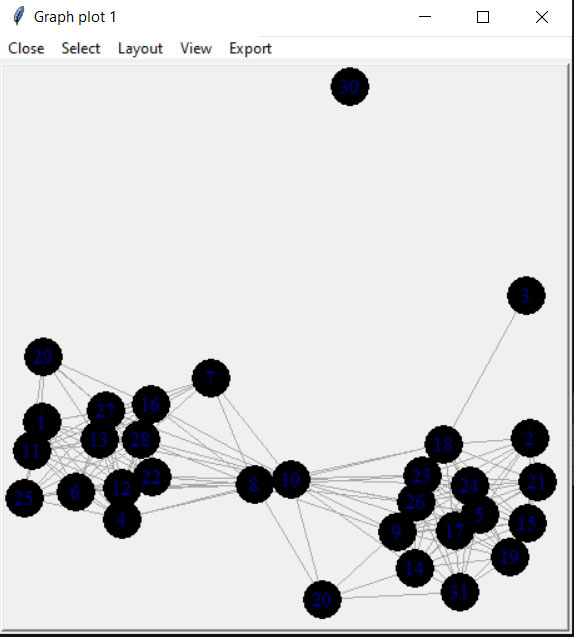
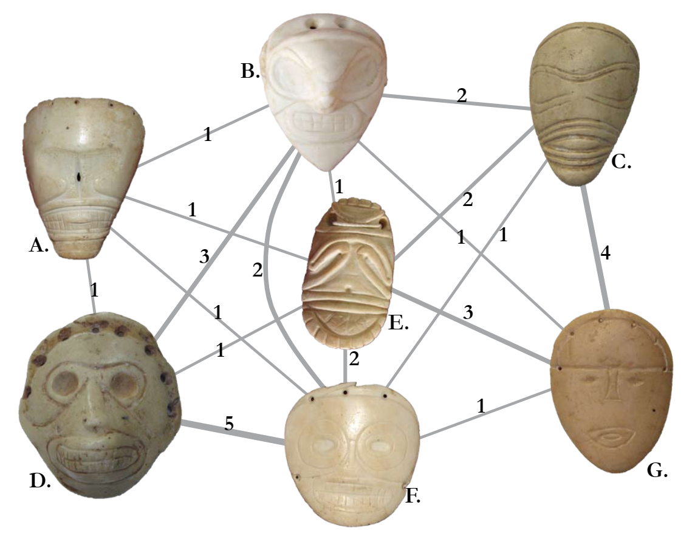
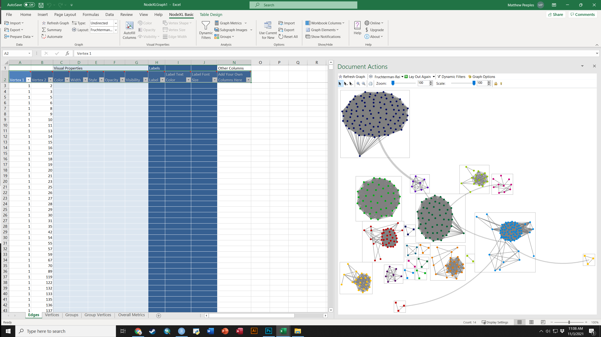
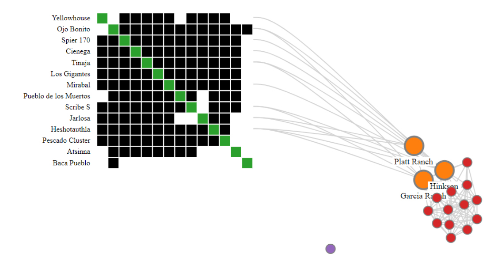

# Network Visualization{#Visualization}

{width=100%}

This section follows along with Brughmans and Peeples (2023) chapter 6 to illustrate the wide variety of techniques which can be used for network visualization. We begin with some general examples of network plotting and then demonstrate how to replicate all of the specific examples that appear in the book. For most of the examples below we rely on R but in a few cases we use other software and provide additional details and data formats. 

There are already some excellent resources online for learning how to create beautiful and informative network visuals. We recommend the excellent online materials produced by Dr. Katherine Ognyanova [available on her website](https://kateto.net/) and her [Static and dynamic network visualization with R](https://kateto.net/network-visualization) workshop materials in particular. Many of the examples here and in the book take inspiration from her work. In addition to this, the [R Graph Gallery](https://www.r-graph-gallery.com/) website created by [Holtz Yan](https://github.com/holtzy) provides numerous excellent examples of plots in R using the `ggplot2` and `ggraph` packages among many others. If you are new to R, it will probably be helpful for you to read a bit about basic graphic functions (including in the tutorials listed here) before getting started.

## Data and R Setup{#VizDatasets}

In order to make it as easy as possible for users to replicate specific visuals from the book and the other examples in this tutorial we have tried to make the examples as modular as possible. This means that we provide calls to initialize the required libraries for each plot within each relevant chunk of code (so that you can more easily tell what package does what) and we also provide links to download the data required to replicate each figure in the description of that figure below. The data sets we use here include both .csv and other format files as well as .Rdata files that contain sets of specific R objects formatted as required for individual chunks of code.

If you plan on working through this entire tutorial and would like to download all of the associated data at once [you can download this zip file](All_data.zip). Simply extract this zip folder into your R working directory and the examples below will then work. Note that all of the examples below are setup such that the data should be contained in a sub-folder of your working directory called "data" (note that directories and file names are case sensitive).

## Visualizing Networks in R{#ViZInR}

```{block, type="rmdnote"}
There are many tools available for creating network visualizations in R including functions built directly into the `igraph` and `statnet` packages. Before we get into the details, we first briefly illustrate the primary network plotting options for `igraph`, `statnet` and a visualization package called `ggraph`. We start here by initializing our required libraries and reading in an adjacency matrix and creating network objects in both the `igraph` and `statnet` format. These will be the basis for all examples in this section.
```

Let's start by reading in our example data and then we describe each package in turn:

```{r Chapter6_read_data, warning=F, message=F}
library(igraph)
library(statnet)
library(ggraph)
library(intergraph)


cibola <-
  read.csv(file = "data/Cibola_adj.csv",
           header = TRUE,
           row.names = 1)

cibola_attr <- read.csv(file = "data/Cibola_attr.csv", header = TRUE)

# Create network in igraph format
cibola_i <- igraph::graph_from_adjacency_matrix(as.matrix(cibola),
                                                mode = "undirected")
cibola_i

# Create network object in statnet/network format
cibola_n <- asNetwork(cibola_i)
cibola_n
```

### `network` package{#networkpackage}

All you need to do to plot a `network/statnet` network object is to simply type `plot(nameofnetwork)`. By default, this creates a network plot where all nodes and edges are shown the same color and weight using the Fruchterman-Reingold graph layout by default. There are, however, many options that can be altered for this basic plot. In order to see the details you can type `?plot.network` at the console for the associated document. 

```{r Fig_net_simple}
set.seed(6332)
plot(cibola_n)
```

In order to change the color of nodes, the layout, symbols, or any other features, you can add arguments as detailed in the help document. These arguments can include calls to other functions, mathematical expressions, or even additional data in other attribute files. For example in the following plot, we calculate degree centrality directly within the plot call and then divide the result by 10 to ensure that the nodes are a reasonable size in the plot. We use the `vertex.cex` argument to set node size based on the results of that expression. Further we change the layout using the "mode" argument to produce a network graph using the Kamada-Kawai layout. We change the color of the nodes so that they represent the `Region` variable in the associated attribute file using the `vertex.col` argument and and set change all edge colors using the `edge.col` argument. Finally, we use `displayisolates = FALSE` to indicate that we do not want the single isolated node to be plotted. These are but a few of the many options.

```{r Fig_network_net}
set.seed(436)
plot(
  cibola_n,
  vertex.cex = sna::degree(cibola_n) / 10,
  mode = "kamadakawai",
  vertex.col = as.factor(cibola_attr$Region),
  edge.col = "darkgray",
  displayisolates = FALSE
)
```

### `igraph` package{#igraphpackage}

The `igraph` package also has a built in plotting function called `plot.igraph`. To call this you again just need to type `plot(yournetworkhere)` and provide an igraph object (R can tell what kind of object you have if you simply type plot). The default igraph plot again uses a Fruchterman-Reingold layout just like `statnet/network` but by default each node is labeled. 

```{r Fig_igraph_simple}
set.seed(435)
plot(cibola_i)
```

Let"s take a look at a few of the options we can alter to change this plot. There are again many options to explore here and the help documents for igraph.plotting describe them in detail (type ?igraph.plotting at the console for more). If you want to explore `igraph` further, we suggest you check the [Network Visualization](https://kateto.net/network-visualization) tutorial linked above which provides a discussion of the wide variety of options. 

```{r Fig_igraph}
set.seed(3463)
plot(
  cibola_i,
  vertex.size = igraph::eigen_centrality(cibola_i)$vector * 20,
  layout = layout_with_kk,
  vertex.color = as.factor(cibola_attr$Great.Kiva),
  edge.color = "darkblue",
  vertex.frame.color = "red",
  vertex.label = NA
)
```

### `ggraph` package{#ggraphpackage}

The `ggraph` package provides a powerful set of tools for plotting and visualizing network data in R. The format used for this package is a bit different from what we saw above and instead relies on the `ggplot2` style of plots where a plot type is called and modifications are made with sets of lines with additional arguments separated by `+`. Although this takes a bit of getting used to we have found that the ggplot format is often more intuitive for making complex graphics once you understand the basics.

Essentially, the way the `ggraph` call works is you start with a `ggraph` function call which includes the network object and the layout information. You then provide lines specifying the edges `geom_edge_link` and nodes `geom_node_point` features and so on. Conveniently the `ggraph` function call will take either an `igraph` or a `network` object so you do not need to convert.

Here is an example. Here we first the call for the igraph network object `Cibola_i` and specify the Fruchterman-Reingold layout using `layout = "fr"`. Next, we call the `geom_edge_link` and specify edge colors. The `geom_node_point` call then specifies many attributes of the nodes including the fill color, outline color, transparency (alpha), shape, and size using the `igraph::degree` function. The `scale_size` call then tells the plot to scale the node size specified in the previous line to range between 1 and 4. Finally `theme_graph` is a basic call to the `ggraph` theme that tells the plot to make the background white and to remove the margins around the edge of the plot. Let's see how this looks. 

In the next section we go over the most common options in `ggraph` in detail.

```{r Fig_ggraph}
set.seed(4368)
# Specify network to use and layout
ggraph(cibola_i, layout = "fr") +
  # Specify edge features
  geom_edge_link(color = "darkgray") +
  # Specify node features
  geom_node_point(
    fill = "blue",
    color = "red",
    alpha = 0.5,
    shape = 22,
    aes(size = igraph::degree(cibola_i)),
    show.legend = FALSE
  ) +
  # Set the upper and lower limit of the "size" variable
  scale_size(range = c(1, 10)) +
  # Set the theme "theme_graph" is the default theme for networks
  theme_graph()
```

There are many options for the `ggraph` package and we recommend exploring the help document (`?ggraph`) as well as the [Data Imaginist](https://www.data-imaginist.com/tags/visualization) `ggraph` tutorial online for more. Most of the examples below will use the `ggraph` format.

## Network Visualization Options{#NetVizOptions}

In this section we illustrate some of the most useful graphical options for visualizing networks, focusing in particular on the `ggraph` format. In most cases there are similar options available in the plotting functions for both `network` and `igraph`. Where relevant we reference specific figures from the book and this tutorial and the code for all of the figures produced in R is presented in the next session. For all of the examples in this section we will use the [Cibola technological similarity data (click here to download)](data/Peeples2018.Rdata). First we call the required packages and import the data.

```{r graph_layout, message=F, warning=FALSE}

library(igraph)
library(statnet)
library(intergraph)
library(ggraph)

load("data/Peeples2018.Rdata")

# Create igraph object for plots below
net <- asIgraph(brnet)

```

### Graph Layout{#GraphLayouts}

Graph layout simply refers to the placement and organization in 2-dimensional or 3-dimensional space of nodes and edges in a network. 

#### Manual or User Defined Layouts{#ManualLayouts}

There are a few options for manually defining node placement and graph layout in R and the easiest is to simply provide x and y coordinates directly. In this example, we plot the Cibola technological similarity network with a set of x and y coordinates that group sites in the same region in a grid configuration. For another example of this approach see [Figure 6.1 below](#Figure_6_1). For an example of how you can interactively define a layout see [Figure 6.5](#Figure_6_5) 

```{r manual_layout, fig.width=7, fig.height=7}
# site_info - site location and attribute data

# Create xy coordinates grouped by region
xy <-
  matrix(
    c(1, 1, 3, 3, 2, 1, 2, 1.2, 3, 3.2, 2, 1.4, 1, 1.2, 2, 2.2, 3,
      2, 3, 1, 2.2, 1, 2, 3, 2, 3.2, 3, 1.2, 3, 3.4, 1, 2, 3.2, 3.2,
      3, 1.4, 3, 2.2, 2, 2, 3.2, 3.4, 2.2, 1.2, 3.4, 3.2, 3.2, 1, 2,
      3.4, 3.4, 3.4, 2.2, 3, 2.2, 3.2, 2.2, 3.4, 1, 1.4, 3, 2.4),
    nrow = 31,
    ncol = 2,
    byrow = TRUE
)

# Plot using "manual" layout and specify xy coordinates
ggraph(net,
       layout = "manual",
       x = xy[, 1],
       y = xy[, 2]) +
  geom_edge_link(edge_color = "gray") +
  geom_node_point(aes(size = 4, col = site_info$Region),
                  show.legend = FALSE) +
  theme_graph()

```

#### Geographic Layouts{#GeographicLayouts}

Plotting networks using a a geographic layout is essentially the same as plotting with a manual layout except that you specify geographic coordinates instead of other coordinates. See [Figure 6.2](#Figure_6_2) for another example.

```{r map1, fig.width=7, fig.height=7}
ggraph(net,
       layout = "manual",
       x = site_info$x,
       y = site_info$y) +
  geom_edge_link(edge_color = "gray") +
  geom_node_point(aes(size = 4, col = site_info$Region),
                  show.legend = FALSE) +
  theme_graph()
```

When working with geographic data, it is also sometimes useful to plot directly on top of some sort of base map. There are many options for this but one of the most convenient is to use the `sf` and `ggmap` packages to directly download the relevant base map layer and plot directly on top of it. This first requires converting points to latitude and longitude in decimal degrees if they are not already in that format. See the details on the [sf package](https://r-spatial.github.io/sf/) and [ggmap package](https://github.com/dkahle/ggmap) for more details. 

```{block, type="rmdtip"}
We describe the specifics of spatial data handling, geographic coordinates, and projection in the section on [Spatial Networks](#SpatialNetworks). See that section for a full description and how R deals with geographic information. 
```


```{r geo_layout, warning=F, message=F, fig.heigh=7, fig.width=7, cache=T}
library(sf)
library(ggmap)

# Convert attribute location data to sf coordinates and change
# map projection
locations_sf <-
  st_as_sf(site_info, coords = c("x", "y"), crs = 26912)
loc_trans <- st_transform(locations_sf, crs = 4326)
coord1 <- do.call(rbind, st_geometry(loc_trans)) %>%
  tibble::as_tibble() %>%
  setNames(c("lon", "lat"))

xy <- as.data.frame(coord1)
colnames(xy) <- c("x", "y")

# Get basemap "terrain-background" data for map in black and white
# the bbox argument is used to specify the corners of the box to be
# used and zoom determines the detail.
base_cibola <- get_stamenmap(
  bbox = c(-110.2, 33.4, -107.8, 35.3),
  zoom = 10,
  maptype = "terrain-background",
  color = "bw"
)

# Extract edge list from network object
edgelist <- get.edgelist(net)

# Create data frame of beginning and ending points of edges
edges <- data.frame(xy[edgelist[, 1], ], xy[edgelist[, 2], ])
colnames(edges) <- c("X1", "Y1", "X2", "Y2")

# Plot original data on map
ggmap(base_cibola, darken = 0.35) +
  geom_segment(
    data = edges,
    aes(
      x = X1,
      y = Y1,
      xend = X2,
      yend = Y2
    ),
    col = "white",
    alpha = 0.8,
    size = 1
  ) +
  geom_point(
    data = xy,
    aes(x, y, col = site_info$Region),
    alpha = 0.8,
    size = 5,
    show.legend = FALSE
  ) +
  theme_void()
```

#### Shape-Based and Algorithmic Layouts{#AlgorithmicLayouts}

There are a wide variety of shape-based and algorithmic layouts available for use in R. In most cases, all it takes to change layouts is to simply modify a single line the `ggraph` call to specify our desired layout. The `ggraph` package can use any of the `igraph` layouts as well as many that are built directly into the package. See `?ggraph` for more details and to see the options. Here we show a few examples. Note that we leave the figures calls the same except for the argument `layout = "yourlayout"` in each `ggraph` call and the `ggtitle` name. For the layouts that involve randomization, we use the `set.seed()` function to make sure they will always plot the same. See the discussion of [Figure 6.8](#Figure_6_8) below for more details. Beyond this [Figure 6.9](#Figure_6_9) provides additional options that can be used for hierarchical network data.

```{block, type="rmdtip"}
If you do not specify a graph layout in `ggraph`, the plotting function will automatically choose a layout using the `layout_nicely()` function. Although this sometimes produces useful the layout used is not specified in the call so we recommend supplying a `layout` argument directly.
```

```{r layouts, message=F, warning=F, fig.width=7, fig.height=3}
# circular layout
circ_net <- ggraph(net, layout = "circle") +
  geom_edge_link(edge_color = "gray") +
  geom_node_point(aes(size = 4, col = site_info$Region),
                  show.legend = FALSE) +
  ggtitle("Circle") +
  theme_graph() +
  theme(plot.title = element_text(size = rel(1)))

# Fruchcterman-Reingold layout
set.seed(4366)
fr_net <- ggraph(net, layout = "fr") +
  geom_edge_link(edge_color = "gray") +
  geom_node_point(aes(size = 4, col = site_info$Region),
                  show.legend = FALSE) +
  ggtitle("Fruchterman-Reingold") +
  theme_graph() +
  theme(plot.title = element_text(size = rel(1)))

# Davidsons and Harels annealing algorithm layout
set.seed(3467)
dh_net <- ggraph(net, layout = "dh") +
  geom_edge_link(edge_color = "gray") +
  geom_node_point(aes(size = 4, col = site_info$Region),
                  show.legend = FALSE) +
  ggtitle("Davidson-Harel") +
  theme_graph() +
  theme(plot.title = element_text(size = rel(1)))

library(ggpubr)
ggarrange(circ_net, fr_net, dh_net, nrow = 1)
```

```{block, type="rmdnote"}
In the code above we used the `ggarrange` function within the `ggpubr` package to combine the figures into a single output. This function works with any `ggplot2` or `ggraph` format output when you supply the names of each figure in the order you want them to appear and the number of rows `nrow` and number of columns `ncol` you want the resulting combined figure to have. If you want to label each figure using the `ggarrange` function you can use the `labels` argument.
```


### Node and Edge Options{#NodeEdgeOptions}

There are many options for altering color and symbol for nodes and edges within R. In this section we very briefly discuss some of the most common options. For more details see the discussion of [figures 6.10 through 6.16](#Figure_6_10) below.

#### Nodes {#NodeOptions}

In `ggraph` changing node options mostly consists of changing options within the `geom_node_point` call within the `ggraph` figure call. As we have already seen it is possible to set color for all nodes or by some variable, to change the size of points, and we can also scale points by some metric like centrality. Indeed, it is even possible to make the call to the centrality function in question directly within the figure code. 

When selecting point shapes you can use any of the shapes available in base R using `pch` point codes. Here are all of the available options:

```{r pch_points, warning=F, message=F}
library(ggpubr)
ggpubr::show_point_shapes()
```

There are many options for selecting colors for nodes and edges. These can be assigned using standard color names or can be assigned using rgb or hex codes. It is also possible to use standard palettes in packages like `RColorBrewer` or `scales` to specify categorical or continuous color schemes. This is often done using either the `scale_fill_brewer` or `scale_color_brewer` calls from `RColorBrewer`. Here are a couple of examples. In these examples, colors are grouped by site region, node size is scaled to degree centrality, and node and edge color and shape are specified in each call. Note the `alpha` command which controls the transparency of the relevant part of the plot. The scale_size call specifies the maximum and minimum size of points in the plot.

The [R Graph Gallery](https://www.r-graph-gallery.com/38-rcolorbrewers-palettes.html) has a good overview of the available color palettes in `RColorBrewer` and when the can be used. The "Set2" palette used here is a good one for people with many kinds of color vision deficiencies. 

```{r color_brewer, fig.width=7, fig.height=4, warning=F, message=F}
library(RColorBrewer)

set.seed(347)
g1 <- ggraph(net, layout = "kk") +
  geom_edge_link(edge_color = "gray", alpha = 0.7) +
  geom_node_point(
    aes(fill = site_info$Region),
    shape = 21,
    size = igraph::degree(net) / 2,
    alpha = 0.5
  ) +
  scale_fill_brewer(palette = "Set2") +
  theme_graph() +
  theme(legend.position = "none")

set.seed(347)
g2 <- ggraph(net, layout = "kk") +
  geom_edge_link(edge_color = "blue", alpha = 0.3) +
  geom_node_point(
    aes(col = site_info$Region),
    shape = 15,
    size = igraph::degree(net) / 2,
    alpha = 1
  ) +
  scale_color_brewer(palette = "Set1") +
  theme_graph() +
  theme(legend.position = "none")

ggarrange(g1, g2, nrow = 1)
```

There are also a number of more advanced methods for displaying nodes including displaying figures or other data visualizations in the place of nodes or using images for nodes. There are examples of each of these in the book and code outlining how to create such visuals in the discussions of [Figure 6.3](#Figure_6_3) and [Figure 6.13](#Figure_6_13) below. 

#### Edges{#EdgeOptions}

Edges can be modified in terms of color, line type, thickness and many other features just like nodes and this is typically done using the `geom_edge_link` call within `ggraph`. Let"s take a look at a couple of additional examples. In this case we"re going to use a weighted network object in the original [Peeples2018.Rdata](data/Peeples2018.Rdata) file to show how we can vary edges in relation to edge attributes like weight. 

In the example here we plot both the line thickness and transparency using the edge weights associated with the network object. We also are using the `scale_edge_color_gradient2` to specify a continuous edge color scheme with three anchors. For more details see `?scale_edge_color`

```{r edge_options1, message=F, warning=F}
library(intergraph)
net2 <- asIgraph(brnet_w)

set.seed(436)
ggraph(net2, "stress") +
  geom_edge_link(aes(width = weight, alpha = weight, col = weight)) +
  scale_edge_color_gradient2(
    low = "#440154FF",
    mid = "#238A8DFF",
    high = "#FDE725FF",
    midpoint = 0.8
  ) +
  scale_edge_width(range = c(1, 5)) +
  geom_node_point(size = 4, col = "blue") +
  labs(edge_color = "Edge Weight Color Scale") +
  theme_graph()
```

Another feature of edges that is often important in visualizations is the presence or absence and type of arrows. Arrows can be modified in `ggraph` using the `arrow` argument within a `geom_edge_link` call. The most relevant options are the length of the arrow (which determines size), the `type` argument which specifies an open or closed arrow, and the spacing of the arrow which can be set by the `end_cap` and `start_cap` respectively which define the gap between the arrow point and the node. These values can all be set using absolute measurements as shown in the example below. Since this is an undirected network we use the argument `ends = "first"` to simulated a directed network so that arrowheads will only be drawn the first time an edge appears in the edge list. See `?arrow` for more details on options. 

```{r edge_options2, message=F, warning=F}
set.seed(436)
ggraph(net, "stress") +
  geom_edge_link(
    arrow = arrow(
      length = unit(2, "mm"),
      ends = "first",
      type = "closed"
    ),
    end_cap = circle(0, "mm"),
    start_cap = circle(3, "mm"),
    edge_colour = "black"
  ) +
  geom_node_point(size = 4, col = "blue") +
  theme_graph()
```

Another common consideration with edges is the shape of the edges themselves. So far we have used examples where the edges are all straight lines, but it is also possible to draw them as arcs or so that they fan out from nodes so that multiple connections are visible. In general, all you need to do to change this option is to use another command in the `geom_edge_` family of commands. For example, in the following chunk of code we produce a network with arcs rather than straight lines. In this case the argument `strength` controls the amount of bend in the lines.

```{r edge_arc}
set.seed(436)
ggraph(net, "kk") +
  geom_edge_arc(edge_colour = "black", strength = 0.1) +
  geom_node_point(size = 4, col = "blue") +
  theme_graph()
```

It is also possible to not show edges at all but instead just a gradient scale representing the density of edges using the `geom_edge_density` call. This could be useful in very large and complex networks.

```{r edge_density, warning=F}
set.seed(436)
ggraph(net2, "kk") +
  geom_edge_density() +
  geom_node_point(size = 4, col = "blue") +
  theme_graph()
```

```{block, type="rmdtip"}
If you want to see all of the possible options for `geom_edge_` commands, simply use the help command on any one of the functions (i.e., `?geom_edge_arc`) and scroll down in the help window to the section labeled "See Also."
```

### Labels {#LabelOptions}

In many cases you may want to label either the nodes, edges, or other features of a network. This is relatively easy to do in `ggraph` with the `geom_node_text()` command. This will place labels as specified on each node. If you use the `repel = TRUE` argument it will repel the names slightly from the node to make them more readable. As shown in the example for [Figure 6.4](#Figure_6_4) it is also possible to filter labels to label only certain nodes.

```{r node_label}
set.seed(436)
ggraph(net2, "fr") +
  geom_edge_link() +
  geom_node_point(size = 4, col = "blue") +
  geom_node_text(aes(label = vertex.names), size = 3, repel = TRUE) +
  theme_graph()
```

It is also possible to label edges by adding an argument directly into the `geom_edge_` command. In practice, this really only works with very small networks. In the next chunk of code, we create a small network and demonstrate this function.

```{r edge_label}
g <- graph(c("A", "B",
             "B", "C",
             "A", "C",
             "A", "A",
             "C", "B",
             "D", "C"))

E(g)$weight <- c(3, 1, 6, 8, 4, 2)

set.seed(4351)
ggraph(g, layout = "stress") +
  geom_edge_fan(aes(label = weight),
                angle_calc = "along",
                label_dodge = unit(2, "mm")) +
  geom_node_point(size = 20, col = "lightblue") +
  geom_node_text(label = V(g)$name) +
  theme_graph()
```

### Be Kind to the Color Blind{#Colorblind}

When selecting your color schemes, it is important to consider the impact of a particular color scheme on color blind readers. There is an excellent set of R scripts on GitHub in a package called [colorblindr](https://github.com/clauswilke/colorblindr) by Claus Wilke which can help you do just that. I have slightly modified the code from the `colorblindr` package and created a script called [colorblindr.R](data/colorblindr.R) which you can download and use to test out your network. Simply run the code in the script and then use the `cvd_grid2()` function on a `ggplot` or `ggraph` object to see simulated colors.

The chunk of code below loads the `colorblindr.R` script and then plots a figure using `RColorBrewer` color `Set2` in its original unmodified format and then as it might look to readers with some of the most common forms of color vision issues. Download the [colorblindr.R script](scripts/colorblindr.R) to follow along.

```{r colorblind, warning=F, message=F, fig.height=7, fig.width=7}
library(colorspace)
source("scripts/colorblindr.R")
cvd_grid2(g1)
```

### Communities and Groups{#VizCommunities}

Showing communities or other groups in network visualizations can be as simple as color coding nodes or edges as we have seen in many examples here. It is sometimes also useful to highlight groups by creating a convex hull or circle around the relevant points. This can be done in `ggraph` using the `geom_mark_hull` command within the `ggforce` package. You will also need a package called `concaveman` that allows you to set the concavity of the hulls around points.

The following chunk of code provides a simple example using the Louvain clustering algorithm.

```{r ggforce, warning=F, message=F, fig.width=7, fig.height=7}

library(ggforce)
library(concaveman)

# Define clusters
grp <- as.factor(cluster_louvain(net2)$membership)

set.seed(4343)
ggraph(net2, layout = "fr") +
  geom_edge_link0(width = 0.2) +
  geom_node_point(aes(fill = grp),
                  shape = 21,
                  size = 5,
                  alpha = 0.75) +
  # Create hull around points within group and label
  geom_mark_hull(
    aes(
      x,
      y,
      group = grp,
      fill = grp,
    ),
    concavity = 4,
    expand = ggplot2::unit(2, "mm"),
    alpha = 0.25,
  ) +
  scale_fill_brewer(palette = "Set2") +
  theme_graph()
```

The discussion of [Figure 6.4](#Figure_6_4) below provides another similar example. There are many more complicated ways of showing network groups provided by the examples covering figures from the book. For example, [Figure 6.18](#Figure_6_18) provides an example of the "group-in-a-box" technique using the NodeXL software package. [Figure 6.19](#Figure_6_19) illustrates the use of matrices as visualization tools and [Figure 6.20](#Figure_6_20) provides links to the Nodetrix hybrid visualization software. 

## Replicating the Book Figures{#ReplicatingBookFigures}

In this section we go through each figure in Chapter 6 of Brughmans and Peeples (2023) and detail how the final graph was created for all figures that were created using R. For those figures not created in R we describe what software and data were used and provide additional resources where available. We hope these examples will serve as inspiration for your own network visualization experiments. Some of these figures are relatively simple while others are quite complex. They are presented in the order they appear in the book. 

### Figure 6.1: Manual Layout {- #Figure_6_1}

Figure 6.1. An example of an early hand drawn network graph (sociogram) published by Moreno (1932: 101). Moreno noted that the nodes at the top and bottom of the sociogram have the most connections and therefore represent the nodes of greatest importance. These specific “important” points are emphasized through both their size and their placement.

Note that the hand drawn version of this figure is presented in the book and this digital example is presented only for illustrative purposes. This shows how you can employ user defined layouts by directly supplying coordinates for the nodes in the plot. [Download the Moreno data to follow along]("data/Moreno.csv").

```{r Fig6_1, message=F, warning=F, fig.width=2, fig.height=3}
library(igraph)
library(ggraph)

# Read in adjacency matrix of Moreno data and covert to network
moreno <-
  as.matrix(read.csv("data/Moreno.csv", header = TRUE, row.names = 1))
g_moreno <- graph_from_adjacency_matrix(moreno)

# Create xy coordinates associated with each node
xy <- matrix(
  c(4, 7, 1, 5, 6, 5, 2, 4, 3, 4, 5, 4, 1, 2.5, 6, 2.5, 4, 1),
  nrow = 9,
  ncol = 2,
  byrow = TRUE
)

# Plot the network using layout = "manual" to place nodes using xy coordinates
ggraph(g_moreno,
       layout = "manual",
       x = xy[, 1],
       y = xy[, 2]) +
  geom_edge_link() +
  geom_node_point(fill = "white",
                  shape = 21,
                  size = igraph::degree(g_moreno)) +
  scale_size(range = c(2, 3)) +
  theme_graph()

```

### Figure 6.2: Examples of Common Network Plot Formats {- #Figure_6_2}

Figure. 6.2. These plots are all different visual representations of the same network data from Peeples’s (2018) data where edges are defined based on the technological similarities of cooking pots from each node which represent archaeological settlements. 

The code below creates each of the individual figures and then compiles them into a single composite figure for plotting. 

First read in the data ([all data are combined in a single RData file here](data/Peeples2018.Rdata)).

```{r Fig6_2_dat, message=F, warning=F, fig.height=7, fig.width=7}
library(igraph)
library(statnet)
library(intergraph)
library(ggplotify)
library(ggraph)
library(ggpubr)

load(file = "data/Peeples2018.Rdata")
## contains objects
# site_info - site locations and attributes
# ceramic_br - raw Brainerd-Robinson similarity among sites
# brnet - binary network with similarity values > 0.65
#     defined as edges in statnet/network format
# brnet_w - weighted network with edges (>0.65) given weight
#     values based on BR similarity in statnet/network format
##
```

Fig 6.2a - A simple network graph with nodes placed based on the Fruchterman-Reingold algorithm

```{r Fig6_2a, message=F, warning=F, fig.width=7, fig.height=7}
## create simple graph with Fruchterman - Reingold layout
set.seed(423)
f6_2a <- ggraph(brnet, "fr") +
  geom_edge_link(edge_colour = "grey66") +
  geom_node_point(aes(size = 5), col = "red", show.legend = FALSE) +
  theme_graph()
f6_2a
```

Fig 6.2b - Network graph nodes with placed based on the real geographic locations of settlements and are color coded based on sub-regions.

```{r Fig6_2b, message=F, warning=F, fig.width=7, fig.height=7}
## create graph with layout determined by site location and
## nodes color coded by region
f6_2b <- ggraph(brnet, "manual",
                x = site_info$x,
                y = site_info$y) +
  geom_edge_link(edge_colour = "grey66") +
  geom_node_point(aes(size = 2, col = site_info$Region),
                  show.legend = FALSE) +
  theme_graph()
f6_2b
```

Fig 6.2c - A graph designed to show how many different kinds of information can be combined in a single network plot. In this network graph node placement is defined by the stress majorization algorithm (see below), with nodes color coded based on region, with different symbols for different kinds of public architectural features found at those sites, and with nodes scaled based on betweenness centrality scores. The line weight of each edge is used to indicate relative tie-strength.

```{r Fig6_2c, message=F, warning=F, fig.width=7, fig.height=7}
# create vectors of attributes and betweenness centrality and plot
# network with nodes color coded by region, sized by betweenness,
# with symbols representing public architectural features, and
# with edges weighted by BR similarity
col1 <- as.factor((site_info$Great.Kiva))
col2 <- as.factor((site_info$Region))
bw <- sna::betweenness(brnet_w)

f6_2c <- ggraph(brnet_w, "stress") +
  geom_edge_link(aes(width = weight, alpha = weight),
                 edge_colour = "black",
                 show.legend = FALSE) +
  scale_edge_width(range = c(1, 2)) +
  geom_node_point(aes(
    size = bw,
    shape = col1,
    fill = col1,
    col = site_info$Region
  ),
  show.legend = FALSE) +
  scale_fill_discrete() +
  scale_size(range = c(4, 12)) +
  theme_graph()
f6_2c
```

Fig. 6.2d - This network graph is laid out using the Kamada-Kawai force directed algorithm with nodes color coded based on communities detected using the Louvain community detection algorithm. Each community is also indicated by a circle highlighting the relevant nodes. Edges within communities are shown in black and edges between communities are shown in red.

In this plot we use the `as.ggplot` function to convert a traditional `igraph` plot to a `ggraph` plot to illustrate how this can be done.

```{r Fig6_2d, message=F, warning=F, fig.width=7, fig.height=7}
# convert network object to igraph object and calculate Louvain
# cluster membership plot and convert to grob to combine in ggplot
g <- asIgraph(brnet_w)
clst <- cluster_louvain(g)

f6_2d <- as.ggplot(
  ~ plot(
    clst,
    g,
    layout = layout_with_kk,
    vertex.label = NA,
    vertex.size = 10,
    col = rainbow(4)[clst$membership]
  )
)
f6_2d
```

Finally, we use the `ggarrange` function from the `ggpubr` package to combine all of these plots into a single composite plot.

```{r Fig6_2_all, message=F, warning=F, fig.height=7, fig.width=7}
# Combine all plots into a single figure using ggarrange
figure_6_2 <- ggarrange(
  f6_2a,
  f6_2b,
  f6_2c,
  f6_2d,
  nrow = 2,
  ncol = 2,
  labels = c("(a)", "(b)", "(c)", "(d)"),
  font.label = list(size = 22)
)

figure_6_2
  
```

### Figure 6.3: Examples of Rare Network Plot Formats {- #Figure_6_3}

Figure 6.3. Examples of less common network visuals techniques for Peeples’s (2018) ceramic technological similarity data. 

Fig 6.3a - A weighted heat plot of the underlying similarity matrix with hierarchical clusters shown on each axis. This plot relies on a packages called `superheat` that produces plots formatted as we see here. The required input is a symmetric similarity matrix object. 

```{block, type="rmdnote"}
In the chunk of code below we use the `as.ggplot` function from the `ggplotify` package. This function converts a non `ggplot2` style function into a `ggplot2` format so that it can be further used with packages like `ggpubr` and `colorblindr`.
```


```{r Fig6_3a, message=F, warning=F, fig.width=7, fig.height=7, cache=T}
library(igraph)
library(statnet)
library(intergraph)
library(ggraph)
library(ggplotify)
library(superheat)

ceramic_br_a <- ceramic_br
diag(ceramic_br_a) <- NA

f6_3a <- as.ggplot(
  ~ superheat(
    ceramic_br_a,
    row.dendrogram = TRUE,
    col.dendrogram = TRUE,
    grid.hline.col = "white",
    grid.vline.col = "white",
    legend = FALSE,
    left.label.size = 0,
    bottom.label.size = 0
  )
)
f6_3a
```

Fig. 6.3b - An arcplot with within group ties shown above the plot and between group ties shown below.

For this plot, we read in a adjacency matrix that is ordered in the order we want it to show up in the final plot. [Download the file here](data/Peeples_arcplot.csv) to follow along. Note that the object `grp` must be produced in the same order that the nodes appear in the original adjacency matrix file.


```{r Fig6_3b, message=F, warning=F, fig.width=7, fig.height=7}
arc_dat <- read.csv("data/Peeples_arcplot.csv",
                    header = TRUE,
                    row.names = 1)
g <- graph_from_adjacency_matrix(as.matrix(t(arc_dat)))

# set groups for color
grp <- as.factor(c(2, 2, 2, 2, 2, 2, 2, 2, 2, 2, 2, 2, 2,
                   3, 3, 3, 1, 1, 1, 1, 1, 1, 1, 1, 1, 1,
                   1, 1, 1, 1))


# Make the graph
f6_3b <- ggraph(g, layout = "linear") +
  geom_edge_arc(
    edge_colour = "black",
    edge_alpha = 0.2,
    edge_width = 0.7,
    fold = FALSE,
    strength = 1,
    show.legend = FALSE
  ) +
  geom_node_point(
    aes(
      size = igraph::degree(g),
      color = grp,
      fill = grp
    ),
    alpha = 0.5,
    show.legend = FALSE
  ) +
  scale_size_continuous(range = c(4, 8)) +
  theme_graph()
f6_3b
```

Fig. 6.3c - Network plot with sites in geographic locations and edges bundled using the edge bundling hammer routine.

```{block, type="rmdwarning"}
This function requires the `edgebundle` package be installed along with `reticulate` and Python 3.8 (see [Packages](#Packages)) and uses the [Cibola technological similarity data](data/Peeples2018.Rdata). Check [Data and Workspace Setup](#ShouldIInstall) section for more details on getting the edge bundling package and Python up and running.

Be aware that this function may take a long time on your computer depending on your processing power and RAM.
```
```{r, echo=F, message=F, warning=F}
library(reticulate)
use_condaenv("r-reticulate")
```

```{r Fig6_3c, message=F, warning=F, fig.width=7, fig.height=7, cache=T}
library(edgebundle)
load("data/Peeples2018.Rdata")

# Create attribute file with required data
xy <- as.data.frame(site_info[, 1:2])
xy <- cbind(xy, site_info$Region)
colnames(xy) <- c("x", "y", "Region")

# Run hammer bundling routine
g <- asIgraph(brnet)
hbundle <- edge_bundle_hammer(g, xy, bw = 5, decay = 0.3)

f6_3c <-   ggplot() +
  geom_path(data = hbundle, aes(x, y, group = group),
            col = "gray66", size = 0.5) +
  geom_point(data = xy, aes(x, y, col = Region),
             size = 5, alpha = 0.75, show.legend = FALSE) +
  theme_void()
f6_3c
```

Fig. 6.3d - Network graph where nodes are replaced by waffle plots that show relative frequencies of the most common ceramic technological clusters.

This is a somewhat complicated plot that requires a couple of specialized libraries and additional steps along the way. We provide comments in the code below to help you follow along. Essentially the routine creates a series of waffle plots and then uses them as annotations to replace the nodes in the final `ggraph`. This plot requires that you install a development package called `ggwaffle`. Run the line of code below before creating the figure if you need to add this package. 

```{r, eval=F}
devtools::install_github("liamgilbey/ggwaffle")
```

```{block, type="rmdtip"}
There are numerous projects that are in the R CRAN archive and those packages have been peer reviewed and evaluated. There are many other packages and compendiums designed for use in R that are not yet in the CRAN archive. Frequently these are found as packages in development on GitHub. In order to use these packages in development, you can use the `install_github` function wrapped inside the `devtools` package (though it originates in the `remotes` package). In order to install a package from GitHub, you type supply "username/packagename" inside the `install_github` call.
```

Let's now look at the figure code:

```{r Fig6_3d, message=F, warning=F, fig.width=10, fig.height=10}
# Initialize libraries

library(ggwaffle)
library(tidyverse)

# Create igraph object from data imported above
cibola_adj <-
  read.csv(file = "data/Cibola_adj.csv",
           header = TRUE,
           row.names = 1)
g <- graph_from_adjacency_matrix(as.matrix(cibola_adj),
                                 mode = "undirected")

# Import raw ceramic data and convert to proportions
ceramic_clust <- read.csv(file = "data/Cibola_clust.csv",
                          header = TRUE,
                          row.names = 1)
ceramic_p <- prop.table(as.matrix(ceramic_clust), margin = 1)

# Assign vertex attributes to the network object g which represent
# columns in the ceramic.p table
V(g)$c1 <- ceramic_p[, 1]
V(g)$c2 <- ceramic_p[, 2]
V(g)$c3 <- ceramic_p[, 3]
V(g)$c4 <- ceramic_p[, 4]
V(g)$c5 <- ceramic_p[, 5]
V(g)$c6 <- ceramic_p[, 6]
V(g)$c7 <- ceramic_p[, 7]
V(g)$c8 <- ceramic_p[, 8]
V(g)$c9 <- ceramic_p[, 9]
V(g)$c10 <- ceramic_p[, 10]

# Precompute the layout and assign coordinates as x and y in network g
set.seed(345434534)
xy <- layout_with_fr(g)
V(g)$x <- xy[, 1]
V(g)$y <- xy[, 2]

# Create a data frame that contains the 4 most common
# categories in the ceramic table, the node id, and the proportion
# of that ceramic category at that node
nodes_wide <- igraph::as_data_frame(g, "vertices")
nodes_long <- nodes_wide %>%
  dplyr::select(c1:c4) %>%
  mutate(id = seq_len(nrow(nodes_wide))) %>%
  gather("attr", "value", c1:c4)
nodes_out <- NULL
for (j in seq_len(nrow(nodes_long))) {
  temp <- do.call("rbind", replicate(round(nodes_long[j, ]$value * 50, 0),
                                     nodes_long[j, ], simplify = FALSE))
  nodes_out <- rbind(nodes_out, temp)
}

# Create a list object for the call to each bar chart by node
bar_list <- lapply(1:vcount(g), function(i) {
  gt_plot <- ggplotGrob(
    ggplot(waffle_iron(nodes_out[nodes_out$id == i, ],
                       aes_d(group = attr))) +
      geom_waffle(aes(x, y, fill = group), size = 10) +
      coord_equal() +
      labs(x = NULL, y = NULL) +
      theme(
        legend.position = "none",
        panel.background = element_rect(fill = "white", colour = NA),
        line = element_blank(),
        text = element_blank()
      )
  )
  panel_coords <- gt_plot$layout[gt_plot$layout$name == "panel", ]
  gt_plot[panel_coords$t:panel_coords$b, panel_coords$l:panel_coords$r]
})

# Convert the results above into custom annotation
annot_list <- lapply(1:vcount(g), function(i) {
  xmin <- nodes_wide$x[i] - .25
  xmax <- nodes_wide$x[i] + .25
  ymin <- nodes_wide$y[i] - .25
  ymax <- nodes_wide$y[i] + .25
  annotation_custom(
    bar_list[[i]],
    xmin = xmin,
    xmax = xmax,
    ymin = ymin,
    ymax = ymax
  )
})

# create basic network
p <- ggraph(g, "manual", x = V(g)$x, y = V(g)$y) +
  geom_edge_link0() +
  theme_graph() +
  coord_fixed()

# put everything together by combining with the annotation (bar plots + network)
f6_3d <- Reduce("+", annot_list, p)
f6_3d
```

```{block, type="rmdtip"}
The inspiration for the example above came from a [R blogpost by schochastics (David Schoch)](https://www.r-bloggers.com/2020/03/ggraph-tricks-for-common-problems/). As that post shows, any figures that can be treated as `ggplot2` objects can be used in the place of nodes by defining them as "annotations." See the post for more details.
```

Now let's look at all of the figures together.

{width=100%}

### Figure 6.4: Simple Network with Clusters {- #Figure_6_4}

Figure 6.4. A network among Clovis era sites in the Western U.S. with connections based on shared lithic raw material sources. Nodes are scaled based on betweenness centrality with the top seven sites labelled. Color-coded clusters were defined using the Louvain algorithm. 
 
```{block, type="rmdtip"}
This example shows how to define and indicate groups and label points based on their values. Note the use of the `ifelse` call in the `geom_node_text` portion of the plot. See [here](#Conditionals) for more information on how `ifelse` statements work.
```

```{r Fig6_4, warning=F, message=F, fig.width=7, fig.height=7}
library(ggforce)
library(ggraph)
library(statnet)
library(igraph)

clovis <- read.csv("data/Clovis.csv", header = TRUE, row.names = 1)
colnames(clovis) <- row.names(clovis)
graph <- graph_from_adjacency_matrix(as.matrix(clovis),
                                     mode = "undirected",
                                     diag = FALSE)

bw <- igraph::betweenness(graph)

grp <- as.factor(cluster_louvain(graph)$membership)

set.seed(43643548)
ggraph(graph, layout = "fr") +
  geom_edge_link(edge_width = 1, color = "gray") +
  geom_node_point(aes(fill = grp, size = bw, color = grp),
                  shape = 21,
                  alpha = 0.75) +
  scale_size(range = c(2, 20)) +
  geom_mark_hull(
    aes(
      x,
      y,
      group = grp,
      fill = grp,
      color = NA
    ),
    concavity = 4,
    expand = unit(2, "mm"),
    alpha = 0.25,
    label.fontsize = 12
  ) +
  scale_color_brewer(palette = "Set2") +
  scale_fill_brewer(palette = "Set2") +
  scale_edge_color_manual(values = c(rgb(0, 0, 0, 0.3),
                                     rgb(0, 0, 0, 1))) +
  # If else statement only labels points that meet the condition
  geom_node_text(aes(label = ifelse(bw > 40,
                                    as.character(name),
                                    NA_character_)),
                 size = 4) +
  theme_graph() +
  theme(legend.position = "none")
```

### Figure 6.5: Interactive Layout {- #Figure_6_5}

Figure 6.5. An example of the same network graph with two simple user defined layouts created interactively.

Figure 6.5 was produced in [NetDraw](https://sites.google.com/site/netdrawsoftware/download) by creating a simple network and taking screen shots of two configurations of nodes. There are a few options for creating a similar figures in R. The simplest is to use an igraph network object and the `tkplot` function. This function brings up a window that lets you drag and move nodes (with or without an initial algorithmic layout) and when you"re done you can assign the new positions to a variable to use for plotting. [Use these data](data/Peeples2018.Rdata) to follow along.

```{block, type="rmdwarning"}
Note that if you are running this package in your browser via binder, the function below will not work as you do not have permission to open the tkplot on the virtual server. To follow along with the plotting of this figure you can use the pre-determined locations by reading in this file `load(file="data/Coords.Rdata")`

```


```{r Fig6_5a, message=F, warning=F, eval=F}
library(igraph)
library(intergraph)

load("data/Peeples2018.Rdata")

cibola_i <- asIgraph(brnet)

locs <- tkplot(cibola_i)
coords <- tkplot.getcoords(locs)

```

This will bring up a window like the example below and when you click "Close" it will automatically create the variables with the node location information for plotting. 

{width=60%}
```{r Fig6_5b, echo=F}
load(file = "data/Coords.Rdata")

```

```{r Fig6_5c}
plot(cibola_i, layout = coords)
```

### Figure 6.6: Absolute Geographic Layout {- #Figure_6_6}

Fig. 6.6. Map of major Roman roads and major settlements on the Iberian Peninsula, (a) with roads mapped along their actual geographic paths and (b) roads shown as simple line segments between nodes. 

The figure that appears in the book was originally created using GIS software but it is possible to prepare a quite similar figure in R using the tools we outlined above. To reproduce the results presented here you will need to download [the node information file](data/Hispania_nodes.csv) and the [road edge list](data/Hispania_roads.csv). We have created a script called [map_net.R](scripts/map_net.R) which will produce similar maps when supplied with a network object and a file with node locations in lat/long coordinates. For more information on how R works with geographic data see the [spatial networks](#SpatialNetworks) section of this document.

```{r Fig6_6, warning=F, message=F, cache=T}


library(igraph)
library(ggmap)
library(sf)

edges1 <- read.csv("data/Hispania_roads.csv", header = TRUE)
edges1 <- edges1[which(edges1$Weight > 25), ]
nodes <- read.csv("data/Hispania_nodes.csv", header = TRUE)
nodes <- nodes[which(nodes$Id %in% c(edges1$Source, edges1$Target)), ]

road_net <-
  graph_from_edgelist(as.matrix(edges1[, 1:2]), directed = FALSE)

# Convert attribute location data to sf coordinates
locations_sf <-
  st_as_sf(nodes, coords = c("long", "lat"), crs = 4326)
coord1 <- do.call(rbind, st_geometry(locations_sf)) %>%
  tibble::as_tibble() %>%
  setNames(c("lon", "lat"))

xy <- as.data.frame(coord1)
colnames(xy) <- c("x", "y")

# Extract edge list from network object
edgelist <- get.edgelist(road_net)

# Create data frame of beginning and ending points of edges
edges <- as.data.frame(matrix(NA, nrow(edgelist), 4))
colnames(edges) <- c("X1", "Y1", "X2", "Y2")
for (i in seq_len(nrow(edgelist))) {
  edges[i, ] <- c(nodes[which(nodes$Id == edgelist[i, 1]), 3],
                  nodes[which(nodes$Id == edgelist[i, 1]), 2],
                  nodes[which(nodes$Id == edgelist[i, 2]), 3],
                  nodes[which(nodes$Id == edgelist[i, 2]), 2])
}

my_map <- get_stamenmap(bbox = c(-9.5, 36, 3, 43.8),
                       maptype = "watercolor",
                       zoom = 6)

ggmap(my_map) +
  geom_segment(
    data = edges,
    aes(
      x = X1,
      y = Y1,
      xend = X2,
      yend = Y2
    ),
    col = "black",
    size = 1
  ) +
  geom_point(
    data = xy,
    aes(x, y),
    alpha = 0.8,
    col = "black",
    fill = "white",
    shape = 21,
    size = 1.5,
    show.legend = FALSE
  ) +
  theme_void()
```

### Figure 6.7: Distorted Geographic Layout {- #Figure_6_7}

Figure 6.7. This ceramic similarity network of the San Pedro River Valley in Arizona shows the challenges of creating geographic network layouts. (a) Shows sites in their original locations whereas (b) shifts locations to improve the visibility of network structure. Note how the distorted geographic layout retains the basic relationships among the nodes while altering their locations slightly.

Unfortunately as the first map contains real site locations we cannot share those data here. The second map can still be reproduced given nothing but the code below. The only difference required to produce Figure 6.7a would be to replace the `coord` site coordinates with the actual site locations. the `coord` object used here was created by taking the original site locations and applying the `jitter` function, which jitters x and y coordinates by a specified amount.

```{block, type="rmdnote"}
In the code below we use the `scalebar` function within the `ggsn` package to draw a scale for the map. Note that we provide the coordinate locations in decimal degrees of the minimum values on the x and y axis where we want the scale to appear, the geographic transformation (see [Spatial Networks](#SpatialNetworks) for more details), and the style of scale. See `?scalebar` for options. There is also a `north` function in the same package that lets you generate north arrows.
```


```{r, message=F, warning=F, fig.height=7, fig.width=7, cache=T}
library(igraph)
library(sf)
library(ggmap)
library(ggsn)
library(ggrepel)
library(ggpubr)

load("data/Figure6_7.Rdata")
# g.net - igraph network object of San Pedro sites based on
# ceramic similarity

# Define coordinates of "jittered" points
# These points were originally created using the "jitter" function
# until a reasonable set of points were found.
coord <- c(-110.7985, 32.97888,
-110.7472, 32.89950,
-110.6965, 32.83496,
-110.6899, 32.91499,
-110.5508, 32.72260,
-110.4752, 32.60533,
-110.3367, 32.33341,
-110.5930, 32.43487,
-110.8160, 32.86185,
-110.6650, 32.64882,
-110.4558, 32.56866,
-110.6879, 32.60055,
-110.7428, 32.93124,
-110.4173, 32.34401,
-110.7000, 32.73344)

attr <- c("Swingle's Sample", "Ash Terrace", "Lost Mound",
          "Dudleyville Mound", "Leaverton", "High Mesa",
          "Elliott Site", "Bayless Ruin", "Flieger",
          "Big Bell", "111 Ranch", "Twin Hawks", "Artifact Hill",
          "Jose Solas Ruin", "Wright")


# Convert coordinates to data frame
zz <- as.data.frame(matrix(coord, nrow = 15, byrow = TRUE))
colnames(zz) <- c("x", "y")

# Get basemap "terrain-background" data for map in black and white
base3 <- get_stamenmap(
  bbox = c(-111, 32.2, -110, 33.1),
  zoom = 10,
  maptype = "terrain-background",
  color = "bw"
)

# Extract edge list from network object
edgelist <- get.edgelist(g.net)

# Create data frame of beginning and ending points of edges
edges2 <- data.frame(zz[edgelist[, 1], ], zz[edgelist[, 2], ])
colnames(edges2) <- c("X1", "Y1", "X2", "Y2")

# Plot jittered coordinates on map
figure_6_7 <- ggmap(base3, darken = 0.35) +
  geom_segment(
    data = edges2,
    aes(
      x = X1,
      y = Y1,
      xend = X2,
      yend = Y2
    ),
    col = "white",
    size = 1
  ) +
  geom_point(
    data = zz,
    aes(x, y),
    alpha = 0.8,
    col = "red",
    size = 5,
    show.legend = FALSE
  ) +
  geom_text_repel(aes(x = x, y = y, label = attr), data = zz, size = 3) +
  scalebar(
    x.min = -111,
    x.max = -110.75,
    y.min = 32.25,
    y.max = 33,
    dist = 10,
    dist_unit = "km",
    st.bottom = FALSE,
    transform = TRUE,
    model = "WGS84"
  ) +
  theme_void()

figure_6_7
```

### Figure 6.8: Graph Layout Algorithms {- #Figure_6_8}

Fig. 6.8. Several different graph layouts all using the Bronze Age Aegean geographic network (Evans et al. 2011). In each graph, nodes are scaled based on betweenness centrality and color-coded based on clusters defined using modularity maximisation.

In the code below the only thing we change between each plot is the `layout` argument in `ggraph`. See [the CRAN project page on ggraph](https://cran.r-project.org/web/packages/ggraph/vignettes/Layouts.html) for more information on available layouts. We plot clusters by color here to make it easier to track differences between the layout options.

```{r Fig6_8, warning=F, message=F, fig.width=7, fig.height=12}


library(igraph)
library(ggraph)
library(ggpubr)
library(igraphdata)
library(graphlayouts)
library(sf)
library(ggmap)

# Load igraph Aegean_net data

aegean <- read.csv("data/aegean.csv", row.names = 1, header = T)
aegean_dist <- aegean
aegean_dist[aegean_dist > 124] <- 0
aegean_dist[aegean_dist > 0] <- 1
aegean_net <- graph_from_adjacency_matrix(as.matrix(aegean_dist))

# Define cluster membership and betweenness centrality for plotting
grp <- as.factor(cluster_optimal(aegean_net)$membership)
bw <- as.numeric(igraph::betweenness(aegean_net))

# Create geographic network and plot
nodes <- read.csv("data/aegean_locs.csv")

# Convert attribute location data to sf coordinates
locations_sf <-
  st_as_sf(nodes,
           coords = c("Longitude", "Latitude"),
           crs = 4326)
coord1 <- do.call(rbind, st_geometry(locations_sf)) %>%
  tibble::as_tibble() %>%
  setNames(c("lon", "lat"))

xy <- as.data.frame(coord1)
colnames(xy) <- c("x", "y")

my_map <- get_stamenmap(bbox = c(22, 34.5, 29, 38.8),
                       zoom = 8,
                       maptype = "terrain-background")

# Extract edge list from network object for road_net
edgelist1 <- get.edgelist(aegean_net)

# Create data frame of beginning and ending points of edges
edges1 <- as.data.frame(matrix(NA, nrow(edgelist1), 4))
colnames(edges1) <- c("X1", "Y1", "X2", "Y2")
for (i in seq_len(nrow(edgelist1))) {
  edges1[i, ] <-
    c(nodes[which(nodes$Name == edgelist1[i, 1]), ]$Longitude,
      nodes[which(nodes$Name == edgelist1[i, 1]), ]$Latitude,
      nodes[which(nodes$Name == edgelist1[i, 2]), ]$Longitude,
      nodes[which(nodes$Name == edgelist1[i, 2]), ]$Latitude)
}

geo_net <- ggmap(my_map) +
  geom_segment(
    data = edges1,
    aes(
      x = X1,
      y = Y1,
      xend = X2,
      yend = Y2
    ),
    col = "black",
    size = 1
  ) +
  geom_point(
    data = xy,
    aes(x, y, size = bw, fill = grp),
    alpha = 0.8,
    shape = 21,
    show.legend = FALSE
  ) +
  scale_size(range = c(4, 12)) +
  scale_color_brewer(palette = "Set2") +
  scale_fill_brewer(palette = "Set2") +
  theme_graph() +
  ggtitle("Geographic") +
  theme(plot.title = element_text(size = rel(1)))

# Multidimensional Scaling Layout with color by cluster and node
# size by betweenness
set.seed(435353)
g_mds <- ggraph(aegean_net, layout = "mds") +
  geom_edge_link0(width = 0.2) +
  geom_node_point(aes(fill = grp, size = bw),
                  shape = 21,
                  show.legend = FALSE) +
  scale_size(range = c(4, 12)) +
  scale_color_brewer(palette = "Set2") +
  scale_fill_brewer(palette = "Set2") +
  scale_edge_color_manual(values = c(rgb(0, 0, 0, 0.3),
                                     rgb(0, 0, 0, 1))) +
  theme_graph() +
  theme(plot.title = element_text(size = rel(1))) +
  ggtitle("Multi-Dimensional Scaling") +
  theme(legend.position = "none")

# Fruchterman-Reingold Layout with color by cluster and node size
# by betweenness
set.seed(435353)
g_fr <- ggraph(aegean_net, layout = "fr") +
  geom_edge_link0(width = 0.2) +
  geom_node_point(aes(fill = grp, size = bw),
                  shape = 21,
                  show.legend = FALSE) +
  scale_size(range = c(4, 12)) +
  scale_color_brewer(palette = "Set2") +
  scale_fill_brewer(palette = "Set2") +
  scale_edge_color_manual(values = c(rgb(0, 0, 0, 0.3),
                                     rgb(0, 0, 0, 1))) +
  theme_graph() +
  theme(plot.title = element_text(size = rel(1))) +
  ggtitle("Fruchterman-Reingold") +
  theme(legend.position = "none")

# Kamada-Kawai Layout with color by cluster and node size by betweenness
set.seed(435353)
g_kk <- ggraph(aegean_net, layout = "kk") +
  geom_edge_link0(width = 0.2) +
  geom_node_point(aes(fill = grp, size = bw),
                  shape = 21,
                  show.legend = FALSE) +
  scale_size(range = c(4, 12)) +
  scale_color_brewer(palette = "Set2") +
  scale_fill_brewer(palette = "Set2") +
  scale_edge_color_manual(values = c(rgb(0, 0, 0, 0.3),
                                     rgb(0, 0, 0, 1))) +
  theme_graph() +
  theme(plot.title = element_text(size = rel(1))) +
  ggtitle("Kamada-Kawai") +
  theme(legend.position = "none")

# Radial Centrality Layout with color by cluster and node size by
# betweenness
set.seed(435353)
g_cent <- ggraph(aegean_net,
                 layout = "centrality",
                 centrality = igraph::betweenness(aegean_net)) +
  geom_edge_link0(width = 0.2) +
  geom_node_point(aes(fill = grp, size = bw),
                  shape = 21,
                  show.legend = FALSE) +
  scale_size(range = c(4, 12)) +
  scale_color_brewer(palette = "Set2") +
  scale_fill_brewer(palette = "Set2") +
  scale_edge_color_manual(values = c(rgb(0, 0, 0, 0.3),
                                     rgb(0, 0, 0, 1))) +
  theme_graph() +
  theme(plot.title = element_text(size = rel(1))) +
  ggtitle("Radial Centrality") +
  theme(legend.position = "none")

# Spectral Layout with color by cluster and node size by betweenness
u1 <- layout_with_eigen(aegean_net)
g_spec <- ggraph(aegean_net,
                 layout = "manual",
                 x = u1[, 1],
                 y = u1[, 2]) +
  geom_edge_link0(width = 0.2) +
  geom_node_point(aes(fill = grp, size = bw),
                  shape = 21,
                  show.legend = FALSE) +
  scale_size(range = c(4, 12)) +
  scale_color_brewer(palette = "Set2") +
  scale_fill_brewer(palette = "Set2") +
  scale_edge_color_manual(values = c(rgb(0, 0, 0, 0.3),
                                     rgb(0, 0, 0, 1))) +

  theme_graph() +
  theme(plot.title = element_text(size = rel(1))) +
  ggtitle("Spectral") +
  theme(legend.position = "none")


figure_6_8 <-
  ggarrange(geo_net,
            g_mds,
            g_fr,
            g_kk,
            g_cent,
            g_spec,
            ncol = 2,
            nrow = 3)
figure_6_8
```

### Figure 6.9: Heirarchical Graph Layouts {- #Figure_6_9}

Fig. 6.9. Examples of visualisations based on hierarchical graph data. (a) Graph with nodes color-coded by hierarchical level. (b) Bubble plot where nodes are scaled proportional to the sub-group size. (c) Dendrogram of hierarchical cluster data. (d) Radial graph with edges bundled based on similarity in relations. Edges are colour-coded such that they are red at the origin and purple at the destination to help visualise direction.

These graphs are based on a hierarchical graph that was created by assigning nodes to the leaves of a hierarchical cluster analysis performed on the Cibola ceramic technological cluster data. The data for 6.9d were randomly generated following an example on the R Graph Gallery. [Use these data](data/Figure6_9.Rdata) to follow along.

```{r Fig6_9, warning=F, message=F, fig.height=7, fig.width=7, cache=T}
# initialize libraries
library(igraph)
library(ggraph)
library(ape)
library(RColorBrewer)
library(ggpubr)

load(file = "data/Figure6_9.Rdata")

set.seed(4353543)
h1 <- ggraph(h_graph, "circlepack") +
  geom_edge_link() +
  geom_node_point(aes(colour = depth, size = (max(depth) - depth) / 2),
                  show.legend = FALSE) +
  scale_color_viridis() +
  theme_graph() +
  coord_fixed()

set.seed(643346463)
h2 <- ggraph(h_graph, "circlepack") +
  geom_node_circle(aes(fill = depth),
                   size = 0.25,
                   n = 50,
                   show.legend = FALSE) +
  scale_fill_viridis() +
  theme_graph() +
  coord_fixed()

h3 <- ggraph(h_graph, "dendrogram") +
  geom_node_point(aes(filter = leaf),
                  color = "blue",
                  alpha = 0.7,
                  size = 3) +
  theme_graph() +
  geom_edge_link()

h4 <-
  ggraph(sub_grp_graph, layout = "dendrogram", circular = TRUE) +
  geom_conn_bundle(
    data = get_con(from = from, to = to),
    alpha = 0.2,
    width = 0.9,
    tension = 0.9,
    aes(colour = ..index..)
  ) +
  scale_edge_colour_distiller(palette = "RdPu") +
  geom_node_point(aes(
    filter = leaf,
    x = x * 1.05,
    y = y * 1.05,
    colour = group),
    size = 3) +
  scale_colour_manual(values = rep(brewer.pal(9, "Paired"), 30)) +
  theme_graph() +
  theme(legend.position = "none")

figure_6_9 <- ggarrange(
  h1,
  h2,
  h3,
  h4,
  ncol = 2,
  nrow = 2,
  labels = c("(a)", "(b)", "(c)", "(d)")
)
figure_6_9
```

### Figure 6.10: Be kind to the color blind {- #Figure_6_10}

Fig. 6.10. Examples of a simple network graph with color-coded clusters. The top left example shows the unmodified figure and the remaining examples simulate what such a figure might look like to people with various kinds of colour vision deficiencies. 

This function calls a script that we modified from the `colorblindr` package by [Claus Wilke](https://github.com/clauswilke/colorblindr) which is available here. The function `cv2_grid` take any ggplot object and outputs a 2 x 2 grid with the original figure and examples of what the figure might look like to people with three of the most common forms of color vision deficiency. Use [these data](data/Peeples2018) and [this script](scripts/colorblindr.R) to follow along.


```{r Fig6_10, warning=F, message=F, fig.height=7, fig.width=7}
library(igraph)
library(statnet)
library(intergraph)
library(ggraph)
library(RColorBrewer)
library(colorspace)
source("scripts/colorblindr.R")

load("data/Peeples2018.Rdata")

# Create igraph object for plots below
net <- asIgraph(brnet)

set.seed(347)
g1 <- ggraph(net, layout = "kk") +
  geom_edge_link(edge_color = "gray", alpha = 0.7) +
  geom_node_point(
    aes(fill = site_info$Region),
    shape = 21,
    size = igraph::degree(net) / 2,
    alpha = 0.5
  ) +
  scale_fill_brewer(palette = "Set2") +
  theme_graph() +
  theme(legend.position = "none")

cvd_grid2(g1)

```


### Figure 6.11: Node Symbol and Color Schemes {- #Figure_6_11}

Fig. 6.11. Examples of different node color and symbol schemes. Note how adding color and size eases the identification of particular values, in particular with closely spaced points. Using transparency can similarly aid in showing multiple overlapping nodes.

The version that appears in the book was compiled and labeled in Adobe Illustrator using the output created here.

```{r Fig6_11, warning=F, message=F}
library(scales)

plot(
  x = 1:5,
  y = rep(2, 5),
  pch = 16,
  cex = seq(5:10),
  col = "blue",
  ylim = c(0, 4),
  bty = "n",
  xaxt = "n",
  yaxt = "n",
  xlab = "",
  ylab = ""
)
points(
  x = 1:5,
  y = rep(1.5, 5),
  pch = 21,
  cex = seq(5:10),
  bg = heat.colors(5, rev = TRUE)
)
points(
  x = 1:5,
  y = rep(1, 5),
  pch = c(1, 2, 3, 4, 5),
  cex = seq(5:10),
  bg = "skyblue",
  col = "blue",
  lwd = 2
)

set.seed(34456)
x <- rnorm(15, 1, 0.5)
y <- rnorm(15, 1, 0.5)
xy <- cbind(x, y)
xy2 <- cbind(x + 5, y)
xy3 <- cbind(x + 10, y)
xy4 <- cbind(x + 15, y)
xy5 <- cbind(x + 20, y)

size <- sample(c(5, 6, 7, 8, 9), size = 15, replace = TRUE)
size <- size - 4

h_col <- heat.colors(5, rev = TRUE)

plot(
  xy[order(size, decreasing = TRUE), ],
  pch = 16,
  col = "blue",
  cex = size[order(size, decreasing = TRUE)],
  xlim = c(0, 22),
  ylim = c(-1, 3),
  bty = "n",
  xaxt = "n",
  yaxt = "n",
  xlab = "",
  ylab = ""
)
points(xy2[order(size, decreasing = TRUE), ],
       pch = 21,
       bg = h_col[size[order(size, decreasing = TRUE)]],
       cex = size[order(size, decreasing = TRUE)])
points(xy3[order(size, decreasing = TRUE), ],
       pch = size[order(size, decreasing = TRUE)],
       col = "blue",
       cex = size[order(size, decreasing = TRUE)])
points(
  xy4[order(size, decreasing = TRUE), ],
  pch = 21,
  col = "gray66",
  bg = alpha("blue", 0.7),
  cex = size[order(size, decreasing = TRUE)]
)
points(xy5[order(size, decreasing = TRUE), ],
       pch = 21,
       bg = alpha(h_col[size[order(size, decreasing = TRUE)]], 0.7),
       cex = size[order(size, decreasing = TRUE)])
```


### Figure 6.12: Image for Node {- #Figure_6_12}

Fig. 6.12. Network graph showing similarity among carved faces from Banés, Holguín province, Cuba. Nodes are depicted as the objects in question themselves and edges represent shared attributes with numbers indicating the number of shared attributes for each pair of faces.

Figure 6.12 was used with permission by Angus Mol and the original was produced for his 2014 book. 

{width=100%}

### Figure 6.13: Images for Nodes {- #Figure_6_13}

Fig. 6.13. Two-mode network of ceramics and sites in the San Pedro Valley with ceramic ware categories represented by a graphic example of each type.

The version of Figure 6.13 in the Brughmans and Peeples (2023) book was originally created in NetDraw and modified to add the node pictures in Adobe Photoshop. This approach was preferred as it produced higher resolution and more consistent images than the graphics we could produce directly in R for this particular feature. It is, however, possible to use images in the place of nodes in R networks as the example below illustrates. 

We have found in practice that this feature in R works best for simple icons. If you are using high resolution images or lots of color or detail in your images it works better to create an initial image format in something like R or NetDraw and then to modify the network in a graphical editing software after the fact. 

In the place of the example in the book, we here demonstrate how you can use image files with R to create nodes as pictures. You can [download the data](data/Figure6_13.Rdata) to follow along. This .RData file also includes the images used here in R format and the code used to read in .png images is shown below but commented out.

```{r Fig6_13, fig.height=7, fig.width=7, warning=F, message=F, cache=T}
library(png)
library(igraph)

load("data/Figure6_13.Rdata")
# two_mode_net - igraph two mode network object

# Set Vector property to images by mode
# Note that if you want to set a different image
# for each node you can simply create a long list
# containing image names for node type 1 followed
# by image names for node type 2.
V(two_mode_net)$raster <- list(img.1, img.2)[V(two_mode_net)$type + 1]

set.seed(34673)
plot(
  two_mode_net,
  vertex.shape = "raster",
  vertex.label = NA,
  vertex.size = 16,
  vertex.size2 = 16,
  edge.color = "gray"
)

```

If you want to use images in a one mode network you can follow the sample below using [these data](data/Cibola_adj.csv). Note that in the line with `V(Cibola_i)$raster` you can either assign a single image or an image for each node in the network.

```{r Fig6_13b, fig.height=7, fig.width=7, warning=F, message=F, cache=T}
library(png)
library(igraph)

cibola <-
  read.csv(file = "data/Cibola_adj.csv",
           header = TRUE,
           row.names = 1)

# Create network in igraph format
cibola_i <- igraph::graph_from_adjacency_matrix(as.matrix(cibola),
                                                mode = "undirected")
# Set Vector property to images using a list with a length
# determined by the number of nodes in the network.
# Here we divide the northern and southern portions of the
# study area.
V(cibola_i)$raster <- list(img.2, img.1, img.2, img.2,
                           img.1, img.2, img.2, img.1,
                           img.1, img.1, img.2, img.2,
                           img.2, img.1, img.1, img.2,
                           img.1, img.1, img.1, img.1,
                           img.1, img.2, img.1, img.1,
                           img.2, img.1, img.2, img.2,
                           img.2, img.2, img.1)

set.seed(34673)
plot(
  cibola_i,
  vertex.shape = "raster",
  vertex.label = NA,
  vertex.size = 16,
  vertex.size2 = 16,
  edge.color = "gray"
)

```

### Figure 6.14: Edge Thickness and Color {- #Figure_6_14}

Fig. 6.14. A random weighted graph where edge line thickness and color are both used to indicate weight in 5 categories. 

You can [download the data](data/Figure6_14.Rdata) to follow along.

```{r Fig6_14, warning=F, message=F, fig.width=7, fig.height=7}


library(igraph)
library(ggraph)

load("data/Figure6_14.Rdata")

edge_cols <- colorRampPalette(c("gray", "darkblue"))(5)

set.seed(43644)
ggraph(g_net, layout = "fr") +
  geom_edge_link0(aes(width = E(g_net)$weight),
                  edge_colour = edge_cols[E(g_net)$weight]) +
  geom_node_point(shape = 21,
                  size = igraph::degree(g_net) + 3,
                  fill = "red") +
  theme_graph() +
  theme(legend.title = element_blank())
```

### Figure 6.15: Edge Direction {- #Figure_6_15}

Fig. 6.15. Two methods of displaying directed ties using arrows (left) and arcs (right). Both of these simple networks represent the same relationships shown in the adjacency matrix in the center.

See the tutorial on [edges](#EdgeOptions) above for more details on using arrows in `ggraph`. We use the `grid.table` function here from the `gridExtra` package to plot tabular data as a figure.

```{r Fig6_15, warning=F, message=F}

library(igraph)
library(grid)
library(gridExtra)

g <- graph(c("A", "B",
              "B", "C",
              "A", "C",
              "A", "A",
              "C", "B",
              "D", "C"))

layout(matrix(c(1, 1, 2, 3, 3), 1, 5, byrow = TRUE))

set.seed(4355467)
plot(
  g,
  edge.arrow.size = 1,
  vertex.color = "black",
  vertex.size = 50,
  vertex.frame.color = "gray",
  vertex.label.color = "white",
  edge.width = 2,
  vertex.label.cex = 2.75,
  vertex.label.dist = 0,
  vertex.label.family = "Helvetica"
)

plot.new()
adj1 <- as.data.frame(as.matrix(as_adjacency_matrix(g)))
tt2 <- ttheme_minimal(base_size = 25)
grid.table(adj1, theme = tt2)

plot(
  g,
  edge.arrow.size = 1.25,
  vertex.color = "black",
  vertex.size = 50,
  vertex.frame.color = "gray",
  vertex.label.color = "white",
  edge.width = 2,
  edge.curved = 0.3,
  vertex.label.cex = 2.75,
  vertex.label.dist = 0,
  vertex.label.family = "Helvetica"
)
```

### Figure 6.16: Edge Binarization{- #Figure_6_16}

Fig. 6.16. These networks all show the same data based on similarity scores among sites in the U.S. Southwest (ca. AD 1350–1400) but each has a different cutoff for binarization.

The following chunk of code uses [ceramic similarity data from the SWSN database](data/Figure6_16.Rdata) and defines three different cutoff thresholds for defining edges. Note the only difference is the `thresh` argument in the `event2dichot` function.

```{r Fig6_16, warning=F, message=F, fig.height=3, fig.width=7, cache=T}

library(igraph)
library(statnet)
library(intergraph)
library(ggraph)
library(ggpubr)

load("data/Figure6_16.Rdata")
# Contains similarity matrix AD1350sim

ad1350sim_cut0_5 <- asIgraph(network(
  event2dichot(ad1350sim,
               method = "absolute",
               thresh = 0.25),
  directed = FALSE
))
ad1350sim_cut0_75 <- asIgraph(network(
  event2dichot(ad1350sim,
               method = "absolute",
               thresh = 0.5),
  directed = FALSE
))
ad1350sim_cut0_9 <- asIgraph(network(
  event2dichot(ad1350sim,
               method = "absolute",
               thresh = 0.75),
  directed = FALSE
))

set.seed(4637)
g0_50 <- ggraph(ad1350sim_cut0_5, layout = "fr") +
  geom_edge_link0(edge_colour = "black") +
  geom_node_point(shape = 21, fill = "gray") +
  ggtitle("0.25") +
  theme_graph()

set.seed(574578)
g0_75 <- ggraph(ad1350sim_cut0_75, layout = "fr") +
  geom_edge_link0(edge_colour = "black") +
  geom_node_point(shape = 21, fill = "gray") +
  ggtitle("0.50") +
  theme_graph()

set.seed(7343)
g0_90 <- ggraph(ad1350sim_cut0_9, layout = "fr") +
  geom_edge_link0(edge_colour = "black") +
  geom_node_point(shape = 21, fill = "gray") +
  ggtitle("0.75") +
  theme_graph()

ggarrange(g0_50, g0_75, g0_90, nrow = 1, ncol = 3)

```

### Figure 6.17: Edge Bundling {- #Figure_6_17}

Fig. 6.17. Network map of ceramic similarity from the U.S. Southwest/Mexican Northwest ca. AD 1350–1400 based on the hammer bundling algorithm. Note that this figure will look somewhat different from the one in the book as the locations of sites have been jittered for data security

```{block, type="rmdwarning"}
This function relies on the `edgebundle` package to combine sets of nodes with similar relations into single paths. This package also requires that you install the `reticulate` package which connects R to Python 3.7 and you must also have Python installed on your computer with the `datashader` Python libraries. 

Note that this will require about 1.4 GB of disk space and several minutes so make sure you have adequate space and time before beginning. 
```

To install an instance of Python with all of the required libraries you can use the following call: 

```{r, eval=F}
edgebundle::install_bundle_py(method = "auto", conda = "auto")
```

[Use these data](data/Figure6_17.Rdata) to follow along. 

```{r Fig6_17, fig.width=7, fig.height=7, warning=F, message=F, cache=T}

library(igraph)
library(ggraph)
library(edgebundle)
library(ggmap)
library(sf)

load("data/Figure6_17.Rdata")
# attr.dat - site attribute data
# g.net - igraph network object
load("data/map.RData")
# map3 - state outlines
# base2 - terrain basemap in black and white

locations_sf <- st_as_sf(attr.dat, coords = c("V3", "V4"),
                         crs = 26912)
z <- st_transform(locations_sf, crs = 4326)
coord1 <- do.call(rbind, st_geometry(z)) %>%
  tibble::as_tibble() %>%
  setNames(c("lon", "lat"))

xy <- as.data.frame(coord1)
colnames(xy) <- c("x", "y")

hbundle <- edge_bundle_hammer(g.net, xy, bw = 0.9, decay = 0.2)

ggmap(base2, darken = 0.15) +
  geom_polygon(
    data = map3,
    aes(x, y,
        group = Group.1),
    col = "black",
    size = 0.5,
    fill = NA
  ) +
  geom_path(
    data = hbundle,
    aes(x, y, group = group),
    color = "white",
    show.legend = FALSE
  ) +
  geom_path(
    data = hbundle,
    aes(x, y, group = group),
    color = "darkorchid4",
    show.legend = FALSE
  ) +
  geom_point(
    data = xy,
    aes(x, y),
    alpha = 0.4,
    size = 2.5,
    show.legend = FALSE
  ) +
  theme_graph()
```

### Figure 6.18: Group-in-a-box {- #Figure_6_18}

Fig. 6.18. Example of a group-in-a-box custom graph layout created in NodeXL based on ceramic similarity data from the U.S. Southwest/Mexican Northwest ca. AD 1350-1400. 

The group-in-a-box network format is, as far as we are aware, currently only implemented in the [NodeXL](https://www.smrfoundation.org/nodexl/) platform. This software package is an add-in for Microsoft Excel that allows for the creation and analysis of network graphs using a wide variety of useful visualization tools. To produce a "Group-in-a-box" layout you simply need to paste a set of edge list values into the NodeXL Excel Template, define groups (based on an algorithm or some vertex attribute), and be sure to select "Layout each of the graph's groups in its own box" in the layout options. 

For more details on how to use NodeXL see the extensive documentation online. There are commercial versions of the software available but the group-in-a-box example shown here can be produced in the free version.

{width=100%} 

To download an Excel workbook set up for the example provided in the book [click here]("data/NodeXLGraph1.xlsx"). When you open this In Excel, it will ask you if it can install the necessary extensions. Say yes to continue and replicate the results in the book.

### Figure 6.19: Weighted Adjacency Matrix {- #Figure_6_19}

Fig. 6.19. Dual display of a network graph and associated weighted adjacency matrix based on Peeples (2018) ceramic technology data.

This plot uses a sub-set of the [Cibola technological similarity network](#Cibola) data to produce both a typical node-link diagram and an associated weighted adjacency matrix. [Use these data](data/Figure6_19.Rdata) to follow along.

```{r Fig6_18, fig.width=7, fig.height=4, warning=F, message=F}

library(igraph)
library(ggraph)
library(ggpubr)

load("data/Figure6_19.Rdata")
# graph6.18 - graph object in igraph format
# node_list - data frame with node details
# edge_list - edge_list which contains information on groups
# and edge weight

set.seed(343645)
coords <- layout_with_fr(graph6.18)
g1 <- ggraph(graph6.18, "manual",
             x = coords[, 1],
             y = coords[, 2]) +
  geom_edge_link(aes(),
                 color = "gray75",
                 alpha = 0.5,
                 show.legend = FALSE) +
  geom_node_point(aes(color = as.factor(V(graph6.18)$comm), size = 5),
                  show.legend = FALSE) +
  scale_color_manual(values = c("#8da0cb", "#66c2a5", "#fc8d62"),
                     guide = FALSE) +
  theme_graph()

# Set order of nodes to order in which they appear in the y axis in
# the network graph above
name_order <- node_list[order(coords[, 2]), ]$name

# Adjust the "to" and "from" factor levels so they are equal
# to this complete list of node names
plot_data <- edge_list %>% mutate(to = factor(to, levels = name_order),
                                  from = factor(from, levels = rev(name_order)))

# Now run the ggplot code again
# Create the adjacency matrix plot
g2 <- ggplot(plot_data, aes(
  x = from,
  y = to,
  fill = group,
  alpha = (weight * 1.5)
)) +
  geom_tile() +
  theme_bw() +
  scale_x_discrete(drop = FALSE) +
  scale_y_discrete(drop = FALSE) +
  theme(
    axis.text.x = element_text(
      angle = 270,
      hjust = 0,
      size = rel(0.5)
    ),
    axis.text.y = element_text(size = rel(0.5)),
    aspect.ratio = 1,
    legend.position = "none"
  ) +
  xlab("") +
  ylab("") +
  scale_fill_manual(values = c("#8da0cb", "#66c2a5", "#fc8d62", "black"),
                    guide = FALSE)

# Combine into a single figure
figure6_19 <- ggarrange(g1, g2, nrow = 1)

figure6_19
```

### Figure 6.20: Nodetrix Diagram {- #Figure_6_20}

Fig. 6.20. Nodetrix visualisation of the Peeples (2018) ceramic technological data showing one dense cluster as an adjacency matrix and the remainder of the graph as a node-link diagram.

{width=100%}

This Nodetrix interactive visualization was created using the Javascript implementation available on [GitHub](https://github.com/IRT-SystemX/nodetrix) by user [jdfekete](https://github.com/jdfekete/), Jean-Daniel Fekete who was one of the original authors of the method (Henry et al. 2007). To see a live demo of the Nodetrix Application in use with the Cibola technological similarity data [click here](https://mattpeeples.net/nodetrix/).

The details of running the Javascript program are described on the GitHub page and are beyond this scope of this tutorial. We do illustrate below, however, how you can export R in the *.json format required by this program using the `d3r` and `rjson` packages. The code below expects and `igraph` network object. 

```{block, type="rmdwarning"}
Note that the Nodetrix.js application expects node names/designations with no spaces in a node attribute called "name" so be sure to check before you run the code below.
```


```{r Fig6_20, warning=F, message=F, eval=F}

library(d3r)
library(rjson)

# net <- igraph network object

data_json <- d3_igraph(net)


dj <- jsonlite::fromJSON(data_json)
dj$links[[1]] <- as.numeric(dj$links[[1]])
dj$links[[2]] <- as.numeric(dj$links[[2]])
dj <- jsonlite::toJSON(dj)

write(dj, "network.json")
```


### Figure 6.21: The Filmstrip Approach {- #Figure_6_21}

Fig. 6.21. A demonstration of the filmstrip approach to plotting longitudinal network data. These data represent networks of ceramic similarity in the San Pedro Valley of Arizona for three consecutive 50-year intervals. 

[Use these data](data/Figure6_21.Rdata) to replicate the figures shown here.

```{r Fig6_21, fig.width=7, fig.height=3, warning=F, message=F}
library(igraph)
library(ggraph)
library(ggpubr)

load("data/Figure6_21.Rdata")

set.seed(4543)
g1 <- ggraph(AD1250net, "kk") +
  geom_edge_link(aes(), color = "gray75", show.legend = FALSE) +
  geom_node_point(aes(),
                  size = 1,
                  show.legend = FALSE,
                  color = "blue") +
  ggtitle("AD1250-1300") +
  theme_graph()

set.seed(4543)
g2 <- ggraph(AD1300net, "kk") +
  geom_edge_link(aes(), color = "gray75", show.legend = FALSE) +
  geom_node_point(aes(),
                  size = 1,
                  show.legend = FALSE,
                  color = "blue") +
  ggtitle("AD1300-1350") +
  theme_graph()


set.seed(4543)
g3 <- ggraph(AD1350net, "kk") +
  geom_edge_link(aes(), color = "gray75", show.legend = FALSE) +
  geom_node_point(aes(),
                  size = 1,
                  show.legend = FALSE,
                  color = "blue") +
  ggtitle("AD1350-1400") +
  theme_graph()

figure6_21 <- ggarrange(g1, g2, g3, nrow = 1)

figure6_21
```

### Figure 6.22: Similtaneous Display {- #Figure_6_22}

Fig. 6.22. Examples of simultaneous display of two consecutive intervals for the San Pedro valley ceramic similarity network. (a) A network using the Kamada-Kawai algorithm with edges color-coded based on time period. (b) An arc plot showing ties in consecutive intervals above and below the line.

[Use these data](data/Figure6_22.Rdata) to follow along. Note in the first plot we add the `colour` argument to the `aes()` statement to include our period designation.

```{r, warning=F, message=F, fig.height=7, fig.width=7}

library(igraph)
library(ggraph)
library(ggpubr)
library(ggrepel)

load("data/Figure6_22.Rdata")

graph <- graph_from_data_frame(net_all)

xy <- layout_with_kk(graph)
xy <- cbind(sites, xy)
xy <- as.data.frame(xy)
colnames(xy) <- c("site", "x", "y")
xy$x <- as.numeric(xy$x)
xy$y <- as.numeric(xy$y)

set.seed(6436)
similt_net <- ggraph(graph, layout = "manual",
                     x = xy$x, y = xy$y) +
  geom_edge_link(aes(colour = Period), alpha = 0.3, width = 1) +
  geom_node_point(size = 3) +
  theme_graph() +
  theme(legend.title = element_text(size = rel(1)),
        legend.text = element_text(size = rel(1)),
        legend.key.height = unit(1, "cm"),
        legend.key.width = unit(2, "cm"))

# Make the graph
lin_net <- ggraph(spgraph, layout = "linear") +
  geom_edge_arc(edge_colour = "black", edge_alpha = 0.4, edge_width = 0.3,
                fold = FALSE, strength = 1) +
  geom_node_point(aes(size = igraph::degree(spgraph)), col = "red",
                  alpha = 0.5) +
  scale_size_continuous(range = c(4, 8)) +
  theme_graph() +
  theme(legend.title = element_blank(),
        plot.margin = unit(c(0, 0, 0.4, 0), "null"),
        panel.spacing = unit(c(0, 0, 3.4, 0), "null")) +
  annotate("text", x = 3, y = 3, label = "AD 1250-1300",
           size = 4) +
  annotate("text", x = 3, y = -3, label = "AD 1300-1350",
           size = 4)

similt_net

lin_net

```

### Figure 6:23: Timelines and Time Prisms {- #Figure_6_23}

Fig. 6.23. This plot shows two displays of the same ceramic similarity data from the Sonoran Desert in the U.S. Southwest as a time prism (top) and timeline (bottom).

These examples were drawn from work outline on a workshop focused on temporal networks by Skye Bender-deMoll. [Click here](https://statnet.org/Workshops/ndtv_workshop.html) to see the detailed workshop overview. The functions for animating and plotting temporal networks used here come from the `ndtv` and `networkDynamic` packages.

```{block, type="rmdwarning"}
Note that the data required is a list object that contains multiple temporal slices of the same network in `network` format from the `statnet` suite of packages. Each network must have the same number of nodes and the same node identifiers must be used in every network in the list.

```

[Use these data](data/Figure6_23.Rdata) to follow along.

```{r Fig6_23, warning=F, message=F}

library(networkDynamic)
library(ndtv)
library(GISTools)
library(statnet)

load("data/Figure6_23.Rdata")

# create networkDynamic object from list containing multiple
# sna network objects
sanpedro <- networkDynamic(network.list = sp_nets)

# Compute animation
compute.animation(sanpedro, default.dist = 7, animation.mode = "kamadakawai")

# Define colors for regions
mycol <- c(
  add.alpha("#1b9e77", 0.75),
  add.alpha("#d95f02", 0.75),
  add.alpha("#7570b3", 0.75),
  add.alpha("#e7298a", 0.75),
  add.alpha("#66a61e", 0.75),
  add.alpha("#e6ab02", 0.75)
)

# Plot time prism
set.seed(364467)
timePrism(
  sanpedro,
  at = c(1, 2, 3),
  displaylabels = FALSE,
  planes = TRUE,
  display.isolates = FALSE,
  label.cex = 0.5,
  usearrows = FALSE,
  vertex.cex = 0.5,
  edge.col = "gray50",
  vertex.col = mycol[factor(sp_attr$SWSN_MacroGroup)]
)

# Plot proximity timeline
set.seed(235254)
proximity.timeline(
  sanpedro,
  default.dist = 10,
  mode = "sammon",
  labels.at = 17,
  vertex.cex = 4,
  render.edges = FALSE,
  vertex.col = mycol[factor(sp_attr$SWSN_MacroGroup)],
  chain.direction = "reverse",
  xaxt = "n"
)
```

### Figure 6.24: Animation {- #Figure_6_24}

Fig. 6.24. An example of three frames from a network animation. 

Figure 6.24 was created using the `ndtv` package and the same data produced above for figure 6.23. We simply rendered the animation as above and then output to an interactive html widget. The figure in the book represents 3 screen shots from the interactive plot. See the `ndtv` documentation for more details.

```{r Fig6_24, warning=F, message=F, eval=F, results="asis"}
render.d3movie(sanpedro, vertex.col = mycol[factor(sp_attr$SWSN_MacroGroup)])
```

```{r Fig6_24a, warning=F, message=F, eval=T, results="asis"}
render.d3movie(sanpedro, vertex.col = mycol[factor(sp_attr$SWSN_MacroGroup)],
               output.mode = "inline")
```

### Figure 6.25: Interactive Networks {- #Figure_6_25}

Fig. 6.25. An example of a dynamic network visual created in R. Notice how the nodes and edges are responding to the movement of the edge under the cursor and the drop down menu that allows selection of nodes by group.

For this example we closely follow an example provided on the [Static and dynamic network visualization with R](https://kateto.net/network-visualization) workshop documents online but using the [Cibola technological similarity data](data/Figure6_25.Rdata) instead.

```{r Fig6_25, warning=F, message=F, fig.height=7, fig.width=7}

library(visNetwork)
library(networkD3)
library(igraph)

load("data/Figure6_25.Rdata") # Contains an igraph graph object

# Use igraph to make the graph and find membership
clust <- cluster_louvain(graph)
members <- membership(clust)

# Convert to object suitable for networkD3
graph_d3 <- igraph_to_networkD3(graph, group = members)

# Modify interactive network to allow highlighting by groups, etc.
links <- graph_d3$links
colnames(links) <- c("from", "to")
links[, 1] <- links[, 1] + 1
links[, 2] <- links[, 2] + 1
nodes <- graph_d3$nodes
colnames(nodes)[1] <- "id"

# Create node and link objects in d3 format
vis_nodes <- nodes
vis_links <- links

# Set visualization options
vis_nodes$shape  <- "dot"
vis_nodes$shadow <- TRUE # Nodes will drop shadow
vis_nodes$borderWidth <- 2 # Node border width
vis_nodes$color.background <- c("slategrey", "tomato", "gold",
                                "purple")[nodes$group]
vis_nodes$color.border <- "black"
vis_nodes$color.highlight.background <- "orange"
vis_nodes$color.highlight.border <- "darkred"

# Create network in d3 format
visnet <- visNetwork(vis_nodes, vis_links)

# View network with visualization options active
visOptions(visnet, highlightNearest = TRUE, selectedBy = "group")
```

### Figure 6.26: SWSN Example 1{- #Figure_6_26}

Fig. 6.26. Networks by time for the SWSN project area (from Mills et al. 2013).

The figure for the original plot in Mills et al. 2013 was produced in R and then compiled and modified using Adobe Illustrator. First a regional color scheme was defined and then each time period was plotted using this color scheme. In Illustrator components were arranged in rough geographic positions and isolates were placed at the margin. Click the link for more info on the [Southwest Social Networks Project](#SWSN.)

The following chunk of code reproduces Figure 6.26 for one time period (AD1300-1350). [Download these data](data/Figure6_26.Rdata) to follow along.

```{r, warning=F, message=F, fig.width=7, fig.height=7}

library(statnet)
library(ggraph)

load("data/Figure6_26.Rdata")

# Create sna network object
net <-
  network(event2dichot(sim, method = "absolute", thresh = 0.75),
          directed = FALSE)

# define color scheme. colors listed in order based on the
# factor attr$Macro
mycols <- c("#000738", "#ffa1a1", "#ad71d8", "#016d1b", "#00ff30",
            "#92d8ff", "#ffffff", "#adadad", "#846b00", "#ff0000",
            "#5273dd", "#946a43", "#a00000", "#f97c00", "#00ffec",
            "#ffff3e", "#824444", "#00ba89", "#00ba89", "#0303ff")

# Plot network
set.seed(235)
ggraph(net, layout = "fr") +
  geom_edge_link(alpha = 0.5) +
  geom_node_point(aes(fill = as.factor(attr$Macro), size = evcent(net)),
                  shape = 21,
                  show.legend = FALSE) +
  scale_size(range = c(1.5, 3)) +
  scale_fill_manual(values = mycols) +
  theme_graph()
```

### Figure 6.27: SWSN Example 2{- #Figure_6_27}

Fig. 6.27. An explicit geographic map network of the SWSN project area through time (Mills et al. 2013).

The original version of this figure was produced in ArcGIS using data prepared in R. Here we show how these same network maps with edges color coded by geographic length can be produced in R. We provide code to prepare a map for one time period (AD1300-1350). [Use these data](data/Figure6_27.Rdata) to follow along. Note that this figure will differ slightly from the one in the book and in the original Mills et al. 2013 publication as site locations have been jittered. In this example we use geographic coordinates to calculate distance. See the [spatial networks](#SpatialNetworks) section for more details.

```{block, type="rmdtip"}
Note for short edges to be visible on top of long edges here we must first sort the order of edges bu length in the original edge list before converting it into a igraph network object. In the three lines beginning with `# Order edges so shorest will plot last`, we use the `order` function and set `decreasing = TRUE` so that edges will be listed from longest to shortest. The order of the edge list is the order that edges will be plotted.
```


```{r Fig6_27, warning=F, message=F, fig.width=7, fig.height=7, cache=T}
library(statnet)
library(igraph)
library(intergraph)
library(geosphere)
library(ggmap)
library(sf)
library(tidyverse)
library(ggraph)

# Load in network and map data
load("data/Figure6_27.Rdata")

# prepare network object
net <- network(event2dichot(sim, method = "absolute", thresh = 0.75),
               directed = FALSE)
r_net <- asIgraph(net)

# convert coordinates to lat/long and covert to sf object
locations_sf <- st_as_sf(attr,
                         coords = c("EASTING", "NORTHING"),
                         crs = 26912)
z <- st_transform(locations_sf, crs = 4326)
coord1 <- do.call(rbind, st_geometry(z)) %>%
  tibble::as_tibble() %>%
  setNames(c("lon", "lat"))

# output coordinates in data frame
xy <- as.data.frame(coord1)
colnames(xy) <- c("x", "y")

# Create edge list with xy coordinates for each source and target
edgelist2 <- get.edgelist(r_net)
edges2 <- data.frame(xy[edgelist2[, 1], ], xy[edgelist2[, 2], ])
colnames(edges2) <- c("X1", "Y1", "X2", "Y2")

# Determine the geographic distances of edges using the distm
# function in the geosphere package
dist_meas <- NULL
for (i in seq_len(nrow(edges2))) {
  temp <- as.matrix(edges2[i, ])
  dist_meas[i] <- distm(temp[1, 1:2], temp[1, 3:4])
}

# Order edges so shortest will plot last
net_dat <- as.data.frame(cbind(edges2, dist_meas))
net_dat <- net_dat[order(net_dat$dist_meas, decreasing = TRUE), ]

# Create bins in distance measurement
net_dat <- net_dat %>%
  mutate(DistBins = cut(dist_meas,
                        breaks = c(-Inf, 25000, 100000, 250000, Inf)))

# Plot network map
ggmap(base2, darken = 0.5) +
  geom_segment(
    data = net_dat,
    aes(
      x = X1,
      y = Y1,
      xend = X2,
      yend = Y2,
      col = DistBins
    ),
    size = 0.15,
    show.legend = FALSE
  ) +
  scale_color_manual(values = c("white", "skyblue", "dodgerblue",
                                "darkblue")) +
  theme_graph()
```

