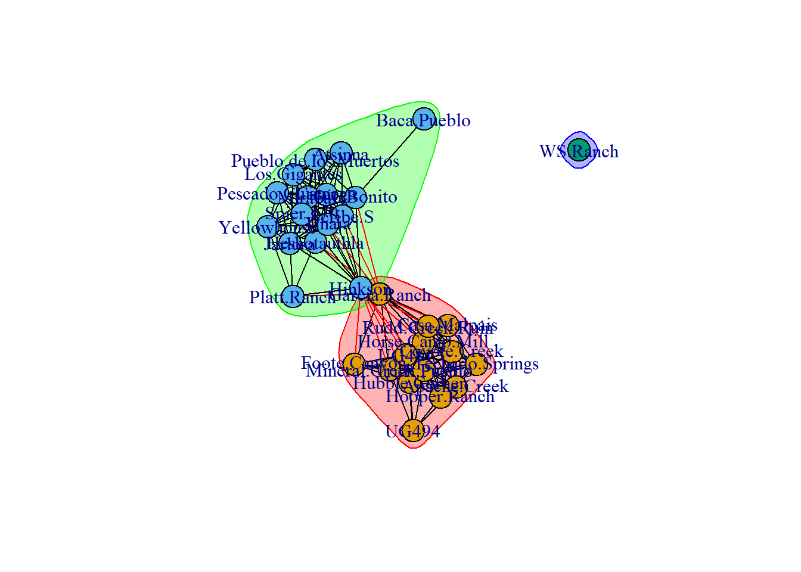

# Exploratory Network Analysis 

This section serves as a companion to Chapter 4 in Brughmans and Peeples 2022 and provides basic examples of the exploratory network analytical methods outlined in the book as well as a few others. 

## Example Network Objects

In order to facilitate the exploratory analysis examples in this section, we want to first create a set of igraph network objects that will serve our purposes across all of the analyses below. Specifically, we will generate and define:

* simple_net - A simple undirected binary network with isolates
* simple_net_noiso - A simple undirected binary network without isolates
* directed_net - A directed binary network
* weighted_net - An undirected weighted network
* sim_net_i - A similarity network with edges weighted by similarity in the igraph format
* sim_net - A similarity network with edges weighted by similarity in the statnet/network format
* sim_mat - A data frame object containing a weighted similarity matrix

Each of these will be used as appropriate to illustrate particular methods. 

In the following chunk of code we initialize all of the packages that we will use in this section and define all of the network objects that we will use (using the object names above). In these examples we will once again use the Cibola technological similarity data we used in the Network Data section previously. 


```r
# initialize packages
library(igraph)
library(statnet)
library(intergraph)
library(vegan)

# read in csv data
Cibola_edgelist <- read.csv(file="data/Cibola_edgelist.csv", header=TRUE) 
Cibola_adj_mat <- read.csv(file="data/Cibola_adj.csv", header=T, row.names=1)

# Simple network with isolates
simple_net <- igraph::graph_from_adjacency_matrix(as.matrix(Cibola_adj_mat), mode="undirected")

# Simple network with no isolates
simple_net_noiso <- igraph::graph_from_edgelist(as.matrix(Cibola_edgelist), directed=FALSE)

#Create a directed network by subsampling edgelist
set.seed(45325)
EL2 <- Cibola_edgelist[sample(seq(1,nrow(Cibola_edgelist)), 125, replace=FALSE),]
directed_net <- igraph::graph_from_edgelist(as.matrix(EL2), directed=TRUE)

# Create a weighted undirected network by adding column of random weights to edgelist
Cibola_edgelist$Weight <- sample(seq(1,4), nrow(Cibola_edgelist), replace=TRUE)
weighted_net <- igraph::graph_from_edgelist(as.matrix(Cibola_edgelist[,1:2]), directed=FALSE)
E(weighted_net)$weight <- Cibola_edgelist$Weight

# Create a similarity network using the Brainerd-Robinson metric
Cibola_clust <- read.csv(file="data/Cibola_clust.csv", header=TRUE, row.names=1)
clust_p <- prop.table(as.matrix(Cibola_clust), margin = 1) 
sim_mat <- (2-as.matrix(vegan::vegdist(clust_p, method='manhattan')))/2
sim_net <- network(sim_mat, directed=FALSE, ignore.eval=FALSE, names.eval='weight')
sim_net_i <- asIgraph(sim_net)
```

## Calculating Network Metrics in R {#CalcMetric}

Although the calculations behind the scenes for centrality metrics, clustering algorithms, and other network measures may be somewhat complicated, calculating these measures in R using network objects is usually quite straight forward and typically only involves a single function and a couple of arguments within it. There are, however, some things that need to be kept in mind when applying these methods to network data. In this appendix, we provide examples of some of the most common functions you may use as well as a few caveats and potential problems.

One thing to keep in mind when working with R network data and using multiple packages at the same time is that different packages may have functions with the same name so it often is good practice to specify which package you mean to use directly in your code. For example, the function to calculate degree centrality in both igraph and sna (part of the statnet suite of packages) is simply "degree." If you type "degree(simple_net)" at the console, R will attempt to use the "degree" function from whichever package was called more recently. This may not be what you want. In order to avoid ambiguity, you can add the package name to the call like this "igraph::degree(simple_net)" since "simple_net" is an igraph object, this will work correctly and return results. On the other hand "sna::degree(simple_net)" would create an error as the sna version of the degree function expects a different format of network object. 

In addition to potential overlap in function names, another thing that you need to keep in mind is that certain network metrics require networks with specific properties and may produce unexpected results if the wrong kind of network is used. For example, closeness centrality is only well defined for binary networks that have no isolates. If you were to use the "igraph::closeness" command to calculate closeness centrality on a network with isolates, you would get results but you would also get a warning telling you "closeness centrality is not well-defined for disconnected graphs." For other functions if you provide data that does not meet the criteria required by that function you my instead get an error and have no results returned. In some cases, however, a function may simply return results and not provide any warning so it is important that you are careful when selecting methods to avoid providing data that violates assumptions of the method provided. Remember, that if you have questions about how a function works or what it requires you can type "?function_name" at the console with the function in question and you will get the help document that should provide more information. You can also include package names in the help call to avoid getting something unexpected (i.e., "?igraph::degree")

## Centrality

One of the most common kinds of exploratory network analysis involves calculating basic network centrality and centralization statistics. There are a wide array of methods available in R through the igraph and statnet packages. In this section we highlight a few examples as well as a few caveats to keep in mind.

### Degree Centrality

Degree centrality can be calculated using the "igraph::degree" function for simple networks with or without isolates as well as simple directed networks. This method is not, however, appropriate for weighted networks or similarity networks (because it expects binary values). If you apply the "igraph::degree" function to a weighted network object you will simply get the binary network degree centrality values. The alternative for calculating weighted degree for weighted and similarity networks is to simply calculate the row sums of the underlying similarity matrix (minus 1 to account for self loops) or adjacency matrix. For the degree function the returned output is a vector of values representing degree centrality which can further be assigned to an R object, plotted, or otherwise used. We provide a few examples here to illustrate. Note that for directed graphs you can also specify the mode as "in" for indegree or "out" for outdegree or "all" for the sum of both. 

Graph level degree centralization is equally simple to call using the centr_degree function. This function returns an object with multiple parts including a vector of degree centrality scores, the graph level centralization metric, and the theoretical maximum number of edges (n * [n-1]). This metric can be normalized such that the maximum centralization value would be 1 using the "normalize=TRUE" argument as we demonstrate below.


```r
# simple network with isolates
igraph::degree(simple_net) 
#>          Apache.Creek               Atsinna           Baca.Pueblo 
#>                    11                     8                     1 
#>          Casa.Malpais               Cienega          Coyote.Creek 
#>                    11                    13                    11 
#>          Foote.Canyon          Garcia.Ranch          Heshotauthla 
#>                     6                    13                    14 
#>               Hinkson          Hooper.Ranch       Horse.Camp.Mill 
#>                    18                    11                    12 
#>         Hubble.Corner               Jarlosa          Los.Gigantes 
#>                    13                    11                    12 
#>  Mineral.Creek.Pueblo               Mirabal            Ojo.Bonito 
#>                    12                    13                    14 
#>       Pescado.Cluster           Platt.Ranch Pueblo.de.los.Muertos 
#>                    11                     5                    10 
#>       Rudd.Creek.Ruin              Scribe.S             Spier.170 
#>                    12                    13                    13 
#>       Techado.Springs                Tinaja          Tri.R.Pueblo 
#>                     9                    14                    13 
#>                 UG481                 UG494              WS.Ranch 
#>                    14                     6                     0 
#>           Yellowhouse 
#>                    10
# simple network no isolates
igraph::degree(simple_net_noiso) 
#>          Apache Creek          Casa Malpais          Coyote Creek 
#>                    11                    11                    11 
#>          Hooper Ranch       Horse Camp Mill         Hubble Corner 
#>                    11                    12                    13 
#>  Mineral Creek Pueblo       Rudd Creek Ruin       Techado Springs 
#>                    12                    12                     9 
#>          Tri-R Pueblo                 UG481                 UG494 
#>                    13                    14                     6 
#>               Atsinna               Cienega          Los Gigantes 
#>                     8                    13                    12 
#>               Mirabal            Ojo Bonito Pueblo de los Muertos 
#>                    13                    14                    10 
#>              Scribe S             Spier 170                Tinaja 
#>                    13                    13                    14 
#>           Baca Pueblo          Garcia Ranch               Hinkson 
#>                     1                    13                    18 
#>          Heshotauthla               Jarlosa       Pescado Cluster 
#>                    14                    11                    11 
#>           Yellowhouse          Foote Canyon           Platt Ranch 
#>                    10                     6                     5

# directed network
igraph::degree(directed_net, mode="in") # indegree
#>          Coyote Creek       Techado Springs         Hubble Corner 
#>                     1                     6                     5 
#>          Tri-R Pueblo          Heshotauthla Pueblo de los Muertos 
#>                     6                     2                     5 
#>       Rudd Creek Ruin               Hinkson          Los Gigantes 
#>                     7                     4                     3 
#>           Yellowhouse               Mirabal              Scribe S 
#>                    10                     5                     8 
#>          Hooper Ranch               Cienega             Spier 170 
#>                     2                     1                     8 
#>          Garcia Ranch       Pescado Cluster                 UG494 
#>                     2                     4                     3 
#>                Tinaja  Mineral Creek Pueblo               Jarlosa 
#>                     9                     6                     2 
#>       Horse Camp Mill          Foote Canyon          Casa Malpais 
#>                     6                     0                     1 
#>           Platt Ranch          Apache Creek               Atsinna 
#>                     2                     0                     0 
#>            Ojo Bonito                 UG481           Baca Pueblo 
#>                     6                    11                     0
igraph::degree(directed_net, mode="out") # outdegree
#>          Coyote Creek       Techado Springs         Hubble Corner 
#>                     6                     2                     5 
#>          Tri-R Pueblo          Heshotauthla Pueblo de los Muertos 
#>                     2                    11                     1 
#>       Rudd Creek Ruin               Hinkson          Los Gigantes 
#>                     3                     9                     5 
#>           Yellowhouse               Mirabal              Scribe S 
#>                     0                     7                     2 
#>          Hooper Ranch               Cienega             Spier 170 
#>                     7                     7                     2 
#>          Garcia Ranch       Pescado Cluster                 UG494 
#>                     9                     4                     0 
#>                Tinaja  Mineral Creek Pueblo               Jarlosa 
#>                     1                     1                     5 
#>       Horse Camp Mill          Foote Canyon          Casa Malpais 
#>                     4                     4                     7 
#>           Platt Ranch          Apache Creek               Atsinna 
#>                     1                     7                     7 
#>            Ojo Bonito                 UG481           Baca Pueblo 
#>                     4                     1                     1

# weighted network - rowSums of adjacency matrix
rowSums(as.matrix(as_adjacency_matrix(weighted_net, attr="weight")))-1
#>          Apache Creek          Casa Malpais          Coyote Creek 
#>                    25                    29                    21 
#>          Hooper Ranch       Horse Camp Mill         Hubble Corner 
#>                    18                    27                    35 
#>  Mineral Creek Pueblo       Rudd Creek Ruin       Techado Springs 
#>                    24                    23                    26 
#>          Tri-R Pueblo                 UG481                 UG494 
#>                    33                    23                    17 
#>               Atsinna               Cienega          Los Gigantes 
#>                    14                    34                    35 
#>               Mirabal            Ojo Bonito Pueblo de los Muertos 
#>                    31                    32                    23 
#>              Scribe S             Spier 170                Tinaja 
#>                    27                    27                    35 
#>           Baca Pueblo          Garcia Ranch               Hinkson 
#>                     2                    23                    37 
#>          Heshotauthla               Jarlosa       Pescado Cluster 
#>                    32                    18                    34 
#>           Yellowhouse          Foote Canyon           Platt Ranch 
#>                    21                    14                    10

# similarity network
rowSums(sim_mat)-1 # note we use the similarity matrix here and not the network object
#>          Apache Creek               Atsinna           Baca Pueblo 
#>              16.00848              15.87024              14.77997 
#>          Casa Malpais               Cienega          Coyote Creek 
#>              17.30358              17.09394              16.51137 
#>          Foote Canyon          Garcia Ranch          Heshotauthla 
#>              16.39800              18.86633              17.56933 
#>               Hinkson          Hooper Ranch       Horse Camp Mill 
#>              19.65702              15.66441              17.46148 
#>         Hubble Corner               Jarlosa          Los Gigantes 
#>              17.19686              15.91820              16.15846 
#>  Mineral Creek Pueblo               Mirabal            Ojo Bonito 
#>              18.21639              16.58203              17.53557 
#>       Pescado Cluster           Platt Ranch Pueblo de los Muertos 
#>              16.18044              17.42528              16.39842 
#>       Rudd Creek Ruin              Scribe S             Spier 170 
#>              16.38749              17.55555              16.47111 
#>       Techado Springs                Tinaja          Tri-R Pueblo 
#>              14.51971              17.45952              16.85153 
#>                 UG481                 UG494              WS Ranch 
#>              18.20736              15.45871              12.95816 
#>           Yellowhouse 
#>              14.55062

# If you want to normalize your degree centrality metric by the number of nodes present
# you can do that by adding the normalize=TRUE command to the function calls above.
# for weighted and similarity networks you can simply divide by the number of nodes minus 1.
igraph::degree(simple_net, normalize=T)
#>          Apache.Creek               Atsinna           Baca.Pueblo 
#>            0.36666667            0.26666667            0.03333333 
#>          Casa.Malpais               Cienega          Coyote.Creek 
#>            0.36666667            0.43333333            0.36666667 
#>          Foote.Canyon          Garcia.Ranch          Heshotauthla 
#>            0.20000000            0.43333333            0.46666667 
#>               Hinkson          Hooper.Ranch       Horse.Camp.Mill 
#>            0.60000000            0.36666667            0.40000000 
#>         Hubble.Corner               Jarlosa          Los.Gigantes 
#>            0.43333333            0.36666667            0.40000000 
#>  Mineral.Creek.Pueblo               Mirabal            Ojo.Bonito 
#>            0.40000000            0.43333333            0.46666667 
#>       Pescado.Cluster           Platt.Ranch Pueblo.de.los.Muertos 
#>            0.36666667            0.16666667            0.33333333 
#>       Rudd.Creek.Ruin              Scribe.S             Spier.170 
#>            0.40000000            0.43333333            0.43333333 
#>       Techado.Springs                Tinaja          Tri.R.Pueblo 
#>            0.30000000            0.46666667            0.43333333 
#>                 UG481                 UG494              WS.Ranch 
#>            0.46666667            0.20000000            0.00000000 
#>           Yellowhouse 
#>            0.33333333

# it is also possible to directly plot the degree distribution for a given network
# using the degree.distribution function. Here we embed that call directly in a 
# call for a histogram plot using the hist function
hist(igraph::degree.distribution(simple_net))
```


```r

# graph level centralization
igraph::centr_degree(simple_net)
#> $res
#>  [1] 11  8  1 11 13 11  6 13 14 18 11 12 13 11 12 12 13 14 11  5 10 12 13 13  9
#> [26] 14 13 14  6  0 10
#> 
#> $centralization
#> [1] 0.2408602
#> 
#> $theoretical_max
#> [1] 930

# to calculate centralization score for a similarity matrix, use the sna::centralization function
sna::centralization(sim_mat, normalize=TRUE, sna::degree)
#> [1] 0.1082207
```

If you are interested in calculating graph level density you can do this using the "edge_density" function. Note that just like the degree function above, this only works for binary networks and if you submit a weighted network object you will simply get the binary edge density value.


```r
edge_density(simple_net_noiso)
#> [1] 0.383908

edge_density(weighted_net)
#> [1] 0.383908
```

### Betweenness Centrality

The betweenness functions work very much like the degree function calls above. Betweenness centrality in igraph can be calculated for simple networks with and without isolates, directed networks, and weighted networks. In the case of weighted networks or similarity networks, the shortest paths between sets of nodes are calculated such that the path of greatest weight is taken at each juncture. You can normalize your results by using "normalize=TRUE" just like you could for degree. The "igraph::betweenness" function will automatically detect if a graph is directed or weighted and use the appropriate method but you can also specify a particular edge attribute to use for weight if you perhaps have more than one weighting scheme. 


```r
# calculate betweenness for simple network
igraph::betweenness(simple_net)
#>          Apache.Creek               Atsinna           Baca.Pueblo 
#>             1.1250000             0.0000000             0.0000000 
#>          Casa.Malpais               Cienega          Coyote.Creek 
#>             8.8253059             8.0328650             3.2862641 
#>          Foote.Canyon          Garcia.Ranch          Heshotauthla 
#>             0.2500000            58.7048084            15.6031093 
#>               Hinkson          Hooper.Ranch       Horse.Camp.Mill 
#>           142.3305364             1.1250000             9.0503059 
#>         Hubble.Corner               Jarlosa          Los.Gigantes 
#>            11.9501530             6.2604913             1.2590038 
#>  Mineral.Creek.Pueblo               Mirabal            Ojo.Bonito 
#>            12.8566507             8.0328650            41.0052110 
#>       Pescado.Cluster           Platt.Ranch Pueblo.de.los.Muertos 
#>             0.5722222             2.7950980             0.2844828 
#>       Rudd.Creek.Ruin              Scribe.S             Spier.170 
#>             9.0503059            15.3558646             8.0328650 
#>       Techado.Springs                Tinaja          Tri.R.Pueblo 
#>             0.0000000            16.0653473            11.9501530 
#>                 UG481                 UG494              WS.Ranch 
#>            17.0225282             0.0000000             0.0000000 
#>           Yellowhouse 
#>             2.1735632
# calculate betweenness for weighted network
igraph::betweenness(weighted_net, directed=FALSE)
#>          Apache Creek          Casa Malpais          Coyote Creek 
#>            20.9442338            18.9625928            17.6782863 
#>          Hooper Ranch       Horse Camp Mill         Hubble Corner 
#>            15.6685277             2.7803603             7.6666667 
#>  Mineral Creek Pueblo       Rudd Creek Ruin       Techado Springs 
#>            28.7124872            55.2913965             0.0000000 
#>          Tri-R Pueblo                 UG481                 UG494 
#>             2.8409091            50.0026062             0.0000000 
#>               Atsinna               Cienega          Los Gigantes 
#>             8.0155123             0.9448773             3.9171717 
#>               Mirabal            Ojo Bonito Pueblo de los Muertos 
#>             4.5814935            93.4976551             3.1785714 
#>              Scribe S             Spier 170                Tinaja 
#>            20.5347403             5.5688312            33.2419553 
#>           Baca Pueblo          Garcia Ranch               Hinkson 
#>             0.0000000            98.8990651           102.7018007 
#>          Heshotauthla               Jarlosa       Pescado Cluster 
#>            16.9579004            57.7828448             0.0000000 
#>           Yellowhouse          Foote Canyon           Platt Ranch 
#>             1.6544012             5.3428571             0.0000000
# calculate betweenness for weighted network specifying weight attribute
igraph::betweenness(weighted_net, weights=E(weighted_net)$weight)
#>          Apache Creek          Casa Malpais          Coyote Creek 
#>            20.9442338            18.9625928            17.6782863 
#>          Hooper Ranch       Horse Camp Mill         Hubble Corner 
#>            15.6685277             2.7803603             7.6666667 
#>  Mineral Creek Pueblo       Rudd Creek Ruin       Techado Springs 
#>            28.7124872            55.2913965             0.0000000 
#>          Tri-R Pueblo                 UG481                 UG494 
#>             2.8409091            50.0026062             0.0000000 
#>               Atsinna               Cienega          Los Gigantes 
#>             8.0155123             0.9448773             3.9171717 
#>               Mirabal            Ojo Bonito Pueblo de los Muertos 
#>             4.5814935            93.4976551             3.1785714 
#>              Scribe S             Spier 170                Tinaja 
#>            20.5347403             5.5688312            33.2419553 
#>           Baca Pueblo          Garcia Ranch               Hinkson 
#>             0.0000000            98.8990651           102.7018007 
#>          Heshotauthla               Jarlosa       Pescado Cluster 
#>            16.9579004            57.7828448             0.0000000 
#>           Yellowhouse          Foote Canyon           Platt Ranch 
#>             1.6544012             5.3428571             0.0000000

# calculate graph level centralization
centr_betw(simple_net)
#> $res
#>  [1]   1.1250000   0.0000000   0.0000000   8.8253059   8.0328650   3.2862641
#>  [7]   0.2500000  58.7048084  15.6031093 142.3305364   1.1250000   9.0503059
#> [13]  11.9501530   6.2604913   1.2590038  12.8566507   8.0328650  41.0052110
#> [19]   0.5722222   2.7950980   0.2844828   9.0503059  15.3558646   8.0328650
#> [25]   0.0000000  16.0653473  11.9501530  17.0225282   0.0000000   0.0000000
#> [31]   2.1735632
#> 
#> $centralization
#> [1] 0.3064557
#> 
#> $theoretical_max
#> [1] 13050
```

### Eigenvector Centrality

The "igraph::eigen_centrality" function can be calculated for simple networks with and without isolates, directed networks, and weighted networks. By default scores are scaled such that the maximum score of 1. You can turn this scaling of by using the "scale=FALSE" argument. This function automatically detects whether a network object is directed or weighted but you can also call edge attributes to specify a particular weight attribute. By default this function outputs many other features of the analysis such as the number of steps toward convergence and the number of iterations but if you just want the centrality results you can use the atomic vector call to $vector.


```r
eigen_centrality(simple_net, scale=TRUE)$vector
#>          Apache.Creek               Atsinna           Baca.Pueblo 
#>            0.46230981            0.54637071            0.07114132 
#>          Casa.Malpais               Cienega          Coyote.Creek 
#>            0.53026366            0.85007181            0.49562276 
#>          Foote.Canyon          Garcia.Ranch          Heshotauthla 
#>            0.33029706            0.70213609            0.88689660 
#>               Hinkson          Hooper.Ranch       Horse.Camp.Mill 
#>            1.00000000            0.46230981            0.57200439 
#>         Hubble.Corner               Jarlosa          Los.Gigantes 
#>            0.56392007            0.71724727            0.77369018 
#>  Mineral.Creek.Pueblo               Mirabal            Ojo.Bonito 
#>            0.54647608            0.85007181            0.86025176 
#>       Pescado.Cluster           Platt.Ranch Pueblo.de.los.Muertos 
#>            0.73195749            0.32635046            0.67002143 
#>       Rudd.Creek.Ruin              Scribe.S             Spier.170 
#>            0.57200439            0.84891759            0.85007181 
#>       Techado.Springs                Tinaja          Tri.R.Pueblo 
#>            0.40025173            0.90370210            0.56392007 
#>                 UG481                 UG494              WS.Ranch 
#>            0.61755036            0.26599780            0.00000000 
#>           Yellowhouse 
#>            0.63999991

eigen_centrality(weighted_net, weights=E(weighted_net)$weight, directed=FALSE, scale=FALSE)$vector
#>          Apache Creek          Casa Malpais          Coyote Creek 
#>            0.08116512            0.10608344            0.07254989 
#>          Hooper Ranch       Horse Camp Mill         Hubble Corner 
#>            0.05355994            0.10123595            0.10910432 
#>  Mineral Creek Pueblo       Rudd Creek Ruin       Techado Springs 
#>            0.08413746            0.07625776            0.08447282 
#>          Tri-R Pueblo                 UG481                 UG494 
#>            0.10895556            0.07774168            0.05405234 
#>               Atsinna               Cienega          Los Gigantes 
#>            0.13955196            0.30115914            0.30169689 
#>               Mirabal            Ojo Bonito Pueblo de los Muertos 
#>            0.28497508            0.26014833            0.22489789 
#>              Scribe S             Spier 170                Tinaja 
#>            0.24715956            0.24475384            0.29249400 
#>           Baca Pueblo          Garcia Ranch               Hinkson 
#>            0.02677487            0.13528182            0.20949749 
#>          Heshotauthla               Jarlosa       Pescado Cluster 
#>            0.27176745            0.16928366            0.30678791 
#>           Yellowhouse          Foote Canyon           Platt Ranch 
#>            0.18740871            0.05703852            0.07672358
```

### Page Rank Centrality

The "igraph::page_rank" function can be calculated for simple networks with and without isolates, directed networks, and weighted networks. By default scores are scaled such that the maximum score is 1. You can turn this scaling off by using the "scale=FALSE" argument. This function automatically detects whether a network object is directed or weighted but you can also call edge attributes to specify a particular weight attribute. You can change the algorithm used to implement the page rank algorithm (see help for details) and can also change the damping factor if desired.


```r
page_rank(directed_net, directed=TRUE)
#> $vector
#>          Coyote Creek       Techado Springs         Hubble Corner 
#>            0.01375364            0.03433734            0.02521968 
#>          Tri-R Pueblo          Heshotauthla Pueblo de los Muertos 
#>            0.04722743            0.01549665            0.02764172 
#>       Rudd Creek Ruin               Hinkson          Los Gigantes 
#>            0.02688472            0.01836421            0.01753448 
#>           Yellowhouse               Mirabal              Scribe S 
#>            0.14152350            0.02093896            0.03621715 
#>          Hooper Ranch               Cienega             Spier 170 
#>            0.01588291            0.01375364            0.03717403 
#>          Garcia Ranch       Pescado Cluster                 UG494 
#>            0.01654066            0.02484170            0.11486692 
#>                Tinaja  Mineral Creek Pueblo               Jarlosa 
#>            0.08069154            0.02587238            0.01519626 
#>       Horse Camp Mill          Foote Canyon          Casa Malpais 
#>            0.02259737            0.01226440            0.01375364 
#>           Platt Ranch          Apache Creek               Atsinna 
#>            0.01556097            0.01226440            0.01226440 
#>            Ojo Bonito                 UG481           Baca Pueblo 
#>            0.03372781            0.09534309            0.01226440 
#> 
#> $value
#> [1] 1
#> 
#> $options
#> NULL

page_rank(weighted_net, weights=E(weighted_net)$weight, directed=FALSE, algo="prpack")
#> $vector
#>          Apache Creek          Casa Malpais          Coyote Creek 
#>           0.033408370           0.037619401           0.029012546 
#>          Hooper Ranch       Horse Camp Mill         Hubble Corner 
#>           0.026100007           0.035514772           0.044908000 
#>  Mineral Creek Pueblo       Rudd Creek Ruin       Techado Springs 
#>           0.032792641           0.031475846           0.034442169 
#>          Tri-R Pueblo                 UG481                 UG494 
#>           0.042761060           0.031862128           0.024881892 
#>               Atsinna               Cienega          Los Gigantes 
#>           0.021022779           0.042391852           0.043870781 
#>               Mirabal            Ojo Bonito Pueblo de los Muertos 
#>           0.038954388           0.044079292           0.030274554 
#>              Scribe S             Spier 170                Tinaja 
#>           0.034530275           0.034699053           0.043523141 
#>           Baca Pueblo          Garcia Ranch               Hinkson 
#>           0.008406127           0.031427598           0.046735307 
#>          Heshotauthla               Jarlosa       Pescado Cluster 
#>           0.040758010           0.025200790           0.042215972 
#>           Yellowhouse          Foote Canyon           Platt Ranch 
#>           0.028800300           0.021398935           0.016932015 
#> 
#> $value
#> [1] 1
#> 
#> $options
#> NULL
```

### Closeness Centrality

The "igraph::closeness" function calculates closeness centrality and can be calculated for directed and undirected simple or weighted networks with no isolates. This function can also be used for networks with isolates, but you will receive an additional message suggesting that closeness is undefined for networks that are not fully connected. For very large networks you can use the "igraph::estimate_closeness" function with a cutoff setting that will consider paths of length up to cutoff to calculate closeness scores. For directed networks you can also specify whether connections in, out, or in both directions should be used.


```r
igraph::closeness(simple_net)
#> Warning in igraph::closeness(simple_net): At centrality.c:2874 :closeness
#> centrality is not well-defined for disconnected graphs
#>          Apache.Creek               Atsinna           Baca.Pueblo 
#>           0.010101010           0.010101010           0.009345794 
#>          Casa.Malpais               Cienega          Coyote.Creek 
#>           0.011904762           0.012345679           0.011363636 
#>          Foote.Canyon          Garcia.Ranch          Heshotauthla 
#>           0.011235955           0.013157895           0.012658228 
#>               Hinkson          Hooper.Ranch       Horse.Camp.Mill 
#>           0.014084507           0.010101010           0.012048193 
#>         Hubble.Corner               Jarlosa          Los.Gigantes 
#>           0.012195122           0.012048193           0.010638298 
#>  Mineral.Creek.Pueblo               Mirabal            Ojo.Bonito 
#>           0.012048193           0.012345679           0.012658228 
#>       Pescado.Cluster           Platt.Ranch Pueblo.de.los.Muertos 
#>           0.010526316           0.011111111           0.010416667 
#>       Rudd.Creek.Ruin              Scribe.S             Spier.170 
#>           0.012048193           0.012500000           0.012345679 
#>       Techado.Springs                Tinaja          Tri.R.Pueblo 
#>           0.009900990           0.012658228           0.012195122 
#>                 UG481                 UG494              WS.Ranch 
#>           0.012345679           0.009615385           0.001075269 
#>           Yellowhouse 
#>           0.010309278

igraph::closeness(simple_net_noiso)
#>          Apache Creek          Casa Malpais          Coyote Creek 
#>            0.01470588            0.01886792            0.01754386 
#>          Hooper Ranch       Horse Camp Mill         Hubble Corner 
#>            0.01470588            0.01923077            0.01960784 
#>  Mineral Creek Pueblo       Rudd Creek Ruin       Techado Springs 
#>            0.01923077            0.01923077            0.01428571 
#>          Tri-R Pueblo                 UG481                 UG494 
#>            0.01960784            0.02000000            0.01369863 
#>               Atsinna               Cienega          Los Gigantes 
#>            0.01470588            0.02000000            0.01587302 
#>               Mirabal            Ojo Bonito Pueblo de los Muertos 
#>            0.02000000            0.02083333            0.01538462 
#>              Scribe S             Spier 170                Tinaja 
#>            0.02040816            0.02000000            0.02083333 
#>           Baca Pueblo          Garcia Ranch               Hinkson 
#>            0.01315789            0.02222222            0.02500000 
#>          Heshotauthla               Jarlosa       Pescado Cluster 
#>            0.02083333            0.01923077            0.01562500 
#>           Yellowhouse          Foote Canyon           Platt Ranch 
#>            0.01515152            0.01724138            0.01694915

igraph::closeness(weighted_net, weights=E(weighted_net)$weight)
#>          Apache Creek          Casa Malpais          Coyote Creek 
#>           0.010101010           0.012987013           0.012195122 
#>          Hooper Ranch       Horse Camp Mill         Hubble Corner 
#>           0.011111111           0.010638298           0.011904762 
#>  Mineral Creek Pueblo       Rudd Creek Ruin       Techado Springs 
#>           0.012987013           0.013888889           0.009615385 
#>          Tri-R Pueblo                 UG481                 UG494 
#>           0.011111111           0.012658228           0.007874016 
#>               Atsinna               Cienega          Los Gigantes 
#>           0.010869565           0.010416667           0.010752688 
#>               Mirabal            Ojo Bonito Pueblo de los Muertos 
#>           0.010989011           0.014492754           0.011363636 
#>              Scribe S             Spier 170                Tinaja 
#>           0.011627907           0.011764706           0.013333333 
#>           Baca Pueblo          Garcia Ranch               Hinkson 
#>           0.006535948           0.014925373           0.015151515 
#>          Heshotauthla               Jarlosa       Pescado Cluster 
#>           0.012987013           0.013698630           0.010101010 
#>           Yellowhouse          Foote Canyon           Platt Ranch 
#>           0.010869565           0.011627907           0.010526316

igraph::closeness(directed_net, mode="in")
#> Warning in igraph::closeness(directed_net, mode = "in"): At
#> centrality.c:2874 :closeness centrality is not well-defined for disconnected
#> graphs
#>          Coyote Creek       Techado Springs         Hubble Corner 
#>           0.001189061           0.001984127           0.001782531 
#>          Tri-R Pueblo          Heshotauthla Pueblo de los Muertos 
#>           0.002114165           0.001426534           0.001980198 
#>       Rudd Creek Ruin               Hinkson          Los Gigantes 
#>           0.001893939           0.001492537           0.001615509 
#>           Yellowhouse               Mirabal              Scribe S 
#>           0.003003003           0.001626016           0.002123142 
#>          Hooper Ranch               Cienega             Spier 170 
#>           0.001275510           0.001189061           0.002109705 
#>          Garcia Ranch       Pescado Cluster                 UG494 
#>           0.001275510           0.001976285           0.002531646 
#>                Tinaja  Mineral Creek Pueblo               Jarlosa 
#>           0.002583979           0.001890359           0.001545595 
#>       Horse Camp Mill          Foote Canyon          Casa Malpais 
#>           0.001709402           0.001149425           0.001189061 
#>           Platt Ranch          Apache Creek               Atsinna 
#>           0.001547988           0.001149425           0.001149425 
#>            Ojo Bonito                 UG481           Baca Pueblo 
#>           0.001886792           0.002409639           0.001149425
```


### Hubs and Authorities

In directed networks it is possible to calculate hub and authority scores to identify nodes that are characterized by high indegree and high outdegree in particular. Because this is a measure that depends on direction it is only appropriate for directed network objects. If you run this function for an undirected network hub scores and authority scores will be identical. These functions can also be applied networks that are both directed and weighted. If you do not want all options printed you can use the atomic vector $vector call as well.


```r
igraph::hub_score(directed_net)$vector
#>          Coyote Creek       Techado Springs         Hubble Corner 
#>           0.319987436           0.122658318           0.307404093 
#>          Tri-R Pueblo          Heshotauthla Pueblo de los Muertos 
#>           0.084507972           1.000000000           0.122816074 
#>       Rudd Creek Ruin               Hinkson          Los Gigantes 
#>           0.166019620           0.643450794           0.554451472 
#>           Yellowhouse               Mirabal              Scribe S 
#>           0.000000000           0.748983983           0.241641653 
#>          Hooper Ranch               Cienega             Spier 170 
#>           0.414687961           0.628845892           0.241641653 
#>          Garcia Ranch       Pescado Cluster                 UG494 
#>           0.676530960           0.501275171           0.000000000 
#>                Tinaja  Mineral Creek Pueblo               Jarlosa 
#>           0.118825579           0.074972539           0.476521878 
#>       Horse Camp Mill          Foote Canyon          Casa Malpais 
#>           0.204246560           0.191774909           0.359129249 
#>           Platt Ranch          Apache Creek               Atsinna 
#>           0.118825579           0.277582949           0.624799840 
#>            Ojo Bonito                 UG481           Baca Pueblo 
#>           0.417189057           0.009535434           0.090153273

igraph::authority_score(directed_net)$vector
#>          Coyote Creek       Techado Springs         Hubble Corner 
#>            0.05372558            0.32708203            0.28835263 
#>          Tri-R Pueblo          Heshotauthla Pueblo de los Muertos 
#>            0.35970234            0.25265287            0.64749966 
#>       Rudd Creek Ruin               Hinkson          Los Gigantes 
#>            0.58040612            0.51570940            0.40670628 
#>           Yellowhouse               Mirabal              Scribe S 
#>            0.89632254            0.65295655            1.00000000 
#>          Hooper Ranch               Cienega             Spier 170 
#>            0.13144157            0.12092866            0.95846193 
#>          Garcia Ranch       Pescado Cluster                 UG494 
#>            0.10662631            0.54096988            0.07192748 
#>                Tinaja  Mineral Creek Pueblo               Jarlosa 
#>            0.92642355            0.48608217            0.31808635 
#>       Horse Camp Mill          Foote Canyon          Casa Malpais 
#>            0.52090872            0.00000000            0.05372558 
#>           Platt Ranch          Apache Creek               Atsinna 
#>            0.25547962            0.00000000            0.00000000 
#>            Ojo Bonito                 UG481           Baca Pueblo 
#>            0.68004222            0.56553123            0.00000000
```
## Triads and clustering

Another important topic in network science concerns considerations of the overall structure and clustering of connections across a network as a whole. There are a variety of methods which have been developed to characterize the overall degree of clustering and closure in networks, many of which are based on counting triads of various configurations. In this section, we briefly outline approaches toward evaluating triads, transitivity, and clustering in R.

### Triads

A triad is simply a set of three nodes and a description of the configuration of edges among them. For undirected graphs, there are four possibilities for describing the connections among those nodes (empty graph, 1 connection, 2 connections, 3 connections). For directed graphs the situation is considerably more complicated because ties can be considered in both directions and an edge in one direction isn't necessarily reciprocated. Thus there are 16 different configurations that can exist (see Brughmans and Peeples 2022: Figure 4.4).

One common method for outlining the overall structural properties of a network is to conduct a "triad census" which counts each of the 4 or 16 possible triads for a given network. Although a triad census can be conducted on an undirected network using the igraph::triad_census function, a warning will be returned along with 0 results for all impossible triad configurations so be aware. The results are returned as a vector of counts of each possible node configuration in an order outlined in the help document associated with the function (see ?triad_census for more).


```r
igraph::triad_census(directed_net)
#>  [1] 1404 2007    0  134  146  174    0    0  195    0    0    0    0    0    0
#> [16]    0

igraph::triad_census(simple_net)
#> Warning in igraph::triad_census(simple_net): At motifs.c:1055 :Triad census
#> called on an undirected graph
#>  [1] 1033    0 2551    0    0    0    0    0    0    0  441    0    0    0    0
#> [16]  470
```

Often can be useful to visualize the motifs defined for each entry in the triad census and this can be done using the "graph_from_isomorphism_class()" function and a little bit of additional data wrangling and plotting using the ggraph and ggpubr packages. These packages are described in more detail in the visualization section of this appendix. 


```r
library(ggraph)
library(ggpubr)

g <- list()
xy <- as.data.frame(matrix(c(0,0,1,0,0.5,0.5),nrow=3,ncol=2,byrow=T))

for (i in 0:15) {
  g_temp <- graph_from_isomorphism_class(size=3, number=i, directed=T)
  g[[i+1]] <- ggraph(g_temp, layout="manual",
                     x=xy[,1], y=xy[,2]) +
                geom_node_point(size=8,col="purple") +
                geom_edge_fan(arrow = arrow(length = unit(4, 'mm'), type="closed"),
                 end_cap = circle(6, 'mm'), start_cap = circle(6, 'mm'), 
                 edge_colour = "black") +
                theme_graph(plot_margin = margin(0,0,0,0),border=T,foreground="black")
}

# motifs ordered by order in triad_census function
ggarrange(g[[1]],g[[2]],g[[4]],g[[7]],
          g[[3]],g[[5]],g[[6]],g[[10]],
          g[[8]],g[[12]],g[[11]],g[[9]],
          g[[13]],g[[14]],g[[15]],g[[16]],
          nrow=4, ncol=4)
```


### Transitivity and Clustering

A network’s global average transitivity (or clustering coefficient) is the number of closed triads over the total number of triads in a network. This measure can be calculated using "igraph::transitivity" for simple networks with or without isolates, directed networks, and weighted networks. There are options within the function to determine the specific type of transitivity (global transitivity is the default) and for how to treat isolates. See the help document (?igraph::transitivity) for more details. If you want to calculate local transitivity for a particular node you can use the "type='local'" argument. This will return a NA value for nodes that are not part of any triads (isolates and nodes with a single connection).


```r
igraph::transitivity(simple_net, type="global")
#> [1] 0.7617504

igraph::transitivity(simple_net, type="local")
#>  [1] 0.8727273 1.0000000       NaN 0.8363636 0.8333333 0.8727273 0.8666667
#>  [8] 0.4358974 0.7252747 0.4183007 0.8727273 0.8333333 0.7435897 0.8000000
#> [15] 0.8787879 0.7272727 0.8333333 0.6703297 0.9272727 0.7000000 0.9555556
#> [22] 0.8333333 0.7692308 0.8333333 1.0000000 0.7582418 0.7435897 0.7142857
#> [29] 1.0000000       NaN 0.8222222
```

## Walks, Paths, and Distance

There are a variety of network metrics which rely on distance and paths across networks that can be calculated in R. There are a great many functions available and we highlight just a few here.

### Distance

In some cases, you may simply want information about the graph distance between nodes in general or perhaps the average distance. There are a variety of functions that can help with this including "igraph::distances" and "igraph::mean_distance." These work on simple networks, directed networks, and weighted networks.


```r
# Create matrix of all distances among nodes and view the first few rows and columns
igraph::distances(simple_net)[1:4, 1:4]
#>              Apache.Creek Atsinna Baca.Pueblo Casa.Malpais
#> Apache.Creek            0       4           4            1
#> Atsinna                 4       0           2            3
#> Baca.Pueblo             4       2           0            3
#> Casa.Malpais            1       3           3            0

# Calculate the mean distance for a network
igraph::mean_distance(simple_net)
#> [1] 1.949425
```

### Shortest Paths

If you want to identify particular shortest paths to or from nodes in a network you can use the "igraph::shortest_paths" function or alternatively the igraph::all_shortest_paths if you want all shortest paths originating at a particular node. To call this function you simply need to provide a network object and an id for the origin and destination of the path. The simplest solution is just to call the node number. This function works with directed and undirected networks with or without weights. Although it can be applied to networks with isolates, the isolates themselves will produce NA results. 


```r
# track shortest path from Apache Creek to Pueblo de los Muertos
igraph::shortest_paths(simple_net, from=1, to=21)
#> $vpath
#> $vpath[[1]]
#> + 5/31 vertices, named, from 9142c51:
#> [1] Apache.Creek          Casa.Malpais          Garcia.Ranch         
#> [4] Heshotauthla          Pueblo.de.los.Muertos
#> 
#> 
#> $epath
#> NULL
#> 
#> $predecessors
#> NULL
#> 
#> $inbound_edges
#> NULL
```

The output provides the ids for all nodes crossed in the path from origin to destination. 

### Diameter

The "igraph::diameter" function calculates the diameter of a network (the longest shortest path) and you can also use the "farthest_vertices" function to get the ids of the nodes that form the ends of that longest shortest path. This metric can be calculated for directed and undirected, weighted and unweighted networks, with or without isolates.


```r
igraph::diameter(directed_net, directed=TRUE)
#> [1] 4

igraph::farthest_vertices(directed_net, directed=T)
#> $vertices
#> + 2/30 vertices, named, from 9143afa:
#> [1] Apache Creek          Pueblo de los Muertos
#> 
#> $distance
#> [1] 4
```

## Components and Bridges

Identifying fully connected subgraphs within a large network is a common analytical procedure and is quite straight forward in R using the igraph package. If you first want to know whether or not a given network is fully connected you can use the "igraph::is_connected" function to check. 


```r
igraph::is_connected(simple_net)
#> [1] FALSE

igraph::is_connected(simple_net_noiso)
#> [1] TRUE
```

You can also count components using the "count_components" function.


```r
igraph::count_components(simple_net)
#> [1] 2
```


### Identifying Components

If you want to decompose a network object into its distinct components you can use the "igraph::decompose" function which outputs a list object with each entry representing a distinct component. Each object in the list can then be called using [[k]] where k is the number of the item in the list.


```r
components <- igraph::decompose(simple_net, min.vertices = 1)

components
#> [[1]]
#> IGRAPH 9372e7a UN-- 30 167 -- 
#> + attr: name (v/c)
#> + edges from 9372e7a (vertex names):
#>  [1] Apache.Creek--Casa.Malpais          Apache.Creek--Coyote.Creek         
#>  [3] Apache.Creek--Hooper.Ranch          Apache.Creek--Horse.Camp.Mill      
#>  [5] Apache.Creek--Hubble.Corner         Apache.Creek--Mineral.Creek.Pueblo 
#>  [7] Apache.Creek--Rudd.Creek.Ruin       Apache.Creek--Techado.Springs      
#>  [9] Apache.Creek--Tri.R.Pueblo          Apache.Creek--UG481                
#> [11] Apache.Creek--UG494                 Atsinna     --Cienega              
#> [13] Atsinna     --Los.Gigantes          Atsinna     --Mirabal              
#> [15] Atsinna     --Ojo.Bonito            Atsinna     --Pueblo.de.los.Muertos
#> + ... omitted several edges
#> 
#> [[2]]
#> IGRAPH 9372e7a UN-- 1 0 -- 
#> + attr: name (v/c)
#> + edges from 9372e7a (vertex names):

V(components[[2]])$name
#> [1] "WS.Ranch"
```

In the example here this network is fully connected with the exception of 1 node (WS Ranch). When you run the decompose function it separates WS ranch into a component as an isolate with no edges.

### Cutpoints

A cutpoint is a node, the removal which creates a network with a higher number of components. There is not a convenient igraph function for identifying cutpoints but there is a function in the "sna" package within the "statnet" suite. Using the intergraph package we can easily convert an igraph object to an sna object (using the asNetwork function) within the call to use this function. 

The sna::cutpoint function returns the node id for any cutpoints detected. We can use the numbers returned to find the name of the node in question.


```r
cut_p <- cutpoints(asNetwork(simple_net))
cut_p
#> [1] 18

V(simple_net)$name[cut_p]
#> [1] "Ojo.Bonito"

set.seed(4536)
plot(simple_net)
```


The example here reveals that Ojo Bonito is a cutpoint and if we look at the figure we can see that it is the sole connection with Baca Pueblo which would otherwise become and isolate and distinct component if Ojo Bonito were removed.

### Bridges

A bridge is an edge, the removal of which results in a network with a higher number of components. The function igraph::min_cut finds bridges in network objects for sets of nodes or for the graph as a whole. The output of this function includes a vector called $cut which provides the edges representing bridges. By default this function only outputs the cut value but you can use the argument value.only=FALSE to get the full output.


```r
min_cut(simple_net_noiso,value.only=FALSE)
#> $value
#> [1] 1
#> 
#> $cut
#> + 1/167 edge from 91433a6 (vertex names):
#> [1] Ojo Bonito--Baca Pueblo
#> 
#> $partition1
#> + 1/30 vertex, named, from 91433a6:
#> [1] Baca Pueblo
#> 
#> $partition2
#> + 29/30 vertices, named, from 91433a6:
#>  [1] Apache Creek          Casa Malpais          Coyote Creek         
#>  [4] Hooper Ranch          Horse Camp Mill       Hubble Corner        
#>  [7] Mineral Creek Pueblo  Rudd Creek Ruin       Techado Springs      
#> [10] Tri-R Pueblo          UG481                 UG494                
#> [13] Atsinna               Cienega               Los Gigantes         
#> [16] Mirabal               Ojo Bonito            Pueblo de los Muertos
#> [19] Scribe S              Spier 170             Tinaja               
#> [22] Garcia Ranch          Hinkson               Heshotauthla         
#> [25] Jarlosa               Pescado Cluster       Yellowhouse          
#> [28] Foote Canyon          Platt Ranch
```

As this example illustrates the edge between Ojo Bonito and Baca Pueblo is a bridge (perhaps not surprising as Ojo Bonito was a cut point).

## Cliques and Communities

Another very common task in network analysis involves creating cohesive sub-groups of nodes in a larger network. There are wide variety of methods available for defining such groups and we highlight a few of the most common here.

### Cliques

A clique as a network science concept is arguably the strictest method of defining a cohesive subgroup. It is any set of three or more nodes in which each node is directly connected to all other nodes. It can be alternatively defined as a completely connected subnetwork, or a subnetwork with maximum density. The function "igraph::max_cliques" finds all maximal cliques in a network and outputs a list object with nodes in each set indicated. For the sake of space here we only output one clique of the 24 that were defined by this function call.


```r
max_cliques(simple_net, min=1)[[24]]
#> + 9/31 vertices, named, from 9142c51:
#> [1] Los.Gigantes    Cienega         Tinaja          Spier.170      
#> [5] Scribe.S        Pescado.Cluster Mirabal         Heshotauthla   
#> [9] Yellowhouse
```

Note in this list that the same node can appear in more than one maximal clique.

### K-cores

A k-core is a maximal subnetwork in which each vertex has at least degree k within the subnetwork. In R this can be obtained using the "igraph::coreness" function and the filtering by value as appropriate. This function creates a vector of k values which can then be used to remove nodes as appropriate or symbolize them in plots.


```r
# Define coreness of each node
kcore <- coreness(simple_net)
kcore
#>          Apache.Creek               Atsinna           Baca.Pueblo 
#>                     9                     8                     1 
#>          Casa.Malpais               Cienega          Coyote.Creek 
#>                     9                     9                     9 
#>          Foote.Canyon          Garcia.Ranch          Heshotauthla 
#>                     6                     9                     9 
#>               Hinkson          Hooper.Ranch       Horse.Camp.Mill 
#>                     9                     9                     9 
#>         Hubble.Corner               Jarlosa          Los.Gigantes 
#>                     9                     9                     9 
#>  Mineral.Creek.Pueblo               Mirabal            Ojo.Bonito 
#>                     9                     9                     9 
#>       Pescado.Cluster           Platt.Ranch Pueblo.de.los.Muertos 
#>                     9                     5                     9 
#>       Rudd.Creek.Ruin              Scribe.S             Spier.170 
#>                     9                     9                     9 
#>       Techado.Springs                Tinaja          Tri.R.Pueblo 
#>                     9                     9                     9 
#>                 UG481                 UG494              WS.Ranch 
#>                     9                     6                     0 
#>           Yellowhouse 
#>                     9

# set up colorscale
col_set <- heat.colors(max(kcore), rev=TRUE)
set.seed(2509)
plot(simple_net, vertex.color=col_set[kcore])
```


In the plot shown here the darker read colors represent higher maximal k-core values.

### Cluster Detection Algorithms

R allows you to use a variety of common cluster detection algorithms to define groups of nodes in a network using a variety of different assumptions. We highlight a few of the most common here.

#### Girvan-Newman Clustering

Girvan-Newman clustering is a divisive algorithm based on betweenness that defines a partition of network that maximizes modularity by removing nodes with high betweenness iteratively (see discussion in Brughmans and Peeples 2022 Chapter 4.6). In R this is referred to as the igraph::edge.betweenness.community function. This function can be used on directed or undirected networks with or without edge weights. This function outputs a variety of information including individual edge betweenness scores, modularity information, and partition membership. See the help documents for more information


```r
GN <- igraph::edge.betweenness.community(simple_net)
set.seed(4353)
plot(simple_net, vertex.color=GN$membership)
```


#### Walktrap Algorithm

The walktrap algorithm is designed to work for either binary or weighted networks and defines communities by generating a large number of short random walks and determining which sets of nodes consistently fall along the same short random walks. This can called using the "igraph::cluster_walktrap" function. The "steps" argument determines the length of the short walks and is set to 4 by default.


```r
WT <- igraph::cluster_walktrap(simple_net, steps=4)
set.seed(4353)
plot(simple_net, vertex.color=WT$membership)
```


#### Louvain Modularity

Louvain modularity is a cluster detection algorithm based on modularity. The algorithm iteratively moves nodes among community definitions in a way that optimizes modularity. This measure can be calculated on simple networks, directed networks, and weighted networks and is implemented in R through the "igraph::cluster_louvain" function.


```r
LV <- igraph::cluster_louvain(simple_net)
set.seed(4353)
plot(simple_net, vertex.color=LV$membership)
```


#### Calculating Modularity for Partitions

If you would like to compare modularity scores among partitions of the same graph, this can be achieved using the "igraph::modularity" function. In the modularity call you simply supply an argument indicating the partition membership for each node. Note that this can also be used for attribute data such as regional designations. In the following chunk of code we will compare modularity for each of the clustering methods described above as well using subregion designations [from the original Cibola region attribute data](data/Cibola_attr.csv)


```r
# Modularity for Girvan-Newman
modularity(simple_net, membership=membership(GN))
#> [1] 0.4103589

# Modularity for walktrap
modularity(simple_net, membership=membership(WT))
#> [1] 0.4157195

# Modularity for Louvain clustering
modularity(simple_net, membership=membership(LV))
#> [1] 0.4131378

# Modularity for subregion
Cibola_attr <- read.csv("data/Cibola_attr.csv")
modularity(simple_net, membership=as.factor(Cibola_attr$Region))
#> [1] 0.1325612
```

Note that although modularity can be useful in comparing among partitions like this approach has been shown to be poor at detecting small communities within a network so will not always be appropriate. 

#### Finding Edges Within and Between Communities

In many cases you may be interested in identifying edges that remain within or extend between some network partition. This can be done using the "igraph::crossing" function. This function expects a igraph cluster definition object and an igraph network and will return a list of true and false values for each edge where true indicates an edge that extends beyond the cluster assigned to the nodes. Let's take a look at the first 10 edges in our simple_net object based on the Louvain cluster definition. 


```r
igraph::crossing(LV, simple_net)[1:10]
#>         Apache.Creek|Casa.Malpais         Apache.Creek|Coyote.Creek 
#>                             FALSE                             FALSE 
#>         Apache.Creek|Hooper.Ranch      Apache.Creek|Horse.Camp.Mill 
#>                             FALSE                             FALSE 
#>        Apache.Creek|Hubble.Corner Apache.Creek|Mineral.Creek.Pueblo 
#>                             FALSE                             FALSE 
#>      Apache.Creek|Rudd.Creek.Ruin      Apache.Creek|Techado.Springs 
#>                             FALSE                             FALSE 
#>         Apache.Creek|Tri.R.Pueblo                Apache.Creek|UG481 
#>                             FALSE                             FALSE
```

Beyond this, if you plot an igraph object and add a cluster definition to the call it will produce a network graph with the clusters outlined and with nodes that extend between clusters shown in red.


```r
set.seed(54)
plot(LV, simple_net)
```



## Case Study

In the case study provided at the end of Chapter 4 of Brughmans and Peeples (2022) we take a simple network based on Roman era roads and spatial proximity of settlements in the Iberian Peninsula and calculate some basic exploratory network statistics. As described in the book, we can create different definitions and criteria for network edges and these can have impacts on the network and node level properties. In this case, we define three different networks as follows:

* A basic network where every road connecting two settlements is an edge
* A network that retains all of the ties of the above network but also connects isolated nodes that are within 50 Kms of one of the road network settlements
* A network that retains all of the ties of the first road network but connects each isolate to its nearest neighbor among the road network settlements

First let's read in the [data file](data/road_networks.RData) that contains all three networks and start by plotting them in turn on a map. For more details on how these plots work, see section 6 on network visualization. 


```r

library(igraph)
library(ggmap)
library(sf)

load("data/road_networks.RData")

# Convert attribute location data to sf coordinates
locations_sf <- st_as_sf(nodes, coords = c("long", "lat"), crs = 4326)
coord1 <- do.call(rbind, st_geometry(locations_sf)) %>% 
  tibble::as_tibble() %>% setNames(c("lon","lat"))

xy <- as.data.frame(coord1)
colnames(xy) <- c('x','y')

myMap <- get_stamenmap(bbox = c(-9.5,36,3,43.8),maptype = "watercolor",zoom = 6)


# Extract edgelist from network object for road_net
edgelist1 <- get.edgelist(road_net)

# Create dataframe of beginning and ending points of edges
edges1 <- as.data.frame(matrix(NA,nrow(edgelist1),4))
colnames(edges1) <- c("X1","Y1","X2","Y2")
for (i in 1:nrow(edgelist1)) {
edges1[i,] <- c(nodes[which(nodes$Id==edgelist1[i,1]),3],nodes[which(nodes$Id==edgelist1[i,1]),2],
               nodes[which(nodes$Id==edgelist1[i,2]),3],nodes[which(nodes$Id==edgelist1[i,2]),2])
}

basic_net <- ggmap(myMap) +
  geom_segment(data = edges1, aes(x=X1, y=Y1, xend=X2, yend=Y2), col='black', size=1) +
  geom_point(data = xy, aes(x,y), alpha=0.8, col='black', fill="white", shape=21, size=2, show.legend=F) +
  ggtitle("Basic Network") +
  theme_void()


# Extract edgelist from network object for road_net2
edgelist2 <- get.edgelist(road_net2)

# Create dataframe of beginning and ending points of edges
edges2 <- as.data.frame(matrix(NA,nrow(edgelist2),4))
colnames(edges2) <- c("X1","Y1","X2","Y2")
for (i in 1:nrow(edgelist2)) {
edges2[i,] <- c(nodes[which(nodes$Id==edgelist2[i,1]),3],nodes[which(nodes$Id==edgelist2[i,1]),2],
               nodes[which(nodes$Id==edgelist2[i,2]),3],nodes[which(nodes$Id==edgelist2[i,2]),2])
}

basic_net_50 <- ggmap(myMap) +
  geom_segment(data = edges2, aes(x=X1, y=Y1, xend=X2, yend=Y2), col='black', size=1) +
  geom_point(data = xy, aes(x,y), alpha=0.8, col='black', fill="white", shape=21, size=2, show.legend=F) +
  ggtitle("Basic Network + 50Km Buffer") +
  theme_void()

# Extract edgelist from network object for road_net 3
edgelist3 <- get.edgelist(road_net3)

# Create dataframe of beginning and ending points of edges
edges3 <- as.data.frame(matrix(NA,nrow(edgelist3),4))
colnames(edges3) <- c("X1","Y1","X2","Y2")
for (i in 1:nrow(edgelist3)) {
edges3[i,] <- c(nodes[which(nodes$Id==edgelist3[i,1]),3],nodes[which(nodes$Id==edgelist3[i,1]),2],
               nodes[which(nodes$Id==edgelist3[i,2]),3],nodes[which(nodes$Id==edgelist3[i,2]),2])
}

basic_net_nn <- ggmap(myMap) +
  geom_segment(data = edges3, aes(x=X1, y=Y1, xend=X2, yend=Y2), col='black', size=1) +
  geom_point(data = xy, aes(x,y), alpha=0.8, col='black', fill="white", shape=21, size=2, show.legend=F) +
  ggtitle("Basic Network + Nearest Neighbor Isolates") +
  theme_void()

library(ggpubr)

ggarrange(basic_net, basic_net_50, basic_net_nn, nrow=1)
```


Now that we've replicated the visuals, we want to replicate network statistics. Since we're going to calculate several of the same network statistics for the networks in question, we can wrap this all into a function to save a bit of time. The following function expects an igraph network object and calculates each of the 10 variables show in the example in the book and returns them as a matrix.


```r
library(igraph)
library(intergraph)

net_stats <- function(net) {
  out <- matrix(NA,10,2)
  out[,1] <- c("Nodes", "Edges", "Isolates", "Density", "Average Degree", "Average Shortest Path",
               "Diamater", "Clustering Coefficient", "Closed Triad Count", "Open Triad Count")
  out[1,2] <- vcount(net) # number of nodes
  out[2,2] <- ecount(net) # number of edges
  out[3,2] <- length(isolates(asNetwork(net))) # number of isolates
  out[4,2] <- round(edge_density(net),3) # network density rounding to the third digit
  out[5,2] <- round(mean(igraph::degree(net)),3) # mean degree rounding to the third digit
  out[6,2] <- round(igraph::mean_distance(net),3) # mean shortest path length rounding to the third digit
  out[7,2] <- igraph::diameter(net) # network diameter
  out[8,2] <- round(igraph::transitivity(net, type='average'),3) # average global transitivity rounding to the third digit
  out[9,2] <- igraph::triad_census(net)[16] # closed triads in triad_census
  out[10,2] <- igraph::triad_census(net)[11] # open triads in triad_census
return(out)
}
```

Now let's run it for each of the three networks in turn to reproduce the results in the book.


```r
net_stats(road_net)
#>       [,1]                     [,2]   
#>  [1,] "Nodes"                  "122"  
#>  [2,] "Edges"                  "127"  
#>  [3,] "Isolates"               "33"   
#>  [4,] "Density"                "0.017"
#>  [5,] "Average Degree"         "2.082"
#>  [6,] "Average Shortest Path"  "6.603"
#>  [7,] "Diamater"               "15"   
#>  [8,] "Clustering Coefficient" "0.162"
#>  [9,] "Closed Triad Count"     "19"   
#> [10,] "Open Triad Count"       "241"

net_stats(road_net2)
#>       [,1]                     [,2]   
#>  [1,] "Nodes"                  "122"  
#>  [2,] "Edges"                  "144"  
#>  [3,] "Isolates"               "22"   
#>  [4,] "Density"                "0.02" 
#>  [5,] "Average Degree"         "2.361"
#>  [6,] "Average Shortest Path"  "6.758"
#>  [7,] "Diamater"               "15"   
#>  [8,] "Clustering Coefficient" "0.199"
#>  [9,] "Closed Triad Count"     "23"   
#> [10,] "Open Triad Count"       "279"

net_stats(road_net3)
#>       [,1]                     [,2]   
#>  [1,] "Nodes"                  "122"  
#>  [2,] "Edges"                  "160"  
#>  [3,] "Isolates"               "0"    
#>  [4,] "Density"                "0.022"
#>  [5,] "Average Degree"         "2.623"
#>  [6,] "Average Shortest Path"  "7.088"
#>  [7,] "Diamater"               "16"   
#>  [8,] "Clustering Coefficient" "0.136"
#>  [9,] "Closed Triad Count"     "19"   
#> [10,] "Open Triad Count"       "331"
```

