# Spatial Networks{#SpatialNetworks}

{width=100%}

This section follows along with Chapter 7 of Brughmans and Peeples (2023) to provide information on how to implement spatial network models and analyses in R. Spatial networks are one of the most common kinds of networks used in archaeological research. Many network studies rely on GIS tools to conduct spatial network research, but R is quite capable of spatial analysis. Note that we have created a separate section on [spatial interaction models](#SpatialInteraction) in the "Going Beyond the Book" section of this document as those approaches in particular require extended discussion.

Working with geographic data in R can be a bit complicated and we cannot cover all aspects in this brief tutorial. If you are interested in exploring geospatial networks more, we suggest you take a look at the excellent and free [*Geocomputation With R*](https://geocompr.robinlovelace.net/) book by Robin Lovelace, Jakob Nowosad, and Jannes Muenchow. The book is a bookdown document just like this tutorial and provides excellent and up to date coverage of spatial operations and the management of spatial data in R. 

## Working with Geographic Data in R{#GeoData}

<div class="rmdnote">
<p>There are a number of packages for R that are designed explicitly for
working with spatial data. Before we get into the spatial analyses it is
useful to first briefly introduce these packages and aspects of spatial
data analysis in R.</p>
</div>

The primary packages include:

* **`sf`** - This package is designed for plotting and encoding simple spatial features and vector data and converting locations among different map projections. Check [here](https://r-spatial.github.io/sf/) for a good brief overview of the package.
* **`ggmap`** - This package is a visualization tool that allows you to combine typical R figures in the `ggplot2` format with static maps available online through services like Google Maps, Stamen Maps, OpenStreet Maps, and others. This package is useful for quickly generating maps with a background layer and that is how we use it here.  
* **`cccd`** - This is a package that is designed explicitly for working with spatial data and has a number of functions for defining networks based on relative neighborhoods and other spatial network definitions. 
* **`deldir`** - This package package is designed to create spatial partitions including calculating Delaunay triangulation and Voronoi tessellations of spatial planes.
* **`geosphere`** - This is a package focused on spherical trigonometry and has functions which allow us to calculate distances between points in spherical geographic space across the globe.
* **`RBGL`** - This is an R implementation of a package called the Boost Graph Library. This package has a number of functions but we use it here as it provides a function to test for graph planarity.

The spatial data we use in this document consists of vector data. This simply means that our mapping data re not images or pixels representing space but instead spatial coordinates that define locations and distances. One key aspect of spatial data in R, especially at large scales, is that we often need to define a projection or coordinate reference system to produce accurate maps. 

A coordinate reference system (CRS) is a formal definition of how spatial points relate to the surface of the globe. CRS typically fall into two categories: geographic coordinate systems and projected coordinate systems. The most common geographic coordinate system is the latitude/longitude system which describes locations on the surface of the Earth in terms of angular coordinates from the Prime Meridian and Equator. A projected data set refers to the process through which map makers take a spherical Earth and create a flat map. Projections distort and move the area, distance, and shape to varying degrees and provide xy location coordinates in linear units. The advantages and disadvantages of these systems are beyond the scope of this document but it is important to note that R often requires us to define our coordinate reference system when working with spatial data.

In the code below and in several other sections of the book you have seen function calls that include an argument called `crs`. This is the coordinate reference system object used by R which provides a numeric code denoting the CRS used by a given data set. Just like we take external .csv data and covert them into network objects R understands, we need to import spatial data and convert to an object R recognizes. We do this in the `sf` package using the `st_as_sf` function.

To use this function you take a data frame which includes location xy information, you use the `coords` argument to specify which fields are the x and y coordinates, and then use the `crs` code to specify the coordinate reference system used. In this example we use code `4326` which refers to the WGS84 World Geodetic System of geographic coordinates. [See this website](https://epsg.io/) to look up many common `crs` code options.


```r
library(sf)
nodes <- read.csv("data/Hispania_nodes.csv", header = T)
locs <- st_as_sf(nodes, coords = c("long", "lat"), crs = 4326)

locs
```

```
## Simple feature collection with 122 features and 2 fields
## Geometry type: POINT
## Dimension:     XY
## Bounding box:  xmin: -9.1453 ymin: 36.0899 xmax: 3.1705 ymax: 43.5494
## Geodetic CRS:  WGS 84
## First 10 features:
##    Id                                    name                geometry
## 1  n0                               "Bracara"  POINT (-8.427 41.5501)
## 2  n1                           "Iria Flavia" POINT (-8.5974 42.8101)
## 3  n2                               "Saltigi" POINT (-1.7228 38.9186)
## 4  n3                              "Bilbilis" POINT (-1.6083 41.3766)
## 5  n4                             "Scallabis" POINT (-8.6871 39.2362)
## 6  n5                  "Mercablum/Merifabion" POINT (-6.0886 36.2765)
## 7  n6 "Valentia (Hispania Tarraconensis) (1)" POINT (-0.3755 39.4758)
## 8  n7                               "Italica" POINT (-6.0449 37.4411)
## 9  n8               "Acci/Col. Iulia Gemella" POINT (-3.1346 37.3003)
## 10 n9                               "Toletum" POINT (-4.0245 39.8567)
```

Another feature used throughout this guide that needs further explanation is the `ggmap` function `get_stamenmap`. This function automatically retrieves a background map for you using a few arguments:

* **`bbox`** - the bounding box which represents the decimal degrees longitude and latitude coordinates of the lower left and upper right area you wish to map.
* **`maptype`** - a name that indicates the style of map to use ([check here for options](https://rdrr.io/cran/ggmap/man/get_stamenmap.html)).
* **`zoom`** - a variable denoting the detail or zoom level to be retrieved. Higher number give more detail but take longer to detail.

With the `ggmap` package, these background maps can easily be incorporated into network graphics.


```r
library(ggmap)
map <- get_stamenmap(bbox = c(-9.5, 36, 3, 43.8),
                       maptype = "terrain",
                       zoom = 6)
ggmap(map)
```

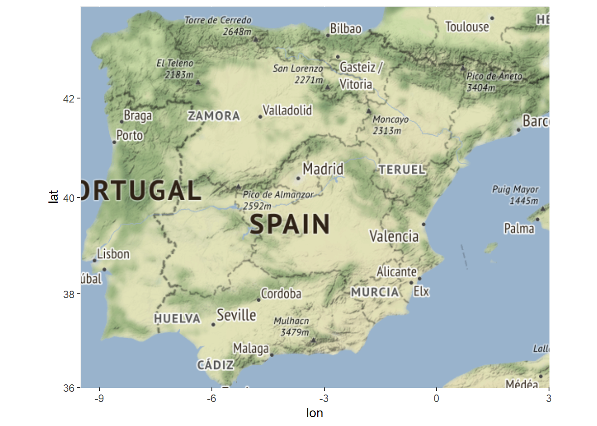

## Example Data{#ExampleData}

For the initial examples in this section we will use the Roman Road data from the Iberian Peninsula. This data set consists of a [csv file of a set of Roman settlements](data/Hispania_nodes.csv) and a [csv file of an edge list](data/Hispania_roads) defining connections among those settlements in terms of roads.

First we map the basic road network. We have commented the code below to explain what is happening at each stage.


```r
library(igraph)
library(ggmap)
library(sf)

# Read in edge list and node location data and covert to network object
edges1 <- read.csv("data/Hispania_roads.csv", header = TRUE)
nodes <- read.csv("data/Hispania_nodes.csv", header = TRUE)
road_net <-
  graph_from_edgelist(as.matrix(edges1[, 1:2]), directed = FALSE)

# Convert attribute location data to sf coordinates
locations_sf <-
  st_as_sf(nodes, coords = c("long", "lat"), crs = 4326)
# We also create a simple set of xy coordinates as this is used
# by the geom_point function
xy <- data.frame(x = nodes$long, y = nodes$lat)

# Extract edge list from network object
edgelist <- get.edgelist(road_net)

# Create data frame of beginning and ending points of edges
edges <- as.data.frame(matrix(NA, nrow(edgelist), 4))
colnames(edges) <- c("X1", "Y1", "X2", "Y2")
# Iterate across each edge and assign lat and long values to
# X1, Y1, X2, and Y2
for (i in seq_len(nrow(edgelist))) {
  edges[i, ] <- c(nodes[which(nodes$Id == edgelist[i, 1]), 3],
                  nodes[which(nodes$Id == edgelist[i, 1]), 2],
                  nodes[which(nodes$Id == edgelist[i, 2]), 3],
                  nodes[which(nodes$Id == edgelist[i, 2]), 2])
}

# Download stamenmap background data.
my_map <- get_stamenmap(bbox = c(-9.5, 36, 3, 43.8),
                       maptype = "watercolor",
                       zoom = 6)

# Produce map starting with background
ggmap(my_map) +
  # geom_segment plots lines by the beginning and ending
  # coordinates like the edges object we created above
  geom_segment(
    data = edges,
    aes(
      x = X1,
      y = Y1,
      xend = X2,
      yend = Y2
    ),
    col = "black",
    size = 1
  ) +
  # plot site node locations
  geom_point(
    data = xy,
    aes(x, y),
    alpha = 0.8,
    col = "black",
    fill = "white",
    shape = 21,
    size = 2,
    show.legend = FALSE
  ) +
  theme_void()
```

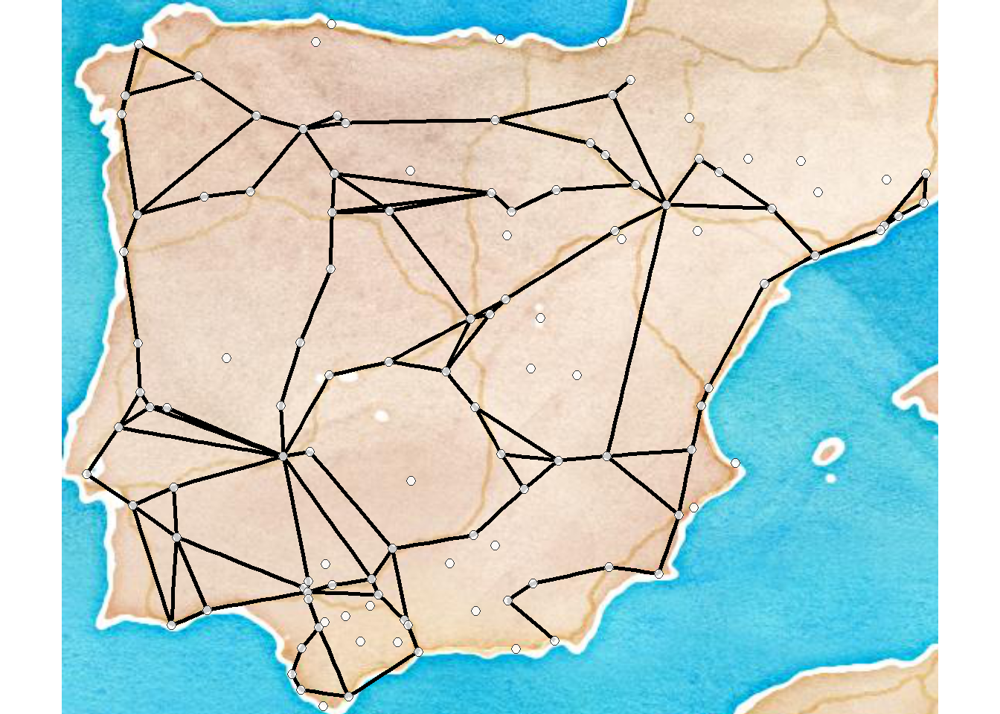

## Planar Networks and Trees{#PlanarTrees}

### Evaluating Planarity{#EvaluatingPlanarity}

A planar network is a network that can be drawn on a plane where the edges do not cross but instead always end in nodes. In many small networks it is relatively easy to determine whether or not a network is planar by simply viewing a network graph. In larger graphs, this can sometimes be difficult. 

<div class="rmdnote">
<p>There is a package available for R called <code>RBGL</code> which is
an R implementation of something called the Boost Graph Library. This
set of routines includes many powerful tools for characterizing network
topology including planarity. This package is not, however, in the CRAN
archive where the packages we have worked with so far reside so it needs
to be installed from another archive called Bioconductor.</p>
</div>

In order to install the `RBGL` and `BiocManager` libraries (if required), run the following lines of code.


```r
if (!requireNamespace("BiocManager", quietly = TRUE))
  install.packages("BiocManager")
BiocManager::install("RBGL")
```

With this in place we can now preform an analysis called the Boyer-Myrvold planarity test (Boyer and Myrvold 2004). This analysis performs a set of operations on a graph structure to evaluate whether or not it can be defined as a planar graph (see publication for more details).

Let's take a look at our Roman Road data.


```r
library(RBGL)
# First convert to a graphNEL object for planarity test
g <- as_graphnel(road_net)
# Implement test
boyerMyrvoldPlanarityTest(g)
```

```
## [1] FALSE
```

This results suggests that our Roman Road data is not planar. We can plot the data to evaluate this and do see crossed edges that could not be re-positioned. 


```r
library(ggraph)
set.seed(5364)
ggraph(road_net, layout = "kk") +
  geom_edge_link() +
  geom_node_point(size = 3) +
  ggtitle("Network of Roman Roads") +
  theme_graph()
```


Now, by way of example, we can generate a small random network that is planar and see the results of the test. Note that in the network graph that is produced the visual is not planar but could be a small number of nodes were moved. Unfortunately planar graph drawing is not currently implemented into `igraph` or other packages so you cannot automatically plot a graph as planar even if it meets the criteria of a planar graph. 


```r
set.seed(49)
g <- erdos.renyi.game(20, 1 / 8)
set.seed(939)
ggraph(g, layout = "stress") +
  geom_edge_link() +
  geom_node_point(size = 2) +
  theme_graph()
```

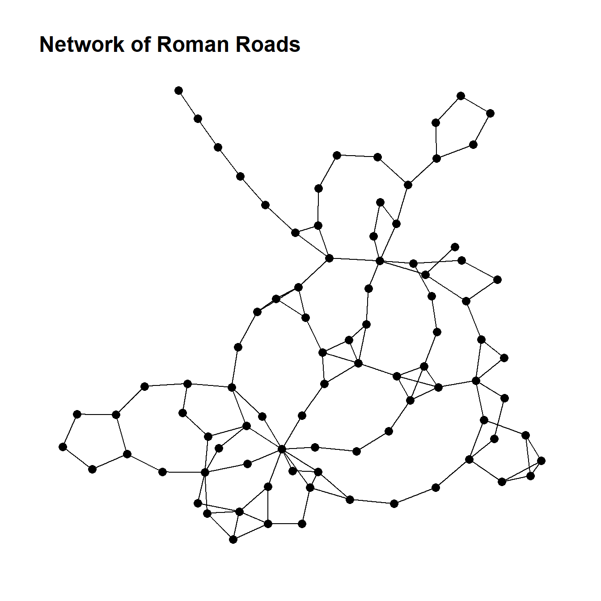

```r
g <- as_graphnel(g)
boyerMyrvoldPlanarityTest(g)
```

```
## [1] TRUE
```

Here is another example where the graph layout algorithm happens to produce a planar graph.


```r
set.seed(4957)
g <- erdos.renyi.game(20, 1 / 8)
set.seed(939)
ggraph(g, layout = "stress") +
  geom_edge_link() +
  geom_node_point(size = 2) +
  theme_graph()
```

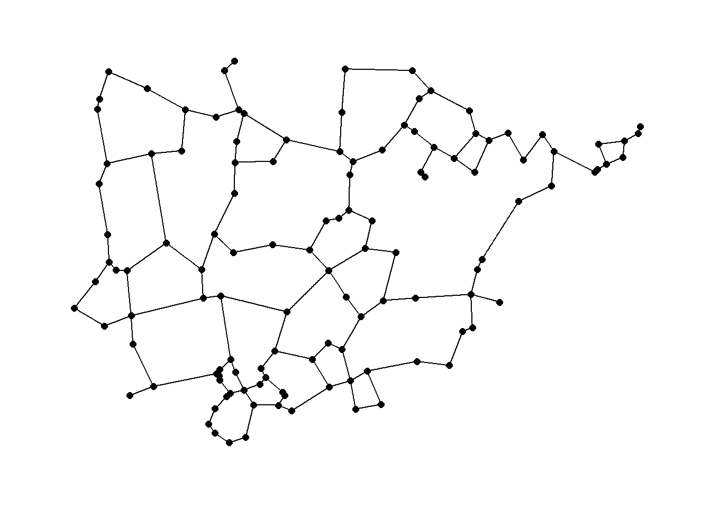

```r
g <- as_graphnel(g)
boyerMyrvoldPlanarityTest(g)
```

```
## [1] TRUE
```

### Defining Trees {#DefiningTrees}

A tree is a network that is connected and acyclic. Trees contain the minimum number of edges for a set of nodes to be connected, which results in an acyclic network with some interesting properties:

* Every edge in a tree is a bridge, in that its removal would increase the number of components.
* The number of edges in a tree is equal to the number of nodes minus one.
* There can be only one single path between every pair of nodes in a tree.

In R using the igraph package it is possible to both generate trees and also to take an existing network and define what is called the minimum spanning tree of that graph or the minimum acyclic component. 

Let's create a simple tree using the `make_tree` function in igraph.


```r
tree1 <- make_tree(n = 50, children = 5, mode = "undirected")
tree1
```

```
## IGRAPH c1343d0 U--- 50 49 -- Tree
## + attr: name (g/c), children (g/n), mode (g/c)
## + edges from c1343d0:
##  [1]  1-- 2  1-- 3  1-- 4  1-- 5  1-- 6  2-- 7  2-- 8  2-- 9  2--10  2--11
## [11]  3--12  3--13  3--14  3--15  3--16  4--17  4--18  4--19  4--20  4--21
## [21]  5--22  5--23  5--24  5--25  5--26  6--27  6--28  6--29  6--30  6--31
## [31]  7--32  7--33  7--34  7--35  7--36  8--37  8--38  8--39  8--40  8--41
## [41]  9--42  9--43  9--44  9--45  9--46 10--47 10--48 10--49 10--50
```

```r
plot(tree1)
```

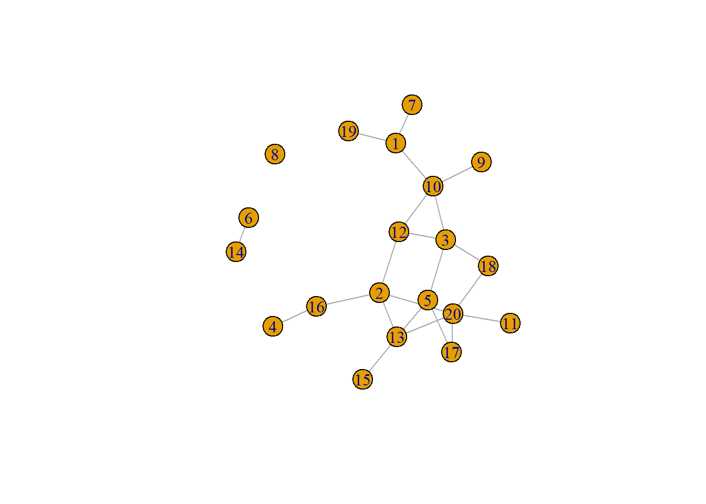

In the example here you can see the branch and leaf structure of the network where there are central nodes that are hubs to a number of other nodes and so on, but there are no cycles back to the previous nodes. Thus, such a tree is inherently hierarchical.In the next sub-section, we will discuss the use of minimum spanning trees.

It is also possible plot trees with a hierarchical network layout where nodes are arranged at levels of the hierarchy. In this case you need to specify the node or nodes that represent the first layer using the `root` call within the `ggraph` call. 


```r
ggraph(tree1,
       layout = "igraph",
       algorithm = "tree",
       root = 1) +
  geom_edge_diagonal(edge_width = 0.5, alpha = .4) +
  geom_node_text(aes(label = V(tree1)), size = 3.5) +
  theme_void()
```

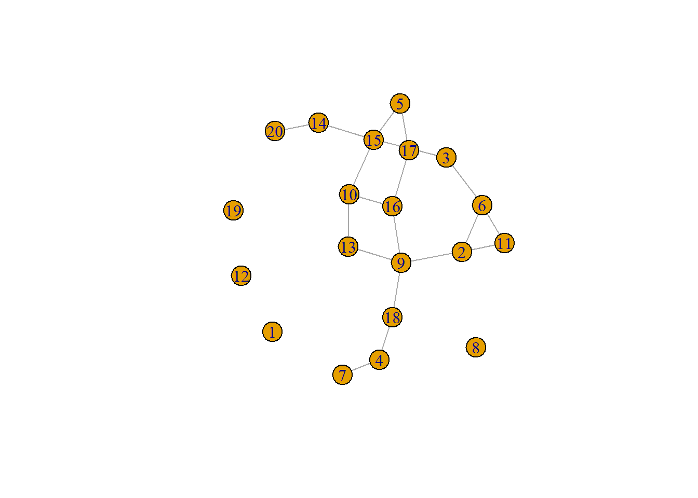

## Spatial Network Models {#SpatialNetworkModels}

In Chapter 7.5 in Brughmans and Peeples (2023) we go over a series of spatial network models that provide a number of different ways of defining networks from spatial data. In this sub-section we demonstrate how to define and analyze networks using these approaches. 

### Relative Neighborhood Networks {#RelativeNeighborhoods}

Relative neighborhood graph: a pair of nodes are connected if there are no other nodes in the area marked by the overlap of a circle around each node with a radius equal to the distance between the nodes.

<div class="rmdnote">
<p>The R package <code>cccd</code> contains functions to define relative
neighborhood networks from distance data using the <code>rng</code>
function. This function can either take a distance matrix object as
created above or a set of coordinates to calculate the distance within
the call. The output of this function is an igraph object. For large
graphs it is also possible to limit the search for possible neighbors to
<span class="math inline">\(k\)</span> neighbors.</p>
</div>

Let's use our previously created distance matrix and plot the results. 


```r
library(cccd)
rng1 <- rng(nodes[, c(3, 2)])
ggraph(rng1, layout = "kk") +
  geom_edge_link() +
  geom_node_point(size = 2) +
  theme_graph()
```

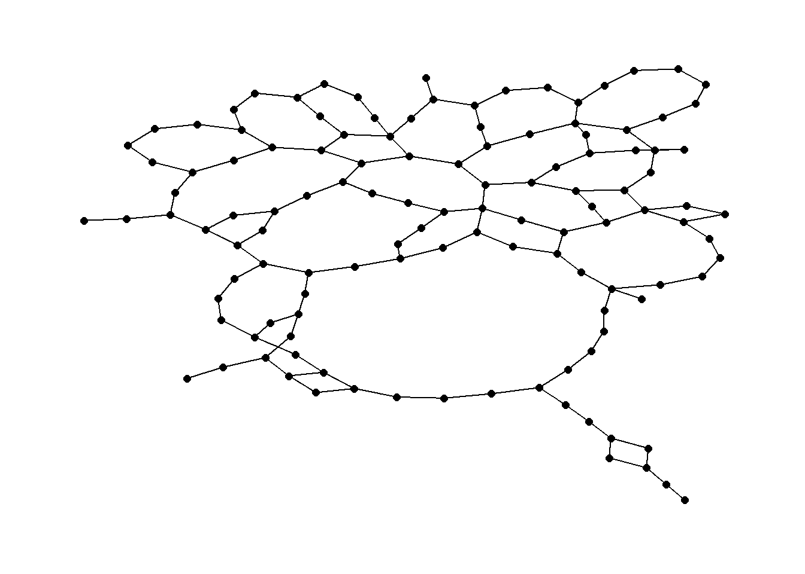

We can also plot the results using geographic coordinates.


```r
ggraph(rng1,
       layout = "manual",
       x = nodes[, 3],
       y = nodes[, 2]) +
  geom_edge_link() +
  geom_node_point(size = 2) +
  theme_graph()
```

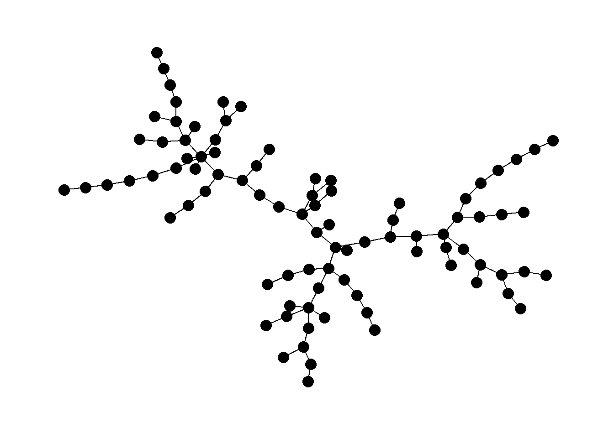

### Gabriel Graphs{#GabrialGraphs}

Gabriel graph: a pair of nodes are connected in a Gabriel graph if no other nodes lie within the circular region with a diameter equal to the distance between the pair of nodes.

Again we can use a function in the `cccd` package to define Gabriel Graph igraph objects from x and y coordinates. Let's take a look using the Roman Road data. See `?gg` for details on the options including different algorithms for calculating Gabriel Graphs. We define a Gabriel graph here and plot it using an algorithmic layout and then geographic coordinates.


```r
gg1 <- gg(x = nodes[, c(3, 2)])
ggraph(gg1, layout = "stress") +
  geom_edge_link() +
  geom_node_point(size = 2) +
  theme_graph()
```

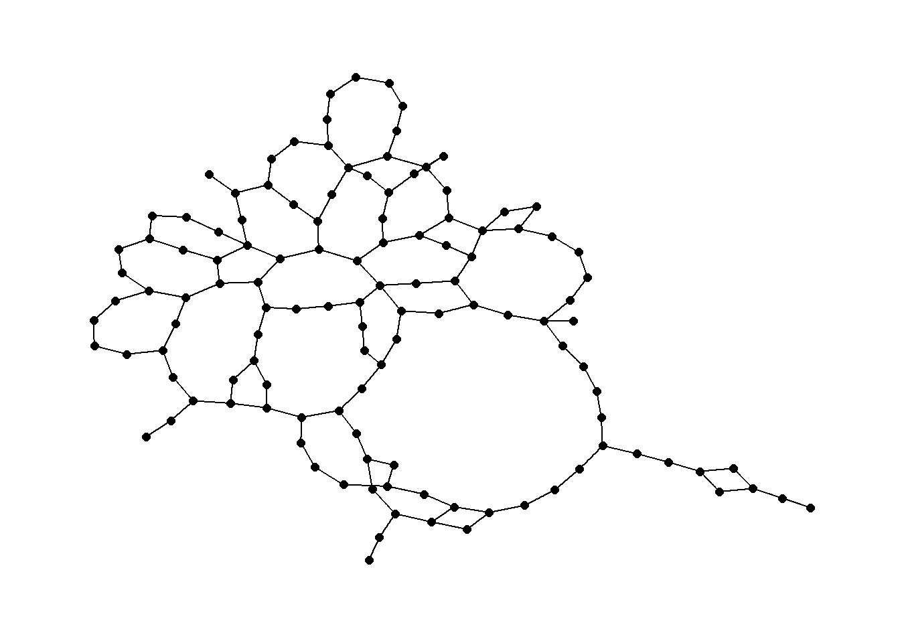

```r
ggraph(gg1,
       layout = "manual",
       x = nodes[, 3],
       y = nodes[, 2]) +
  geom_edge_link() +
  geom_node_point(size = 2) +
  theme_graph()
```

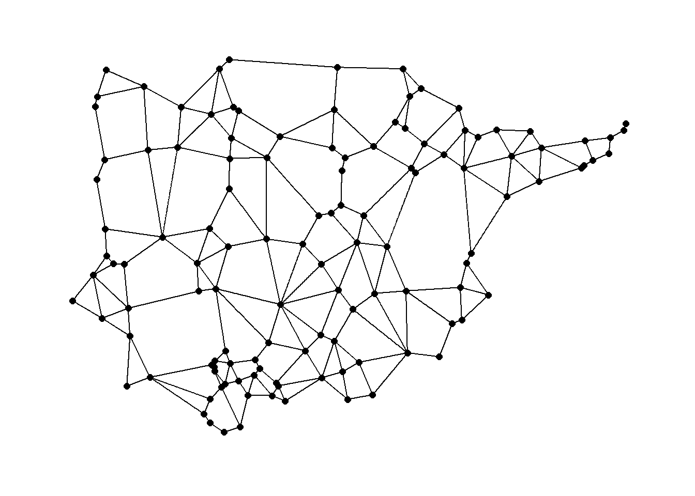

### Beta Skeletons{#BetaSkeletons}

Beta skeleton: a Gabriel graph in which the diameter of the circle is controlled by a parameter beta.

In R the `gg` function for producing Gabriel Graphs has the procedure for beta skeletons built directly in. The argument r in the gg function controls the beta parameter. When r = 1 a traditional Gabriel graph is returned. When the parameter r > 1 there is a stricter definition of connection resulting in fewer ties and when r < 1 link criteria are loosened. See `?gg` for more details.


```r
beta_s <- gg(x = nodes[, c(3, 2)], r = 1.5)
ggraph(beta_s,
       layout = "manual",
       x = nodes[, 3],
       y = nodes[, 2]) +
  geom_edge_link() +
  geom_node_point(size = 2) +
  theme_graph()
```

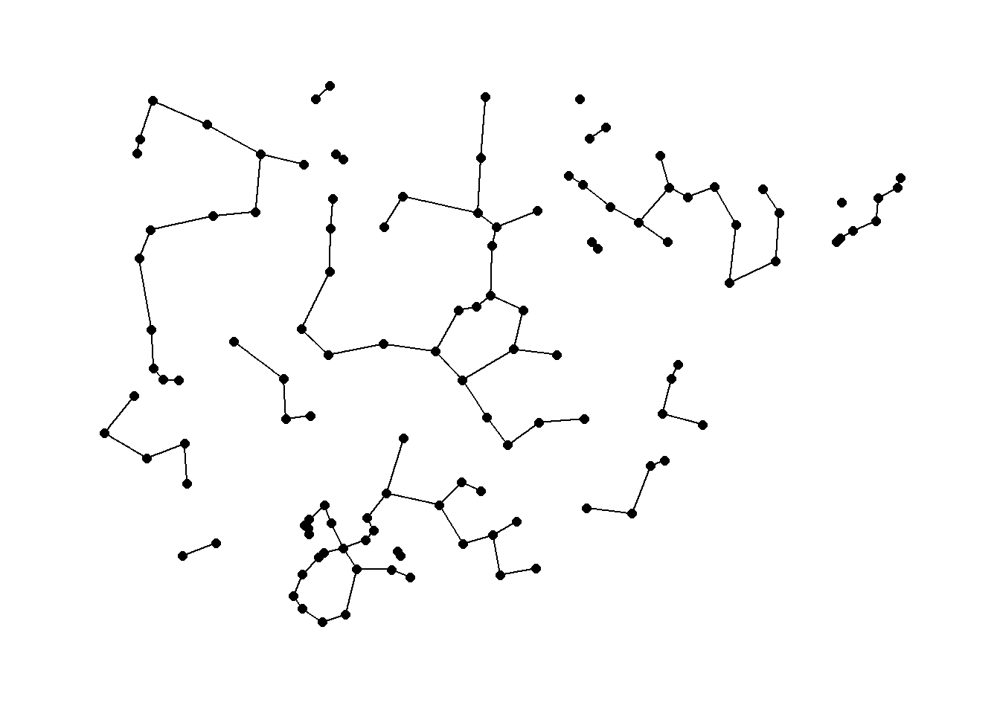

### Minimum Spanning Trees{#MinSpanningTrees}

Minimum spanning tree: in a set of nodes in the Euclidean plane, edges are created between pairs of nodes to form a tree where each node can be reached by each other node, such that the sum of the Euclidean edge lengths is less than the sum for any other spanning tree.

Perhaps the most common use-case for trees in archaeological networks is to define the minimum spanning tree of a given graph or the minimum set of nodes and edges required for a fully connected graph. The `igraph` package has a function called `mst` that defines the minimum spanning tree for a given graph. Let's try this with the Roman Road and then plot it as a node-link diagram and a map.


```r
mst_net <- igraph::mst(road_net)
set.seed(4643)
ggraph(mst_net, layout = "kk") +
  geom_edge_link() +
  geom_node_point(size = 4) +
  theme_graph()
```


```r
# Extract edge list from network object
edgelist <- get.edgelist(mst_net)
# Create data frame of beginning and ending points of edges
edges <- as.data.frame(matrix(NA, nrow(edgelist), 4))
colnames(edges) <- c("X1", "Y1", "X2", "Y2")
for (i in seq_len(nrow(edgelist))) {
  edges[i, ] <- c(nodes[which(nodes$Id == edgelist[i, 1]), 3],
                  nodes[which(nodes$Id == edgelist[i, 1]), 2],
                  nodes[which(nodes$Id == edgelist[i, 2]), 3],
                  nodes[which(nodes$Id == edgelist[i, 2]), 2])
}
ggmap(my_map) +
  geom_segment(
    data = edges,
    aes(
      x = X1,
      y = Y1,
      xend = X2,
      yend = Y2
    ),
    col = "black",
    size = 1
  ) +
  geom_point(
    data = nodes[, c(3, 2)],
    aes(long, lat),
    alpha = 0.8,
    col = "black",
    fill = "white",
    shape = 21,
    size = 1.5,
    show.legend = FALSE
  ) +
  theme_void()
```


Note that minimum spanning trees can also be used for weighted graphs such that weighted connections will be preferred in defining tree structure. See `?mst` for more details.

### Delaunay Triangulation{#DelaunayTri}

Delaunay triangulation: a pair of nodes are connected by an edge if and only if their corresponding regions in a Voronoi diagram share a side.

Voronoi diagram or Thiessen polygons: for each node in a set of nodes in a Euclidean plane, a region is created covering the area that is closer or equidistant to that node than it is to any other node in the set.

<div class="rmdnote">
<p>The package <code>deldir</code> in R allows for the calculation of
Delaunay triangles with x and y coordinates as input. By default the
<code>deldir</code> function will define a boundary that extends
slightly beyond the xy coordinates of all points included in the
analysis. This boundary can also be specified within the call using the
<code>rw</code> argument. See <code>?deldir</code> for more details.</p>
</div>

The results of the `deldir` function can be directly plotted and the output also contains coordinates necessary to integrate the results into another type of figure like a `ggmap`. Let's take a look.


```r
library(deldir)
dt1 <- deldir(nodes[, 3], nodes[, 2])
plot(dt1)
```

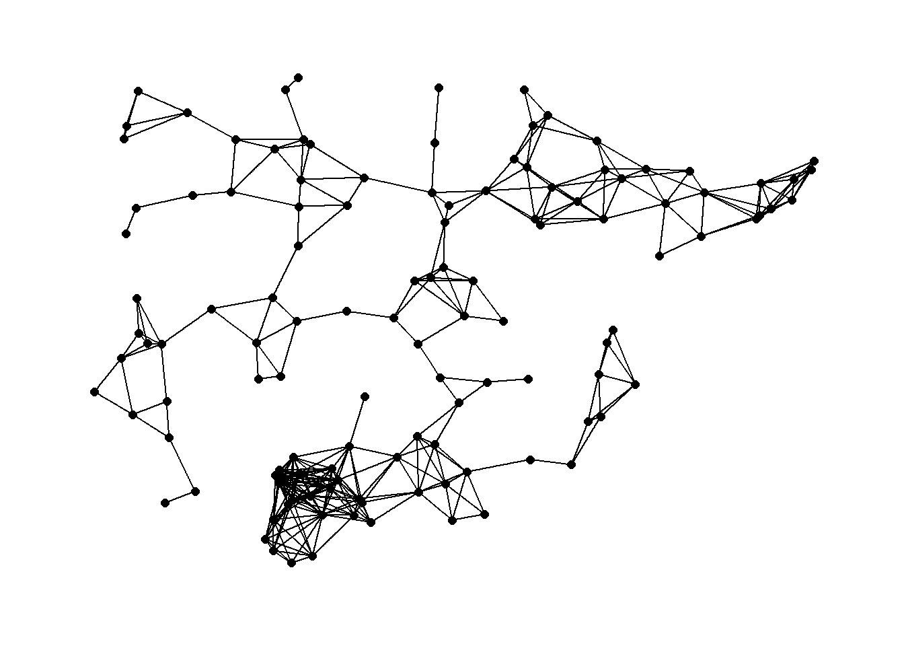

```r
# Extract Voronoi polygons for plotting
mapdat <- as.data.frame(dt1$dirsgs)
# Extract network for plotting
mapdat2 <- as.data.frame(dt1$delsgs)
ggmap(my_map) +
  geom_segment(
    data = mapdat,
    aes(
      x = x1,
      y = y1,
      xend = x2,
      yend = y2
    ),
    col = "black",
    size = 1
  ) +
  geom_segment(
    data = mapdat2,
    aes(
      x = x1,
      y = y1,
      xend = x2,
      yend = y2
    ),
    col = "red",
    size = 1
  ) +
  geom_point(
    data = nodes,
    aes(long, lat),
    alpha = 0.8,
    col = "black",
    fill = "white",
    shape = 21,
    size = 3,
    show.legend = FALSE
  ) +
  theme_void()
```

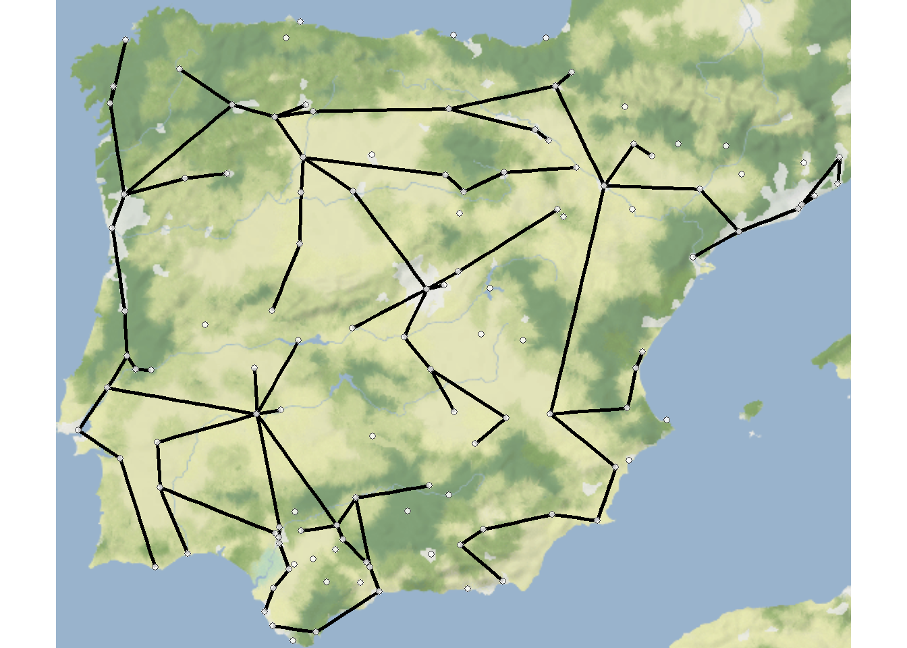

### K-nearest Neighbors {#KNN}

K-nearest neighbor network: each node is connected to K other nodes closest to it.

The `cccd` package has a routine that allows for the calculation of K-nearest neighbor graphs from geographic coordinates or a precomputed distance matrix. In this example we use the Roman Road data and calculate K=1 and K=6 nearest neighbor networks and plot the both simultaneously.


```r
# Calculate k=1 nearest neighbor graph
nn1 <- nng(x = nodes[, c(3, 2)], k = 1)
# Calculate k=6 nearest neighbor graph
nn6 <- nng(x = nodes[, c(3, 2)], k = 6)
el1 <- as.data.frame(
  rbind(cbind(get.edgelist(nn6),
         rep("K=6", nrow(get.edgelist(nn1))
             )),
        cbind(get.edgelist(nn1),
          rep("K=1", nrow(get.edgelist(nn1))
             ))))
colnames(el1) <- c("from", "to", "K")
g <- graph_from_data_frame(el1)
# Plot both graphs
ggraph(g, layout = "manual",
       x = nodes[, 3], y = nodes[, 2]) +
  geom_edge_link(aes(color = factor(K)), width = 1.5) +
  geom_node_point(size = 2) +
  labs(edge_color = "K") +
  theme_graph()
```


### Maximum Distance Networks{#MaxDist}

Maximum distance network: each node is connected to all other nodes at a distance closer than or equal to a threshold value. In order define a maximum distance network we simply need to define a threshold distance and define all nodes greater than that distance as unconnected and nodes within that distance as connected. This can be done in base R using the dist function we used above.

<div class="rmdtip">
<p>Since the coordinates we are using here are in decimal degrees we
need to calculate distances based on “great circles” across the globe
rather than Euclidean distances on a projected plane. There is a
function called <code>distm</code> in the <code>geosphere</code> package
that allows us to do this. If you are working with projected data, you
can simply use the <code>dist</code> function in the place of
<code>distm</code> like the example below.</p>
</div>

Next, in order to define a minimum distance network we simply binarize this matrix. We can do this using the `event2dichot` function within the `statnet` package and easily create an R network objects. Let's try it out with the Roman Road data for thresholds of 100,000 and 250,000 meters.


```r
library(statnet)
```

```
##                Installed ReposVer Built  
## ergm           "4.2.2"   "4.3.1"  "4.2.0"
## network        "1.17.2"  "1.18.0" "4.2.0"
## statnet.common "4.6.0"   "4.7.0"  "4.2.0"
## tergm          "4.1.0"   "4.1.1"  "4.2.1"
```

```r
library(geosphere)
d1 <- distm(nodes[, c(3, 2)])
# Note we use the leq=TRUE argument here as we want nodes less than
# the threshold to count.
net100 <- network(event2dichot(
  d1,
  method = "absolute",
  thresh = 100000,
  leq = TRUE
),
directed = FALSE)
net250 <- network(event2dichot(
  d1,
  method = "absolute",
  thresh = 250000,
  leq = TRUE
),
directed = FALSE)
# Plot 100 Km network
ggraph(net100,
       layout = "manual",
       x = nodes[, 3],
       y = nodes[, 2]) +
  geom_edge_link() +
  geom_node_point(size = 2) +
  theme_graph()
```


```r
# Plot 250 Km network
ggraph(net250,
       layout = "manual",
       x = nodes[, 3],
       y = nodes[, 2]) +
  geom_edge_link() +
  geom_node_point(size = 2) +
  theme_graph()
```


## Case Studies{#SpaceCaseStudies}

### Proximity of Iron Age sites in Southern Spain{#IronAgeSpain}

The first case study in Chapter 7 of Brughmans and Peeples (2023) is an example of several of the methods for defining networks using spatial data outlined above using the locations of 86 sites in the Guadalquivir river valley in Southern Spain. In the code chunks below, we replicate the analyses presented in the book.

First we read in the data which represents site location information in lat/long decimal degrees.


```r
guad <- read.csv("data/Guadalquivir.csv", header = TRUE)
```

Next we create a distance matrix based on the decimal degrees locations using the "distm" function.


```r
library(geosphere)
g_dist1 <- as.matrix(distm(guad[, c(2, 3)]))
g_dist1[1:4, 1:4]
```

```
##          [,1]     [,2]     [,3]     [,4]
## [1,]     0.00 69995.82 42265.58 51296.53
## [2,] 69995.82     0.00 28240.50 29202.84
## [3,] 42265.58 28240.50     0.00 23692.10
## [4,] 51296.53 29202.84 23692.10     0.00
```

From here we can create maximum distance networks at both the 10km and 18km distance and plot it using the geographic location of nodes for node placement.


```r
library(intergraph)
# Note we use the leq=TRUE argument here as we want nodes
# less than the threshold to count.
net10 <- asIgraph(network(
  event2dichot(
    g_dist1,
    method = "absolute",
    thresh = 10000,
    leq = TRUE
  ),
  directed = FALSE
))
net18 <- asIgraph(network(
  event2dichot(
    g_dist1,
    method = "absolute",
    thresh = 18000,
    leq = TRUE
  ),
  directed = FALSE
))
g10_deg <- as.data.frame(igraph::degree(net10))
colnames(g10_deg) <- "degree"
g18_deg <- as.data.frame(igraph::degree(net18))
colnames(g18_deg) <- "degree"
# Plot histogram of degree for 10km network
h10 <- ggplot(data = g10_deg) +
  geom_histogram(aes(x = degree), bins = 15)
# Plot histogram of degree for 18km network
h18 <- ggplot(data = g18_deg) +
  geom_histogram(aes(x = degree), bins = 15)
# Plot 10 Km network
g10 <- ggraph(net10,
              layout = "manual",
              x = guad[, 2],
              y = guad[, 3]) +
  geom_edge_link() +
  geom_node_point(size = 2) +
  theme_graph()
# Plot 18 Km network
g18 <- ggraph(net18,
              layout = "manual",
              x = guad[, 2],
              y = guad[, 3]) +
  geom_edge_link() +
  geom_node_point(size = 2) +
  theme_graph()
g18
```


<div class="rmdnote">
<p>If we want to combine the degree distribution plot and the network
into the same frame, we can use the <code>inset_element</code> function
in the <code>patchwork</code> package. This function lets us place one
plot inside another in the <code>ggplot2</code> format.</p>
</div>


```r
library(patchwork)
plot_a <- g10 + inset_element(
  h10,
  left = 0,
  bottom = 0.7,
  right = 0.25,
  top = 0.99
)
plot_b <- g18 + inset_element(
  h18,
  left = 0,
  bottom = 0.7,
  right = 0.25,
  top = 0.99
)
plot_a
```


```r
plot_b
```


Next, we calculate a relative neighborhood graph for the site locations and plot it with nodes positioned in geographic space.


```r
rng1 <- rng(guad[, 2:3])
g_rng <- ggraph(rng1,
                layout = "manual",
                x = guad[, 2],
                y = guad[, 3]) +
  geom_edge_link() +
  geom_node_point(size = 2) +
  theme_graph()
g_rng_deg <- as.data.frame(igraph::degree(rng1))
colnames(g_rng_deg) <- "degree"
# Plot histogram of degree for relative neighborhood network
h_rng <- ggplot(data = g_rng_deg) +
  geom_histogram(aes(x = degree), bins = 3)
plot_c <- g_rng + inset_element(
  h_rng,
  left = 0,
  bottom = 0.7,
  right = 0.25,
  top = 0.99
)
plot_c
```

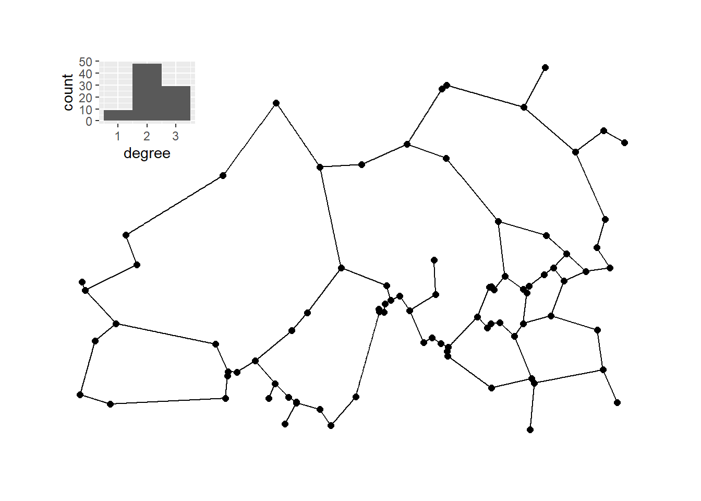

The chunk of code below then calculates and plots the Gabrial graph with the associated degree distribution plot.


```r
gg1 <- gg(x = guad[, 2:3])
g_gg <- ggraph(gg1,
               layout = "manual",
               x = guad[, 2],
               y = guad[, 3]) +
  geom_edge_link() +
  geom_node_point(size = 2) +
  theme_graph()
g_gg_deg <- as.data.frame(igraph::degree(gg1))
colnames(g_gg_deg) <- "degree"
# Plot histogram of degree for relative neighborhood network
h_gg <- ggplot(data = g_gg_deg) +
  geom_histogram(aes(x = degree), bins = 5)
plot_d <- g_gg + inset_element(
  h_gg,
  left = 0,
  bottom = 0.7,
  right = 0.25,
  top = 0.99
)
plot_d
```

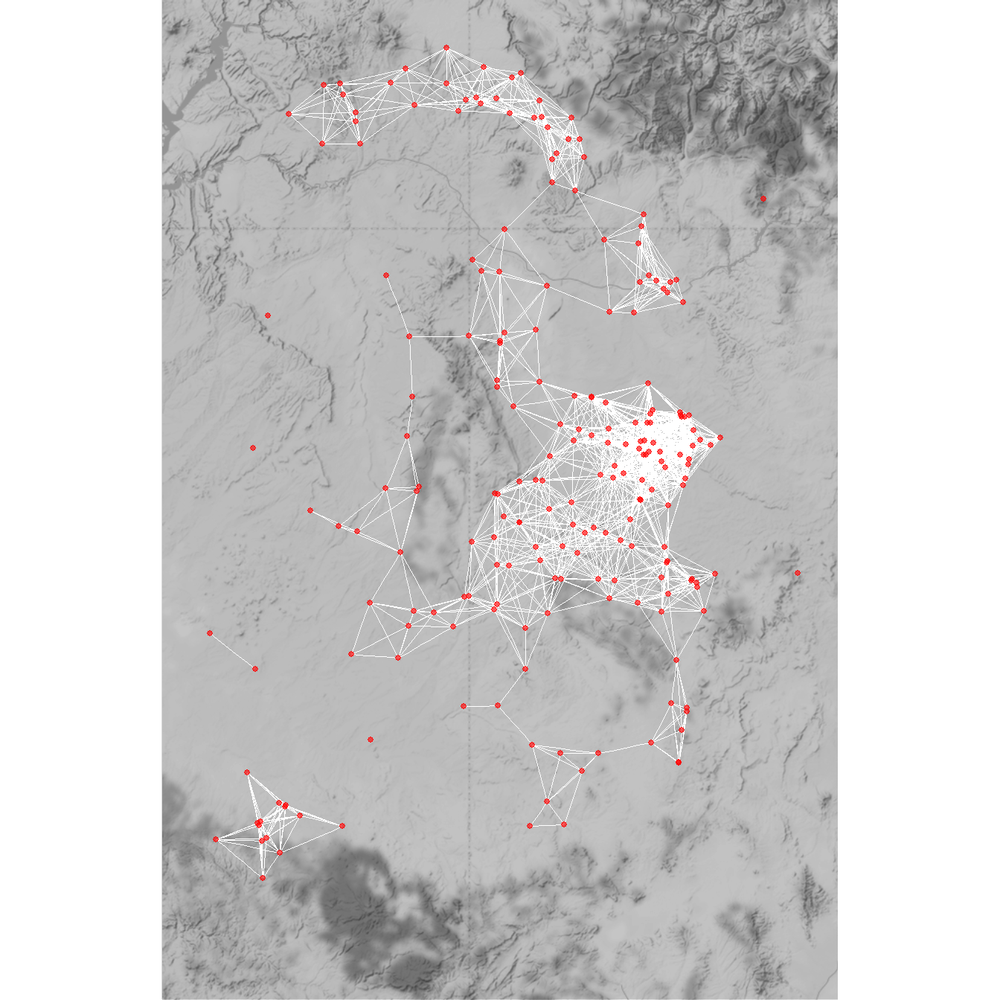

Next, we'll plot the K-nearest neighbors graphs for k= 2, 3, 4, and 6 with the associated degree distribution for each.


```r
# Calculate k=2,3,4, and 6 nearest neighbor graphs
nn2 <- nng(x = guad[, 2:3], k = 2)
nn3 <- nng(x = guad[, 2:3], k = 3)
nn4 <- nng(x = guad[, 2:3], k = 4)
nn6 <- nng(x = guad[, 2:3], k = 6)
# Initialize network graph for each k value
g_nn2 <- ggraph(nn2,
                layout = "manual",
                x = guad[, 2],
                y = guad[, 3]) +
  geom_edge_link() +
  geom_node_point(size = 2) +
  theme_graph()
g_nn3 <- ggraph(nn3,
                layout = "manual",
                x = guad[, 2],
                y = guad[, 3]) +
  geom_edge_link() +
  geom_node_point(size = 2) +
  theme_graph()
g_nn4 <- ggraph(nn4,
                layout = "manual",
                x = guad[, 2],
                y = guad[, 3]) +
  geom_edge_link() +
  geom_node_point(size = 2) +
  theme_graph()
g_nn6 <- ggraph(nn6,
                layout = "manual",
                x = guad[, 2],
                y = guad[, 3]) +
  geom_edge_link() +
  geom_node_point(size = 2) +
  theme_graph()
# Set up data frames of degree distribution for each network
nn2_deg <- as.data.frame(igraph::degree(nn2))
colnames(nn2_deg) <- "degree"
nn3_deg <- as.data.frame(igraph::degree(nn3))
colnames(nn3_deg) <- "degree"
nn4_deg <- as.data.frame(igraph::degree(nn4))
colnames(nn4_deg) <- "degree"
nn6_deg <- as.data.frame(igraph::degree(nn6))
colnames(nn6_deg) <- "degree"
# Initialize histogram plot for each degree distribution
h_nn2 <- ggplot(data = nn2_deg) +
  geom_histogram(aes(x = degree), bins = 5) +
  scale_x_continuous(limits = c(0, max(nn2_deg)))
h_nn3 <- ggplot(data = nn3_deg) +
  geom_histogram(aes(x = degree), bins = 6) +
  scale_x_continuous(limits = c(0, max(nn3_deg)))
h_nn4 <- ggplot(data = nn4_deg) +
  geom_histogram(aes(x = degree), bins = 6) +
  scale_x_continuous(limits = c(0, max(nn4_deg)))
h_nn6 <- ggplot(data = nn6_deg) +
  geom_histogram(aes(x = degree), bins = 5) +
  scale_x_continuous(limits = c(0, max(nn6_deg)))
plot_a <- g_nn2 + inset_element(
  h_nn2,
  left = 0,
  bottom = 0.7,
  right = 0.25,
  top = 0.99
)
plot_b <- g_nn3 + inset_element(
  h_nn3,
  left = 0,
  bottom = 0.7,
  right = 0.25,
  top = 0.99
)
plot_c <- g_nn4 + inset_element(
  h_nn4,
  left = 0,
  bottom = 0.7,
  right = 0.25,
  top = 0.99
)
plot_d <- g_nn6 + inset_element(
  h_nn6,
  left = 0,
  bottom = 0.7,
  right = 0.25,
  top = 0.99
)
plot_a
```


```r
plot_b
```

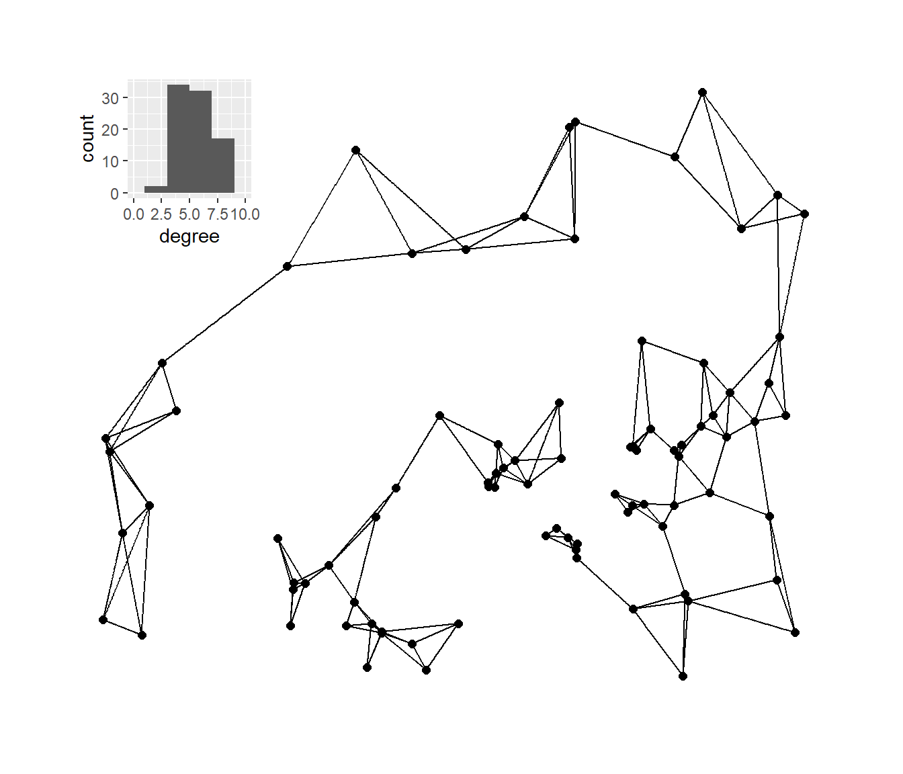

```r
plot_c
```


```r
plot_d
```


### Networks in Space in the U.S. Southwest{#SpaceSW}

The second case study in Chapter 7 of Brughmans and Peeples (2023) provides an example of how we can use spatial network methods to analyze material cultural network data. We use the Chaco World data here and you can download the [map data](data/map.RData), [the site attribute data](data/AD1050attr.csv), and [the ceramic frequency data](data/AD1050cer.csv) to follow along.

The first analysis explores the degree to which similarities in ceramics (in terms of Brainerd-Robinson similarity based on wares) can be explained by spatial distance. To do this we simply define a ceramic similarity matrix, a Euclidean distance matrix, and the fit a model using distance to explain ceramic similarity using a general additive model (`gam`) approach. The `gam` function we use here is in the `mgcv` package. Note that the object `dmat` is created using the `dist` function as the data we started with are already projected site locations using UTM coordinates. 


```r
library(mgcv)
load("data/map.RData")
attr <- read.csv("data/AD1050attr.csv", row.names = 1)
cer <- read.csv("data/AD1050cer.csv",
                header = T,
                row.names = 1)
sim <-
  (2 - as.matrix(vegan::vegdist(prop.table(
    as.matrix(cer), 1),
    method = "manhattan"))) / 2
dmat <- as.matrix(dist(attr[, 9:10]))
fit <- gam(as.vector(sim) ~ as.vector(dmat))
summary(fit)
```

```
## 
## Family: gaussian 
## Link function: identity 
## 
## Formula:
## as.vector(sim) ~ as.vector(dmat)
## 
## Parametric coefficients:
##                   Estimate Std. Error t value Pr(>|t|)    
## (Intercept)      7.979e-01  2.547e-03   313.3   <2e-16 ***
## as.vector(dmat) -2.487e-06  1.448e-08  -171.8   <2e-16 ***
## ---
## Signif. codes:  0 '***' 0.001 '**' 0.01 '*' 0.05 '.' 0.1 ' ' 1
## 
## 
## R-sq.(adj) =  0.372   Deviance explained = 37.2%
## GCV = 0.082702  Scale est. = 0.082699  n = 49729
```

As these results show and as described in the book, spatial distance is a statistically significant predictor of ceramic similarity and distance appear to explain about 37.2% of the variation in ceramic similarity.

The next analysis presented the book creates a series of minimum distance networks from 36Kms all the way out to nearly 400Kms in concentric days travel (36Kms is about one day of travel on foot) and explore the proportion of variance explained by networks constrained on each distance.


```r
# Create a sequence of distances from 36km to 400kms by concentric
# days travel on foot
kms <- seq(36000, 400000, by = 36000)
# Define minimum distance networks for each item in "kms" and the
# calculate variance explained
temp_out <- NULL
for (i in seq_len(length(kms))) {
  dmat_temp <- dmat
  dmat_temp[dmat > kms[i]] <- 0
  dmat_temp[dmat_temp > 0] <- 1
  # Calculate gam model and output r^2 value
  temp <- gam(as.vector(sim[lower.tri(sim)]) ~
                as.vector(dmat_temp[lower.tri(dmat_temp)]))
  temp_out[i] <- summary(temp)$r.sq
}
# Create data frame of output
dat <- as.data.frame(cbind(kms / 1000, temp_out))
colnames(dat) <- c("Dist", "Cor")
library(ggplot2)
# Plot the results
ggplot(data = dat) +
  geom_line(aes(x = Dist, y = Cor)) +
  geom_point(aes(x = Dist, y = Cor), size = 3) +
  xlab("Maximum Distance Network Threshold (Km)") +
  ylab("Proportion of Variance Explained") +
  theme_bw() +
  theme(
    axis.text.x = element_text(size = rel(1.5)),
    axis.text.y = element_text(size = rel(1.5)),
    axis.title.x = element_text(size = rel(1.5)),
    axis.title.y = element_text(size = rel(1.5))
  )
```


Finally, let's recreate figure 7.8 from the book to display the 36km minimum distance network for the Chaco region ca. AD 1050-1100. This follows the same basic format for plotting minimum distance networks we defined above.


```r
d36 <- as.matrix(dist(attr[, 9:10]))
d36[d36 < 36001] <- 1
d36[d36 > 1] <- 0
g36_net <- graph_from_adjacency_matrix(d36, mode = "undirected")
locations_sf <- st_as_sf(attr,
                         coords = c("EASTING", "NORTHING"),
                         crs = 26912)
z <- st_transform(locations_sf, crs = 4326)
coord1 <- do.call(rbind, st_geometry(z)) %>%
  tibble::as_tibble() %>%
  setNames(c("lon", "lat"))
xy <- as.data.frame(cbind(attr$SWSN_Site, coord1))
colnames(xy) <- c("site", "x", "y")
base <- get_stamenmap(
  bbox = c(-110.75, 33.5, -107, 38),
  zoom = 8,
  maptype = "terrain-background",
  color = "bw"
)
# Extract edge list from network object
edgelist <- get.edgelist(g36_net)
# Create data frame of beginning and ending points of edges
edges <- as.data.frame(matrix(NA, nrow(edgelist), 4))
colnames(edges) <- c("X1", "Y1", "X2", "Y2")
for (i in seq_len(nrow(edgelist))) {
  edges[i, ] <- c(xy[which(xy$site == edgelist[i, 1]), 2],
                  xy[which(xy$site == edgelist[i, 1]), 3],
                  xy[which(xy$site == edgelist[i, 2]), 2],
                  xy[which(xy$site == edgelist[i, 2]), 3])
}
figure7_8 <- ggmap(base, darken = 0.15) +
  geom_segment(
    data = edges,
    aes(
      x = X1,
      y = Y1,
      xend = X2,
      yend = Y2
    ),
    col = "white",
    size = 0.10,
    show.legend = FALSE
  ) +
  geom_point(
    data = xy,
    aes(x, y),
    alpha = 0.65,
    size = 1,
    col = "red",
    show.legend = FALSE
  ) +
  theme_void()
figure7_8
```


