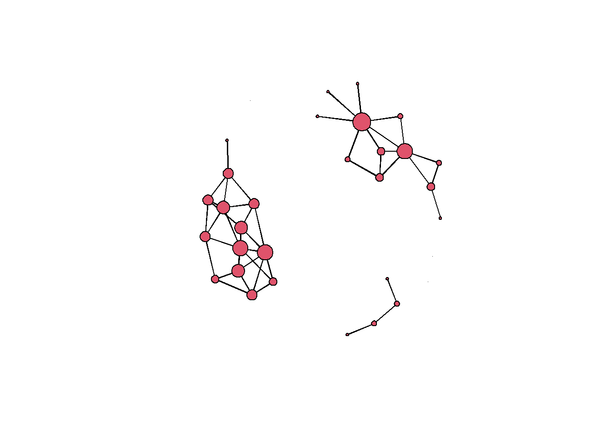
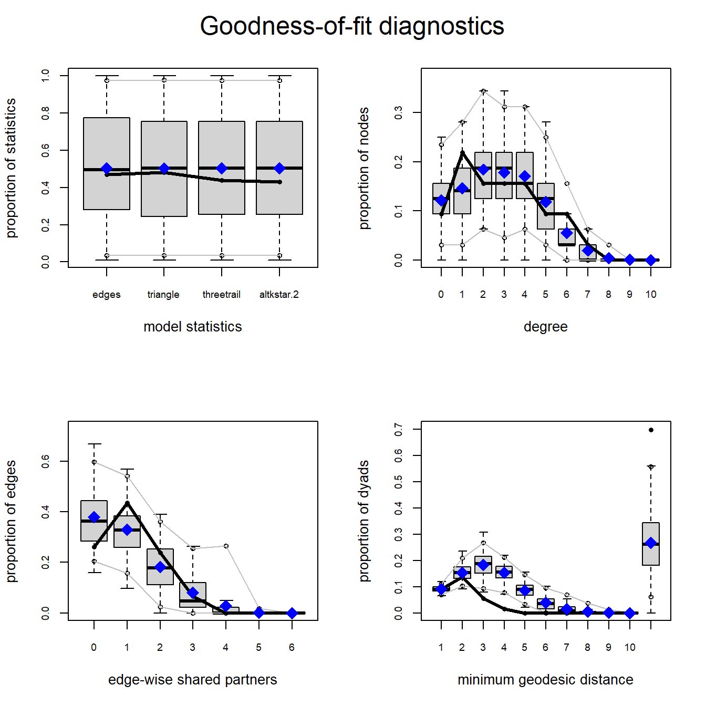
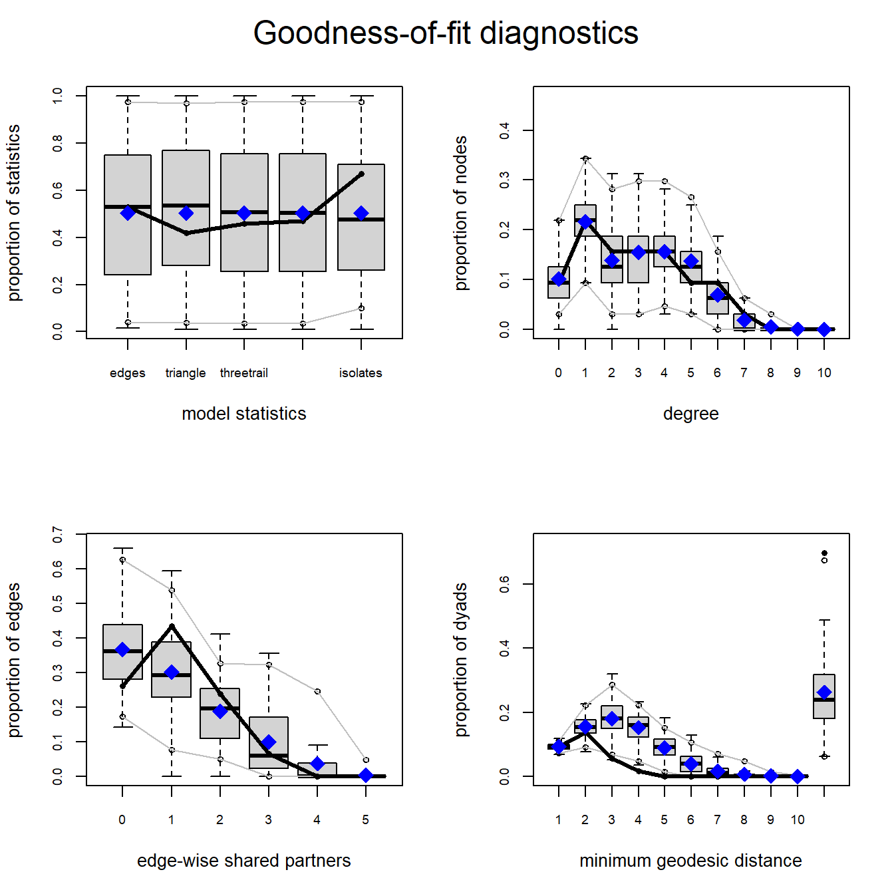
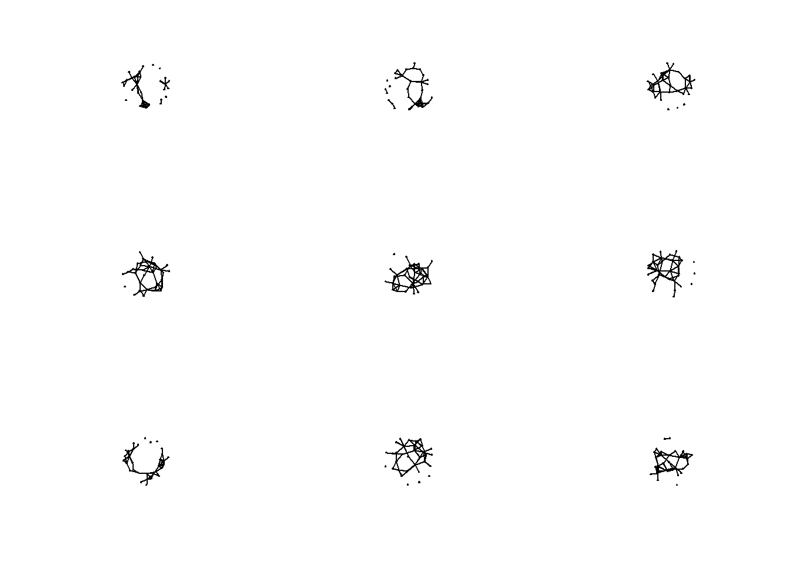
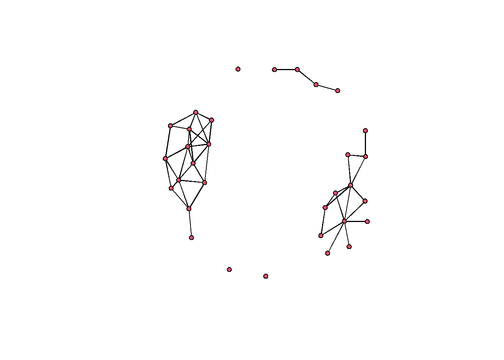

# Going Beyond the Book{#BeyondTheBook}

Although the Brughmans and Peeples (2022) book covers quite a bit, there are areas of network research that we did not have space to cover in detail. In this section, we plan to offer a few additional extended discussions of topics given limited attention in the published book. We also hope to use this section as a place for new tutorials and topics over the years as the archaeological network community grows. 

In this initial version, we provide here an extended discussion of exponential random graph models and how they are implemented in R.

## Exponential Random Graph Models (ERGM){#ERGM}

Exponential Random Graph Models (ERGM; typically pronounced "UR-gum") are a class of statistical models designed to help represent, evaluate, and simulate ideas about network generating processes and structural properties (for a good introductions to the method see Lusher et al. 2013; and for archaeological cases see Amati et al. 2020; Brughmans et al. 2014; Wang and Marwick 2021). These models allow us to formally represent our theories about how particular patterns of relationships (such as paths of a given length or closed triangles) or associations (such as mutuality or connections among nodes that share an attribute) emerge and persist in our networks and further help us evaluate how well such theories account for our observed network data. Specifically, an ERGM can be used to generate large numbers of networks in a random process biased towards particular configurations and associations that represent our theories of interest. We can then compare those simulated networks to our observed network to generate perspectives on the plausibility of our theory. Essentially, ERGMs help us determine the local tendencies in network formation that generate the global properties and structures of our networks.

In many ways, ERGMs are similar to logistic regression models where we predict the presence or absence of ties between pairs of nodes with edge formation modeled as dependent on network structure and properties (e.g., density, transitivity, centralization, etc.). Such models help us assess the probability that the observed network is a product of specified structural properties or generative processes that may be more or less likely to occur than we would expect by chance in a random network.

The details of ERGMs and the underlying math are beyond the scope of this document, but we present a brief overview of the highlights based heavily on [a workshop on ERGM by the `statnet` team](http://statnet.org/Workshops/ergm_tutorial.html) (Krivitsky et al. 2021). See that workshop for more details. 

The general model form for an ERGM can be written as:

$$P(Y=y) = \frac{\mathbf{exp}(\theta' g(y))}{k(\theta)}$$

where 

* $P(Y=y)$ is the probability that the network will take a given state $y$ among random possibilities $Y$.
* $g(y)$ is the set of model ERGM terms considered. These are essential the covariates in the model.
* $\theta$ is the set of coefficients for model terms.
* $k(\theta)$ is a normalizing constant defined as numerator summed overall all possible networks constrained on the node set $y$. In other words, all possible network configurations that could exist with the given node set.

The general form for an ERGM expressed in terms of the entire network as we see above can also be expressed in terms of the conditional log-odds of an edge between any two nodes as follows:

$$\mathbf{logit}(Y_{ij}=y_{ij}) = \theta'\delta(y_{ij})$$

where

* $Y_{ij}$ is the random variable for the state of the edge (present or absent) for a given pair of nodes $i$ and $j$ and $y_{ij}$ is the observed state.
* $\delta (y_{ij})$ is the change statistic representing how $g(y)$ (the state of the graph and associated terms) changes if the edge between $i$ and $j$ is active or not. 
* $\theta$ describes the contribution of a term to the log-odds of an individual edge between $i$ and $j$ conditioned on the state of all other edges remaining the same (we explain this in more detail below with examples).

The coefficient estimates in ERGM models are returned in log-odds which denotes the change in the likelihood of an edge per unit change in the given predictor (This is where the "change statistic") comes in. For example a coefficient estimate $\theta$ of 1.5 for a given term would indicates that the likelihood of an edge is 1.5 times higher for every change of that term by 1 unit. Conversely, an coefficient estimate for a term of -5.5 would suggest that the likelihood of an edge is 5.5 times *less* likely for every unit change of the term. We explain how this works in more detail in the examples below.

### ERGMs in R {#ERGMsInR}

In general, the analysis of ERGMs in R is conducted in thtree basic steps:

* First, we asses the general properties of interest in our network using exploratory network statistics described [in a previous section of this document](#Exploratory).
* Next, we fit one or more ERGMs to our observed network and assess and interpret the results in light of our network theory of interest.
* Finally, we assess the goodness of fit of our models and assess the diagnostic statistics for our model generating processes.

<div class="rmdnote">
<p>The <code>statnet</code> suite of packages includes a package called
<code>ergm</code> that facilitates the analysis of ERGMs in R and an
additional package called <code>tergm</code> that provides terms and
methods for analyzing temporal networks using ERGMs. Networks need to be
in the <code>network</code> format to be analysed using the
<code>statnet</code> suite of packages.</p>
</div>

Let's initialize our `statnet` libarary suite:


```r
library(statnet) # initialize statnet library
#>            Installed ReposVer Built  
#> ergm.count "4.0.2"   "4.1.1"  "4.2.0"
#> network    "1.17.1"  "1.17.2" "4.2.0"
```

In many ways it is easiest to describe what ERGMs do and how they work by example. In the next sections we provide a couple of archaeological examples that highlight some of the ways ERGMs have or could be used in archaeology. We further provide additional resources for taking these methods further.

### Cranborne Chase Visibility Network Example{#CranborneChase}

We start with an example that was described briefly in the Brughmans and Peeples (2022) book in Chapter 4, but not covered in detail. Specifically, we explore the potential generative processes involved in the development of the intervisibility network among long barrows in the Cranborne Chase area in southern England. As this example is only briefly described in the Brughmans and Peeples (2022) book, you may also want to read and follow along with the original article where that analyses first appeared ([Brughmans and Brandes 2017](https://www.frontiersin.org/articles/10.3389/fdigh.2017.00017/)).

Briefly, the network consists of a set of nodes which represent long barrows and edges among them which represent ground-truthed ties of intervisbility between pairs of barrows. The original data came from work by Chris Tilley (1994). These data were used by Brughmans and Brandes (2017) to formally test the notion put forth by Tilley that highly visible barrows "attracted" others over time. In network terms this could be characterized as a "preferential attachment" process. Brughmans and Brandes created an ERGM model with particular properties drawn from Tilley's theoretical model of network development and found that network simulated with those properties using ERGMs generated networks with similar properties to the observed. Based on this, they considered Tilley's theoretical model plausible.

The original ERGM analysis published by Brughmans and Brandes was conducted in a Java program desgined for ERGM analysis called [PNet](http://www.melnet.org.au/pnet). Here we replicate some of their results using slightly different methods and assumptions in R by way of demonstration.

### Assessments of Network Properties{#NetProperties}

Let's start by bringing in our Cranborne Chase network data (as a `network` object) and looking at the general properties of the network object.


```r
load("data/Cranborne.RData")
cranborne
#>  Network attributes:
#>   vertices = 32 
#>   directed = FALSE 
#>   hyper = FALSE 
#>   loops = FALSE 
#>   multiple = FALSE 
#>   bipartite = FALSE 
#>   total edges= 46 
#>     missing edges= 0 
#>     non-missing edges= 46 
#> 
#>  Vertex attribute names: 
#>     vertex.names 
#> 
#> No edge attributes
```

This network is an undirected, unweighted network object with 32 nodes and 46 edges. Let's look at a few properties of the network including density, mean degree, degree centralization, and number of isolates.


```r
sna::gden(cranborne) # density
#> [1] 0.09274194
mean(sna::degree(cranborne)) # mean degree
#> [1] 5.75
sna::centralization(cranborne, g=1, degree) # degree centralization
#> [1] 0.1419355
length(sna::isolates(cranborne)) # numbe of isolates
#> [1] 3
```

This is a fairly sparse network with few isolates and a low degree centralization overall.

Now let's plot it with nodes scaled by degree:


```r
set.seed(4367)
plot(cranborne, vertex.cex = sna::degree(cranborne)/4)
```



### Fitting Models with `ergm`{#FitModels}

Now that we've explored some of the basic properties of our network, the next step is to begin to fit ERGMs to our observed network. The first thing we are going to do is fit a very simple model with only one term. In the `ergm` package "terms" refer to the specific constraints placed on our randomly generated networks (see `?ergm.terms` for a list of the many built-in terms). The most basic term that is included in many models is `edges` which simply refers to the number of edges in a network (density). An ERGM with a single `edges` term is conceptually equivalent to a typical GLM regression model where the only predictor is the intercept.

In the chunk of code below we see the form that `ergm` model objects take in R. Inside the `ergm` call we have our network on the left hand size `cranborne` followed by `~` and then followed by `edges` which is a built-in "term" in the `ergm` package. As we will see below, when we use multiple terms we separate them by a `+`. Once we have crated our `ergm` model object we then explore the output using the `summary()` function. 


```r
mod_null <- ergm(cranborne ~ edges)
#> Starting maximum pseudolikelihood estimation (MPLE):
#> Evaluating the predictor and response matrix.
#> Maximizing the pseudolikelihood.
#> Finished MPLE.
#> Stopping at the initial estimate.
#> Evaluating log-likelihood at the estimate.
summary(mod_null)
#> Call:
#> ergm(formula = cranborne ~ edges)
#> 
#> Maximum Likelihood Results:
#> 
#>       Estimate Std. Error MCMC % z value Pr(>|z|)    
#> edges  -2.2806     0.1548      0  -14.73   <1e-04 ***
#> ---
#> Signif. codes:  
#> 0 '***' 0.001 '**' 0.01 '*' 0.05 '.' 0.1 ' ' 1
#> 
#>      Null Deviance: 687.6  on 496  degrees of freedom
#>  Residual Deviance: 306.4  on 495  degrees of freedom
#>  
#> AIC: 308.4  BIC: 312.6  (Smaller is better. MC Std. Err. = 0)
```

In the output above there are a number of important features that need explanation. 

The summary output includes the call/model formula we used followed by the "Maximum Likelihood Results:". The output we will focus on here includes the estimates of each model term, the standard error of the estimates, and the p-value associated with that term:

* First, in the example here, we get an estimate of `edges` as `-2.2806` which is the conditional log-odds of two nodes having an edge between them (explained further below) 
* Next, we have the standard error of the coefficient estimate.
* And we also have "Pr(>|z|) which is the p-value associated with a particular term. The p-value here is calculated as a function of the relative size of the coefficient estimate and the standard error.

What the estimate (and associated standard error and p-value) indicates is how much a change in the term by one unit changes the likelihood that a particular edge is present. In this case, a change by one unit in the term `edges` refers to the addition of exactly 1 edge to the network ($\delta(g(y)) = 1$) so the coefficient is an estimate of how much the addition of 1 edge to the network changes the likelihood of any particular edge:

$$\begin{aligned}
\mathbf{logit}(p(y)) = \theta \times \delta(g(y))\\
= -2.2806 \times 1\\
= -2.2806
\end{aligned}$$

So in this example, the likelihood of an edge between two nodes is `2.2806` times *less* likely for every additional increase in network density by 1 edge. So for every edge added the probability that a particular edge is present decreases. What this negative coefficient means is that an edge is more likely absent than present (and a positive coefficient would suggest the opposite). We can calculate the probability of that an edge is present by taking the inverse logit of $\theta$:


```r
exp(-2.2806) / (1 + exp(-2.2806))
#> [1] 0.09274246
```

As we would expect, this number is very close to the density of the network which is what the `edges` term used as a constraint:


```r
sna::gden(cranborne)
#> [1] 0.09274194
```

What this indicates is that if we are trying to predict a given network state (a given set of present an absent edges) and the only information we know is the network density, the probability that a particular edge is present is roughly equal to the network density. As the coefficient is statistically significant, this means that there is a low probability (p-value) of obtaining a model with no terms at random that provides as good or better predictions of the observed than the model including the `edges` term.

Finally we can see our model fit statistics at the bottom with [AIC (Akaike Information Criterion)](https://en.wikipedia.org/wiki/Akaike_information_criterion) and [BIC (Bayesian Information Criterion)](https://en.wikipedia.org/wiki/Bayesian_information_criterion). These are both model fit statistics that can be used to compare competing models where lower values represent better fit between the model and the data. Further, the Null deviance is a measure of how well the network was predict by a model with no covariates vs. the residual deviance which is a measure of how well the network is predicted by a model with the covariates. We want residual deviance to be lower than Null deviance and bigger gap between the two is better. In general, the absolute values of these model fit terms do not matter but rather they provide a means for comparing multiple models for predicting the same observations as we will see below.

### Building a Model Based on Theory{#ModelTheory}

The simple example above built an ERGM predicated on nothing but network density. As outlined by Brughmans and Brandes (2017) there are specific features of the Cranborne Chase network development process theorized by Tilley which could be converted into a formal ERGM model using specific `ergm.terms`. Specifically, Tilley suggested that barrows tended to be clustered into groups and intervisibility was a primary concern for some, but not all barrows and they tended to be clustered in sets and include straight paths where multiple barrows were visible. Further, Tilley suggested that barrows that were already highly visible tended to attract new visibility connections through time. To capture this theory of network development in formal terms, Brughmans and Brandes (2017) create a set of terms to match Tilley's expectations. They include the following terms:

* `edges` - network density: this term represent the tendency of barrows to include intervisible connections.
* `triangle` - the number of closed triangles in the network: this term represents the clustering that Tilley expects in the network as networks with many closed triangles often have distinct clusters.
* `threetrail` - the number of paths or trails of 3 (`threepath` and `threetrail` are used equivalently in the `ergm` here) in the network: this term is meant to capture Tilley's visual pathways where multiple barrows are visible in a specific direction.
* `altkstar` - alternating stars: this term is used to represent certain nodes with high degree distribution to represent the prominent nodes in the network generated through a process of preferential attachment.
* `isolates` - the number of isolates in the network: this term is here to capture the tendency for nodes to not be isolate that Tilley describes.

Here are visual representations of these network configurations from Brughmans and Brandes (2017):

{width=80%}

Brughmans and Brandes present two versions of the model. The first excludes the `isolates` term and the second includes it. Let's replicate their results here. Note that we are using different software and terms may be defined slightly differently so our results may differ a bit from their published results. Further, ERGMs include random simulation to two runs of the same model will not return the same results unless we supply a random seed. To do that in the `ergm` call we use a `control` argument as we see below. 

Let's first go over what it is to be included in the terms. We want to first create a model with the terms `edges`, `triangle`, `threetrail`, and `altkstar`. Most of the terms can be used without further arguments but the `altkstar` term needs an additional weight parameter `lambda` and for us to define that weight parameter as fixed (see [term descriptions here](https://zalmquist.github.io/ERGM_Lab/ergm-terms.html#:~:text=ergm%20functions%20such%20as%20ergm,valued%20mode%20and%20vice%20versa.) for more details).

<div class="rmdwarning">
<p>ERGMs can sometimes take quite a bit of time to run as they involve
generating lots of estimates of random variables using the MCMC process.
In order to control the behavior of the MCMC sampling process, we can
use the <code>control</code> argument within the <code>ergm</code>
function. In the examples here we have opted for a fairly large sample
size per chain and a relatively large interval between samples. As we
will see further below, this will help with our coefficient estimates
and model fit but the trade off is time. If you want to simply run the
models in the examples below quickly, you simply remove these three
arguements within the <code>control.ergm</code> function call:
<code>MCMC.burnin</code>, <code>MCMC.interval</code>, and
<code>MCMC.samplesize</code>.</p>
</div>

Let's fit the model and look at the summary. Note when you run this on your own computer you will see additional verbose output on the console as the sampling process proceeds. We have eliminated that here to avoid visual clutter:


```r
mod1 <- ergm(cranborne ~ edges + triangle + threetrail + 
             altkstar(lambda = 2, fixed = T),
             control=control.ergm(MCMC.burnin=1000,
                                  MCMC.interval=10000,
                                  MCMC.samplesize=25000,
                                  seed=34526))
summary(mod1)
#> Call:
#> ergm(formula = cranborne ~ edges + triangle + threetrail + altkstar(lambda = 2, 
#>     fixed = T), control = control.ergm(MCMC.burnin = 1000, MCMC.interval = 10000, 
#>     MCMC.samplesize = 25000, seed = 34526))
#> 
#> Monte Carlo Maximum Likelihood Results:
#> 
#>            Estimate Std. Error MCMC % z value Pr(>|z|)    
#> edges      -3.84281    1.05839      0  -3.631 0.000283 ***
#> triangle    1.79394    0.24931      0   7.195  < 1e-04 ***
#> threetrail -0.06218    0.02695      0  -2.307 0.021045 *  
#> altkstar.2  0.73755    0.51720      0   1.426 0.153853    
#> ---
#> Signif. codes:  
#> 0 '***' 0.001 '**' 0.01 '*' 0.05 '.' 0.1 ' ' 1
#> 
#>      Null Deviance: 687.6  on 496  degrees of freedom
#>  Residual Deviance: 277.0  on 492  degrees of freedom
#>  
#> AIC: 285  BIC: 301.8  (Smaller is better. MC Std. Err. = 0.03905)
```

As our results show, we have three significant predictors: `edges`, `triangle`, and `threetrail` and `altkstar` is not significant. Looking at our coefficients, our negative `edges` (density) term suggests that edges are more likely absent than present in our model as we would expect. For `triangle` we have a positive coefficient suggesting that `triangles` are more likely than we would expect by chance. Finally, `threetrails` are slightly less common than we would expect in a random network. The difference is small but statistically significant.

Brughmans and Brandes (2017) generated similar results but their assessments of the goodness of fit of their model (see discussion below) caused them to create a second model with an additional term to capture the tendency for nodes to not be `isolates`. 

Let's run the second model and look at the results:


```r
mod2 <- ergm(cranborne ~ edges + triangle + threetrail + 
             altkstar(2,fixed=T) + isolates,
             control=control.ergm(MCMC.burnin=1000, 
                                  MCMC.interval=10000, 
                                  MCMC.samplesize=25000, 
                                  seed=1346))
summary(mod2)
#> Call:
#> ergm(formula = cranborne ~ edges + triangle + threetrail + altkstar(2, 
#>     fixed = T) + isolates, control = control.ergm(MCMC.burnin = 1000, 
#>     MCMC.interval = 10000, MCMC.samplesize = 25000, seed = 1346))
#> 
#> Monte Carlo Maximum Likelihood Results:
#> 
#>            Estimate Std. Error MCMC % z value Pr(>|z|)    
#> edges      -8.62662    3.03274      0  -2.844  0.00445 ** 
#> triangle    1.82713    0.23686      0   7.714  < 1e-04 ***
#> threetrail -0.10134    0.03922      0  -2.584  0.00978 ** 
#> altkstar.2  2.50887    1.20530      0   2.082  0.03738 *  
#> isolates   -2.93421    1.67966      0  -1.747  0.08065 .  
#> ---
#> Signif. codes:  
#> 0 '***' 0.001 '**' 0.01 '*' 0.05 '.' 0.1 ' ' 1
#> 
#>      Null Deviance: 687.6  on 496  degrees of freedom
#>  Residual Deviance: 274.2  on 491  degrees of freedom
#>  
#> AIC: 284.2  BIC: 305.3  (Smaller is better. MC Std. Err. = 0.04273)
```

In this model we again obtain results that mirror those of Brughmans and Brandes (2017). We again see with our `edges` term a tendency for edges to be absent as we would expect. For `triangle` we see a strong tendency for closed triangles in our network as Tilley's model predicted. We do not however see a tendency towards visual pathways as our `threetrail` term suggests a slight tendency away from these configurations. With the addition of the `isolates` term our `altkstar` term is significant and positive suggesting a tendency for some nodes to have higher degree than most. Finally, `isolates` is negative suggesting a tendency against isolated nodes but the p-value is a bit higher so we should not put too much interpretive weight in this coefficient estimate.

### Assessing Goodness-of-Fit{#GOF}

If we compare model fit statistics we can see that the AIC for model 2 is slightly lower than for model 1. Further, the difference between the Null and residual deviance is slightly greater for model 2. At the same time, the BIC for model 2 is slightly higher than for model 1. Overall this suggests that the two models are quite similar in terms of their improvement over a model with no predictors but we don't have strong statistical argument from these terms alone for picking one over the other.

To take this further we can use the `gof` or goodness-of-fit function in `ergm` to assess the degree to which our models provide reasonable descriptions of our observations. We can start by running the `gof` function for both models. This function provides visualizations and other statistics to help assess the degree to which model statistics, node degree, edge-wise shared partners, and geodesic distance between nodes are preserved in the networks simulated in the ERGM.


```r
mod1_gof <- gof(mod1)
mod2_gof <- gof(mod2)

mod1_gof$summary.model
#>                  obs      min      mean      max MC p-value
#> edges       46.00000  33.0000  45.30000  59.0000       0.94
#> triangle    17.00000   4.0000  16.27000  35.0000       0.96
#> threetrail 446.00000 185.0000 425.82000 858.0000       0.88
#> altkstar.2  91.34375  56.9375  88.94297 130.0781       0.86

mod2_gof$summary.model
#>                  obs    min      mean      max MC p-value
#> edges       46.00000  34.00  45.89000  59.0000       1.00
#> triangle    17.00000   5.00  18.07000  43.0000       0.84
#> threetrail 446.00000 209.00 447.84000 896.0000       0.92
#> altkstar.2  91.34375  58.25  91.27828 134.7656       0.94
#> isolates     3.00000   0.00   3.24000   9.0000       1.00
```

The summary output for each model shows the observed feature value for a given term and then the min, max, and mean value in the simulated networks. In general, we want the mean values to match closely with relatively small ranges around them. The MC p-value provides and indication of fit here where higher numbers generally indicate a better fit. In general the results here suggest that the model terms generally provide a better fit for model 2 than model 1 (as Brughmans and Brandes suggested using somewhat different statistics).

It is also instructive to compare the properties of our randomly generated networks under each model to the observed network for properties that weren't directly included in our model. The `gof` function can be plotted directly to provide this information. Let's look at the four plots provided for both models:


```r
par(mfrow=c(2,2))
plot(mod1_gof)
```



```r
plot(mod2_gof)
```




In each of these plots the solid black line represents the values for a given property in our observed network and the boxplots represent the distribution of values obtained in our randomly generated networks. As both plots show the median model statistics are quite similar to the observed in both models. Further, both the degree distribution and edge-wise shared partners (the number of nodes with a specific number of partners) are quite similar with the simulated range of values obtained encapsulating the observed. For minimum geodesic distance (length of shortest paths) however, we see that both models consistently over-estimate the geodesic distance for nodes for middling values. Overall, this suggests a fairly good (but not perfect) match between our simulated and observed network properties despite these properties not be directly included in our models. Importantly, our interpretation of our network doesn't hinge on geodesic distance so this mismatch is not a huge problem.

### Assessing Model Degeneracy and MCMC Diagnostics{#Diagnostics}

Another important consideration we have not yet discussed is the need to assess the diagnostics of our model generating process to look for evidence of degeneracy. The `ergm` package generates our random networks using a Markov Chain Monte Carlo (MCMC) process. MCMC is a means for efficiently randomly sampling and exploring the parameter space of a high-dimensional probability distribution. We want to ensure that as our MCMC process explores the parameter space that it does not generate problematic data such as temporally correlated estimates or highly skewed distributions of coefficient estimates. Problems like these would be an indication of poor model specification.

In order to assess our models, we can use the `mcmc.diagnostics` function. Here we run it for model 2 and look at the results. We also call the `latticeExtra` package here as that helps make the visual output look a bit better.


```r
library(latticeExtra)
mcmc.diagnostics(mod2)
#> Sample statistics summary:
#> 
#> Iterations = 3127500:62500000
#> Thinning interval = 2500 
#> Number of chains = 1 
#> Sample size per chain = 23750 
#> 
#> 1. Empirical mean and standard deviation for each variable,
#>    plus standard error of the mean:
#> 
#>                 Mean      SD Naive SE Time-series SE
#> edges      4.961e-01   5.810  0.03770        0.03936
#> triangle   1.505e+00   8.300  0.05386        0.06611
#> threetrail 2.358e+01 149.343  0.96906        1.07973
#> altkstar.2 1.796e+00  17.066  0.11074        0.11878
#> isolates   5.895e-04   1.799  0.01167        0.01167
#> 
#> 2. Quantiles for each variable:
#> 
#>               2.5%     25%    50%    75%  97.5%
#> edges       -11.00  -3.000  1.000   4.00  12.00
#> triangle    -11.00  -4.000  0.000   6.00  22.00
#> threetrail -232.00 -81.000 11.000 114.00 357.00
#> altkstar.2  -31.01  -9.656  1.595  13.08  35.78
#> isolates     -3.00  -1.000  0.000   1.00   4.00
#> 
#> 
#> Are sample statistics significantly different from observed?
#>                   edges      triangle    threetrail
#> diff.      4.961263e-01  1.505432e+00  2.358029e+01
#> test stat. 1.260538e+01  2.277319e+01  2.183906e+01
#> P-val.     1.972186e-36 8.456534e-115 9.875989e-106
#>              altkstar.2     isolates Overall (Chi^2)
#> diff.      1.795793e+00 0.0005894737              NA
#> test stat. 1.511878e+01 0.0505052519    8.728784e+02
#> P-val.     1.217728e-51 0.9597197643   1.031866e-182
#> 
#> Sample statistics cross-correlations:
#>                 edges    triangle threetrail altkstar.2
#> edges       1.0000000  0.66456994  0.8629153  0.9781116
#> triangle    0.6645699  1.00000000  0.8495920  0.7523098
#> threetrail  0.8629153  0.84959205  1.0000000  0.9371681
#> altkstar.2  0.9781116  0.75230982  0.9371681  1.0000000
#> isolates   -0.5432036 -0.05753382 -0.2053427 -0.3803291
#>               isolates
#> edges      -0.54320356
#> triangle   -0.05753382
#> threetrail -0.20534272
#> altkstar.2 -0.38032908
#> isolates    1.00000000
#> 
#> Sample statistics auto-correlation:
#> Chain 1 
#>                   edges     triangle   threetrail
#> Lag 0      1.0000000000 1.000000e+00  1.000000000
#> Lag 2500   0.0429091833 1.923780e-01  0.095528809
#> Lag 5000   0.0097481059 4.664168e-02  0.021285573
#> Lag 7500  -0.0004124377 8.484439e-03 -0.004538084
#> Lag 10000  0.0013139749 3.333200e-03  0.002856167
#> Lag 12500  0.0049697502 1.209685e-05  0.006275546
#>             altkstar.2     isolates
#> Lag 0      1.000000000  1.000000000
#> Lag 2500   0.059569304  0.004099518
#> Lag 5000   0.013925158 -0.006208182
#> Lag 7500  -0.003439839  0.009006027
#> Lag 10000  0.002174916  0.003930273
#> Lag 12500  0.007192035 -0.006963082
#> 
#> Sample statistics burn-in diagnostic (Geweke):
#> Chain 1 
#> 
#> Fraction in 1st window = 0.1
#> Fraction in 2nd window = 0.5 
#> 
#>      edges   triangle threetrail altkstar.2   isolates 
#>    -0.3864     0.6796     0.2605    -0.1335     0.7546 
#> 
#> Individual P-values (lower = worse):
#>      edges   triangle threetrail altkstar.2   isolates 
#>  0.6991902  0.4967317  0.7944651  0.8938198  0.4504707 
#> Joint P-value (lower = worse):  0.7725547 .
```


```
#> 
#> MCMC diagnostics shown here are from the last round of simulation, prior to computation of final parameter estimates. Because the final estimates are refinements of those used for this simulation run, these diagnostics may understate model performance. To directly assess the performance of the final model on in-model statistics, please use the GOF command: gof(ergmFitObject, GOF=~model).
```

In this output the particularly relevant parts include:

* **sample statistic auto-correlation** - This is a measure of the correlation between values in the MCMC chain for each term across the number of steps (lags) indicated. Ideally, we would want to see low values for all but the Lag 0 and this example looks good in that respect.
* **sample statistic burn-in diagnostic (Geweke)** - Burn-in refers to the number of points calculated before the MCMC starts recording points that will be included in our estimate. A burn-in helps deal with "start up effects" that can sometimes appear when we have a poor initial estimate of a parameter. For the Geweke statistics we actually want to obtain p-values close to 1 which, again this example satisfies.
* **MCMC plots** - The plots presented above show two plots for each term. The plot on the left is called the trace plot and it displays every retained value in the MCMC sampling chain included in the estimate. For this plot, we want to see values with even distributions above and below 0 and with no obvious trends. The second plot shows the density of estimates for each term as a simple density plot. For these we want to see roughly bell-shaped curves centered close to 0, which indicates good convergence of our model. In our example here most of our terms look good though `triangle` is slightly skewed. This is not particularly egregious but if working on this model to make a specific argument about our `triangle` term we might choose to run a much longer MCMC chain to improve our fit. For some very complex models this may take many hours so it is often a good idea to run initial models and then set up longer runs overnight or when you will not be using your computer.

### Simulating Networks from ERGMs{#SimERGMs}

It is also possible to generate and explore network simulated using a particular ERGM using the `simulate` function. Let's generate some random networks from model 2 used above and then look at them along with the original network.


```r
sim_nets <- simulate(mod2, nsim = 9, seed = 34464)
par(mfrow = c(3, 3)) # set up for multipanel plotting
for (i in 1:9) {
  plot(sim_nets[[i]])
}
```



```r

par(mfrow = c(1,1)) # return to single panel
plot(cranborne)
```



These simulations help us better understand the model we have created. There are a obvious similarities between the original network and the simulations but there are also key differences. In particular, most of the random simulations created networks with a single large component whereas the original network has multiple components. This likely explains the mismatch in our goodness-of-fit statistics for geodesic distance. We could perhaps deal with this by including additional terms such as terms defined in relation to geographic location, but that is an experiment for another day.

### Choosing ERGM Terms{#ERGMterms}

In the Cranborne Chase example above, we were working with a published example so the hard part (thinking of how a particular theory can be conceptualized in formal network model terms) was done for us. In practice, choosing terms to use can be quite difficult and confusing. This is particularly true because there are multiple terms that do essentially the same thing in different ways. In this section we walk through a few of the other common options that were not covered above and then provide some advice on where to go next.

In the example below we will be using the [Cibola technological similarity networks](#Cibola) used in several other portions of this guide. The data imported below includes a `network` object and a data frame that contains attributes relating to the nodes in that network. We load in the data and then assign attributes to the `Cibola_n` object.


```r
load("data/Cibola_n.RData")
# Cibola_n network object
# Cibola_attr - attribute data frame

# add node attribute based on region
Cibola_n %v% "region" <- Cibola_attr$Region
# add node attribute based on public architecture
Cibola_n %v% "pubarch" <- Cibola_attr$Great.Kiva

# matrix of distances among settlements
d_mat <- as.matrix(dist(Cibola_attr[,2:3]))
```

In many cases we want to use attributes of nodes as predictors in our ERGMs. This can be done a few different ways but in the example below we use the `nodematch` term which calculates a coefficient for nodes that share values for a given attribute. We can all set an additional argument in `nodematch` which specifies coefficient for each unique value in the node attribute. Finally, there are many other cases where we want to use an additional covariate by node or edge to include in our model. In this example, we use a matrix of geographic distances of edges as a `edgecov` term. This term expects a square matrix of `n x n` for where `n` is the number of nodes in the network.

Let's take a look at an example:


```r
mod_Cibola <- ergm(Cibola_n ~ edges + nodematch("region") +
                   nodematch("pubarch", diff = T) + edgecov(d_mat))
summary(mod_Cibola)
#> Call:
#> ergm(formula = Cibola_n ~ edges + nodematch("region") + nodematch("pubarch", 
#>     diff = T) + edgecov(d_mat))
#> 
#> Maximum Likelihood Results:
#> 
#>                                            Estimate
#> edges                                     1.196e+00
#> nodematch.region                          1.299e+00
#> nodematch.pubarch.Cicular Great Kiva      2.843e-01
#> nodematch.pubarch.none                   -7.750e-01
#> nodematch.pubarch.Rectangular Great Kiva -6.913e-01
#> edgecov.d_mat                            -2.323e-05
#>                                          Std. Error MCMC %
#> edges                                     3.513e-01      0
#> nodematch.region                          4.593e-01      0
#> nodematch.pubarch.Cicular Great Kiva      4.439e-01      0
#> nodematch.pubarch.none                    2.763e-01      0
#> nodematch.pubarch.Rectangular Great Kiva  5.448e-01      0
#> edgecov.d_mat                             3.847e-06      0
#>                                          z value Pr(>|z|)
#> edges                                      3.405 0.000662
#> nodematch.region                           2.828 0.004688
#> nodematch.pubarch.Cicular Great Kiva       0.640 0.521864
#> nodematch.pubarch.none                    -2.805 0.005026
#> nodematch.pubarch.Rectangular Great Kiva  -1.269 0.204441
#> edgecov.d_mat                             -6.039  < 1e-04
#>                                             
#> edges                                    ***
#> nodematch.region                         ** 
#> nodematch.pubarch.Cicular Great Kiva        
#> nodematch.pubarch.none                   ** 
#> nodematch.pubarch.Rectangular Great Kiva    
#> edgecov.d_mat                            ***
#> ---
#> Signif. codes:  
#> 0 '***' 0.001 '**' 0.01 '*' 0.05 '.' 0.1 ' ' 1
#> 
#>      Null Deviance: 644.6  on 465  degrees of freedom
#>  Residual Deviance: 489.2  on 459  degrees of freedom
#>  
#> AIC: 501.2  BIC: 526.1  (Smaller is better. MC Std. Err. = 0)
```

This creates output just like our example above and this gives you a sense of how categorical and covariate ERGM terms work. Everything else is finding the right model to fit your data. There is no magic bullet here but in general we suggest you carefully read the [ERGM term descriptions](https://zalmquist.github.io/ERGM_Lab/ergm-terms.html#:~:text=ergm%20functions%20such%20as%20ergm,valued%20mode%20and%20vice%20versa.) and consider how these different terms relate to your data and network theories. Note that many ERGM terms can only be used with particular kinds of networks (bipartite networks, weighted networks, directed networks, simple networks, etc.). Your efforts will be better spent when your modeling effort is designed in relation to a specific and well-described network theory/hypothesis. We suggest reading the archaeological examples of ERGMs cited in this document and in the broader networks literature to get a sense of what is possible before diving into your own ERGM project. 
