# Affiliation Data and Co-Association{#Affiliation}

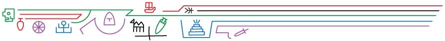{width=100%}

Many of the material cultural networks that archaeologists have generated in recent studies are based, at least in part, on affiliation data. An affiliation network is a particular form of network defined in terms of what are often called "actors" and "events." Typically, such data are used to generate a bipartite (two-mode) network where one set of nodes represents a set of social entities (individuals, groups, etc.) and the second set of nodes represent some set of features or events they can have in common or attend. For example, the classic affiliation data set is refereed to as the *Deep South* case study which represents data on a group of women in a southern town and the social events in which they participated (Davis et al. 1941). An affiliation network is defined connecting people to events in this case based on the notion that people who attended more events together had more opportunities to interact, or perhaps that their co-attendance was a reflection of other social relationships (see Breiger 1974). Similarly, events that had many of the same attendees could also be thought of as being more strongly connected than events with very different rosters of participants. The bipartite network created connecting these two classes of nodes are often further projected into distinct one-mode networks of person-to-person and event-to-event relationships for further analyses.

Although this is not always explicitly discussed, the affiliation network framework mirrors many archaeological network constructions where sites/regions/contexts are connected via the materials present in those contexts. For example, sites may stand in for "persons" in such a network and artifacts categories as "events" with the underlying reasoning being that the inhabitants of sites that share more categories of artifacts were more likely to have interacted than the inhabitants of sites with very different materials. In most archaeological examples where such data have been used (e.g., Coward 2013; Golitko et al. 2012; Mizoguchi 2013; Mills et al. 2013, 2015, etc.) these affiliation data are projected into a single one-mode network focused on sites/contexts and that network is used for most formal analyses. This is not, of course, the only path forward. There are examples of archaeologists conducting direct analyses of two-mode data (e.g., Blair 2015, 2017; Ladefoged et al. 2019, etc.). The consideration of material networks as affiliation networks also opens up the possibility of many additional methods that have as of yet been rare in archaeological network research. In this section, we outline a few approaches that may be of use as archaeologists continue to experiment with such affiliation data.

## Analyzing Two-Mode Networks{#AnalyzingTwoMode}

In the examples here we will be using the [Cibola data set](#Cibola) used throughout this document. The specific data we will use consist of a set of sites as the first mode and a set of ceramic technological clusters as the second mode. Our underlying assumption is that sites that share more ceramic technological clusters are more strongly connected than sites that share fewer. Further, ceramic technological clusters that are frequently co-associated in site assemblages are more closely connected than those that do not frequently co-occur. [Download the data here to follow along](data/Cibola_clust.csv).

Let's read in the data and create a simple two-mode network visualization to start by reading in the Cibola incidence matrix. We will be using the `igraph` package for most of the examples below so we initialize that as well as the `ggraph` package for plotting:


```r
library(igraph)
library(ggraph)

# Read in two-way table of sites and ceramic technological clusters
cibola_clust <- read.csv(file = "data/Cibola_clust.csv",
                         header = TRUE,
                         row.names = 1)
# Create network from incidence matrix based on presence/absence of
# a cluster at a site
cibola_inc <- igraph::graph_from_incidence_matrix(cibola_clust,
                                                  directed = FALSE)
# Plot as two-mode network
set.seed(4643)
ggraph(cibola_inc) +
  geom_edge_link(aes(size = 0.5), color = "gray", show.legend = FALSE) +
  geom_node_point(aes(color = as.factor(V(cibola_inc)$type),
                      size = 4),
                  show.legend = FALSE) +
  geom_node_text(aes(label = name), size = 3, repel = TRUE) +
  theme_graph()
```

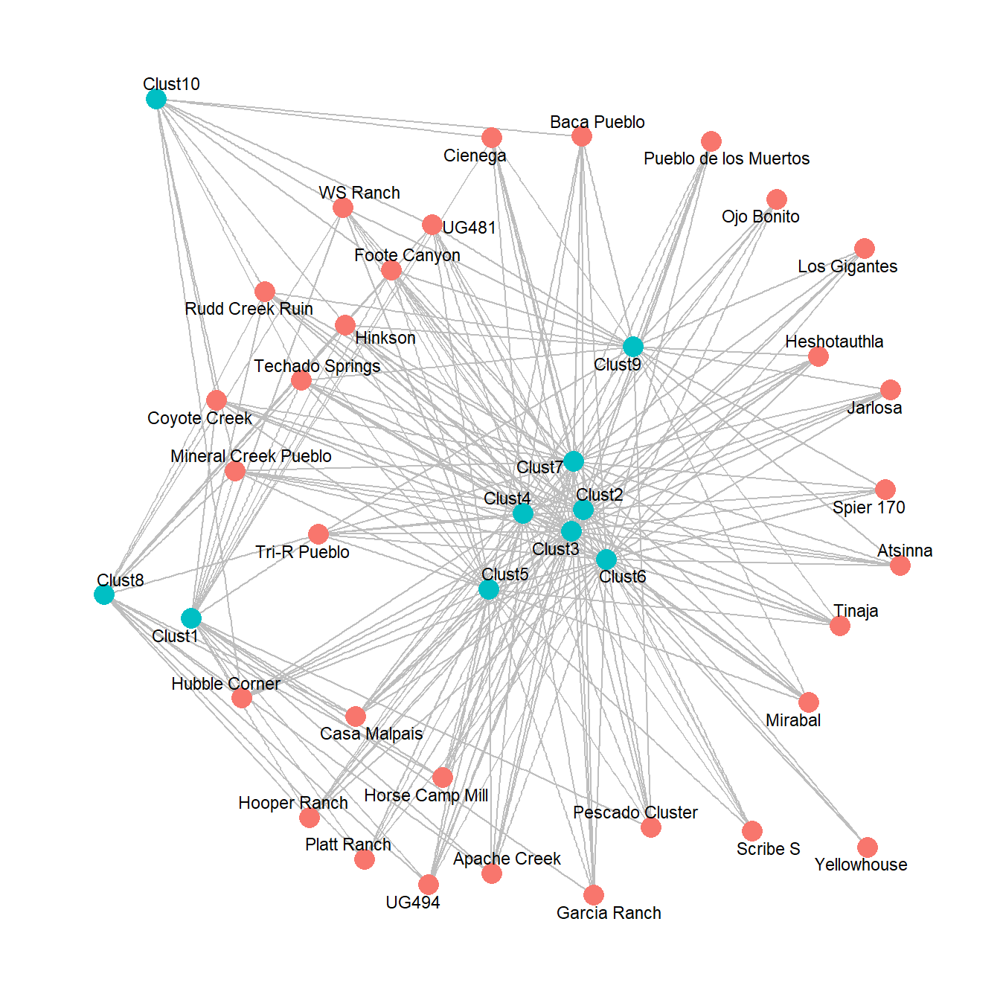


### Using Traditional Network Metrics{#TraditionalMetrics}

There are several possible approaches for analyzing two-mode network data. Perhaps the simplest approach is to analyze two-mode data using typical one-mode metrics like we've already seen throughout this guide. Essentially, this is akin to treating both modes as equivalent and evaluating relative positions and structures between node classes. If you send a bipartite network object to the typical network measures outlined in the [Exploratory Analysis](#Exploratory) section, you will get results returned as if it were a one-mode network. For example, here we apply two measures of centrality and plot the results.  


```r
dg_bi <- igraph::degree(cibola_inc)
bw_bi <- igraph::betweenness(cibola_inc)

# Plot as two-mode network with size by centrality
set.seed(4643)
ggraph(cibola_inc) +
  geom_edge_link(aes(size = 0.5), color = "gray", show.legend = FALSE) +
  geom_node_point(aes(color = as.factor(V(cibola_inc)$type),
                      size = dg_bi),
                  show.legend = FALSE) +
  geom_node_text(aes(label = name), size = 3, repel = TRUE) +
  ggtitle("Node Size by Degree") +
  theme_graph()
```

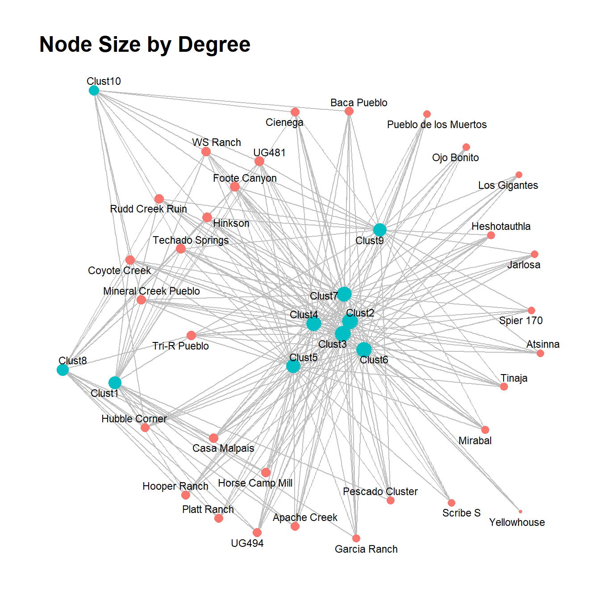

```r
set.seed(4643)
ggraph(cibola_inc) +
  geom_edge_link(aes(size = 0.5), color = "gray", show.legend = FALSE) +
  geom_node_point(aes(color = as.factor(V(cibola_inc)$type),
                      size = bw_bi),
                  show.legend = FALSE) +
  geom_node_text(aes(label = name), size = 3, repel = TRUE) +
  ggtitle("Node Size by Betweenness") +
  theme_graph()
```

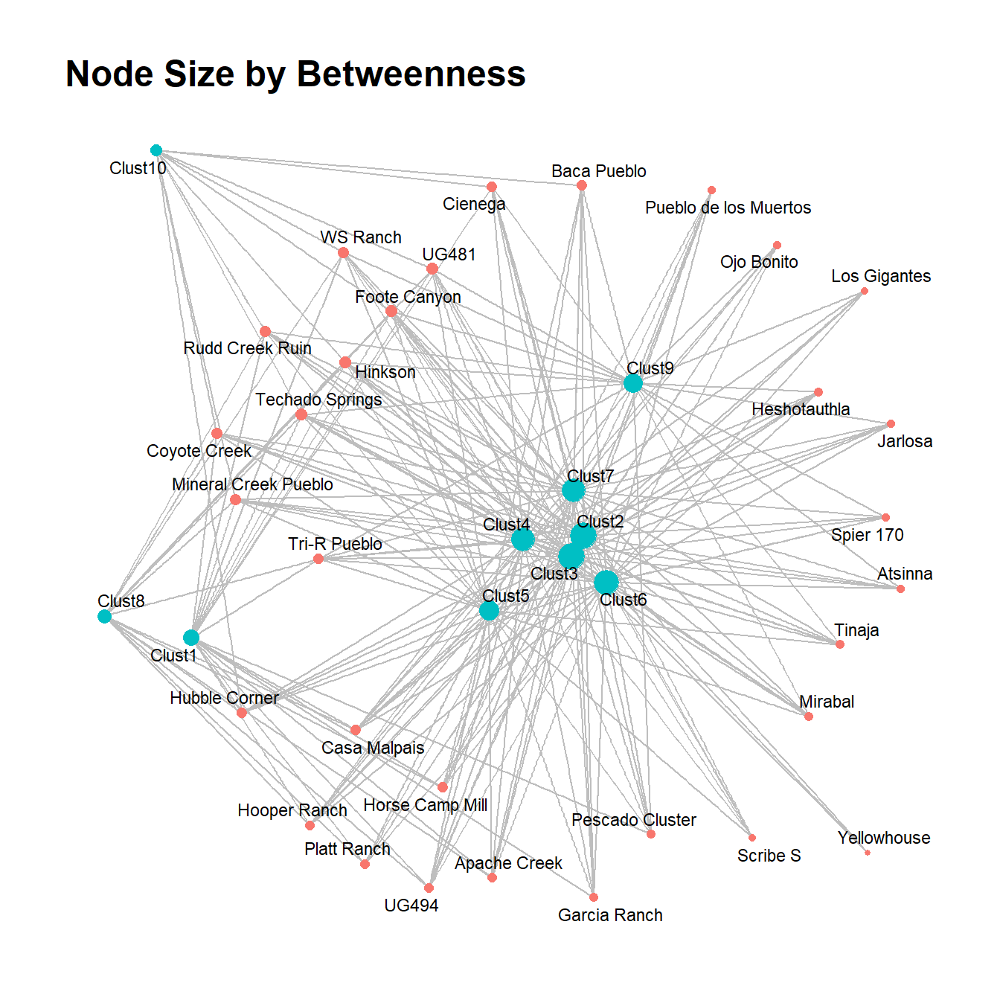

This method could be useful if you are interested in determining relative centrality between classes of nodes, in particular where the numbers of nodes in each mode are similar. In the example here, for both degree and betweenness centrality the mode made of of ceramic technological clusters (in blue) seems to include the most central nodes, but there are a few exceptions. Importantly, however, there is an imbalance in the size of each mode so it is important to consider the potential impact of such differences.

### Using Two-Mode Specific Network Metrics{#TwoModeMetrics}

In addition to the traditional approach to calculating network metrics for bipartite networks using the same one-mode metrics we've previously used, there are also methods designed specifically to work with two-mode network data. Unfortunately, most of these metrics have not been incorporated into robust and currently maintained packages for R. Many of these approaches represent simply normalizations of existing network metrics, however, so it is possible to create our own custom versions without too much trouble.

#### Density{-}

For example, if we are interested in network density, it doesn't make sense to simply use regular density measures as that assumes any node can be connected to any other node. In a two-mode network, nodes can only be connected *between* classes. Thus, to obtain appropriate two-mode density, we need to divide density by a factor defined as:

$$\frac{n_1n_2}{(n_1+n_2)(n_1+n_2-1)}$$
where $n_1$ and $n_2$ represent the number of nodes in modes 1 and 2 respectively.

Let's give this a try by first calculating density the traditional (`den_init`) way and then correcting it (`den_corr`). Note that we divide our initial density by 2 because we only want density counted based on connections in one direction.


```r
# edge density divided by 2 because we only want edges counted in one direction
den_init <- edge_density(cibola_inc) / 2
den_init
```

```
## [1] 0.145122
```

```r
# number of nodes in first mode
n1 <- length(which(V(cibola_inc)$type == FALSE))
n1
```

```
## [1] 31
```

```r
# number of nodes in second mode
n2 <- length(which(V(cibola_inc)$type == TRUE))
n2
```

```
## [1] 10
```

```r
den_corr <- den_init / ((n1 * n2) / ((n1 + n2) * (n1 + n2 - 1)))
den_corr
```

```
## [1] 0.7677419
```

As this example shows, our initial density estimate was quite low at about 0.145 but once we correct for node class, we get a quite dense network of about 0.768. This makes sense given how many active edges we see in the figures above. The high centrality suggests that most nodes in mode 1 have connections to most nodes in mode 2.

#### Degree Centrality{-}

Let's take a look at degree centrality next. As we saw in the previous section it is possible to calculate degree centrality using the traditional metric and simply plotting that. In the plot shown previously, most of the "Technological Cluster" nodes shown in blue had much higher degree than the sites. This isn't surprising given that there are 31 sites and 10 ceramic clusters and such a high two-mode density. In other words, the theoretically possible degree for the technological cluster nodes is more than 3 times higher than that for sites so it isn't surprising that our observed values are higher for mode two. One easy way to deal with degree in two-mode network is to normalize by the size of the opposite node class. For example, degree centrality in one-mode networks can be normalized as:

$$d_i^* = \frac{d_i}{n-1}$$

where $d_i$ is the original degree for node $i$ and $n$ is the number of nodes in the network. 

For two-mode networks, the standardization would take the following form:

$$\begin{aligned}
d^*_{i} =& \frac{d_{i}}{n_2} \text{, for } i \in V_1 \\
d^*_{j} =& \frac {d_{j}}{n_1} \text{, for } j \in V_2 
\end{aligned}$$

where

* $d_{i}$ is the degree of node $i$ in mode $V_1$
* $d_{j}$ is the degree of node $j$ in mode $V_2$
* $n_1$ is the number of nodes in mode $1$
* $n_2$ is the number of nodes in mode $2$

Let's give this a try with our Cibola ceramic technological clusters data. We roll this into a function for convenience:


```r
degree_twomode <- function(net) {
  n1 <- length(which(V(net)$type == FALSE))
  n2 <- length(which(V(net)$type == TRUE))
  temp_dg <- igraph::degree(net, mode = "in")
  dg_n1 <- temp_dg[which(V(net)$type == FALSE)] / n2
  dg_n2 <- temp_dg[which(V(net)$type == TRUE)] / n1
  return(c(dg_n1, dg_n2))
}

dg_tm <- degree_twomode(cibola_inc)
dg_tm
```

```
##          Apache Creek               Atsinna           Baca Pueblo 
##             0.8000000             0.6000000             0.8000000 
##          Casa Malpais               Cienega          Coyote Creek 
##             0.9000000             0.8000000             0.9000000 
##          Foote Canyon          Garcia Ranch          Heshotauthla 
##             1.0000000             0.7000000             0.7000000 
##               Hinkson          Hooper Ranch       Horse Camp Mill 
##             1.0000000             0.8000000             0.9000000 
##         Hubble Corner               Jarlosa          Los Gigantes 
##             0.8000000             0.6000000             0.5000000 
##  Mineral Creek Pueblo               Mirabal            Ojo Bonito 
##             0.9000000             0.7000000             0.6000000 
##       Pescado Cluster           Platt Ranch Pueblo de los Muertos 
##             0.7000000             0.8000000             0.6000000 
##       Rudd Creek Ruin              Scribe S             Spier 170 
##             0.9000000             0.6000000             0.6000000 
##       Techado Springs                Tinaja          Tri-R Pueblo 
##             1.0000000             0.7000000             0.9000000 
##                 UG481                 UG494              WS Ranch 
##             1.0000000             0.8000000             0.9000000 
##           Yellowhouse                Clust1                Clust2 
##             0.3000000             0.6129032             1.0000000 
##                Clust3                Clust4                Clust5 
##             1.0000000             0.9032258             0.7741935 
##                Clust6                Clust7                Clust8 
##             0.9354839             0.9032258             0.5161290 
##                Clust9               Clust10 
##             0.6774194             0.3548387
```

```r
# Plot as two-mode network with size by centrality
set.seed(4643)
ggraph(cibola_inc) +
  geom_edge_link(aes(size = 0.5), color = "gray", show.legend = FALSE) +
  geom_node_point(aes(color = as.factor(V(cibola_inc)$type),
                      size = dg_tm),
                  show.legend = FALSE) +
  geom_node_text(aes(label = name), size = 3, repel = TRUE) +
  ggtitle("Node Size by Two-Mode Normalized Degree") +
  theme_graph()
```

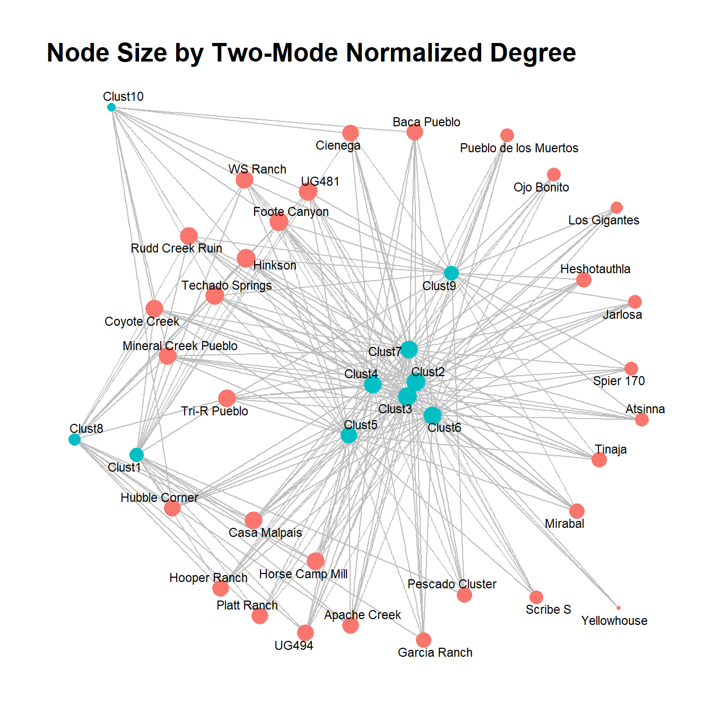

As this shows, after normalization most of the nodes have similar degree values with a couple of low degree nodes. If we plot the normalized degree distributions for both the one-mode method and the two-mode normalization as density plots, the difference is even more obvious.


```r
dg_orig <- igraph::degree(cibola_inc, mode = "in", normalized = TRUE)

dg_all <- c(dg_orig, dg_tm)
dg_lab <- c(rep("one-mode degree", 41), rep("two-mode degree", 41))

df <- data.frame(dg = dg_all, group = dg_lab)

ggplot(df) +
  geom_density(aes(x = dg, fill = group), alpha = 0.5) +
  xlim(range = c(0, 1)) +
  theme_bw()
```

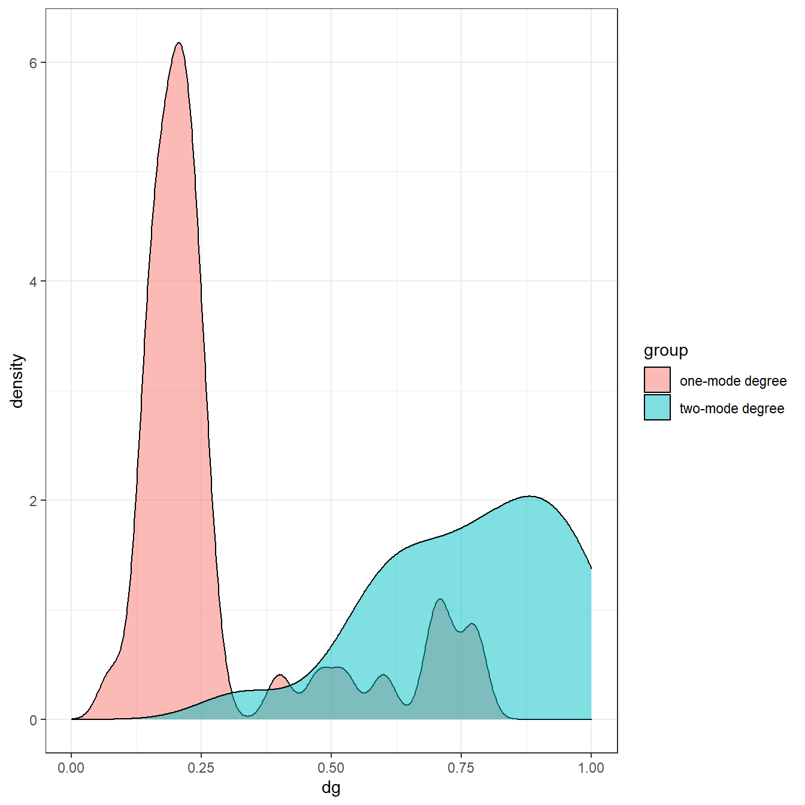

Indeed, the one-mode metric suggests that most nodes have low degree whereas the two-mode metric suggests most nodes have high degree. This demonstrates how important it is to modify traditional network metrics for the two-mode use case to assess distributional features like this. 

#### Betweenness Centrality {-}

Let's now try the same for betweenness centrality. The normalization of betweenness is a bit more complicated as it involves shortest paths rather than just counts of nodes. For one mode networks, betweenness is typically normalized by dividing results by $(n-1)(n-2)$. For the case of two-mode networks the following equations are used:

$$\begin{aligned}
b_{v_1\text{max}} = & \frac{1}{2}[n_2^2 (s+1)^2 + n_2 (s+1) (2t-s-1)-t(2s-t+3))] \\
b_{v_2\text{max}} = & \frac{1}{2}[n_1^2 (p+1)^2 + n_1 (p+1) (2r-p-1)-t(2p-r+3))] 
\end{aligned}
$$

$$\begin{aligned}
s =& (n_1 - 1) \text { div } n_2 \\
t =& (n_1 - 1) \text{ mod } n_2 \\
p =& (n_2 - 1) \text { div } n_1 \\
r =& (n_1 - 1) \text { mod } n_2
\end{aligned}$$

where

* $b_{v_1\text{max}}$ is the theoretical maximum betweenness for mode 1 and $b_{v_2\text{max}}$ is the same for mode 2
* $n_1$ and $n_2$ are the number of nodes in modes 1 and 2 respectively
* $\text {div}$ refers to integer division where any numbers past the decimal point are dropped after the division operation
* $\text {mod}$ refers to modulo where only numbers beyond the decimal point are retained after the division operation

Using these equations we can then calculate normalized betweenness for two-modes as:

$$\begin{aligned}
b^*_i =& \frac{b_i}b_{v_1\text{max}} \text {, for } i \in V_1\\
b^*_j =& \frac{b_j}b_{v_2\text{max}} \text {, for } j \in V_2
\end{aligned}$$

In the following chunk of code, we roll these equations into a function and then calculate two-mode betweenness and plot it. For the sake of convenience, we have placed both of the functions for two-mode centrality created here into a [script which you can download here](scripts/twomode.R).


```r
betweenness_twomode <- function(net) {
  n1 <- length(which(V(net)$type == FALSE))
  n2 <- length(which(V(net)$type == TRUE))
  temp_bw <- igraph::betweenness(net, directed = FALSE)
  s_v <- round((n1 - 1) / n2, 0)
  t_v <- (n1 - 1) %% n2
  p_v <- round((n2 - 1) / n1, 0)
  r_v <- (n1 - 1) %% n2
  bw_v1 <-
    0.5 * (n2^2 * (s_v + 1)^2 + n2 * (s_v + 1) *
            (2 * t_v - s_v - 1) - t_v * (2 * s_v - t_v + 3))
  bw_v2 <- 
    0.5 * (n1^2 * (p_v +1)^2 + n1 * (p_v +1) * (2 * r_v - p_v - 1) *
             r_v * (2 * p_v - r_v + 3))
  bw_n1 <- temp_bw[which(V(net)$type == FALSE)] / bw_v2
  bw_n2 <- temp_bw[which(V(net)$type == TRUE)] / bw_v1
  return(c(bw_n1, bw_n2))
}

bw_tm <- betweenness_twomode(cibola_inc)
bw_tm
```

```
##          Apache Creek               Atsinna           Baca Pueblo 
##          0.0070822286          0.0025896615          0.0093451935 
##          Casa Malpais               Cienega          Coyote Creek 
##          0.0099600613          0.0100144209          0.0125792905 
##          Foote Canyon          Garcia Ranch          Heshotauthla 
##          0.0161688627          0.0042695215          0.0040337432 
##               Hinkson          Hooper Ranch       Horse Camp Mill 
##          0.0161688627          0.0070822286          0.0099600613 
##         Hubble Corner               Jarlosa          Los Gigantes 
##          0.0102638260          0.0025896615          0.0017552743 
##  Mineral Creek Pueblo               Mirabal            Ojo Bonito 
##          0.0125792905          0.0040337432          0.0025896615 
##       Pescado Cluster           Platt Ranch Pueblo de los Muertos 
##          0.0051844595          0.0070822286          0.0025896615 
##       Rudd Creek Ruin              Scribe S             Spier 170 
##          0.0133076983          0.0022732239          0.0030177883 
##       Techado Springs                Tinaja          Tri-R Pueblo 
##          0.0161688627          0.0040337432          0.0099600613 
##                 UG481                 UG494              WS Ranch 
##          0.0161688627          0.0070822286          0.0133076983 
##           Yellowhouse                Clust1                Clust2 
##          0.0002542476          0.0348523775          0.1297623337 
##                Clust3                Clust4                Clust5 
##          0.1297623337          0.0927886415          0.0634360762 
##                Clust6                Clust7                Clust8 
##          0.1134973990          0.0960766642          0.0224202375 
##                Clust9               Clust10 
##          0.0529783153          0.0102589547
```

```r
# Plot as two-mode network with size by centrality
set.seed(4643)
ggraph(cibola_inc) +
  geom_edge_link(aes(size = 0.5), color = "gray", show.legend = FALSE) +
  geom_node_point(aes(color = as.factor(V(cibola_inc)$type),
                      size = bw_tm),
                  show.legend = FALSE) +
  geom_node_text(aes(label = name), size = 3, repel = TRUE) +
  ggtitle("Node Size by Two-Mode Normalized Betweenness") +
  theme_graph()
```

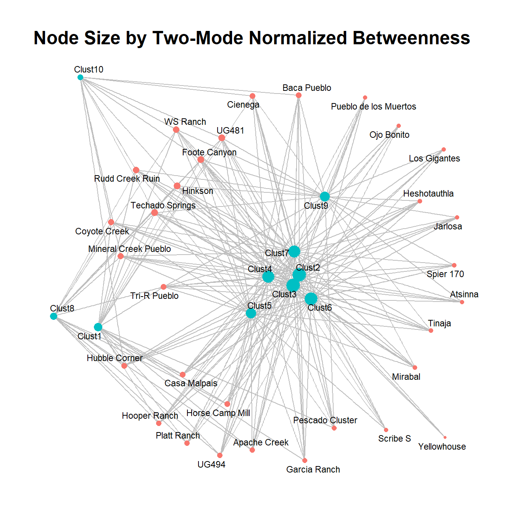

This plot suggests that the normalized betweenness is quite similar the original one-mode measure in this particular network, but that will not necessarily always be the case.

There are similar normalization factors for other centrality measures in the published network literature ([see this document by Borgatti for examples](http://www.analytictech.com/borgatti/papers/2modeconcepts.pdf)) but few of these have been implemented in R as of yet. This would be a useful project in the future (and perhaps we will add that here eventually. [Want to help?](#Contributing)).

### Projecting Two-Mode Networks Before Analysis{#ProjectingTwoMode}

Another common approach to the analysis of two-mode networks is to project them into two separate one-mode networks and then to analyze one or both modes using traditional one-mode metrics. We have already seen this approach in several examples throughout this guide. Indeed, this is the most common approach that archaeological network studies have taken. As we describe in the [Network Data Formats](#NetworkData) section, there are several ways of projecting an incidence matrix into one-mode networks. This includes the matrix multiplication method which counts the numbers of co-occurrences that we already described [in our coverage of two-mode networks](#TwoMode) as well as various similarity metrics for producing weighted networks based on measures such as Brainerd-Robinson similarity, $\chi$-square distance, Jaccard similarity, and many others discussed in the [similarity networks](#SimilarityNetworks) section. Although such networks are not often explicitly described in terms of affiliation networks, they very much fit the definition. In this section, we offer a slightly expanded discussion of some of these methods to highlight important issues for affiliation data specifically.

#### Matrix Multiplication{-}

As [prevsiously described](#TwoMode) one of the most common ways for generating one mode projections from two-mode data is through matrix multiplication. Specifically, if you multiply a matrix $A$ by the transpose of that same matrix $A^T$, you will get a square matrix with the number of rows and columns equal to the rows in the original matrix with each cell representing the number of intersections between the two modes (and with the diagonal of the matrix representing the number of opposite mode categories present in the mode under consideration). Let's take a look at this process formally:

$$\begin{equation}
A  \cdot A^T = 
\begin{pmatrix}
a & b \\
c & d 
\end{pmatrix}
 \cdot
\begin{pmatrix}
a & c \\
b & d 
\end{pmatrix} = 
\begin{pmatrix}
aa + bb & ac+bd \\
ca +db & cc + dd 
\end{pmatrix}
\end{equation}$$

If we assume the original matrix contains only 0s and 1s then we will end up with the intersection of the two network modes in the diagonal as describe above.

There are a couple of ways to conduct this procedure in R. Previously we used the `%*%` operator for matrix multiplication and the `t()` transpose function to calculate a matrix multiplied by its transpose, but it is also possible to use an R built-in function called `crossprod` to do the same thing. Indeed, if you are working on large matrices, which can be computationally expensive, the `crossprod` function is considerably faster. In the chunk below we calculate a square matrix for the `cibola_clust` data set using both methods and then subtract the results from each other to ensure that they are identical.


```r
mat1 <- as.matrix(cibola_clust)
mat1 <- ifelse(mat1 > 0, 1, 0)

res1 <- mat1 %*% t(mat1)

# this does the same as the above
res2 <- crossprod(t(mat1))

# Check to see if they are identical
max(res1-res2)
```

```
## [1] 0
```

Another important feature of a one-mode network generated in this way is that it can be treated as a weighted network by simply including the `weighted = TRUE` argument in the call. For example:


```r
diag(res1) <- 0
cibola_onemode <- graph_from_adjacency_matrix(res1, weighted = TRUE)

set.seed(4643)
ggraph(cibola_onemode) +
  geom_edge_link(aes(alpha = weight, color = weight),
                 width = 1, show.legend = FALSE) +
  scale_edge_alpha_continuous(range = c(0, 0.5)) +
  scale_edge_color_continuous() + 
  geom_node_point(aes(size = igraph::degree(cibola_onemode)),
                  show.legend = FALSE) +
  geom_node_text(aes(label = name), size = 3, repel = TRUE) +
  theme_graph()
```

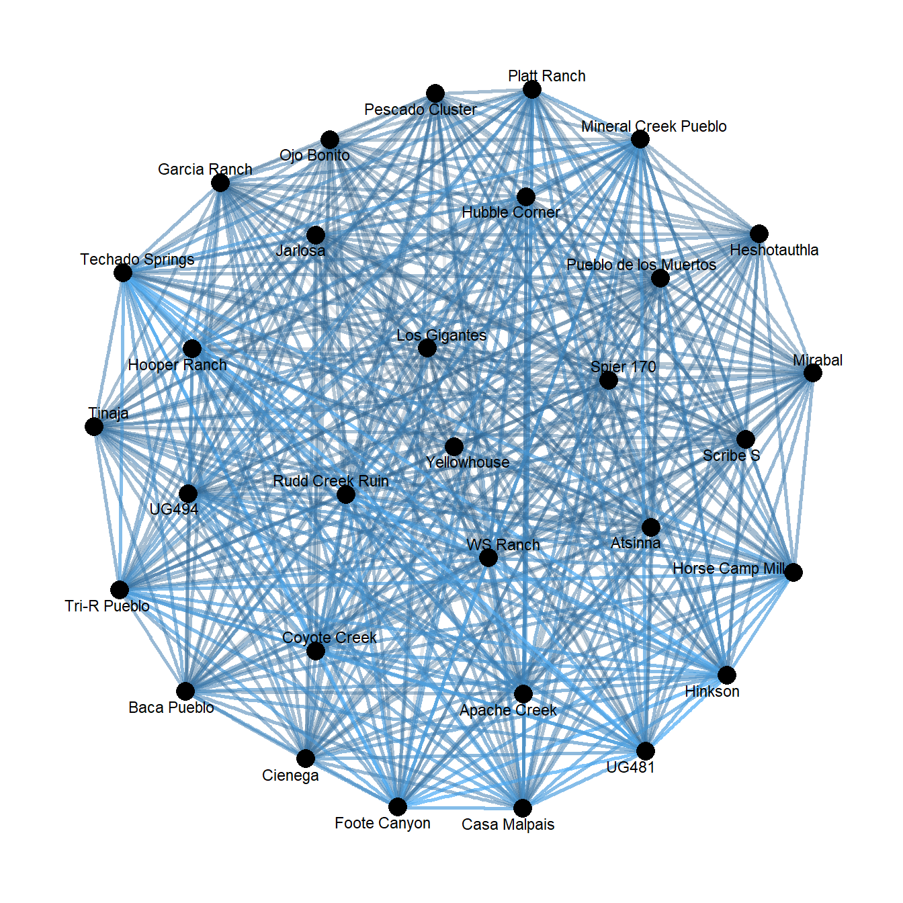

That produces a hairball that is fairly hard to visually interpret. To try to ameliorate that we can borrow a function we previously created in the [two-mode networks](#TwoMode) discussion in the Network Data section and only consider a ceramic cluster present at a site if it makes up at least 20% of the assemblage. Let's try this:


```r
two_mode <- function(x, thresh = 0.2) {
  # Create matrix of proportions from x input into function
  temp <- prop.table(as.matrix(x), 1)
  # Define anything with greater than or equal to threshold as
  # present (1)
  temp[temp >= thresh] <- 1
  # Define all other cells as absent (0)
  temp[temp < 1] <- 0
  # Return the new binarized table as output of the function
  return(temp)
}

mat_new <- two_mode(cibola_clust, thresh = 0.2)

res3 <- crossprod(t(mat_new))

cibola_om_reduced <- graph_from_adjacency_matrix(res3, weighted = TRUE)

set.seed(4643)
ggraph(cibola_om_reduced) +
  geom_edge_link(aes(alpha = weight, color = weight),
                 width = 1, show.legend = FALSE) +
  scale_edge_alpha_continuous(range = c(0.1, 1)) +
  scale_edge_color_gradient() +
  geom_node_point(aes(size = igraph::degree(cibola_om_reduced)),
                  show.legend = FALSE) +
  geom_node_text(aes(label = name), size = 3, repel = TRUE) +
  theme_graph()
```

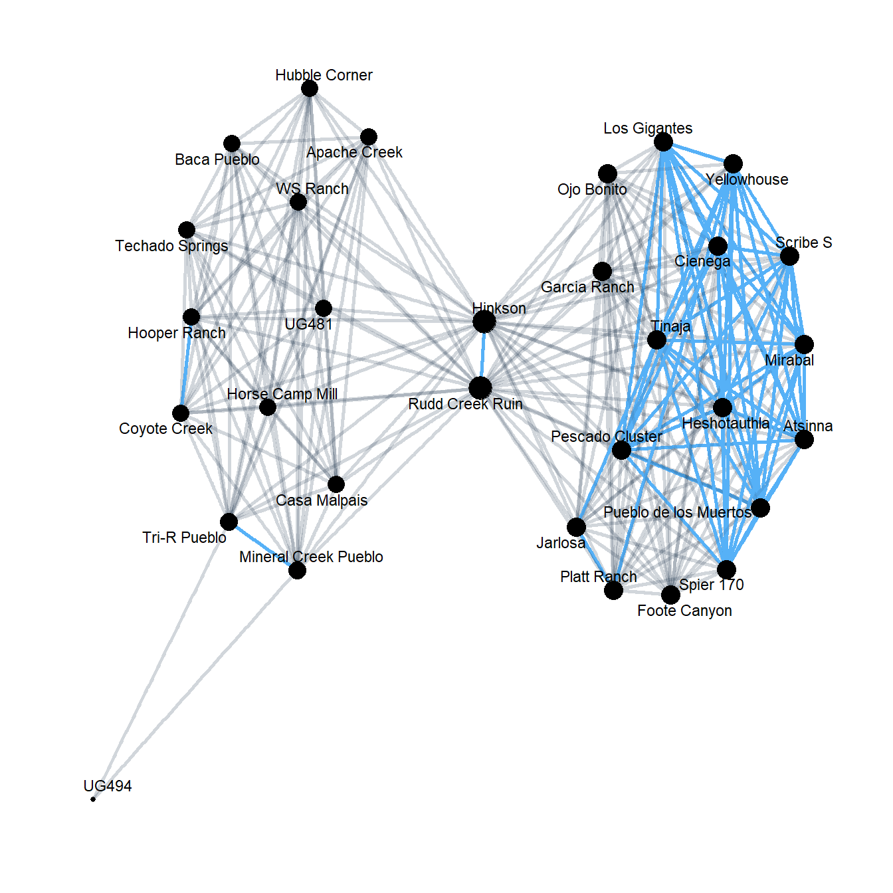

That is a lot easier to interpret. We've got one cluster of quite strong ties and then a second cluster characterized by weaker ties with relatively week ties between the clusters. Notably, this pattern is very similar to the pattern seen in the Brainerd-Robinson similarity matrices generated using these data which isn't too surprising.

#### Weighted Matrix Projection{-}

We have already described several similarity metrics in detail in [the similarity networks section of this document](#SimilarityNetworks). In this section, we want to offer one additional approach developed by Newman (2001) for defining connections in scientific collaboration networks. Newman wanted to extend the procedure for assessing co-occurrence to take into account the number of collaborators involved in each collaboration. Specifically, he posited that when there were fewer collaborators, the connection between a pair of co-authors was stronger than when there were many co-authors. We could equivalently think of this in terms of material culture to suggest that sites or contexts that shared rare categories were more strongly connected than sites/contexts that shared only common categories. Using this logic,  Newman created a new weighting scheme for co-occurrence networks where the weight of a connection between nodes $i$ and $j$ is the defined in terms of the number of cross-mode connections for that node. In other words:

$$w_{ij} = \Sigma_p \frac{1}{N_p-1}$$

where $N_p$ is the number of connections from mode 1 to mode 2 for node $p$ and $w_{ij}$ is the weight of the connection from $i$ to $j$.

<div class="rmdnote">
<p>The Newman method of weighting bipartite networks has been
implemented in an R package called <code>tnet</code>. This package has a
few other useful functions for the analysis of bipartite, weighted, and
longitudinal networks so it is worth investigating (see
<code>?tnet</code>). Unfortunately, it is no longer being actively
maintained.</p>
</div>

Let's take a look at Newman's method using the `tnet` package. This package expects a simple two-column edge list with only integers for the node identifiers which we can generate using the `igraph` `get.edgelist` function and including the `names = FALSE` argument:


```r
library(tnet)

tm_el <- get.edgelist(cibola_inc, names = FALSE)
head(tm_el)
```

```
##      [,1] [,2]
## [1,]    1   32
## [2,]    1   33
## [3,]    1   34
## [4,]    1   35
## [5,]    1   36
## [6,]    1   37
```

```r
proj_newman <- as.matrix(projecting_tm(tm_el, method = "Newman"))

proj_net <- graph_from_edgelist(proj_newman[, 1:2])
E(proj_net)$weight <- proj_newman[, 3]
V(proj_net)$name <- row.names(cibola_clust)

set.seed(4643)
ggraph(proj_net) +
  geom_edge_link(aes(color = weight),
                 width = 1, show.legend = FALSE) +
  scale_edge_alpha_continuous(range = c(0, 0.5)) +
  scale_edge_color_continuous() +
  geom_node_point(aes(size = igraph::degree(proj_net)),
                  show.legend = FALSE) +
  geom_node_text(aes(label = name), size = 3, repel = TRUE) +
  theme_graph()
```

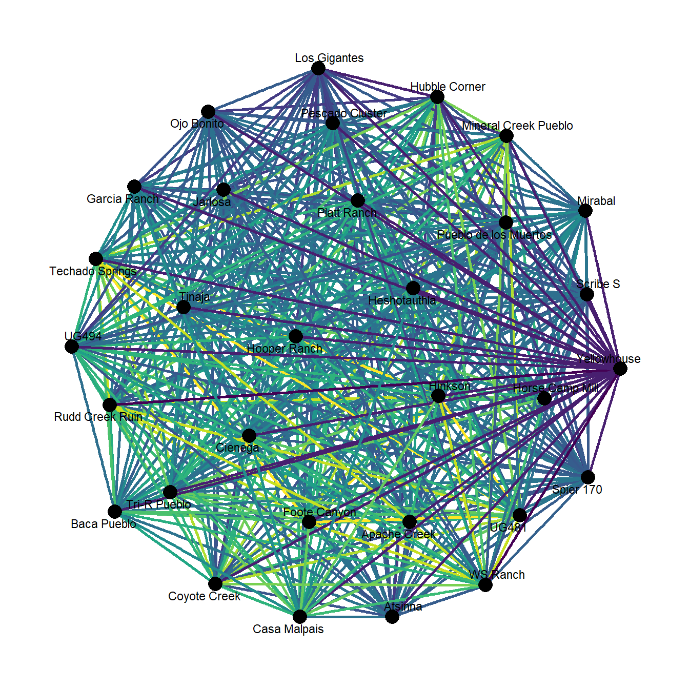

As expected, we get another hairball here, but let's take a look at the edge weights of this projection versus the original matrix multiplication projection:


```r
cor(E(proj_net)$weight, E(cibola_onemode)$weight)^2
```

```
## [1] 0.9454047
```

```r
plot(E(proj_net)$weight, E(cibola_onemode)$weight, pch = 16, col = "blue",
     xlab = "Newman Weights", ylab = "Matrix Multiplication Weights")
```

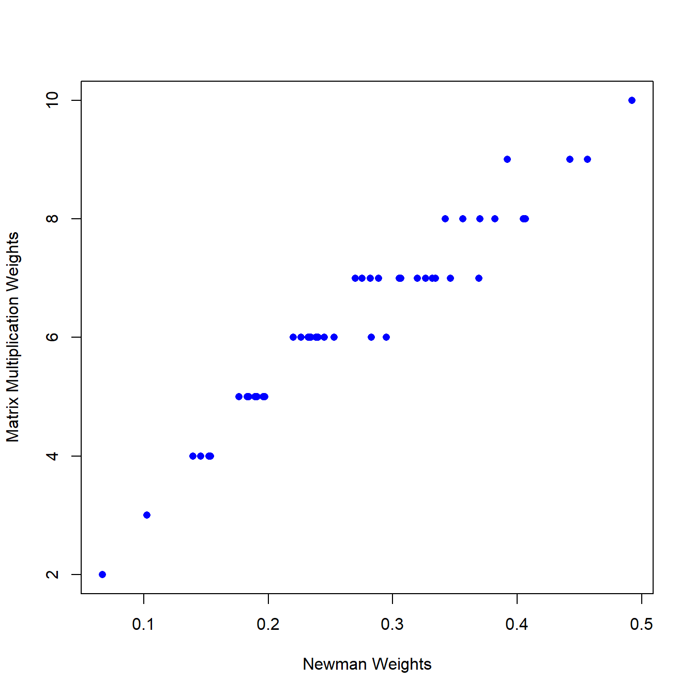

As this shows, edge weights are highly correlated with an $r^2 = 0.95$ but there are also some subtle differences that distinguish these two projection methods. Via experimentation we have found the Newman model to be particularly useful in situations where there are a mix of common and rare artifact (mode 2) categories as this produces networks that account for relative frequency via context-to-context co-associations.

## Correspondence Analysis{#CorrespondenceAnalysis}

Another method that has proven useful in exploring affiliation data in archaeological and many other contexts is correspondence analysis. Correspondence analysis is a method of dimension reduction based on the decomposition of the $chi$-square statistic that allows for the projection of the rows and columns of an incidence matrix into the same low dimensional space (see Peeples and Schachner 2012). Correspondence analysis works on either count or presence/absence data. The technical details of this approach are beyond the scope of this document (see Peeples and Schachner 2012), but generally correspondence analysis can be used to plot row and column cases from an incidence matrix in a single bi-plot where the spatial configuration of those points is related to the degree of co-association among them (though not a perfect representation of co-association). Correspondence analysis is frequently used for frequency seriation in archaeology but can also be useful in any analysis focused on co-association including spatial analyses (Alberti 2017). Correspondence analysis has also previously been used by [Giomi and Peeples (2019)](https://www.sciencedirect.com/science/article/abs/pii/S0278416518301132?via%3Dihub) for investigating assemblages of materials recovered in discrete excavation contexts within the Pueblo Bonito Chacoan Great House complex. They explicitly compare correspondence analysis to related co-association methods we will describe further below to construct networks of co-association among artifact categories. 

<div class="rmdnote">
<p>Conducting correspondence analysis and visualizing it in R is
typically done using the <code>ca</code> package. This package has a
plotting function within it that creates bi-plots where each mode (rows
and columns of the incidence matrix) are displayed with different shapes
and colors. See the <code>?ca()</code> function help for more
information. Although we do not use it here, the <code>anacor</code>
package provides additional extensions of correspondence analysis
methods (such as alternative axis scaling methods) that may also be
useful.</p>
</div>

Let's start by applying the `ca` function to our `cibola_clust` incidence matrix data set:


```r
library(ca)

ca_cibola <- ca(cibola_clust)
plot(ca_cibola)
```

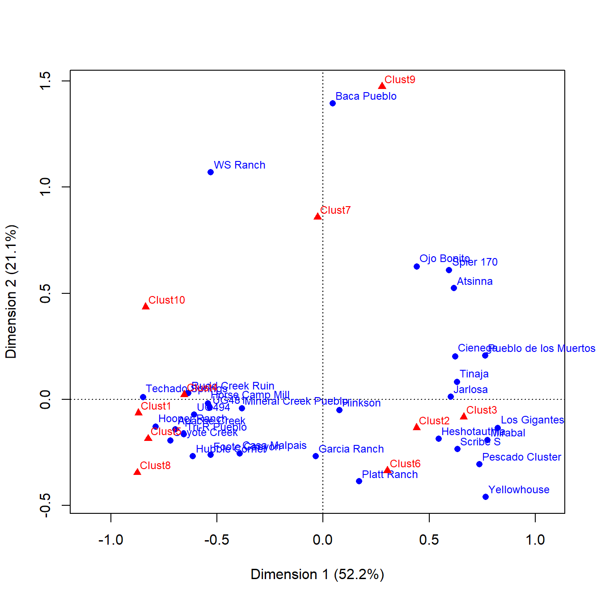

This plot clearly shows associations between certain clusters and sets of sites. If you are familiar with the sites used here you may also notice that there are clear geographic clusters as well. In addition to this, the dimensions contain percentages in the labels. What this indicates is the amount of variation in the underlying incidence matrix that each dimension represents. Correspondence analysis is designed such that the first dimension accounts for the most variation and so on up to 1 dimension less than the number of categories present.

### Network Visuals Using Correspondence Analysis{#CAViz}

Correspondence analysis has frequently been used for plotting affiliation data like this in sociology, in particular using layouts generated through CA to plot networks with edges generated using some other mode of projection described above (see Borgatti and Halgin 2014; Faust 2005). In the chunk of code below we plot the reduced Cibola one-mode network edges as well as the one mode projection of the columns using the positions on the correspondence analysis axes as the point locations.


```r
# Create network object using crossprod function
col_net <- graph_from_adjacency_matrix(crossprod(as.matrix(cibola_clust)),
                                       weighted = TRUE,
                                       mode = "undirected",
                                       diag = FALSE)

# Combine both edge lists into a single frame
el_com <-  rbind(get.edgelist(cibola_om_reduced), get.edgelist(col_net))

# Define composite network object and add Edge and Vertex attributes
net2 <- graph_from_edgelist(el_com, directed = FALSE)
E(net2)$weight <- c(E(cibola_om_reduced)$weight, E(col_net)$weight)
E(net2)$mode <- c(rep("blue", ecount(cibola_om_reduced)),
                  rep("red", ecount(col_net)))
V(net2)$mode2 <- c(rep("blue", vcount(cibola_om_reduced)),
                   rep("red", vcount(col_net)))
V(net2)$name <- c(row.names(cibola_clust), colnames(cibola_clust))

# Create object containing row and column coordinates from correspondence
# analysis results
xy <- rbind(ca_cibola$rowcoord[, 1:2], ca_cibola$colcoord[, 1:2])

# Plot the results color coding by mode
set.seed(4643)
ggraph(net2, layout = "manual",
       x = xy[, 1],
       y = xy[, 2]) +
  geom_edge_link0(aes(alpha = weight, color  = E(net2)$mode),
                 show.legend = FALSE) +
  scale_edge_color_manual(values = c("blue", "red")) +
  geom_node_point(aes(color = mode2, shape = mode2), 
                  size = 3,
                  show.legend = FALSE) +
  scale_color_manual(values = c("blue", "red")) +
  scale_shape_manual(values = c(16, 17)) +
  geom_node_text(aes(label = name), size = 3, repel = TRUE) +
  theme_bw()
```

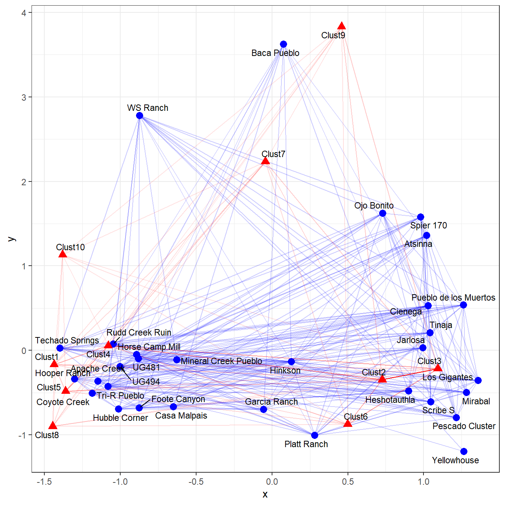

As this plot illustrates, there is considerable information here about the co-associations of the two modes in our incidence matrix in visuals like this. We suggest that visualizations like this are a potential avenue worth perusing in future archaeological network investigations of incidence matrix data sets.

## Measuring Co-association{#MeasuringCoassociation}

Giomi and Peeples (2019) presented a network analysis focused on intra-site variability in the Chacoan Great House complex of Pueblo Bonito. In this analysis, they used correspondence analysis as shown above in addition a method for assessing co-occurrence in two-way tables first published by Kintigh (2006). This method calculates the expected co-occurrence of every pair of objects in an assemblage based on the total number of contexts considered and the number of contexts that contain each type of object (you can think about types of objects and contexts as two modes in a two-mode network). This method relies on presence/absence only so it can be applied in many contexts even where only sketchy information on archaeological context inventories are available. Giomi and Peeples present this measure of co-association $C_{ab}$ between object types $a$ and $b$ defined as:

$$C_{ab}=\frac{o_{ab}-Np_{ab}}{\sqrt{Np_{ab}(1-p_{ab})}}$$

where

* $o_{ab}$ = the observed number of co-occurrences between object classes $a$ and $b$.
* $N$ = the total number of assemblages
* $p_{ab}$ = the expected proportion of co-occurrences between object classes $a$ and $b$ defined as the proportion of assemblages where $a$ occurs times the proportion of assemblages where $b$ occurs.

This measure provides an index of the number of co-occurrences observed in relation to expected given the overall frequency of each object class in Z-standardized units. That means that a value of 3 means that two object classes co-occur approximately 3 standard deviations more than we would expect given the frequency of occurrence for those object classes and the number of contexts for which we have data. Similarly a value of -2 means that two object classes are 2 standard deviations less associated than would be expected given their frequency of occurrence.  

Here is the function used by Giomi and Peeples (2019) and also available [on GitHub here](https://github.com/mpeeples2008/Giomi-and-Peeples-2019).


```r
## Co-occurrence assessment script
## This function expects a binary data frame object that contains only 1s and 0s with the contexts under consideration as rows and the 
## categories as columns and each cell represents the presence or absence of a particular category in a particular context

cooccur <- function(x) {
  
  # calculate the proportional occurrence of each artifact class
  nm.p <- colSums(x)/nrow(x) 
  
  # calculated observed co-occurrences through matrix multiplication
  obs <- t(as.matrix(x)) %*% (as.matrix(x)) 
  diag(obs) <- 0
  
  # create matrix of expected values based on proportional occurrence 
  expect <- matrix(0,nrow(obs),ncol(obs)) 
  for (i in 1:nrow(obs)) {
    for (j in 1:ncol(obs)) {
      expect[i,j] <- (nm.p[i]*nm.p[j])*nrow(x)}} 
  
  # convert expected count to expected proportion
  p <- expect/nrow(x)
  
  # calculate final matrix of scores and output
  out <- (obs-expect)/(sqrt(expect*(1-p))) 
  diag(out) <- 0
  return(out)}
```

To test this approach we're going to use a partial inventory of artifacts from a site in west-central New Mexico called Techado Springs (Smith et al. 2009). This was an extensively excavated settlement with over 500 rooms and we have artifact inventory data for 198 of those rooms. For the example here, we're using 9 categories of features/objects encountered in those rooms, all of which are related to the ceramic production process. You can [download the artifact data here](data/Techado_artifacts.csv) to follow along.


```r
tec <- read.csv("data/Techado_artifacts.csv", header = TRUE, row.names = 1)
tec <- tec[which(rowSums(tec) > 0), ]

out <- cooccur(tec)

# see first few columns
out[,1:4]
```

```
##                   CeramicDryFeature CeramicVessel        Puki   PaintCup
## CeramicDryFeature         0.0000000     3.9785881  2.25632854  1.5877018
## CeramicVessel             3.9785881     0.0000000 -1.38858632 -0.2800886
## Puki                      2.2563285    -1.3885863  0.00000000 -0.9061016
## PaintCup                  1.5877018    -0.2800886 -0.90610162  0.0000000
## PolishingStone           -1.0575847           NaN -5.15060380  1.3732138
## RawClay                  -0.8651613    -1.5384481 -1.43135460 -1.3739322
## Scoop                     0.7167460    -1.4775196 -1.59036373  0.6854396
## CeramicScrapper           0.2165159     0.2621044 -0.01569124  2.1188426
## UnfiredVessel             3.6918908     8.3227556  1.04664169  1.9422423
```

Looking at the first few columns of the output of our `cooccur` function we can see a few particularly high and low values. For example, polishing stones and pukis (tools used for supporting vessels while forming them) are much less associated than would be expected by chance (-5.15). On the other side, ceramic drying features and un-fired vessels are much more associated than we would expect by chance (3.69). There are also several `NaN` or `NA` indicating that those two categories never co-occur in this data set.

Next, let's plot all of the returned values as a histogram:


```r
hist(out, breaks = 10, xlab = "C_p")
```

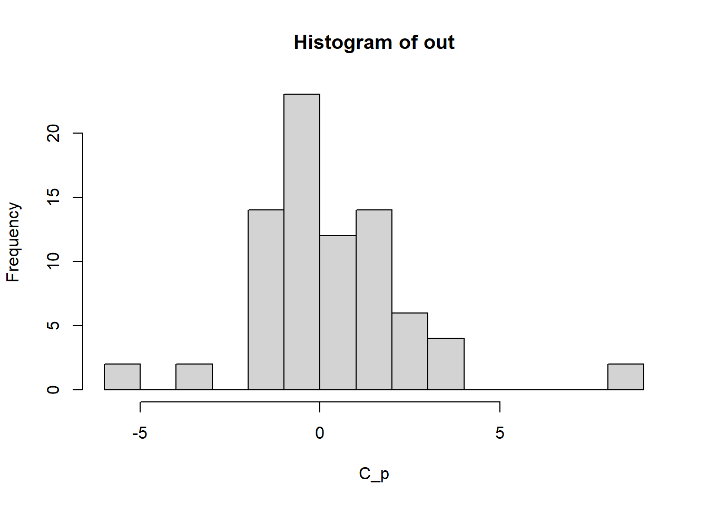
If we examine this histogram of all values returned from the analysis we see a distribution that is peaked near 0 (or the degree of co-association we would expect by chance) but there are extreme values in both directions suggesting much less and greater co-association than would be expected by chance for certain features/object classes.

### Alternative Methods for Visualizing Co-associations{#COViz}

Another way we can visualize these data is using a network graph as described by Giomi and Peeples (2019). First, we dichotomize the output created above. We are going to use an absolute threshold here and define a edge (connection) between any pair of object classes that are associated 2 standard deviations or greater more than expected by chance. There is nothing special about this 2 SD threshold and in practice it is a good idea to try a range of values and compare your results.


```r
net_dat <- out
net_dat <- ifelse(net_dat < 2, 0, net_dat)
net_dat[is.na(net_dat)] <- 0

net_c <- graph_from_adjacency_matrix(net_dat,
                                     mode = "undirected",
                                     weighted = TRUE)
V(net_c)$name <- colnames(tec)

set.seed(4643)
ggraph(net_c) +
  geom_edge_link(aes(width = weight)) +
  scale_edge_width_continuous(range = c(0.5, 1.5)) +
  geom_node_point(size = 3, color = "red") +
  geom_node_text(aes(label = name), size = 3, repel = TRUE) +
  theme_graph()
```

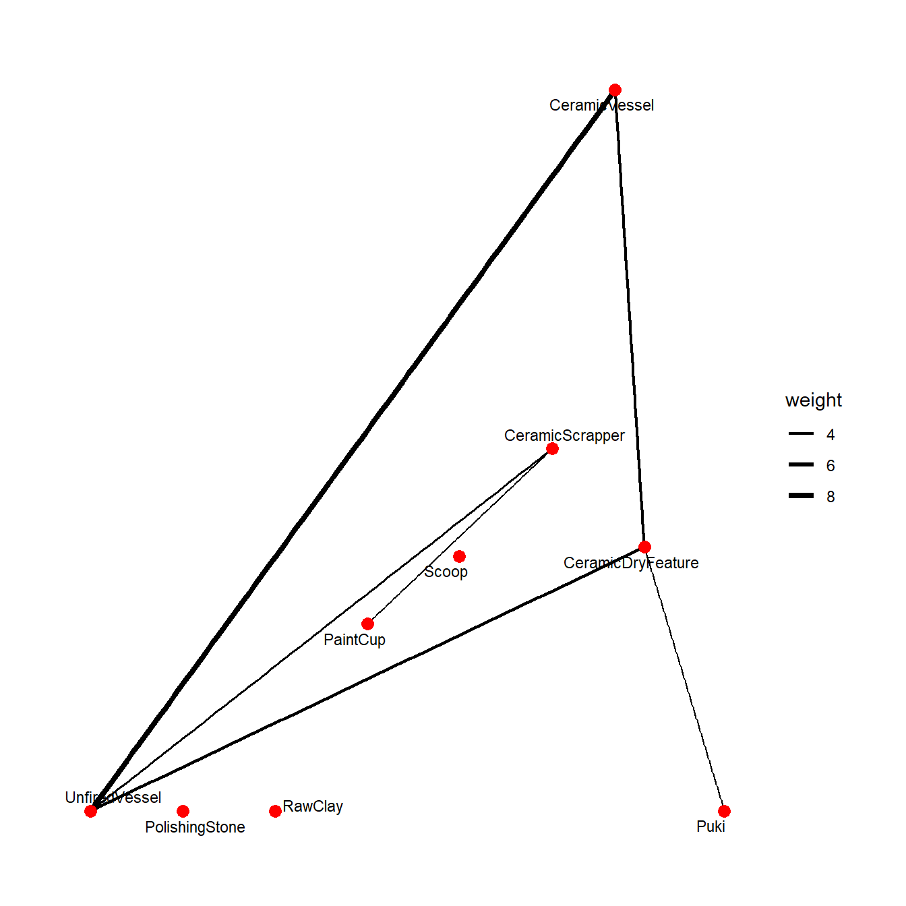

This plot shows the strongest co-associations among categories and provides a nice distillation of important relationships in one mode of these data. It is also possible to do the reverse and explore the connections among rooms by virtue of the co-associations in their assemblages. Let's give this a try using the `t()` transpose function to reverse the matrix for our analysis. In the plot below we have further defined clusters among nodes using the Louvain clustering method and color coded them to evaluate the potential for community structure in our results.


```r
net_dat <- cooccur(t(tec))
net_dat <- ifelse(net_dat > 2, 1, 0)
net_dat[is.na(net_dat)] <- 0

net_r <- graph_from_adjacency_matrix(net_dat, mode = "undirected")
V(net_r)$name <- row.names(tec)

group <- cluster_louvain(net_r)$memberships[1, ]

set.seed(4532)
ggraph(net_r, layout = "fr") +
  geom_edge_link(alpha = 0.5) +
  geom_node_point(aes(color = as.factor(group)),
                  size = 3,
                  show.legend = FALSE) +
  scale_color_discrete("Set2") +
  geom_node_text(aes(label = name), size = 3, repel = TRUE) +
  theme_graph()
```

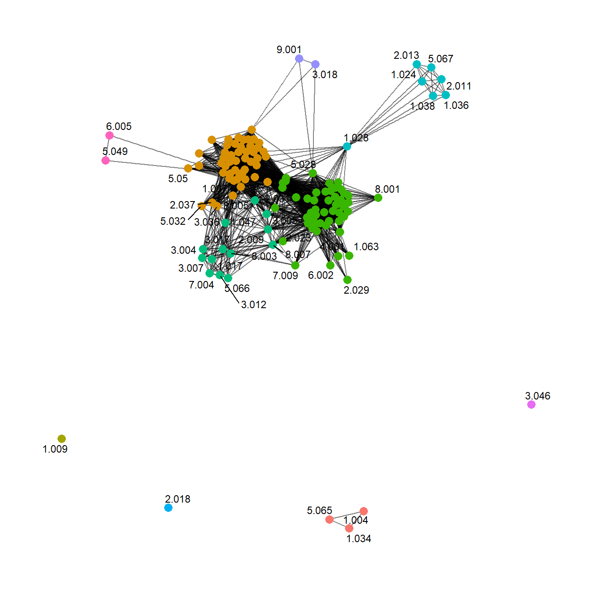

Hmm... There appear to be some clusters... interesting. There are a lot of things we would likely want to do here including going back to the original data and looking for other commonalities among rooms that group together in terms of strong similarities in ceramic production tools and features. For example, Giomi and Peeples (2019) explore the relationships between cluster/clique membership and room inventories and make behavioral interpretations of common assemblages drawing on ethnographic examples. 

As the brief example above illustrates, co-association methods like this are a natural fit for network methods and we argue that archaeologists should explore these and similar approaches more in the future.

