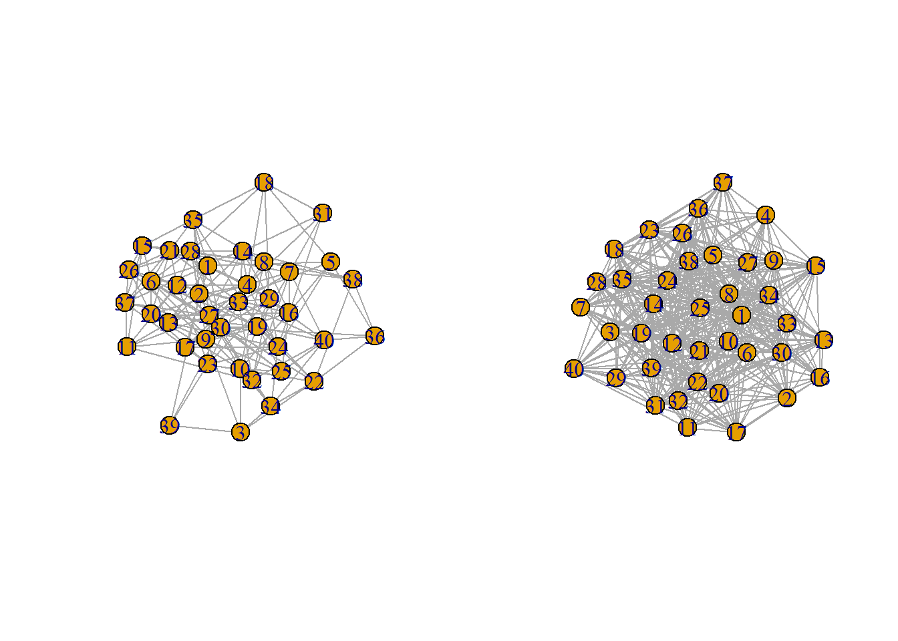
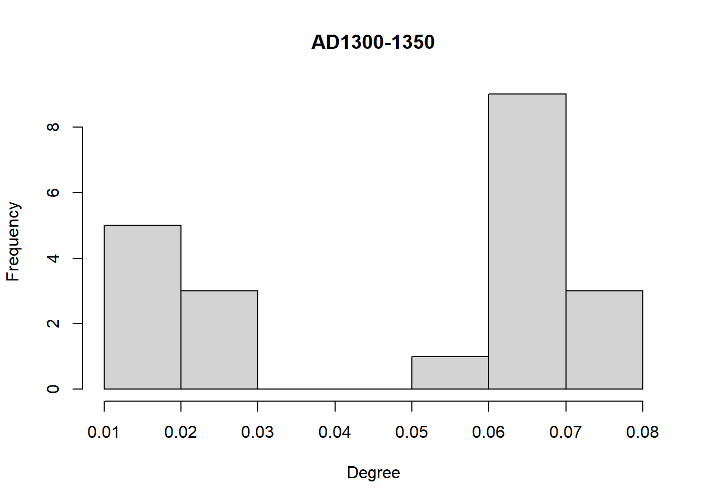
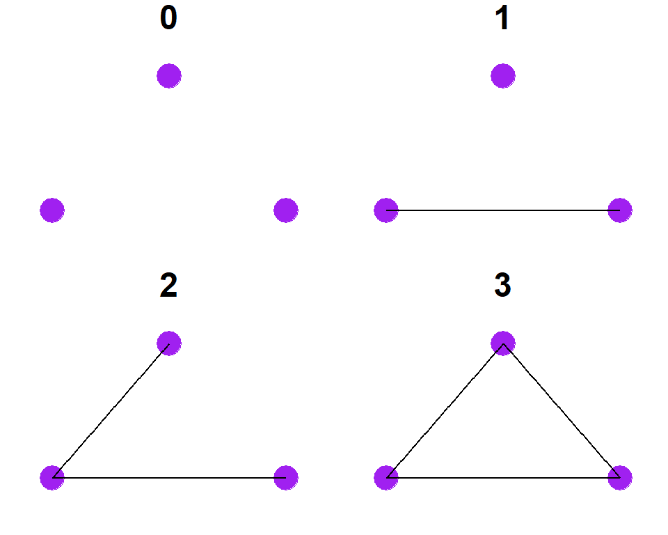
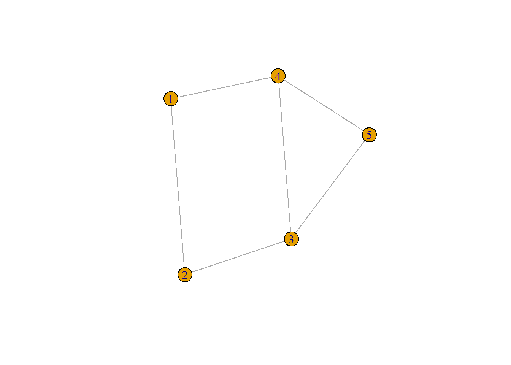
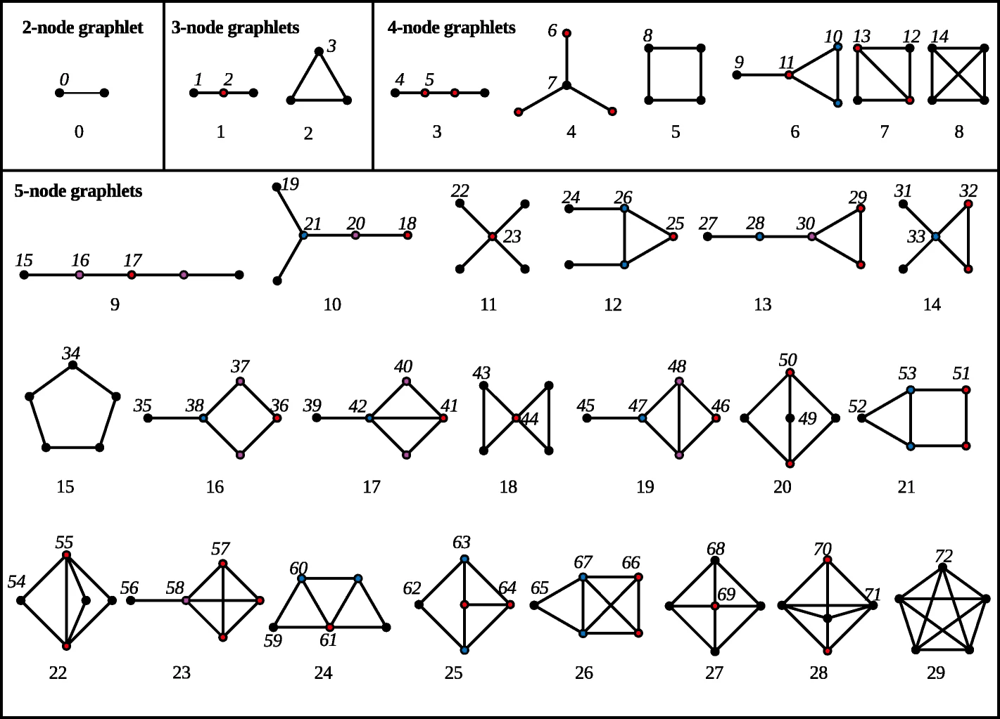

# Comparing Networks{#ComparingNetworks}

{width=100%}

How can we systematically and quantitatively compare network configurations and node/edge structural positions? Can we compare networks even if they represent different kinds of phenomena and have vastly different numbers of nodes and edges? What are the best metrics to use in our comparisons (i.e., graph level vs. node/edge level metrics)? Can we capture both global network properties and local structures in our comparisons? These have all been common questions in the world of network research in recent years. This is not surprising as one of the most exciting aspects of networks in general is the realization that many networked systems share common properties and dynamics despite representing wholly different kinds of relations and social or biological systems. Identifying and specifying the relative similarity or distance among different networks, thus, would likely get us quite far.

There has been increased interest in developing models for directly comparing networks in recent years (see Tantardini et al. 2019). This work is quite variable but can generally be grouped into two sets of approaches:

* **Known Node Correspondence** - Methods focused on comparing network configurations which share a common set of nodes (or at least have a sub-set of nodes in common). 
* **Unknown Node Correspondence** - Methods focused on comparing networks represented by different sets of nodes, which can differ dramatically in size, content, and the nature of ties.

There are lots of methods out there for both approaches and importantly, there has been considerable methodological work focused on these methods to identify which work best for characterizing and comparing important dimensions of network variability in different contexts (e.g., Milenković and Pržulj 2008; Milenković et al. 2010; Pržulj 2007; Tantardini et al. 2019; Trpevski et al. 2016; Yaveroğlu et al. 2014). In this section, we briefly explore both "known node correspondence (KNC)" and "unknown node correspondence (UNC)" methods (borrowing the useful terminology of Tantardini et al. 2019) and the potential utility of such approaches for archaeological network research.

<div class="rmdnote">
<p>Many of the methods outlined in this section are fairly
computationally intensive and involve iterative calculations that scale
rapidly in complexity with the size of the networks involved. Although
there are implementations of many of these methods in R, other analyses
are more efficient or more readily available in Python or other
languages. Do not fear! R-Studio has has the built-in ability to run
Python scripts and to use Python libraries and we show how this works in
the examples below. Using a package called <code>reticulate</code> it is
relatively easy to move back and forth between R and Python.</p>
</div>
{width=80%}

## Known Node Correspondence Methods{#KnownNode}

In this section, we outline potential analytical approaches we can take when our networks share the same nodes or when they have a substantial sub-set of nodes in common. Approaches in this vein are frequently used for comparing different layers of multi-layer networks or different temporal slices of dynamic networks. As both of these kinds of data are common in archaeology these methods likely have much to offer. 

### Direct Comparison of Adjacency Matrices{#CompareAdjacencyMatrices}

The simplest approach to comparing networks with a common set of nodes is to simply directly evaluate differences in the underlying adjacency matrices. For example, you can simply take the absolute difference of one matrix from the other and then normalize it based on some distance metric. Importantly this simple approach works on both simple binary networks, directed networks, as well as weighted networks.

For the example here we will use three time slices of a ceramic similarity network from the [Southwest Social Networks Project](#SWSN) San Pedro region dating to AD1250-1300, AD1300-1350, and AD1350-1400 respectively. Each network object is named based on the first year in the 50 year interval it represents. These network slices have nodes in common but the nodes present in each interval are not identical. Thus, we first create a function below called `network_subset_common` which requires two network objects and the name attribute and outputs a list with two networks that include only those nodes where the two overlap. Let's start by importing the data and finding the common networks for every combination of the three time slices. Our output objects are named `net` followed by the year indicating the first 50 year interval included, then `_`, and then the year indicating the second 50 year interval. Here we make lists for both the consecutive intervals and the non-consecutive intervals. Download the [data here](data/SanPedro_nets.Rdata) to follow along:


```r
library(statnet)
```

```
##                Installed ReposVer Built  
## ergm           "4.3.2"   "4.4.0"  "4.2.2"
## network        "1.18.0"  "1.18.1" "4.2.2"
## sna            "2.7"     "2.7-1"  "4.2.0"
## statnet.common "4.7.0"   "4.8.0"  "4.2.1"
```

```r
load("data/SanPedro_nets.Rdata")

network_subset_common <-
  function(net1, net2, namevar = "vertex.names") {
    net1_names <-
      network::get.vertex.attribute(net1, attrname = namevar)
    net2_names <-
      network::get.vertex.attribute(net2, attrname = namevar)
    common_names <- net1_names[which(net1_names %in% net2_names)]
    out1 <- net1 %s% which(net1 %v% namevar %in% common_names)
    out2 <- net2 %s% which(net2 %v% namevar %in% common_names)
    return(list(out1, out2))
  }

net1250_1300 <-
  network_subset_common(AD1250net, AD1300net, namevar = "vertex.names")
net1300_1350 <-
  network_subset_common(AD1300net, AD1350net, namevar = "vertex.names")
net1250_1350 <-
  network_subset_common(AD1250net, AD1350net, namevar = "vertex.names")
```

In order to make comparisons, we next extract the adjacency matrices from the network list objects of interest. Let's start by comparing AD1250-1300 and AD1300-1350. First we extract the matrices:


```r
net1 <- as.matrix(net1250_1300[[1]])
net2 <- as.matrix(net1250_1300[[2]])
```

Next, we find the absolute value of the difference between these two adjacency matrices:


```r
net_diff <- abs(net1-net2)

# Let's look at the first 4 rows and columns
net_diff[1:4, 1:4]
```

```
##               Artifact Hill Ash Terrace Bayless Ruin Big Bell
## Artifact Hill             0           1            0        0
## Ash Terrace               1           0            0        0
## Bayless Ruin              0           0            0        0
## Big Bell                  0           0            0        0
```

Now we can simply identify the number and proportion of edges that differ between the two adjacency matrices. This metric can be formally defined as:

$$S = 1- \frac{\Sigma | A^1_{ij} - A^2_{ij}|}{n(n-1)}$$

where

* $A^1_{ij}$ and $A^2_{ij}$ are the adjacency matrices with identical sets of nodes.
* $n$ is the number of nodes

Let's take a look using the matrices we created above:


```r
1 - (sum(net_diff) / (nrow(net_diff) * (nrow(net_diff) - 1)))
```

```
## [1] 0.8205128
```

So this number let's us know that the proportion of ties in common between our two networks is `0.82`.

We can roll this whole process into a function for ease of use. The function we use here expects two adjacency matrices with the same node set.


```r
adjacency_compare <- function(net1, net2) {
  net_diff <- abs(net1 - net2)
  out <-
    1 - (sum(net_diff) / (nrow(net_diff) * (nrow(net_diff) - 1)))
  return(out)
}

# Run function for comparing AD1300-1350 to AD1350-1400
adjacency_compare(as.matrix(net1300_1350[[1]]),
                  as.matrix(net1300_1350[[2]]))
```

```
## [1] 0.625731
```

```r
# Run function for comparing AD1250-1300 and AD1350-1400
adjacency_compare(as.matrix(net1250_1350[[1]]),
                  as.matrix(net1250_1350[[2]]))
```

```
## [1] 0.474359
```

As these results show, our comparison between AD1250-1300 and AD1300-1350 showed the most overlap, followed by the AD1300-1350 and AD1350-1400 interval with an overlap of `0.63` and then finally our non-sequential comparison between AD1250-1300 and AD1350-1400 with an overlap of `0.47`.

This procedure also works on weighted networks, directed networks, or any other form of one-mode network. In the next chunk of code we create two random weighted networks, convert them to adjacency matrices and then compare them using our function:


```r
library(igraph)
set.seed(3464)
rnet1 <- erdos.renyi.game(n = 40, p.or.m = runif(1))
E(rnet1)$weight <- sample(1:5, ecount(rnet1), replace = TRUE)

rnet2 <- erdos.renyi.game(n = 40, p.or.m = runif(1))
E(rnet2)$weight <- sample(1:5, ecount(rnet2), replace = TRUE)

par(mfrow=c(1,2))
plot(rnet1)
plot(rnet2)
```



```r
par(mfrow=c(1,1))

ra1 <- as_adjacency_matrix(rnet1, sparse = FALSE)
ra2 <- as_adjacency_matrix(rnet2, sparse = FALSE)

adjacency_compare(ra1, ra2)
```

```
## [1] 0.5051282
```

This basic adjacency matrix comparison approach can help us get a sense of how similar or different our networks are but it does not account for the direction of difference nor does it provide a means for interpreting that difference in relation to network structure. As we will see, the examples below extend this basic approach in several ways that allow us to consider such features of our network data.

### Quadratic Assignment Procedure{#QAP}

The quadratic assignment procedure (QAP) is a method for evaluating network correlations or other network metrics among two networks with the same node-set using Monte Carlo simulation methods. In R, the QAP function and test are available in the `statnet` package through a function called `qaptest`. 

Using the lists of network objects with same node-set we defined in the last example, we can make further assessments of the similarity between them using the `gcor` or graph correlation function in the `sna` package. This function gives a number between -1 and 1 which indicates the degree and direction of similarity in edges between the two networks. If the two networks have all present and absent edges in common, they would get a value of 1 and if absence and presence are reversed (all active edges in net1 are inactive in net2 and all inactive edges in net1 are active in net2) they would get a value of -1.


```r
gcor(net1250_1300)[[2]]
```

```
## [1] 0.6266283
```

```r
gcor(net1300_1350)[[2]]
```

```
## [1] 0.3873585
```

```r
gcor(net1250_1350)[[2]]
```

```
## [1] 0.2070197
```

As the results here show, AD1250-1300 and AD1300-1350 are reasonably similar with a graph correlation of `0.63` and AD1300-1350 and AD1350-1400 is less similar with a correlation of `0.39`. When we compare the non-sequential intervals AD1250-1300 and AD1350-1400 we see even lower similarity at `0.21`. Notably all values are positive. The question that remains, however, is how we might interpret these values. For example, if we had two nearly complete or nearly empty networks we could potentially get a high graph correlation by chance. The QAP test is designed to deal specifically with this issue.

The QAP test creates a large number of random versions of the two imported network objects (by randomly switching node label assignments while keeping the same network structure) and then calculates the graph correlation (or some other graph level function) between the random versions of the networks for every simulation (the number of simulations is set to 1000 by default). The logic behind this is that if randomly shuffling of the network labels generated new networks that frequently produced graph correlation values as high or higher than the observed, that would suggest that the correlation between our observed networks could be easily generated by chance given network size and density. If, on the other hand, few or no random network label shufflings produced correlations as high and higher than the observed correlation, that could be used to reject the null hypothesis that the relationship between our graphs is random.

Let's give it a shot for all three comparisons and then discuss the results:


```r
set.seed(43673)

qap1250_1300 <- qaptest(net1250_1300, gcor, g1 = 1, g2 = 2)
qap1250_1300
```

```
## 
## QAP Test Results
## 
## Estimated p-values:
## 	p(f(perm) >= f(d)): 0 
## 	p(f(perm) <= f(d)): 1
```

```r
qap1300_1350 <- qaptest(net1300_1350, gcor, g1 = 1, g2 = 2)
qap1300_1350
```

```
## 
## QAP Test Results
## 
## Estimated p-values:
## 	p(f(perm) >= f(d)): 0.001 
## 	p(f(perm) <= f(d)): 1
```

```r
qap1250_1350 <- qaptest(net1250_1350, gcor, g1 = 1, g2 = 2)
qap1250_1350
```

```
## 
## QAP Test Results
## 
## Estimated p-values:
## 	p(f(perm) >= f(d)): 0.093 
## 	p(f(perm) <= f(d)): 0.967
```

The value we're most interested in here is the top p-value which is the simulated probability of obtaining a correlation as high or higher than the observed from randomly shuffled versions of our network. The first two comparisons for temporally sequenced periods both show simulated p-values at or near `0` suggesting that there is a low probability of obtaining correlations as high as the observed in shuffled networks. For the comparison between the non-consecutive AD1250-1300 and AD1350-1400 intervals, however, we get a considerably higher probability with `p = 0.093`. Our results indicate that in 93 of the 1000 random network label shuffles a correlation value as high or higher than the observed was recorded. In light of this we would probably not put much weight behind the correlation between those periods. As the function documentation suggests, QAP results should not be interpreted as indicative of underlying structural differences between networks, but instead simply differences in a particular node labeling schema controlling for structural differences (as only labels are shuffled and not actual network structures).

Finally, we can plot a visualization of the QAP test which provides a density plot of the correlation values produced in each random replication along with a dotted line representing the observed value:


```r
plot(qap1250_1300, xlim = c(-1, 1))
```


```r
plot(qap1300_1350, xlim = c(-1, 1))
```


```r
plot(qap1250_1350, xlim = c(-1, 1))
```


QAP is potentially useful for identifying whether or not a given similarity or other graph level metric between two graphs is statistically significant, but there are also problems with this method in that results can also vary in relation to the size and topological nature of the networks in question (see Anderson et al. 1999).

### DeltaCon{#DeltaCon}

Another method for comparing networks with a common node-set that has more recently gained popularity is the DeltaCon approach (Koutra et al. 2016). This method is similar to the direct comparison of adjacency matrices except that it is based on the commonality in paths between networks rather than just specific edges. The underlying assumption here is that simply matching first degree connections doesn't capture the true similarities and differences in networks and capturing paths of various lengths will likely provide a better assessment of structural similarities and differences among networks. Much like the adjacency matrix methods above DeltaCon ranges from 0 to 1 and provides and indication of the strength of association between the two networks.

The analytical details and justification of DeltaCon are beyond the scope of this guide and we direct you [to the original paper](https://dl.acm.org/doi/abs/10.1145/2824443) where this method was defined for more details. Luckily, GitHub user [Baoxu "Dash" Shi](https://github.com/bxshi) has already created an R function to calculate DeltaCon that is [available here](https://github.com/bxshi/rdsg). We have ported that function into a script and simplified it somewhat in this repository and use that simplified version here. Note that this function relies on three packages which must be installed to use this function: `Matrix`, `SparseM`, and `pracma`.

This function expects two numeric edge lists representing networks with the same node set and you also must indicate the number of nodes in each (so that unconnected nodes/isolates can also be considered). Let's give this a try with the same San Pedro network data we imported above. [Click here](scripts/delta_con.R) to download our modified version of the script used here. The input expected is two matrix objects in the form of an adjaency matrix with the same set of nodes:


```r
source("scripts/delta_con.R")

el1 <- as.matrix(net1250_1300[[1]])
el2 <- as.matrix(net1250_1300[[2]])

delta_con(el1, el2)
```

```
## [1] 0.8639706
```

We get a value of `0.86` which is just a little higher than our adjacency matrix comparison. Now let's try it for the other interval comparisons:


```r
el1 <- as.matrix(net1300_1350[[1]])
el2 <- as.matrix(net1300_1350[[2]])

delta_con(el1, el2)
```

```
## [1] 0.6645235
```

```r
el1 <- as.matrix(net1250_1350[[1]])
el2 <- as.matrix(net1250_1350[[2]])

delta_con(el1, el2)
```

```
## [1] 0.6992425
```

Interestingly, when we compare these results to the simple adjacency matrix comparison above we see some pretty big differences. In the adjacency matrix comparison the non-consecutive intervals were the least similar of the three comparisons with an overlap proportion of about `0.47`. Here the DeltaCon for that comparison is actually higher than that for the AD1300-1350 and AD1350-1400 comparison. This suggests that, although there may be first order differences in nodes between the non-sequential networks, there are perhaps slightly greater similarities in longer paths between the two. This example illustrates how making multiple comparisons with different approaches can sometimes reveal unexpected insights.


## Unknown Node Correspondence{#UnknownNode}

Although methods for comparing networks with a common node-set are useful, perhaps the more common use case for network comparison considers networks that do not have the same nodes or even the same size. Indeed, network analysts are frequently interested in characterizing the similarity and differences among networks that have entirely different sources (for example, comparing road networks to the internet). There are a variety of methods designed for this use case and here we highlight a few of the most useful drawing on the methodological comparison of methods presented by [Tantardini et al. 2019](https://www.nature.com/articles/s41598-019-53708-y#Sec2). Many of the methods outlined by Tantardini and colleagues are available in R but even more are available in Python and anyone considering seriously investigating these approaches for archaeological data would probably want to use Python (we show how you can use Python within R-Studio below).

### Comparing Network Global and Local Statistics{#ComparingStatistics}

Perhaps the simplest and most common means for comparing networks is to simply compare different network metrics and properties of those networks (standardized by network size or type). For example, we could calculate the density of two networks and compare the values and get some sense of how they relate (at least in terms of that one feature). Alternatively, we could calculate node or edge based metrics like centrality and then compare the resulting distributions. We have already shown several examples of this type of comparison in the Exploratory Network Analysis section of this document with our [Roman Roads Case Study](#ExploratoryRomanRoads). In that example, we happened to be using three networks with the same node-set but this is certainly not required. 

In the chunk of code below we reproduce our `net_stats` function for calculating a range of network metrics from the [Exploratory 
Network Analysis](#Exploratory) section and then calculate those stats for our San Pedro time-slice networks.


```r
library(igraph)

net_stats <- function(net) {
  out <- matrix(NA, 10, 2)
  out[, 1] <- c("Nodes", "Edges", "Isolates", "Density", "Average Degree",
               "Average Shortest Path", "Diamater",
               "Clustering Coefficient", "Closed Triad Count",
               "Open Triad Count")
  # number of nodes
  out[1, 2] <- vcount(net)
  # number of edges
  out[2, 2] <- ecount(net)
  # number of isolates
  out[3, 2] <- sum(igraph::degree(net) == 0)
  # network density rounding to the third digit
  out[4, 2] <- round(edge_density(net), 3)
  # mean degree rounding to the third digit
  out[5, 2] <- round(mean(igraph::degree(net)), 3)
  # mean shortest path length rounding to the third digit
  out[6, 2] <- round(igraph::mean_distance(net), 3)
  # network diameter
  out[7, 2] <- igraph::diameter(net)
  # average global transitivity rounding to the third digit
  out[8, 2] <- round(igraph::transitivity(net, type = "average"), 3)
  # closed triads in triad_census
  out[9, 2] <- igraph::triad_census(net)[16]
  # open triads in triad_census
  out[10, 2] <- igraph::triad_census(net)[11]
return(out)
}
```


Since our San Pedro networks are `network` format objects we use the `intergraph` package to convert them to the `igraph` objects this function expects.


```r
library(intergraph)

ns1 <- net_stats(asIgraph(AD1250net))
ns2 <- net_stats(asIgraph(AD1300net))
ns3 <- net_stats(asIgraph(AD1350net))

ns_res <- cbind(ns1, ns2[, 2], ns3[, 2])
colnames(ns_res) <- c("Measure", "AD1250-1300", "AD1300-1350",
                      "AD1350-1400")

knitr::kable(ns_res, format = "html")
```

<table>
 <thead>
  <tr>
   <th style="text-align:left;"> Measure </th>
   <th style="text-align:left;"> AD1250-1300 </th>
   <th style="text-align:left;"> AD1300-1350 </th>
   <th style="text-align:left;"> AD1350-1400 </th>
  </tr>
 </thead>
<tbody>
  <tr>
   <td style="text-align:left;"> Nodes </td>
   <td style="text-align:left;"> 13 </td>
   <td style="text-align:left;"> 21 </td>
   <td style="text-align:left;"> 20 </td>
  </tr>
  <tr>
   <td style="text-align:left;"> Edges </td>
   <td style="text-align:left;"> 26 </td>
   <td style="text-align:left;"> 89 </td>
   <td style="text-align:left;"> 165 </td>
  </tr>
  <tr>
   <td style="text-align:left;"> Isolates </td>
   <td style="text-align:left;"> 0 </td>
   <td style="text-align:left;"> 0 </td>
   <td style="text-align:left;"> 0 </td>
  </tr>
  <tr>
   <td style="text-align:left;"> Density </td>
   <td style="text-align:left;"> 0.333 </td>
   <td style="text-align:left;"> 0.424 </td>
   <td style="text-align:left;"> 0.868 </td>
  </tr>
  <tr>
   <td style="text-align:left;"> Average Degree </td>
   <td style="text-align:left;"> 4 </td>
   <td style="text-align:left;"> 8.476 </td>
   <td style="text-align:left;"> 16.5 </td>
  </tr>
  <tr>
   <td style="text-align:left;"> Average Shortest Path </td>
   <td style="text-align:left;"> 1.554 </td>
   <td style="text-align:left;"> 1.971 </td>
   <td style="text-align:left;"> 1.132 </td>
  </tr>
  <tr>
   <td style="text-align:left;"> Diamater </td>
   <td style="text-align:left;"> 3 </td>
   <td style="text-align:left;"> 5 </td>
   <td style="text-align:left;"> 2 </td>
  </tr>
  <tr>
   <td style="text-align:left;"> Clustering Coefficient </td>
   <td style="text-align:left;"> 0.832 </td>
   <td style="text-align:left;"> 0.848 </td>
   <td style="text-align:left;"> 0.96 </td>
  </tr>
  <tr>
   <td style="text-align:left;"> Closed Triad Count </td>
   <td style="text-align:left;"> 23 </td>
   <td style="text-align:left;"> 247 </td>
   <td style="text-align:left;"> 855 </td>
  </tr>
  <tr>
   <td style="text-align:left;"> Open Triad Count </td>
   <td style="text-align:left;"> 39 </td>
   <td style="text-align:left;"> 119 </td>
   <td style="text-align:left;"> 128 </td>
  </tr>
</tbody>
</table>

Data like this can be useful for making general comparisons of networks. For example, we can see major differences in density among our time periods. Further the ratio of open to closed triads differs dramatically through time. 

Another simple approach that is frequently used for comparing networks is to compare distributions of node or edge level statistics. For example, we can compare degree distributions among our networks here using simple histogram visuals:


```r
hist(
  sna::degree(AD1250net, rescale = TRUE),
  main = "AD1250-1300",
  xlab = "Degree"
)
```


```r
hist(
  sna::degree(AD1300net, rescale = TRUE),
  main = "AD1300-1350",
  xlab = "Degree"
)
```



```r
hist(
  sna::degree(AD1350net, rescale = TRUE),
  main = "AD1350-1400",
  xlab = "Degree"
)
```


A quick glance at these three plots shows that the degree distributions differ in magnitude and the direction of skew among our three intervals. We could take this further by examining features of these distributions in detail and this may provide additional information about differences in the network structures and potential generative processes.

Simple comparisons like those shown here are often a good first step, but it can be difficult to know what to make of differences in such metrics or distributions. In the next several examples, we present approaches that are designed to provide information to help put such single metric/feature comparisons in context.

### Graph Kernel Methods{#NetworkKernel}

A network (or graph) kernel is a function that measures the similarity of a pair of networks based on comparisons of vectors representing specific features of those networks. In practice this represents an inner product of two vectors representing some relevant feature (in a single dimension) of those networks. To explain how this works let's consider a hypothetical example where we want to compare a set of books on various topics to determine how similar each book is to all the other books. Say we have these books as digital text files and we have not previously read them. How might we begin? One relatively simple approach (simple for a computer at least) would be to tabulate all of the words in each book and then compare the frequency distributions of each book to all the others. This is the so-called "bag of words" approach  where similarities in books are defined not by the structure of the content but simply by the overlap in word frequency. Two books on fishing are more likely to have more words in common than a book on fishing and another on nuclear physics. We can extend this same general line of thinking to networks to create a "bag of graphs" representation of the underlying network which provide vectors for comparison (see Silva et al. 2018).

Let's start with a relatively simple example. Let's say we are interested in defining a kernel for comparing two networks based on their "graphlet" representation. A graphlet is simply a set of possible configurations that a set of nodes can take for a given $k$ number of nodes. For example, for 3 nodes the following graphlets are possible configurations:


So for two graphs, we could then compare the number of times each of these configurations appears. Let's make a couple of small random graphs and try it out:


```r
set.seed(4354)
g1 <- erdos.renyi.game(6, 0.6)
g2 <- erdos.renyi.game(5, 0.4)

plot(g1)
```



```r
plot(g2)
```



Now we can tabulate the number of graphets of each configuration from 0 to 3 as denoted above for each graph as a vector:

$$\begin{aligned}
f_{G1} =& (0, 4, 8, 8) \\
f_{G2} =& (0, 3, 6, 1)
\end{aligned}$$

Now we further need to account for the size of each network and the number of graphlets so we can divide the graphlet counts but total number of graphlets in each network:

$$\begin{aligned}
f_{G1} =& (0, 4, 8, 8) / 20 = (0, 0.2, 0.4, 0.4) \\
f_{G2} =& (0, 3, 6, 1) / 10 = (0, 0.3, 0.6, 0.1)
\end{aligned}$$

Now to create we can create a kernel describing the relationship between these two graphs by calculating the inner product of the transpose of the vector for the first graph by the vector of the second graph:

$$K(G1,G2) = F_{G1}^T \cdot F_{G2} = 0.34$$


```r
fg1 <- c(0, 4, 8, 8)
fg1 <- fg1 / sum(fg1)

fg2 <- c(0, 3, 6, 1)
fg2 <- fg2 / sum(fg2)

t(fg1) %*% fg2
```

```
##      [,1]
## [1,] 0.34
```

So in this case our returned value is `0.34` for graphlet kernel $k=3$.

There are many other kinds of kernels that can be calculated on such networks. For example, we can calculate a shortest path kernel which determines how many shortest paths of length 1 through the diameter of the network (standardized for the total number of shortest paths possible) for both networks. Further, we could create a random walk kernel by generating a number of random walks on both networks simultaneously and then quantifying the number of matching walks. There are many different types of kernels that can be calculated in networks and the details of these are described elsewhere (see Ghosh et al. 2018).

<div class="rmdnote">
<p>The package <code>graphkernels</code> provides a set of 14 graph
kernel calculation methods that can be calculated for both R and Python.
This package works using <code>igraph</code> network objects and expects
a list of networks grouped in a single object. We use the R
implementation in our example here.</p>
</div>

In the chunk of code below, we convert our San Pedro `network` objects into the `igraph` network format and then calculate graphlet kernel for $k=3$, a random walk kernel, and finally a shortest path kernel. The results are provided as a symmetric matrix and we can evaluate comparisons between networks by looking at the row and column corresponding to the item number in the list provided to the function. The values are in terms of whatever measure is provide (e.g., number or length of random walks, proportional overlap of graphlets, etc.) but in general, larger numbers indicate greater similarity between networks for a given feature.

Let's give it a try:


```r
library(graphkernels)
library(intergraph)
g <- list(asIgraph(AD1250net), asIgraph(AD1300net), asIgraph(AD1350net))

k_graphlet <- CalculateGraphletKernel(g, par = 3)

k_rw <- CalculateGeometricRandomWalkKernel(g, par = 0.00001)

k_sp <- CalculateShortestPathKernel(g)

out <- matrix(NA, nrow = 3, ncol = 3)

out[1, 1] <- k_graphlet[1, 2]
out[2, 1] <- k_graphlet[2, 3]
out[3, 1] <- k_graphlet[1, 3]

out[1, 2] <- k_rw[1, 2]
out[2, 2] <- k_rw[2, 3]
out[3, 2] <- k_rw[1, 3]

out[1, 3] <- k_sp[1, 2]
out[2, 3] <- k_sp[2, 3]
out[3, 3] <- k_sp[1, 3]

row.names(out) <-
  c("AD1200-1250, 1300-1350",
    "AD1300-1350, 1350-1400",
    "AD1250-1300, 1350-1400")
colnames(out) <- c("graphlets", "random walks", "shortest paths")

knitr::kable(out, "html")
```

<table>
 <thead>
  <tr>
   <th style="text-align:left;">   </th>
   <th style="text-align:right;"> graphlets </th>
   <th style="text-align:right;"> random walks </th>
   <th style="text-align:right;"> shortest paths </th>
  </tr>
 </thead>
<tbody>
  <tr>
   <td style="text-align:left;"> AD1200-1250, 1300-1350 </td>
   <td style="text-align:right;"> 0.3436301 </td>
   <td style="text-align:right;"> 273.0926 </td>
   <td style="text-align:right;"> 9256 </td>
  </tr>
  <tr>
   <td style="text-align:left;"> AD1300-1350, 1350-1400 </td>
   <td style="text-align:right;"> 0.2206312 </td>
   <td style="text-align:right;"> 420.5885 </td>
   <td style="text-align:right;"> 58740 </td>
  </tr>
  <tr>
   <td style="text-align:left;"> AD1250-1300, 1350-1400 </td>
   <td style="text-align:right;"> 0.1412342 </td>
   <td style="text-align:right;"> 260.1718 </td>
   <td style="text-align:right;"> 17160 </td>
  </tr>
</tbody>
</table>

As these results above show, the rank-order of kernel values for different metrics are not the same, despite using the same networks. As this illustrates, a single graph kernel doesn't typically paint the whole picture and graphs can be similar in some features and not others. There are many more graph kernel methods available and it would likely be profitable for archaeological network analysts to explore these methods in greater detail.

### Spectral Methods{#SpectralMethods}

A network *spectrum* is a complex set of functions based on *eigenvalues* of a network that describe the structural properties of that network in $n$ or fewer dimensions when $n$ is the number of nodes in that network. Many approaches to network comparison rely on network *spectra*. In short you can think of a *spectrum* as a set of values that describe the relationships in a network based on linear transformations of the underlying adjacency matrix and those can be compared between different networks. A full explanation of eigenvectors and eigenvalues is beyond the scope of this document ([but check here for a good video explanation](https://www.youtube.com/watch?v=PFDu9oVAE-g)) but in short, eigenvectors ($\overrightarrow v$) and eigenvalues ($\lambda$) for an adjacency matrix ($A$) satisfy the following equation:

$$\begin{aligned}
A \overrightarrow v = &  \lambda \overrightarrow v \\
A \overrightarrow v - \lambda \overrightarrow v =  &  0
\end{aligned}$$

That is, the adjacency matrix multiplied by the eigenvector is equal to the eigenvalue multiplied by the same eigenvector. In two dimensions, we can visualize how this might work by imagining that we stretch or shear an image in a particular direction and evaluate the outcome for specific vectors along that image. In the Mona Lisa example below when we apply a shearing transformation to the famous painting, points along the red axis are no longer along the same directional vector after the transformation. Points along the blue axis, however, are still exactly where they were before the transformation. Thus, the blue vector is an *eigenvector*. In this case we have not re-scaled the image so points along the blue vector are in the same place in both images. Thus, our *eigenvalue* would be 1. If we had sheared the pictures as we see here but also scaled the picture by a factor of 2 our *eigenvalue* for the blue vector would be 2 meaning that if a particular pixel was on the point (0,1) in the first image it would be on the point (0,2) in the sheared and scaled image.

{width=100%}

If we want to extend this to three dimensional space we could imagine rotating a cube in some direction around some random axis. If we think of every point within that cube as having coordinates in 3D space, the only points that will remain along the same vector same after the rotation are those that fall along the axis of rotation. That would be the eigenvector of that transformation. If we were to expand or shrink the shape while making this rotation, the scaling factor would represent the eigenvalue. 

When we apply this same approach to a larger n-dimensional space like an adjacency matrix representing $n$ nodes it becomes a bit harder to visualize but the underlying principle is the same. The set of all eigenvalues (which is of length $n$ for an $n$ x $n$ adjacency matrix) ordered from largest to smallest is the *spectrum* of that matrix. Once we have these in hand for two graphs, we can simply find the Euclidean distance between them as:

$$d(G_1,G_2) = \sqrt{\Sigma_i(s_i^{(1)}-s_i^{(2)})^2} $$

where

* $s_i^{(1)}$ is the spectrum for graph 1 ($G_1$) ordered from largest to smallest
* $s_i^{(2)}$ is the spectrum for graph 2 ($G_2$) ordered from longest to smallest.

If one spectrum vector is longer than the other the vector can be padded with zeros while maintaining the ordering.

Spectral comparisons are useful for comparing graphs of different sizes but there are some issues including the fact that different graphs can have the same spectra and small changes in graph structure can sometimes result in large changes in spectra. Despite these potential problems these methods are still common, especially for comparisons of large graphs as they can be calculated efficiently.

To take this one step further, many graph-based spectral comparison methods are not based on the adjacency matrix directly, but instead further derivations of that matrix that highlight special features. For example, many methods are based on what is called the Laplacian matrix. A Laplacian matrix is the degree matrix of a graph minus the adjacency matrix of the same graph. The degree matrix is defined as a $n$ x $n$ matrix where all entries outside of the diagonal are 0 and the values along the diagonal represent the degree of the network for each node. The same methods described above can be used to find eigenvector and eigenvalues of a Laplacian matrix by simply replacing that matrix for the adjacency matrix ($A$) in the equation above.

There are a few existing packages out there that allow for assessments of spectral-based graph comparisons. We have found many of the most useful and efficient to be limited to Python rather than R. Thus, we take this an an opportunity to explore how Python scripts can be used within R-Studio and using R objects using the package called `reticulate`.

<div class="rmdnote">
<p>The R package <code>reticulate</code> is designed to help you move
objects and functions back and forth between R and Python environments
on your computer. In order to use <code>reticulate</code> you need to
install the R package and also install an instance of Python &gt;= 3.8
on your computer. The easiest way to install Python on your machine if
you don’t already have it is to use the
<code>reticulate::install_miniconda()</code> right in your R console. <a
href="https://rstudio.github.io/reticulate/">Check here for more
details</a>.</p>
</div>

Let's first initialize the `reticulate` package:


```r
library(reticulate)
```

At this point install Python if you have not already done that using the `reticulate::install_miniconda()` command. Once Python in installed you will then need to install a Python package called [NetLSD (Network Laplacian Spectral Descriptors)](https://github.com/xgfs/NetLSD). The easiest way to do this is to click on the "Terminal" panel in your R-Studio instance and then type the following command directly at the terminal (you only need to do this once in an instance of R-Studio):


```python
pip install netlsd
```

If all goes well, that will install the NetLSD Python package in the instance of Python associated with your R-Studio installation and then you call Python commands either directly from the terminal or using special functions built into the `reticulate` package. This is a package that calculates spectral distance between networks using a version of the Laplacian matrix described above to define eigenvalues for each graph.

First, let's create a few network objects in R that we can use in a Python environment. In this case we need adjacency matrices for the NetLSD package:


```r
g1 <- as.matrix(AD1250net)
g2 <- as.matrix(AD1300net)
g3 <- as.matrix(AD1350net)
```

<div class="rmdtip">
<p>In any R Markdown document in R-Studio you can create a block and
specify it as Python code by simply changing the initial <code>r</code>
inside the <code>{r}</code> to <code>{python}</code>.</p>
</div>

Now that we've created our objects in R, we can run our functions in Python. The following chunk of code is actually in Python rather than R although it looks relatively similar. The first few lines consist of import commands which tell Python to initialize the required packages we will use (this is much like the `library()` function in R).

Next, we create Python objects from our R objects. Any object that is in the R global environment can be called within Python in R-Studio by using the prefix `r.` before the name of the object. In the code below, we define a Python object called `graph1` that is based on the R object called `g1` using the `r.g1` command.

The next line of codes represent functions that are within the Python package we installed. First we call a function called `heat` within the `netlsd` package by adding `netlst.heat()` and then providing the object to which this function should be calculated in the parentheses. Next we then calculate the Laplacian spectral distance between two graphs using a function in the `numpy` package (which we imported with the shortened name `np`) by typing `np.linalg.norm`. Just like in R, we can assign the result to an object and then type the name of that object to report the output on the screen.


```
## [1] TRUE
```

```
## [1] TRUE
```


```python

import netlsd
import numpy as np

graph1 = r.g1
graph2 = r.g2
graph3 = r.g3

desc1 = netlsd.heat(graph1)
desc2 = netlsd.heat(graph2)
desc3 = netlsd.heat(graph3)

distance1_2 = np.linalg.norm(desc1 - desc2) 
distance1_2
```

```
## 0.9955321810540247
```

```python
distance2_3 = np.linalg.norm(desc2 - desc3) 
distance2_3
```

```
## 0.25685544386678594
```

```python
distance1_3 = np.linalg.norm(desc1 - desc3) 
distance1_3
```

```
## 1.1791128279165433
```

The results above show the Laplacian spectral distance between our three temporal networks. Smaller numbers indicate less distance and these numbers are not bounded on the upper end. Our results here show that the distance between AD1300-1350 and AD1350-1400 is the smallest (meaning those graphs are most similar by this measure) and the comparison between non-consecutive intervals is the greatest. 

The advantage of this spectral method is that is a comparison of a summary of the overall structural properties of a network rather than a particular feature as we saw with the graph kernel methods.

Importantly, this metric could also be used to compare graphs that differ dramatically in size and scale as well. In the next chunk of code we import the `networkx` package as `nx` and then create a random graph with 1000 nodes using the Barabasi-Albert algorithm. We then compare that to our original 13 node network from AD1250-1300 to show how we can compare networks of dramatically different sizes. Note that all eigenvalues after the first 13 for the San Pedro network will be defined as 0.


```python
import networkx
import netlsd

# create a random graph with 1000 nodes
g4 = networkx.barabasi_albert_graph(1000, m = 20, seed = 13) 
desc4 = netlsd.heat(g4)

distance_new = np.linalg.norm(desc1 - desc4) 
distance_new
```

```
## 1.6540273254767195
```

We have certainly not exhausted the possibilities for spectral graph comparison here. In particular, it is currently unclear how such network summaries work for networks with features like common archaeological networks (for example, similarity networks with very high degrees of closure). As spectral methods perform differently for networks with different structural tendencies, such evaluation of archaeological networks with this in mind would be useful.


### Portrait Divergence{#PortraitDivergence}

Another recently developed method which attempts to provide an overall metric of network relationships is referred to as the *portrait divergence* approach (Bagrow et al. 2018). This approach defines divergence among two networks of non-overlapping nodes based on the distribution of shortest path lengths in the network. Specifically, this method creates a network "portrait" which is a matrix $B_{lk}$ where $l$ is an integer vector from $0$ to the network diameter $d$ and $k$ is a vector from $0$ to $N-1$ where $N$ is the number of nodes with $k$ shortest path at each distance $l$. This metric can also be used for weighted and directed networks. Using this matrix $B_{lk}$ portrait divergence is defined as:

$$P(k,l) = P(k|l)P(l) = \frac {1}{N}B_{lk} \frac {1}{\Sigma_c n^2_c}\Sigma_k k'B_{lk'}$$

where 

* $P(k,l)$ is the probability of choosing two nodes at random at distance $l$ and for one of the two nodes selected to have $k$ nodes at distance $l$. $Q(k,l)$ represents the same probability for network two.
* $N$ is the number of nodes in the network.
* $n_c$ is the number of nodes in connected component $c$. 

Portrait convergence is then calculated using the Jensen-Shannon divergence as:

$$D(G_1,G_2) = \frac {1}{2}KL(P||M) + \frac{1}{2}KL(Q||M)$$

where

* $M = (P+Q)/2$ and is the mixture distribution of $P$ and $Q$
* $KL(\cdot||\cdot)$ is the Kullback-Liebler divergence.

That's a lot of math, we know but essentially what this metric does is it creates a matrix that characterizes shortest path lengths in relation to the total diameter of each graph and the compares them based on the resulting probability distributions of paths of various length using assessments of mutual information. The Kullback-Liebler divergence is a measure of information lost when using one probability distribution to estimate another. This measure is not symmetric in that $KL(P||M)$ is not the same as $KL(M||P)$.

To run this in R, we're going to actually use a Python package/script and initialize it using the `reticulate` command `source_python()` which works essentially like `source()` for R scripts. Our Python script is a modified version of the script [placed on GitHub](https://github.com/bagrow/network-portrait-divergence) by Bagrow ([you can download our modified version here](scripts/portrait_divergence.py)).

In the next chunk of code we show another way that you can run Python code in R-Studio. In this example we first initialize the `portrait_divergence` function and then create 3 edge list objects. We then run the `portrait_divergence` function using the `py$` prefix. Much like we used the `r.` prefix to call global R objects in Python we can use `py$` to call Python objects in R. Using the `py$portrait_divergence()` function and supplying two edge lists as R objects we can run the function.


```r
library(reticulate)
source_python("scripts/portrait_divergence.py")

g1 <- as_edgelist(asIgraph(AD1250net))
g2 <- as_edgelist(asIgraph(AD1300net))
g3 <- as_edgelist(asIgraph(AD1350net))

py$portrait_divergence(g1, g2)
```

```
## [1] 0.5958473
```

```r
py$portrait_divergence(g2, g3)
```

```
## [1] 0.3720442
```

```r
py$portrait_divergence(g1, g3)
```

```
## [1] 0.7556229
```

Portrait divergence ranges from 0 to 1 where lower values indicate a closer relationship in terms of shortest path portrait structure and 1 represents no overlap in the probability distributions for both networks.

Once again, this can also be used on networks of very different sizes and origins. In the next example we use the [Roman Road networks](data/road_networks.Rdata) we used in Section 3 to compare our San Pedro ceramic network to the road network. This Roman Road network has very different properties from the San Pedro network and is much larger as well.


```r
load("data/road_networks.RData")

py$portrait_divergence(g1, as_edgelist(road_net, names = FALSE))
```

```
## [1] 0.8242969
```

When we compare our two networks we see a relatively high portrait divergence value which we might expect given the drastically different nature of these two networks.

Portrait divergence can also be calculated for weighted networks (based on a three column weighted network edge list) using the `portrait_divergence` function. In this example we add random weights to the same two networks we used in our last example to see how this effects the results. Note that the weighting schema can also have very different scales and this procedure will still work. In the example below weights in the AD1250-1300 ceramic similarity network range from 1-3 whereas values range from 1-100 in the road network.


```r
set.seed(46232)
g1w <- cbind(g1, sample(1:3, nrow(g1), replace = TRUE))
rnet <- as_edgelist(road_net, names = FALSE)
rnetw <- cbind(rnet, sample(1:100, nrow(rnet), replace = TRUE))

py$portrait_divergence(g1w, rnetw)
```

```
## [1] 0.7798428
```

As this shows, we get a somewhat lower value when considering random weightings. It would likely be informative to evaluate sets of networks defined using different weighting schemes to track how different approaches to assigning and defining weight lead to different network portraits.

### Graphlet-based Methods{#GraphletMethods}

Another set of methods that have proven quite useful are referred to as graphlet-based measures. There are a few different specific models but in general these methods are grouped in that they define similarity in terms of the distribution of non-isomorphic sub-graphs of larger networks (typically ranging from 3 to 5 nodes). Experimental research has shown that these graphlet approaches do a good job of recovering information about the structure of networks, the individual positions of nodes and edges, and overall network topology as well as generative processes. Indeed, in their comparison of many network comparison methods, Tantardini et al. (2019) found graphlet-based methods generally performed the best under most common circumstances (although these methods have yet to be extended to weighted/valued networks). 

The basic premise is that for a set number of nodes there are limited numbers of unique graph motifs that are possible and by tallying the distribution of these and comparing between networks, we can get an idea of how similar networks are in terms of both local and global structural properties. The image below shows all of the possible undirected graphlet configurations for 2, 3, 4, and 5 nodes. The colored shading in this figure shows nodes that have structurally equivalent positions within the graphlet (so all nodes that are the same color in a given graphlet have the same structural position in that graphlet). The graphlets are further numbered (starting with 0) as they typically are in recent publications ($G_0$ to $G_{29}$) and nodes in unique "orbits" are further labeled $O_0$ to $O_{72}$. An orbit in this case refers to a unique structural position within a unique graphlet. 

{width=100%}

The graphlet automorphisms figure above comes from [Melckenbeeck et al. 2019](https://bmcbioinformatics.biomedcentral.com/articles/10.1186/s12859-018-2483-9) in *BMC Bioinformatics* and was originally published with a [CC-by-4.0 licence](https://creativecommons.org/licenses/by/4.0/) and reused here with altered colors.

<div class="rmdwarning">
<p>Importantly, the quantification of graphlets for graphlet-based
methods discussed here and the graphlet kernel described above are not
exactly the same as the methods outlined in this section do not count
graphlets of size <span class="math inline">\(k\)</span> with any
unconnected nodes. For example, in graphlet-based methods for <span
class="math inline">\(k=3\)</span> only graphlets are considered where
all three nodes have at least one connection (unlike graphlet kernel
methods which also considered an empty triad and a triad with one
unconnected node).</p>
</div>


Let's start by using learning how to use the `orca` package in R to calculate all orbits for a given $k$ for network objects. By way of example, we will once again use the [Roman Roads network data](data/road_networks.RData) as the first network and the [Cibola ceramic similarity network](data/Cibola_adj.csv) as the second (click on the links for each to download and follow along). To use the `orca` package, we need to convert our igraph network objects into edge list with all each column defined as integer data. We do this using the `apply` function with a `get.edgelist` function nested within it. After making this conversion we use the `orca::count4` and `orca::count5` functions to define counts of orbits for the $k=4$ and $k=5$ node configurations respectively. We then view the first few rows of each. These output data frames have a row for each node and the columns represent the counts of orbits of each configuration using the same numbering scheme shown in the figure above.


```r
library(orca)

# Read in data
load("data/road_networks.RData")
cibola <-
  read.csv(file = "data/Cibola_adj.csv",
           header = TRUE,
           row.names = 1)
cibola_net <- igraph::graph_from_adjacency_matrix(as.matrix(cibola),
                                                mode = "undirected")

# Calculate orbits for k = 4 and 5 for the Roman road network
road_net_int <-
  t(apply(igraph::get.edgelist(road_net, names = F), 1, as.integer))

road_orb4 <- orca::count4(road_net_int)
road_orb5 <- orca::count5(road_net_int)

head(road_orb4)
```

```
##      O0 O1 O2 O3 O4 O5 O6 O7 O8 O9 O10 O11 O12 O13 O14
## [1,]  4  6  6  0 10 18  1  4  0  1   0   0   0   0   0
## [2,]  3  5  2  1  6  8  3  0  0  0   0   1   1   0   0
## [3,]  3  9  3  0 11 18  8  1  0  2   0   0   0   0   0
## [4,]  2  4  1  0  9  4  3  0  0  0   0   0   0   0   0
## [5,]  2  4  1  0  7  4  3  0  0  0   0   0   0   0   0
## [6,]  3  2  1  2  5  2  0  0  0  0   2   0   0   1   0
```

```r
head(road_orb5)
```

```
##      O0 O1 O2 O3 O4 O5 O6 O7 O8 O9 O10 O11 O12 O13 O14 O15 O16 O17 O18 O19 O20
## [1,]  4  6  6  0 10 18  1  4  0  1   0   0   0   0   0   9  24  10   5   6   3
## [2,]  3  5  2  1  6  8  3  0  0  0   0   1   1   0   0   8   6   4   1   8   6
## [3,]  3  9  3  0 11 18  8  1  0  2   0   0   0   0   0   6  16  23   0  22  16
## [4,]  2  4  1  0  9  4  3  0  0  0   0   0   0   0   0  13   7   2   6  10   3
## [5,]  2  4  1  0  7  4  3  0  0  0   0   0   0   0   0  13   7   3   1  10   3
## [6,]  3  2  1  2  5  2  0  0  0  0   2   0   0   1   0   9   3   0   4   0   0
##      O21 O22 O23 O24 O25 O26 O27 O28 O29 O30 O31 O32 O33 O34 O35 O36 O37 O38
## [1,]  18   0   1   0   0   0   2   3   0   0   0   0   0   3   0   0   0   0
## [2,]   0   1   0   0   0   0   0   0   0   3   0   0   0   2   0   0   0   0
## [3,]   9   3   0   1   0   0   4   4   0   0   2   0   0   3   0   0   0   0
## [4,]   0   1   0   0   0   0   2   0   0   0   0   0   0   1   0   0   0   0
## [5,]   0   1   0   0   0   0   2   0   0   0   0   0   0   0   0   0   0   0
## [6,]   0   0   0   0   0   0   0   0   5   0   0   0   0   1   0   0   0   0
##      O39 O40 O41 O42 O43 O44 O45 O46 O47 O48 O49 O50 O51 O52 O53 O54 O55 O56
## [1,]   0   0   0   0   0   0   1   0   0   0   0   0   0   0   0   0   0   0
## [2,]   0   0   0   0   0   0   0   1   1   0   0   0   0   0   0   0   0   0
## [3,]   0   0   0   0   0   0   1   0   0   0   0   0   0   0   0   0   0   0
## [4,]   0   0   0   0   0   0   0   0   0   0   0   0   0   0   0   0   0   0
## [5,]   0   0   0   0   0   0   0   0   0   0   0   0   0   0   0   0   0   0
## [6,]   0   0   0   0   0   0   0   0   0   2   0   0   0   0   0   0   0   0
##      O57 O58 O59 O60 O61 O62 O63 O64 O65 O66 O67 O68 O69 O70 O71 O72
## [1,]   0   0   0   0   0   0   0   0   0   0   0   0   0   0   0   0
## [2,]   0   0   0   0   0   0   0   0   0   0   0   0   0   0   0   0
## [3,]   0   0   0   0   0   0   0   0   0   0   0   0   0   0   0   0
## [4,]   0   0   0   0   0   0   0   0   0   0   0   0   0   0   0   0
## [5,]   0   0   0   0   0   0   0   0   0   0   0   0   0   0   0   0
## [6,]   0   0   0   0   0   0   0   0   0   0   0   0   0   0   0   0
```

```r
# Calculate orbits for k = 4 and 5 for the Cibola network
cibola_net_int <-
  t(apply(igraph::get.edgelist(cibola_net, names = F), 1, as.integer))

cibola_orb4 <- orca::count4(cibola_net_int)
cibola_orb5 <- orca::count5(cibola_net_int)

head(cibola_orb4)
```

```
##      O0 O1 O2 O3  O4 O5 O6 O7 O8 O9 O10 O11 O12 O13 O14
## [1,] 11 17  7 48 105 11  0  0  2 11  75  13  40  37 115
## [2,]  8 38  0 28 120  0 23  0  0 54  58   0 104   0  56
## [3,]  1 13  0  0  28  0 17  0  0 61   0   0   0   0   0
## [4,] 11 34  9 46  84 76 41  0  9 46 124  19  61  43 103
## [5,] 13 18 13 65  65 60 15  3  1 32 124  24  15  86 173
## [6,] 11 24  7 48 106 40 16  0  5 17  94  12  48  39 114
```

```r
head(cibola_orb5)
```

```
##      O0 O1 O2 O3  O4 O5 O6 O7 O8 O9 O10 O11 O12 O13 O14 O15 O16 O17 O18 O19 O20
## [1,] 11 17  7 48 105 11  0  0  2 11  75  13  40  37 115 496  69   0 122   0   0
## [2,]  8 38  0 28 120  0 23  0  0 54  58   0 104   0  56 365   0   0 125 179   0
## [3,]  1 13  0  0  28  0 17  0  0 61   0   0   0   0   0  73   0   0  24 115   0
## [4,] 11 34  9 46  84 76 41  0  9 46 124  19  61  43 103  36 334  42  45 214 108
## [5,] 13 18 13 65  65 60 15  3  1 32 124  24  15  86 173 158 185   1  48  61  63
## [6,] 11 24  7 48 106 40 16  0  5 17  94  12  48  39 114 311 201  24  97  96  33
##      O21 O22 O23 O24 O25 O26 O27 O28 O29 O30 O31 O32 O33 O34 O35 O36 O37 O38
## [1,]   0   0   0  66   0  14 261   6 372   1   0   0   0   0   0  14   0   0
## [2,]   0   3   0 164  15   0 233   0 262   0  22  18   0   0  11   0   0   0
## [3,]   0   4   0 125   0   0  42   0   0   0  45   0   0   0   2   0   0   0
## [4,]   0  20   0  58  32  20 156 153 360 115 105  92   0   0  12   1  59   0
## [5,]  28   4   0  60  11  47 111 155 449  74  31  81   2   2   5   0   8   2
## [6,]   0   3   0  82  16  10 317  54 369  58  14  47   0   0   4  17  15   0
##      O39 O40 O41 O42 O43 O44 O45 O46 O47 O48 O49 O50 O51 O52 O53 O54 O55 O56
## [1,]   0   0  26   0  31   1  30 261   9  28   0   0   2  10   4   0   0   2
## [2,]  29  83   0   0  16   0  65 235   0   0   0   0   0   2   0  30   0  30
## [3,]  85   0   0   0   0   0  46   0   0   0   0   0   0   0   0   0   0 152
## [4,]  23 119  15   0 187   3 159  39  26 319   0   0  11   0  13  16   0  55
## [5,]  38  28  30  12 193   2  86  50   9 344   0   0   1   4   3   0  14  47
## [6,]  11  41   6   0  46   0  63 203   8 156   0   0  11   0  13  12   0  11
##      O57 O58 O59 O60 O61 O62 O63 O64 O65 O66 O67 O68 O69 O70 O71 O72
## [1,] 117  10  37  33   6   1   0   5  16 150  58   9   0  50  84 171
## [2,]  69   0 104   0   0   0   0   0 129 105   0   0   0 173   0  70
## [3,]   0   0   0   0   0   0   0   0   0   0   0   0   0   0   0   0
## [4,] 221  14  55  50   9   2  12   6  25 115  80  38   2  90  79 143
## [5,] 355  10  33  40  21   0   0   4   1  76 132   2   4  12 242 276
## [6,] 154  10  39  49   5   2   2   8   8 141  56  20   4  64  87 168
```

#### Relative Graphlet Frequency Distribution{-}

Once these orbits have been enumerated for a pair of networks, there are many options for comparing those networks. The simplest method is to simply calculate the absolute difference in the frequency of graphlets normalized for the total number of graphlets in each network. This is called the Relative Graphlet Frequency Distribution (RGFD). Before we can do this, however, we have to take one intermediate step. The `orca::count4` and `orca::count5` functions calculate orbit counts, but not graphlet counts. We have made a simple function here that assigns graphlet counts using the same schema shown in the figure above.


```r
orbit_to_graphlet <- function(x) {
  out <- matrix(NA, nrow(x), 9)
  out[, 1] <- x[, 1]
  out[, 2] <- rowSums(x[, 2:3])
  out[, 3] <- x[, 4]
  out[, 4] <- rowSums(x[, 5:6])
  out[, 5] <- rowSums(x[, 7:8])
  out[, 6] <- x[, 9]
  out[, 7] <- rowSums(x[, 10:12])
  out[, 8] <- rowSums(x[, 13:14])
  out[, 9] <- x[, 15]
  colnames(out) <- c("G0", "G1", "G2", "G3", "G4", "G5", "G6", "G7", "G8")
  return(out)
}

road_graphlet <- orbit_to_graphlet(road_orb4)
head(road_graphlet)
```

```
##      G0 G1 G2 G3 G4 G5 G6 G7 G8
## [1,]  4 12  0 28  5  0  1  0  0
## [2,]  3  7  1 14  3  0  1  1  0
## [3,]  3 12  0 29  9  0  2  0  0
## [4,]  2  5  0 13  3  0  0  0  0
## [5,]  2  5  0 11  3  0  0  0  0
## [6,]  3  3  2  7  0  0  2  1  0
```

```r
cibola_graphlet <- orbit_to_graphlet(cibola_orb4)
head(cibola_graphlet)
```

```
##      G0 G1 G2  G3 G4 G5  G6  G7  G8
## [1,] 11 24 48 116  0  2  99  77 115
## [2,]  8 38 28 120 23  0 112 104  56
## [3,]  1 13  0  28 17  0  61   0   0
## [4,] 11 43 46 160 41  9 189 104 103
## [5,] 13 31 65 125 18  1 180 101 173
## [6,] 11 31 48 146 16  5 123  87 114
```

With these in place we can then compare the two networks using a rescaled version of the relative graph frequency distribution defined here as:

$$d(G_1,G_2) = \Sigma_{i=1} | F_i(G_1) - F_i(G_2)|$$

where 

* $F_i(G_1)$ is the count of graphlet $i$ in network 1 divided by the total number of graphlets in network 1
* $F_i(G_2)$ is the count of graphlet $i$ in network 2 divided by the total number of graphlets in network 2

We can easily calculate this measure by dividing the column sums of graphlet counts for each network by the total number of graphlets in that network. Next we then find the sum of the absolute differences between the results. Note that in the version here we are using the 15 $k=4$ graphlets but we could also use the 73 $k=5$ graphlets or some other number (though larger numbers are computationally difficult to calculate and don't typically provide better results). Because this measure is a comparisons of two vectors of proportions that sum to 1, possible values range from 0 where two graphlet distributions are identical to 2 when two graphlet distributions are the inverse of one another. We have rolled this into a function here for ease of use. This function expects matrices of graphlet counts:


```r
rgfd <- function(graphlet1, graphlet2) {
  graphlet1_sum <- colSums(graphlet1) / sum(graphlet1)
  graphlet2_sum <- colSums(graphlet2) / sum(graphlet2)
  return(sum(abs(graphlet1_sum - graphlet2_sum)))
}


rgfd(road_graphlet, cibola_graphlet)
```

```
## [1] 1.09591
```

Our example here produced a distance of `1.0959` suggesting these networks share about half of their graphlet distributions in common.

Importantly, it is also possible to run the function defined above for orbit counts directly instead of just graphlet counts for either $k=4$ or $k=5$. Note that when we run the function for $k=4$ below for this example the results are identical to the graphlet counts above but this is by no means guaranteed. 


```r
rgfd(road_orb4, cibola_orb4)
```

```
## [1] 1.09591
```

```r
rgfd(road_orb5, cibola_orb5)
```

```
## [1] 1.273612
```

Our results here suggest that there is a a somewhat greater distance in the distribution of orbits for $k=5$ than for $k=4$. 


#### Graphlet (Orbit) Distribution Agreement {-}

Another graphlet-based method for comparing networks is based on something called graphlet distribution agreement. This measure actually works on the orbits underlying graphlets so you may also sometimes see it referred to as the orbit distribution agreement measure. This measure is based on the distribution of degree for each of the 73 possible orbits for the graphlet $k=5$ case. It is calculated as follows for each possible orbit $j$ (indexed 0 through 72 as in the figure above):

$$NG^j(k) = \frac{d G^j(k)/k}{T_{G^i}} $$
where

* $d G^j(k) / k$ is the number of nodes in network $G$ touching $k$ times for orbit $j$ divided by $k$
* $T_{G^i}$ is the normalizing factor which is the sum of all values of the numerator for all values $j$ 

With this set of values in place for each orbit 0 through 72 for 2 networks we can then calculate agreement for each value of $j$ for two networks using the following equation:

$$A^j(G_1,G_2) = 1 - \sqrt{\frac{1}{2} \Sigma (N^j_{G_1}(k) - N^j_{G_2}(k))^2}$$

The final value for agreement is the geometric or arithmetic mean of all 73 values for $A^j(G_1,G_2)$. The value will range between 0 and 1 with larger numbers indicating greater agreement in the distribution of orbits. 

<div class="rmdnote">
<p>Luckily for us, someone has already gone to the trouble of coding
this method in R. GitHub User <a
href="https://github.com/QiliShi/NetworkSim">QiliShi</a> has created a
package called <code>NetworkSim</code> which calculates the metric
described above. This package is not in the CRAN archive, however, so it
needs to be installed directly from GitHub using the
<code>devtools::install_github</code> function. If you have not already
installed this package, run the next line of code.</p>
</div>


```r
devtools::install_github("QiliShi/NetworkSim")
```

The specific function within the `NetworkSim` package is called `netODA` for orbit distribution agreement. It expects either networks in igraph format or integer edge list objects to run. Let's give it a try using the Roman Road and Cibola ceramic similarity data we imported above using an arithmetic means:


```r
library(NetworkSim)

netODA(road_net, cibola_net, mean = "arithmetic")
```

```
## [1] 0.3420875
```

Now let's compare the three versions of the Roman Road network (see [the section on Exploratory Analysis for more details](#ExploratoryRomanRoads)) using the arithmetic mean.


```r
netODA(road_net, road_net2, mean = "arithmetic")
```

```
## [1] 0.9307024
```

```r
netODA(road_net, road_net3, mean = "arithmetic")
```

```
## [1] 0.8732273
```

```r
netODA(road_net2, road_net3, mean = "arithmetic")
```

```
## [1] 0.8688872
```

As we might expect, these different versions of the Roman Road network are quite similar in graphlet degree distribution with values closer to 1. Now let's try the same with the geometric mean. Here we will also include a comparison between the Cibola ceramic network and the first Roman Road network:


```r
netODA(road_net, road_net2, mean = "geometric")
```

```
## [1] 0.9262988
```

```r
netODA(road_net, road_net3, mean = "geometric")
```

```
## [1] 0.8269154
```

```r
netODA(road_net2, road_net3, mean = "geometric")
```

```
## [1] 0.8243554
```

```r
netODA(road_net, cibola_net, mean = "geometric")
```

```
## [1] NaN
```

Notice that the geometric mean (which is the $i_{th}$ root for the product of a set of $i$ numbers) is quite similar for the Roman Road comparisons but is `NA` for the comparisons of the Roman Road and the Cibola ceramic network. This is because geometric means are undefined if any value in the set of numbers considered is 0 or negative. In this case, this indicates that at least one Agreement value for one orbit configuration was 0 in this comparison. You should be aware that such cases exist and may even be fairly common when comparing very different networks.

#### Graphlet Correlation Distance{-}

One final graphlet-based measure that has shown considerable promise is the Graphlet Correlation Distance (GCD). This measure compares a correlation matrix based on orbit counts for one network to the correlation matrix based on orbit counts for a second network. Exploration focused on this measure has shown that some of the orbits defined above are actually redundant, meaning that counts of that orbit are perfectly correlated with some other orbit (Yaveroglu et al. 2015). Thus, when such measures are calculated those redundant orbits are discarded to avoid double counting particular structural positions. For the case of orbits for $k=4$ the redundant orbits are those indexed {3, 12, 13, 14} in the figure above. The remaining 11 orbits with the redundant orbits removed is used to calculated a measure called GCD-11 which is based on the remaining 11 non-redundant orbits. Work by Tantardini and others (2019) suggest that this measure performs better at recognizing different network generative models than either the GCD-15 measure (which includes redundant orbits for $k=4$) or GCD-73 and GCD-56 which represent the full and non-redundant orbit counts for the $k=5$ case. In the example here we will thus work with the GCD-11 measure.

The GCD-11 measure is calculated by:

* first defining $k=4$ orbit counts by node for two networks and then removing the four columns associated with the redundant orbits
* calculating an 11 x 11 correlation matrix using the rank order Spearman's $\rho$ measure of correlation for the data frame of orbit counts by node for both networks
* finally, GCD-11 is defined as the Euclidean distance between the upper triangle (excluding the diagonal) of both correlation matrices.

This measure, as it is based on Euclidean distance will be 0 when two networks are identical and has no upper bound.

We are unaware of any existing R package that calculates GCD-11 or any other derivation of Graphlet Correlation Distance, but it is relatively easy to create a function to obtain this measure. You can [download our GCD-11 script here](scripts/netGCD.R) or follow along with the code below. This `netGCD()` function requires the `orca` package and expects two `igraph` network objects as input.


```r
require(orca)

### GCD-11 function

netGCD <- function(net1, net2) {
  # Convert igraph objects into integer edge lists
  net1a <- t(apply(igraph::get.edgelist(net1, names = F), 1, as.integer))
  net2a <- t(apply(igraph::get.edgelist(net2, names = F), 1, as.integer))
  
  # Calculate orbit counts for 4 nodes and exclude redundant indexes
  orb1 <- orca::count4(net1a)[, -c(4, 13, 14, 15)]
  orb2 <- orca::count4(net2a)[, -c(4, 13, 14, 15)]
  
  # Create correlation matrix using Spearman's rho for both orbit counts
  orbcor1 <- cor(orb1, method = "spearman")
  orbcor2 <- cor(orb2, method = "spearman")
  
  # Convert to vector of upper triangle
  orbcor1 <- orbcor1[upper.tri(orbcor1)]
  orbcor2 <- orbcor2[upper.tri(orbcor2)]
  
  # Calculate Euclidean distance between results for each network
  out <- as.matrix(dist(t(cbind(orbcor1, orbcor2))))[2]
  
  return(out)
}
```


<div class="rmdwarning">
<p>Note that the indexes used to remove columns from the orbit count
data frame above are different than the numbers indexes listed in the
text above {3, 12, 13, 14} vs. {4, 13, 14, 15}. This is because R by
default starts indexes at 1 and many other programming languages and the
graphlet framework starts the index at 0.</p>
</div>


Now let's give this a try using our Roman Road and Cibola ceramic networks:


```r
netGCD(road_net, cibola_net)
```

```
## [1] 3.126976
```

```r
netGCD(road_net, road_net2)
```

```
## [1] 1.05689
```

```r
netGCD(road_net, road_net3)
```

```
## [1] 0.658248
```

```r
netGCD(road_net2, road_net3)
```

```
## [1] 0.9222939
```

```r
netGCD(road_net, road_net) # comparing identical networks
```

```
## [1] 0
```

The GCD-11 values are higher for comparing networks generated through very different processes and, as we illustrate for the last example, 0 when we compare a network to itself. There is no upper bound on distance but by comparing sets of networks together and comparing the results we can get a better sense of how networks compare in structural properties.

As mentioned briefly above, GCD-11 is particularly well suited to identifying networks generated through similar processes. Thus, if we expect a network was generated in a particular way, we could create random networks generated by that process (and other competing generative processes) and then compare the results to aid in our interpretation. For example, in the next chunk of code we create a random small world network with 1000 nodes and another network generated using the Erdos Renyi process and and compare them both our Roman Road network.


```r
set.seed(3256)
sw1 <- sample_smallworld(dim = 1, size = 1000, nei = 2, p = 0.1)
er1 <- erdos.renyi.game(n = 1000, p = 0.1)

netGCD(road_net, sw1)
```

```
## [1] 1.471473
```

```r
netGCD(road_net, er1)
```

```
## [1] 4.746792
```

```r
netGCD(sw1, er1)
```

```
## [1] 5.012386
```

As this shows, there is a considerably smaller distance between our random small world network and the Roman Road network than there is between our Erdos-Renyi network and the Roman Road network. Indeed, the comparisons between the Erdos-Renyi model and the Roman Roads produces a similar high distance to a comparison of our random small world and Erdos-Renyi networks. This is not, of course, proof that our Roman Network network has small world structure but such a comparison could be part of an analytical path to evaluate that possibility.

### Alignment-based Methods{#Alignment}

There are a number of additional methods of Unknown Node Correspondence approaches to network comparison we haven't covered here. Many of these are simply slight alterations of the approaches we have already outlined but one set of methods known as alignment-based methods are somewhat different. These approaches come from computational biology and attempt to create mappings of ordered pairs of nodes in two networks that are in similar positions in both networks and various functions that assess the quality of matching. Most approaches to alignment-based methods do not simply rely on network information but other biological information (such as information based on the functions of particular genes or proteins) and thus can't be generalized to other areas. There are alignment based approaches which rely solely on topology which attempt to align networks based on graphlet degree distributions (similar to GCD discussed above). We have experimented with this method (GRAAL or GRAph ALigner) but found that it is more computationally intensive and tends to produce less useful results than other methods we have outlined. This doesn't mean such approaches aren't useful in any archaeological cases but we leave further experimentation to others.

