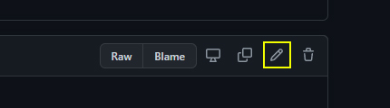

# Welcome{-}


This project serves as a companion to the Cambridge Manuals in Archaeology book *Archaeological Network Science* by Tom Brughmans and Matthew A. Peeples (2022). 

<a href="https://book.archnetworks.net"></a>

This document outlines methods for managing, analyzing, and visualizing network data, primarily using the R programming language. We provide code and examples to replicate the analyses presented in the book as well as many other additional useful code snippets, examples, and tools. This Online Companion is designed to expand upon topics covered in the book and you may find it useful to follow along with these examples as you read. Sections 1 through 6 in this document correspond to the topics and information covered in Chapters 2 through 7 of the Brughmans and Peeples book. You can use the table of contents on the left-hand side of your screen to jump directly to a particular section and the table and contents on the right to navigate within each section. Note that each section represents a distinct tutorial so you can skip around and do not have to begin with Section 1.

**Cite this document as:**

> Peeples, Matthew A. and Tom Brughmans (2022). Online Companion to Archaeological Network Science by Brughmans and Peeples. <https://archnetworks.net>, Accessed 2022-05-17.

**The associated book can be cited as**

> Brughmans, Tom and Matthew A. Peeples (in press). *Archaeological Network Science.* Cambridge Manuals in Archaeology. Cambridge University Press, Cambridge, UK.

***
<div class="warning" style='padding:0.1em; background-color:#E9D8FD; color:#69337A'>
<span>
<p style='margin-top:1em; text-align:center'>
<b>NOTICE</b></p>
<p style='margin-left:1em;'>
Note that this is a pre-release version of this document. Be aware that there are formatting issues and there may be lingering errors currently under investigation. Please check back here for updates in the coming months for the full "release" version of this document.
</p>
</span>
</div>
***

## Reproducibility{-}

The most recent version of this document was built with R version 4.2.0 (2022-04-22 ucrt). We suggest you use a recent version of R when attempting to use the code in this document. 

The content of this document is meant to be as accessible and reproducible as possible. The source code used to produce this document along with all of the data used in analyses are available on [GitHub](https://github.com/mpeeples2008/Archaeological_Network_Science). This GitHub repository allows anyone who chooses to open issues, contribute to the document, or help fix typos or other errors (see information about contributing below). We have also opened a GitHub discussion board with this repository where users can ask questions about any data or code in the repository without making edits or issue requests directly. 

The easiest way to reproduce this document is to launch the project directly in your browser using [Binder](https://mybinder.org/). When you click on the link below it will open a browser based instance of R studio with all of the required packages and files. From there you can test and evaluate the code directly. 

[](https://mybinder.org/v2/gh/mpeeples2008/Archaeological_Network_Science/main)

You can also run the code and generate documents locally using R and R Studio. Download the entire R repository here: [main.zip](https://github.com/mpeeples2008/Archaeological_Network_Science/archive/refs/heads/main.zip). Unzip the file and then:

* Open the "Archaeological_Network_Science.Rproj" in R studio.
* Use the "renv::restore()" command to install the required packages and dependencies. Not that this is a large document that uses a great number of packages so this may take some time.
* You will then be able to browse the files and execute code. 

This document has been deployed using the Netlify platform and the badge below shows the current status of the build hosted at [https://book.archnetworks.net](book.archnetworks.net).

[](https://app.netlify.com/sites/archnetworks/deploys)

## Discord Community{-}

We have created an associated [Archaeological Network Science - Discord Server](https://discord.gg/Z9UXwjASM5), which we hope will provide an additional venue for archaeological network practitioners to collaborate, interact, and ask for help with this document or with archaeological networks broadly. We invite you to use this as a place to ask questions of the authors and the community at large. Note that this Discord is subject to the same [code of conduct](https://github.com/mpeeples2008/Archaeological_Network_Science/blob/main/CODE_OF_CONDUCT.md) we use for the GitHub repository and you must abide by that agreement to participate. We require that you have a Discord account with a verified email address.

{width=300px}

[Join our Discord](https://discord.gg/Z9UXwjASM5)

## New to R and R Studio?{-}

This document assumes you have a basic familiarity with R and R studio. If you are a first time R user and need help getting R and R studio installed and up and running, we have created an overview of [how to install R and R-Studio](#GettingStarted) focused on the resources we use here. Once you have the programs installed, we suggest you follow along with the "Some Basics" tutorials in *the R Cookbook, 2nd edition* [(Long and Teetor 2019)](https://rc2e.com/somebasics) to understand how the R programming environment works. 

If you already have a basic familiarity with R and want to go further, there are numerous additional resources online (many are completely free) to help you learn. Some resources we would recommend include *R for Data Science* ([Wickham and Grolemund 2017](https://r4ds.had.co.nz/)), *Advanced R* ([Wickham 2019](https://adv-r.hadley.nz/)), and *R in Action* and the associated *Quick-R* website [Kabacoff 2015](https://www.statmethods.net/). In addition to this [Ben Marwick](https://anthropology.washington.edu/people/ben-marwick) has created an excellent repository of [resources for using R in archaeology](https://github.com/benmarwick/ctv-archaeology) as well as an ever-growing list of archaeological publications that include R code. The website associated with this book [archnetworks.net](https://www.archnetworks.net) also includes a list of archaeological articles focused on network research that include data and code. Reproducing published results is, in our experience, one of the best ways to learn advanced analytical techniques and data management in R.

## Contribute To the Project{-}

We welcome contributions to this project from the community and the GitHub platform helps us facilitate that. You will first need to [sign up for a GitHub account](https://github.com/) and log in. If you find something that needs updating or changing (typos or errors) you can simply click the "View source" link at the right sidebar on the relevant page and then click the edit icon found near the top of the code block and make your proposed changes. These changes will be saved in a new "fork" of the document and we will review these and implement them where relevant and happily add your name to our list of contributors.

{width=300px}

If you detect a larger error such as code not running or if you would like to request a new feature or  update, you can create an issue using the [issue tracker](https://github.com/mpeeples2008/Archaeological_Network_Science/issues) page associated with the project repository.

All contributors must agree to adhere to our [code of conduct](https://github.com/mpeeples2008/Archaeological_Network_Science/blob/main/CODE_OF_CONDUCT.md).

## Project License{-}

[](http://creativecommons.org/licenses/by-nc-nd/4.0/)

This Online Companion to Archaeological Network Science is licensed under a [Creative Commons Attribution-NonCommercial-NoDerivitives 4.0 International License](http://creativecommons.org/licenses/by-nc-nd/4.0/).


## Help Support this Project and Build the Community{-}

We are devoted to seeing the community of archaeological network practitioners grow and we hope our book and these online resources will help to make this happen. You can support the growth of our community too!

* Spread the word to your friends and colleagues
* Share links to these online resources on social media using the #archnetworks hashtag
* Please cite the book *and* the Online Companion if you use methods or code from this document
* Star the GitHub project repository and contribute to the project
* Join our Discord and invite other interested people
* Share articles, teaching resources, data, or other archaeological network materials for posting on our associated website [archnetworks.net](https://archnetworks.net)
* Buy the book 
* Review the book on online book sellers

## Acknowledgements{-}

This project and the associated book were made possible thanks to the support of several generous funding sources including: The Carlsberg Foundation, in the context of the Past Social Networks Project (CF21-0382); the National Science Foundation through both the Archaeology and the Measurement, Methodology, and Statistics programs (grant #1758690 and #1758606); and the School of Human Evolution and Social Change at Arizona State University. 

{width=150px} {width=300px}

# Gettings Started with R{- #GettingStarted}

In order to follow along with the code and examples in this document, you will need recent installations of both R and R Studio on your computer. R and R studio are available for Windows, MacOS, and Linux/Unix. This Section provides a very brief overview of how to get up and running. 

## Download and Install R{-}

The first step is to install a recent version of R. Follow the instructions below for the appropriate operating system.

* The first step is to go to the R project website [www.r-project.org](https://www.r-project.org) and click on the [CRAN](https://cran.r-project.org/mirrors.html) link under "Downloads" on the lefthand side.
* Choose a mirror for your download selecting one in your country or the "cloud" option.
* Next, click on Windows, MacOS, or your Linux distribution and follow the instructions below.

### Windows{-}

* Next, click the "base" sub-directory on the left hand side of the screen and then click "Download R-4.2.0 for Windows" (the version number should be 4.2 or later) to download the most recent version.
* Once your download is complete, run the *.exe file and answer questions as prompted to complete the installation. 

### MacOS{-}

You first need to know which processor chip your Mac has before proceeding. In order to determine which chip you have go to the Apple menu and select "About This Mac" and look for information under "Processor" or "Chip" in the window that pops up. It will either be Intel or M1.

* Next, click the on the link under "Latest release" for the *.pkg file for the appropriate Mac processor in your Mac. There is a separate notarized and signed .pkg file Macs with Intel processors and Macs with Apple M1 processors (mostly produced 2020 and later). Note, these .pkg files are not interchangeable so confirm which one you need.
* Once you have downloaded the appropriate .pkg, run it and answer the dialogs as required.

### Linux{-}

Linux installations of R are primarily done through the console but the instructions are slightly different depending on the distribution you are using.

* Click on the link for the appropriate Linux distribution and then follow the detailed instructions provided. 
* The "R-core" or "R-base" builds are the ones you want to choose. 

## Download and Install R-Studio{-}

R-studio is an integrated development environment (IDE) for R, Python, and affiliated programming environments that provides additional features for running and debugging code and data management. We see this as essential to working with large and complex R projects. 

In order to install R-Studio:

* Go to the R-Studio website [www.rstudio.com](https://www.rstudio.com/) and click "Download" at the top of the screen.
* Select the "RStudio Desktop" option.
* Download and run the latest "installer" file for the appropriate operating system.
* Run the downloaded file and answer questions at prompts as appropriate. R-Studio will automatically detect your installation of R.

## Run R-Studio{-}

Once you've installed both R and R-Studio, open R-studio and look for the Console window (will typically be the left hand side of the screen). That will tell you the version of R that is associated with the installation of R-Studio. If all goes well, it should be the recent version of R you just installed. 

{width=100%}

## R and R-Studio Basics{-}

R is a powerful statistical analysis platform that can be used to conduct some quite complex analyses. The learning curve is a bit steep when first getting started but the payoff is HUGE because the ecosystem of existing R scripts and packages is huge. We cannot hope to cover everything R and R studio can do in this very short intro here but we have implemented a version of the introduction to R programming that Matt Peeples uses in the first week of classes focused on statistical analyses. Hopefully this will get you started. 

First off, let's take a look at the R-Studio setup. When you first open R-Studio for the first time, you will see a screen divided into 3 panes. Before getting started click on "File" at the top of the screen and go to "New File > R Script" to open a 4th pane. You should see something like the screen below (Note that the color of your screen may be different as I am using a "Dark Mode" here).

{width=100%}

The pane in the top left contains the Workspace tabs which is where you can write code and other documents before executing them. The pane at the bottom left is the console where you can type and run commands directly. The pane at the upper right includes tabs for Environment (a list of objects and functions currently initialized) and History (a list of previous commands run at the console). Finally, the lower right pane has tabs for Files (which shows files in the current directory), Plots (where plots created in the console will be displayed), Packages (a list of additional packages installed and initialized in R), and Help (where you can get information about particular functions and packages). 

In this introductory tutorial we are mostly going to be concerned with the Workspace and Console panes for now. After we introduce a few basics of how R works, we will discuss the Workspace.

### Mathematical Operations{-}

Getting started with R is as simple as typing directly into the Console. You can use the R console like a calculator to conduct mathematical operations. Simply type the numbers and operators at the console and hit enter to calculate. The answer will output directly on the console by default. Try typing the following at the console:


```r
3+3
#> [1] 6
4*10
#> [1] 40
50/5
#> [1] 10
```

R uses `()` for bracketing groups of operations to set the order of operations. These can be nested to do more complex mathematical operations. For example compare the two equations below:


```r
((4*5+3)/2)*12
#> [1] 138

(((4*5))+3/2)*12
#> [1] 258
```

R uses typical mathematical operators including `+ - * /` for addition, subtraction, multiplication, and division and `^` to raise a number to an exponent. 


```r
5^2
#> [1] 25
5^(2+1)
#> [1] 125
```


### Assigning Variables{-}

R can also assign numbers, characters, or more complex operations to variables which can then be used in mathematical operations. Typically, we assign values to a variable using the `<-` arrow but `=` also works. For example:


```r
test_var <- 50
test_var
#> [1] 50

test2 = 10 + test_var
test2
#> [1] 60

char1 <- "hello world"
char1
#> [1] "hello world"
```

### Logical Operators{-}

R can also use logical operators such as `<` less than, `>` greater than, `<=` less than or equal to, `>=` greater than or equal to, `==` exactly equal to, and `!=` not equal to. These operators can be used in conjunction with other operations and return a value indicating `TRUE` or `FALSE`. These can be used in more complex functions and conditional statements as we will see below. For example:


```r
v <- 50
v > 20
#> [1] TRUE
v < 20
#> [1] FALSE
v*2 == 100
#> [1] TRUE
```

### Vectors{-}

R can also assign a vector of numbers or characters to a variable and preform operations using that vector. For example in the following we use the `c()` (c for combine) command to create a vector and subject it to a mathematical operation.


```r
z <- c(2,4,6,8,10,12)
z/2
#> [1] 1 2 3 4 5 6
```

If you want to call a particular value or selection of values in a vector you can use the `[]` square brackets and indicate which item(s) you are interested in.


```r
z[3]
#> [1] 6
z[4:6]
#> [1]  8 10 12
z[c(3,2,1)]
#> [1] 6 4 2
```


### Using Basic R Functions{-}

R has a number of built-in functions that perform many common operations and assessments. These are typically used by typing the name of the function followed by a set of parenthesis that contain all of the arguments that the function expects. For example:


```r
v <- c(5, 10, 15, 20, 25, 30, 2000)
max(v)
#> [1] 2000
min(v)
#> [1] 5
mean(v)
#> [1] 300.7143
median(v)
#> [1] 20
```

For a list of some of the most frequently used built-in functions see [this Quick-R](https://www.statmethods.net/management/functions.html) page. 

### Matrices{-}

R can be used to create tabular/matrix data as well. Typically it is most convenient to read such data for a file for very large tabular data [(see working with files below)](#WorkingWithFiles), but we can also generate simple matrices directly in R using the `matrix()` function. In the following example we create a two-row, two-column matrix by converting a vector of numbers into a matrix by specifying the number of rows `nrow` and number of columns `ncol`. The assignments we make inside the `matrix()` function are called arguments. 


```r
dat <- c(3,4,2,20)
mat1 <- matrix(data = dat, nrow = 2, ncol = 2)
mat1
#>      [,1] [,2]
#> [1,]    3    2
#> [2,]    4   20
```

Note that the `matrix()` function read the numbers in first by column and then by row. If we want want to change that we can first investigate the options for this function using the `help()` function. In order to see the documentation for a given function simply type `help("NameOfFunction")` at the console or `?NameOfFunction`. 


```r
?matrix
```

{width=100%}
{width=100%}

As we can see in the help materials for matrix, there is an additional argument we did not use called `byrow` which is set to `FALSE` by default. Let's change that to `TRUE` and check the results. Note that you can use capital `F` and `T` in the place of `FALSE` and `TRUE` in functions. Note also that our function call can span multiple rows and will automatically end when we close the parentheses. This multi-line formatting will be essential for making longer function calls readable.


```r
mat2 <- matrix(
  data = dat,
  nrow = 2,
  ncol = 2,
  byrow = T
)
mat2
#>      [,1] [,2]
#> [1,]    3    4
#> [2,]    2   20
```

We can also use matrices for many mathematical and statistical functions that are built directly into R. For example, let's run a Fisher's Exact Test using the `fisher.test` function.


```r
fisher.test(mat2)
#> 
#> 	Fisher's Exact Test for Count Data
#> 
#> data:  mat2
#> p-value = 0.07474
#> alternative hypothesis: true odds ratio is not equal to 1
#> 95 percent confidence interval:
#>    0.5875228 107.8450263
#> sample estimates:
#> odds ratio 
#>   6.815654
```

The output includes information about the data we used to run the test, a p-value, the alternative hypothesis, confidence intervals, and odds ratio. The output we get from any given function will vary depending on the application. 

## The Workspace Tab{-}

Now that we are starting to get into more complex calls and functions, it can be useful to write and edit the code before executing it rather than typing it directly into the Console. To do this, we work in the Workspace tab R script document we created at the beginning of this tutorial (Go to File > New File > R Script to open a new document). These .R documents can be edited and saved on your computer so that you can return to them later. Let's take a look at how this works.

Think of the R script document as a draft of what you plan to type to the Console. 

#### Setting the Workspace Directory{-}

Before we get started, let's save the blank R file we just created. First, we want to define the "Working Directory" where files associated with this project will go. To do that go to the menu at the top of the screen and click "Session > Set Working Directory > Choose Working Directory" and then navigate to the location where you would like to save the file. Next, click on "File > Save As" and define a name for your R script. This should end in .R as this is the extension R and R studio recognize for R Scripts.

#### Working with your first R script{-}

Now that you have saved this script, you can type mathematical operations, functions, and other code just as we did directly in the Console above. The main advantage is that if you make a mistake you can go back and fix it more easily. Go ahead and copy the code in the next code chunk below and paste it in your R script int he Workspace window and then save the document.


```r
mat3 <- matrix(
  data = c(4, 5, 1, 5, 1, 5),
  nrow = 2,
  ncol = 3,
  byrow = T
)

mat3^2
```

Once you have this saved, highlight all of the code in the Workspace window and then click the "Run" button on the top right side of this pane (see yellow arrow below).

{width=100%}

This will execute the code in your Console and print the results. Let's say when we ran this code, we realized that we actually wanted to raise `mat3` to the 3rd power. We can make that change and then select the code and click run again to do this. This is the true power of scripts in that they allow us to make changes and modify our code easily as we go without retyping commands. Anything you can do in the console you can first set up in the Workspace pane.

## Installing Packages{-}

So far, everything we have done has involved packages include in "base" R and only internal built-in functions. One of the best things about R is the ecosystem of packages created and peer reviewed by others for all manner of statistical analyses you can imagine. There is a package out there for just about everything so it is always a good idea to check before you start to write any complex script on your own.

In order to install external packages, you need to know the name of the package you want and you simply type `install.packages("NameOfPackage")` at the console. Let's try installing the `vegan` package first which includes lots of useful functions for community ecology research.


```r
install.packages("vegan")
```

Once our package installs, we can "call" it or initialize it using the `libaray()` function.


```r
library(vegan)
#> Loading required package: permute
#> Loading required package: lattice
#> This is vegan 2.6-2
```

Now we can use not just the base R functions, but also the functions within the `vegan` package. One useful function in this package is called `diversity()` which allows us to calculate all manner of common diversity measures. Remember to check `?diversity` if you want to learn more about the package and its arguments. Let's give it a try by creating a vector and then calculating two different diversity indices on that vector:


```r
vec1 <- c(1,6,2,7,45,3,6,2,4,6,7,2)

diversity(vec1, index = "shannon")
#> [1] 1.831803

diversity(vec1, index = "simpson")
#> [1] 0.7259993
```

> There are tons of useful packages out there and it can sometimes be a bit overwhelming trying to find them. Searching in a search engine for the simple letter "R" can also yield unexpected results. One helpful tip when searching for packages is to include "CRAN" or "package" in the search terms. CRAN stands for the Comprehensive R Archive Network and this is the archive that contains most of the peer reviewed and established packages for R. For example, say we are looking for a package focused on building gravity models. If we simply search for "gravity models" we get lots of results but if we search for "R gravity model package" we very quickly find what we're looking for.

## Working with Files{-}

In many cases we may wish to either write or read in external files into R. Frequently these files take the shape of spreadsheets such as Excel documents or csv (comma separated value) documents. R has many functions for reading in such data and most are built-in to base R. Let's try this out by first writing a .csv file from a matrix we generate and then reading it back in. Note that any files you write from the console will go directly to the R working directory unless you otherwise specify.

To write a csv file we use the `write.csv()` function. First we will create a simple matrix, add row names and column names, and then export it.


```r
vec2 <- c(4,2,65,4,2,4,6,4,2)
# Notice in the matrix call below we don't enter 'nrow' 
# and other argument names as R automatically expects
# them to occur in the order mentioned in the documentation
mat4 <- matrix(vec2, 3, 3) # 3 row 3 column matrix
row.names(mat4) <- c("row 1", "row 2", "row 3") # assign row names
colnames(mat4) <- c("A", "B", "C") #assign col names
mat4 # view matrix
#>        A B C
#> row 1  4 4 6
#> row 2  2 2 4
#> row 3 65 4 2

# Export the matrix as a csv file
write.csv(mat4, file = "output_mat.csv")
```

Once you export this file, you should see it appear in the File pane in the bottom right of R-Studio within the working directory.


If you want to read this file back in, we can simply use the `read.csv()` function. Let's give it a try and create a new object called, `read_mat` from the results of the function. We use the argument `header = T` to indicate that the first row represents column names and `row.names = 1` to indicate that the first column includes the row names.


```r
read_mat <- read.csv(file = "output_mat.csv", header = T, row.names = 1)
read_mat
#>        A B C
#> row 1  4 4 6
#> row 2  2 2 4
#> row 3 65 4 2
```

There are lots of different functions for reading in files in different formats and we will introduce some of these later in the subsequent sections of this tutorial. 

## More Advanced R Features{-}

### Conditional Statements{-}

### Loops{-}

### Custom Functions{-}
