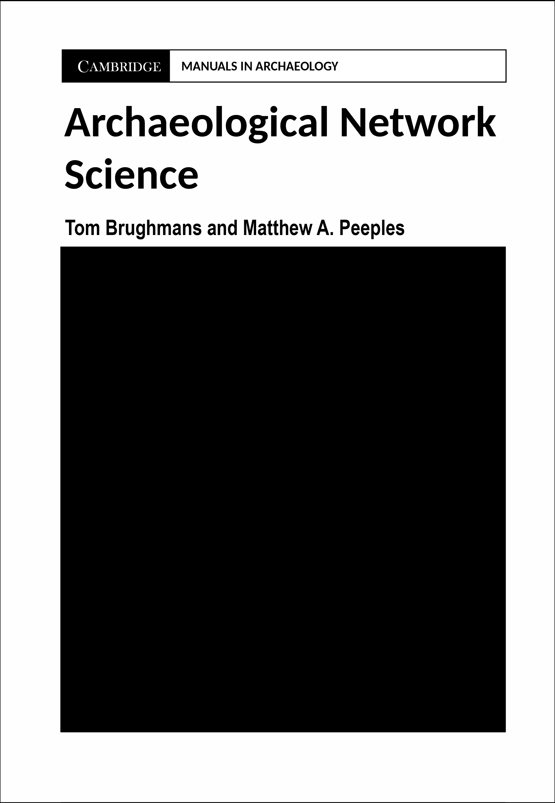

# Welcome {.unnumbered}

> **Note that this is a pre-release version of this document. Be aware that there are formatting issues and there may be lingering errors currently under investigation. Please check back here for updates in the coming months for the full "release" version of this document.**

**Cite this document as:**

> Peeples, Matthew A. and Tom Brughmans (2022). Online Companion to Archaeological Network Science by Brughmans and Peeples. <https://archnetworks.net>

For more information on the book and for other resrouces including downloadable archaeological network data, code, and tutorials see [archnetworks.net](https://archnetworks.net).

------------------------------------------------------------------------

This document serves as a companion to the Cambridge Manuals in Archaeology book *Archaeological Network Science* by Tom Brughmans and Matthew A. Peeples (2022). This document outlines methods for managing and analyzing network data, primarily using the R programming language. In the following sections we provide code and examples to replicate the analyses, techniques, and visualizations presented in the book as well as many other additional useful code snippets, hints, and information. This appendix has been written to expand upon specific topics covered in the book and you may find it useful to follow along with these examples as you read. Sections 2 through 7 in this document correspond to the topics and information covered in Chapters 2 through 7 of the book. You can use the table of contents on the left-hand side of your screen to jump directly to a particular topic.

{width="50%"}

This appendix assumes you have a basic familiarity with R and R studio. If you are a first time R user and need help getting R and R studio installed and up and running, we suggest you follow the basic [RYouWithMe!](https://rladiessydney.org/courses/ryouwithme/) tutorials by the R-Ladies Sydney or the [ModernDive](https://moderndive.netlify.app/1-getting-started.html) Statistical Inference via Data Science basic tutorial (McConville et al. 2021). If you already have a basic familiarity with R and want to go further, there are numerous additional resources online (many are completely free) to help you learn. Some resources we would recommend include *R for Data Science* ([Wickham and Grolemund 2017](https://r4ds.had.co.nz/)), *Advanced R* ([Wickham 2019](https://adv-r.hadley.nz/)), *the R Cookbook, 2nd edition* [(Long and Teetor 2019)](https://rc2e.com/)), and *R in Action* and the associated *Quick-R* website [Kabacoff 2015](https://www.statmethods.net/). In addition to this [Ben Marwick](https://anthropology.washington.edu/people/ben-marwick) has created an excellent repository of [resources for using R in archaeology](https://github.com/benmarwick/ctv-archaeology) as well as an ever-growing list of archaeological publications that include R code. Reproducing published results is, in our experience, one of the best ways to learn advanced analytical techniques and data management in R.

## Project License

This work is licensed under a [Creative Commons Attribution-NonCommercial-NoDerivitives 4.0 International License](http://creativecommons.org/licenses/by-nc-nd/4.0/).
