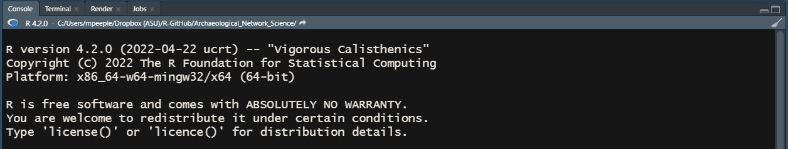
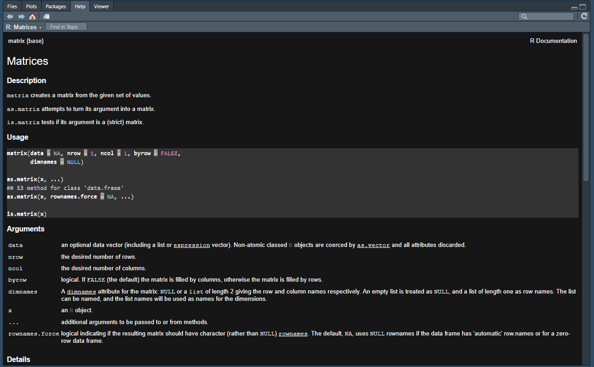
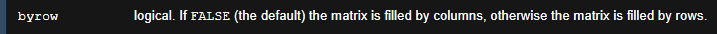
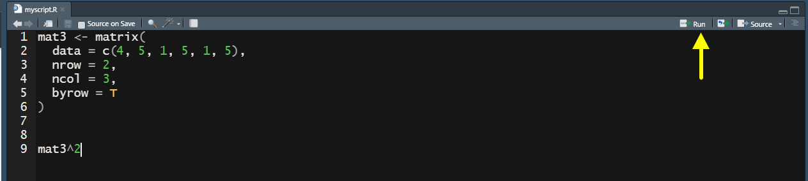
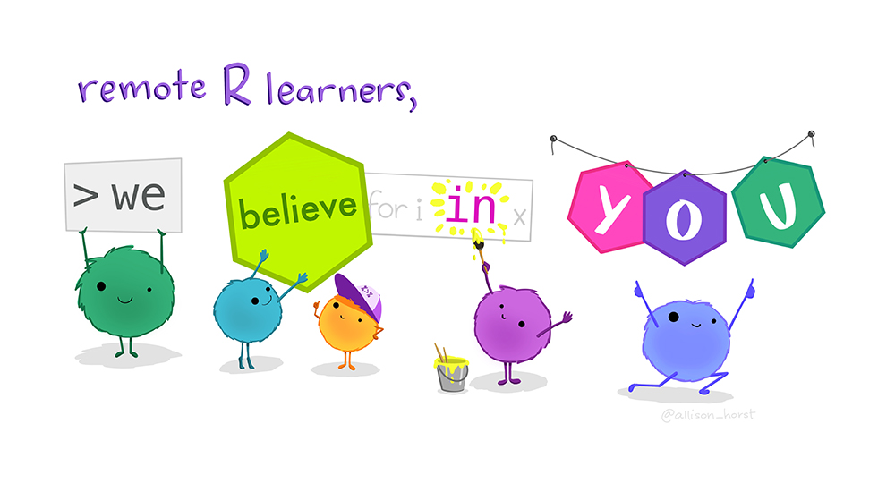

# Welcome{-}

```{r index-1, echo=FALSE}
is_html = knitr::is_html_output()
```

```{asis index-2, echo=is_html}

This project serves as a companion to the Cambridge Manuals in Archaeology book *Archaeological Network Science* by Tom Brughmans and Matthew A. Peeples (2022). 

<a href="https://book.archnetworks.net"></a>

This document contains a series of tutorials that outline methods for managing, analyzing, and visualizing network data, primarily using the R programming language. We provide code and examples to replicate the analyses presented in the book as well as many other additional useful code snippets, examples, and tools. This Online Companion is designed to expand upon topics covered in the book and you may find it useful to follow along with these examples as you read the text. Sections 1 through 6 in this document correspond to the topics and information covered in Chapters 2 through 7 of the Brughmans and Peeples book. You can use the table of contents on the left-hand side of your screen to jump directly to a particular section and the table and contents on the right to navigate within each Section. 
```

For more information on the book and the authors check the project website here: [archnetworks.net](https://archnetworks.net).

**Cite this document as:**

> Peeples, Matthew A. and Tom Brughmans (2022). Online Companion to Archaeological Network Science by Brughmans and Peeples. <https://archnetworks.net>, Accessed `r Sys.Date()`.

**The associated book can be cited as**

> Brughmans, Tom and Matthew A. Peeples (in press). *Archaeological Network Science.* Cambridge Manuals in Archaeology. Cambridge University Press, Cambridge, UK.

***
```{asis index-3, echo=knitr::is_html_output()}
<div class="warning" style='padding:0.1em; background-color:#E9D8FD; color:#69337A'>
<span>
<p style='margin-top:1em; text-align:center'>
<b>NOTICE</b></p>
<p style='margin-left:1em;'>
Note that this is a pre-release version of this document. Be aware that this document is still being updated and edited. Please check back here for updates in the coming months for the final version of this document.
</p>
</span>
</div>
```
***

## How Should I Use This Online Companion?{- #HowTo}

The tutorials here are designed to complement the text of the associated book (Brughmans and Peeples 2022) but can also stand alone as a guide to implementation if you have a basic background in network methods and terminology. Although each section of this guide builds upon the previous sections in terms of network concepts and R methods, the Sections are each independent in terms of data, examples, and code and can be run out of order if you choose.

A few suggestions on where to start:

* If you are new to network analysis and R, we would suggest going through each section of this document, starting with "Getting Started with R" and then going through the numbered sections in order as you following along in the book.
* If you are already familiar with R but new to network analysis, we suggest you read Section 1 to set up your data and workspace, and then follow along with the remaining numbered Sections and associated book chapters as you read.
* If you are already an avid network analyst and R user and are just looking for code chunks to implement something in particular, feel free to skip around. We have tried to make each Section as independent as possible so that you can pick and choose what you want to work on.
* If you're a real pro and are designing your own network analyses or visualizations, we would love it if you contributed to the project to help this document grow.

## Reproducibility{- #Repro}

The most recent version of this document was built with `r R.version.string`. We suggest you use a recent version of R when attempting to use the code in this document. 

The content of this document is designed to be as accessible and reproducible as possible. The source code used to produce this document along with all of the data used in analyses are available on [GitHub](https://github.com/mpeeples2008/ArchNetSci). This GitHub repository allows users to open issues, contribute to the document, or help fix typos or other errors (see information about [contributing](#Contributing) below). We have also opened a GitHub discussion board with this repository where users can ask questions about any data or code in the repository without making edits or issue requests directly. 

The easiest way to reproduce this document is to launch the project directly in your browser using [Binder](https://mybinder.org/). When you click on the link below it will open a browser based instance of R studio with all of the required packages and files. From there you can test and evaluate the code directly.

[](https://mybinder.org/v2/gh/mpeeples2008/ArchNetSci/main)

You can also install this repository as an R package directly from GitHub using:

```{r, eval=F}
if (!require("devtools")) install.packages("devtools")
devtools::install_github("mpeeples2008/ArchNetSci")
```

Finally, you can run the code and generate documents locally using R and R Studio by downloading the entire R repository here: [main.zip](https://github.com/mpeeples2008/ArchNetSci/archive/refs/heads/main.zip). Unzip the files and then:

* Open the "Archaeological_Network_Science.Rproj" file in R studio.
* Use the `renv::restore()` command to install the required packages and dependencies. Not that this is a large document that uses many packages so this may take some time.
* You will then be able to browse the files and execute all of the code in the repository.

This online bookdown document has been deployed using the Netlify platform and the badge below shows the current status of the build hosted at [https://book.archnetworks.net](book.archnetworks.net).

[](https://app.netlify.com/sites/archnetworks/deploys)

## Discord Community{-}

We have created an associated [Archaeological Network Science - Discord Server](https://discord.gg/Z9UXwjASM5), which we hope will provide an additional venue for archaeological network practitioners to collaborate, interact, and ask for help with this document or with archaeological networks broadly. We invite you to use this as a place to ask questions of the authors and the community at large. Note that this Discord is subject to the same [code of conduct](https://github.com/mpeeples2008/Archaeological_Network_Science/blob/main/CODE_OF_CONDUCT.md) we use for the GitHub repository and you must abide by that agreement to participate. We require that you have a Discord account with a verified email address.

```{asis discord, echo=is_html}
<a href="https://discord.gg/Z9UXwjASM5"></a>
```

[Join our Discord](https://discord.gg/Z9UXwjASM5)

## New to R and R Studio?{-}

This network tutorials in this document are built for users with a basic familiarity with R and R-studio but if you're just getting started, don't worry. We have created a detailed guide to [Getting started with R](#GettingStarted). This document covers the installation of the required software and provides a basic introduction to the R programming environment that we hope will be enough to get you started. 

If you already have a basic familiarity with R and want to go further, there are numerous additional resources (most are completely free) to help you learn. Some resources we would recommend include *R for Data Science* [(Wickham and Grolemund 2017)](https://r4ds.had.co.nz/), *Advanced R* [(Wickham 2019)](https://adv-r.hadley.nz/), *the R Cookbook, 2nd edition* [(Long and Teetor 2019)](https://rc2e.com/somebasics), and *R in Action* and the associated *Quick-R* website [(Kabacoff 2015)](https://www.statmethods.net/). In addition to this [Ben Marwick](https://anthropology.washington.edu/people/ben-marwick) has created an excellent repository of [resources for using R in archaeology](https://github.com/benmarwick/ctv-archaeology) as well as an ever-growing list of archaeological publications that include R code. The website associated with this book [(archnetworks.net)](https://www.archnetworks.net) also includes a list of archaeological articles focused on network research that include data and code. Reproducing published results is, in our experience, one of the best ways to learn advanced techniques and data management in R so we suggest you give it a try.

## Contribute To the Project{- #Contributing}

We welcome contributions to this project from the community and the GitHub platform helps us facilitate that. You will first need to [sign up for a GitHub account](https://github.com/) and log in. If you find something that needs updating or changing (typos or errors) you can simply click the "View source" link at the right sidebar on the relevant page and then click the edit icon found near the top of the code block and make your proposed changes. These changes will be saved in a new "fork" of the document and we will review these and implement them where relevant and happily add your name to our list of contributors.

If you detect a larger error such as code not running or if you would like to request a new feature or  update, you can create an issue using the [issue tracker](https://github.com/mpeeples2008/Archaeological_Network_Science/issues) page associated with the project repository.

All contributors must agree to adhere to our [code of conduct](https://github.com/mpeeples2008/Archaeological_Network_Science/blob/main/CODE_OF_CONDUCT.md).

## Project License{-}

[](http://creativecommons.org/licenses/by-nc-nd/4.0/)

This Online Companion to Archaeological Network Science is licensed under a [Creative Commons Attribution-NonCommercial-NoDerivitives 4.0 International License](http://creativecommons.org/licenses/by-nc-nd/4.0/).


## Help Support this Project and Build the Community{-}

We are devoted to seeing the community of archaeological network practitioners grow and we hope our book and these online resources will help to make this happen. You can support the growth of our community too!

* Spread the word to your friends and colleagues
* Share links to these online resources on social media using the #archnetworks hashtag
* Please cite the book *and* the Online Companion if you use methods or code from this document
* Star the GitHub project repository and contribute to the project
* Join our Discord and invite other interested people
* Share articles, teaching resources, data, or other archaeological network materials for posting on our associated website [(archnetworks.net)](https://archnetworks.net)
* Buy the book 
* Review the book on online book sellers

## Acknowledgements{-}

This online bookdown project and the associated book were made possible thanks to the support of several generous funding sources including: The Carlsberg Foundation, in the context of the Past Social Networks Project (CF21-0382); the National Science Foundation through both the Archaeology and the Measurement, Methodology, and Statistics programs (grant #1758690 and #1758606); and the School of Human Evolution and Social Change at Arizona State University. Thank you to Jens Emil Bødstrup Christoffersen for providing detailed comments on and for testing the initial version of this document. Any errors that remain are our own.

{width=150px} {width=300px}

# Gettings Started with R{- #GettingStarted}

In order to follow along with the code and examples in this document, you will need recent installations of both R and R-Studio on your computer. R and R-studio are available for Windows, MacOS, and Linux. This Section provides a very brief overview of how to get up and running. Following this, we introduce the basics of R and R-Studio to get you ready for the tutorials in the remainder of this document. If you follow this tutorial here we are confident you will be able to engage with the examples and code in this Online Companion.

## Download and Install R{- #InstallR}

The first step is to install a recent version of R (we recommend 4.2 or later as this document was originally created in version 4.2). Follow the instructions below for the appropriate operating system.

* The first step is to go to the R project website [www.r-project.org](https://www.r-project.org) and click on the [CRAN](https://cran.r-project.org/mirrors.html) link under "Downloads" on the left hand side.
* Choose a mirror for your download selecting one in your country or the "Cloud" option.
* Next, click on Windows, MacOS, or your Linux distribution and follow the instructions below.

### Windows{-}

* Click the "base" sub-directory on the left hand side of the screen and then click "Download R-4.2.0 for Windows" (the version number should be 4.2 or later) to download the most recent version as an executable.
* Once your download is complete, run the *.exe file and answer questions as prompted to complete the installation. 

### MacOS{-}

To install R on MacOS, you first need to know which chip manufacturer your Mac has. In order to determine which chip you have go to the Apple menu and select "About This Mac" and look for information under "Processor" or "Chip" in the window that pops up. It will either be Intel or M1.

* Next, click the on the link under "Latest release" for the *.pkg file for the appropriate Mac processor in your computer. There is a separate notarized and signed .pkg file Macs with Intel processors and Macs with Apple M1 processors (mostly produced 2020 and later). Note, these .pkg files are not interchangeable so confirm which one you need.
* Once you have downloaded the appropriate .pkg, run it and answer the questions during the install as required.

### Linux{-}

Linux installations of R are primarily done through the console but the instructions are slightly different depending on which distribution you are using.

* Click on the link for the appropriate Linux distribution and then follow the detailed instructions provided. 
* The "R-core" or "R-base" builds are the ones you want to choose. 
* Follow the instructions for your build and install any recommended dependencies. 

## Download and Install R-Studio{- #InstallRStudio}

R-studio is an integrated development environment (IDE) for R, Python, and related programming tools that provides additional features for running and debugging code and data management. We see this IDE as essential to working with large and complex R projects. 

In order to install R-Studio:

* Go to the R-Studio website [www.rstudio.com](https://www.rstudio.com/) and click "Download" at the top of the screen.
* Select the "RStudio Desktop" option.
* Download and run the latest "installer" file for the appropriate operating system.
* Run the downloaded file and answer questions at prompts as appropriate. R-Studio should automatically detect your installation of R.

## Run R-Studio{-}

Once you've installed both R and R-Studio, open R-studio and look for the Console window (it will typically be the left hand side of the screen). That will tell you the version of R that is associated with the installation of R-Studio. If all goes well, it should be the recent version of R you just installed. 

{width=100%}

## R and R-Studio Basics{- #RBasics}

R is a powerful statistical analysis platform that can be used to conduct some quite complex analyses. The learning curve is a bit steep when first getting started but the payoff is HUGE because the ecosystem of existing R scripts and packages is so large and diverse. We cannot hope to cover everything R and R-Studio can do in this very short intro here. Our tutorial here is a version of the "Introduction to R programming" that Peeples has used in the first week of his Quantitative and Formal Methods in Archaeology class for a number of years. Hopefully this will get you started. 

Although R seems complicated at first, many quite complex statistical analyses are run with just a few lines of code. Once you learn the basics, more complex features of R are really just combinations of these basic procedures. You won't become an R expert overnight, but we've seen many students pick up the basics quite quickly and begin to take on their first analyses in R in a matter of hours. 

#### Organization of R-Studio{-}

First off, let's take a look at the R-Studio setup. When you first open R-Studio for the first time, you will see a screen divided into 3 panes. Before getting started click on "File" at the top of the screen and go to "New File > R Script" to open a 4th pane. You should see something like the screen below (Note that the color of your screen may be different as I am using a particular color setting that I find easier on my eyes).

{width=100%}

Organization of R-Studio Windows:

* Workspace - The pane in the top left contains the Workspace tabs which is where you can write code and other documents prior to executing the code. 
* Console - The pane at the bottom left is the console where you can type and run commands directly.
* Environment/History - The pane at the upper right includes tabs for Environment (a list of objects and functions currently initialized) and History (a list of previous commands run at the console). 
* Files/Plots/Packages - The lower right pane has tabs for Files (which shows files in the current directory), Plots (where plots created in the console will be displayed), Packages (a list of additional packages installed and initialized in R), and Help (where you can get information about particular functions and packages). 

Note that the locations and visibility of these panes can be changed by going to "View > Panes" and selecting different options. In the set of tutorials that follow we are going to focus on the Console first and will introduce the other panels and what they provide along the way.

### Mathematical Operations{- #Math}

Getting started with R is as simple as typing directly into the Console. You can use the R console like a calculator to conduct mathematical operations. Simply type the numbers and operators at the console and hit enter to calculate. The answer will output directly on the console by default. Try typing the following at the console:

```{r}
3+3
4*10
50/5
```

R uses `( )` for bracketing groups of operations. These can be nested to do more complex mathematical operations or to determine the order of operations. For example compare the two equations below:

```{r}
((4*5+3)/2)*12

(((4*5))+3/2)*12
```

R uses typical mathematical operators including `+ - * /` for addition, subtraction, multiplication, and division and `^` to raise a number to an exponent. 

```{r}
5^2
5^(2+1)
```

Anything placed after a `#` in a block of code will be treated as a comment and not evaluated:

```{r}
4 * 20 # comment here
3 * 4 # 4 + 4 will not be evaluated as it is after the #
```

### Creating Variables/Objects{- #Variables}

R can also assign numbers, characters, or more complex operations to variables (also known as objects in this context) which can then be used in mathematical operations. Typically, we assign values to a object using the `<-` assign command but `=` also works. For example:

```{r}
test_var <- 50
test_var

test2 = 10 + test_var
test2

char1 <- "hello world"
char1

```

Object names in R are case sensitive and cannot include spaces. Object names can include numbers and letters but must start with a letter. It is a good idea to use descriptive object names where the object will be used repeatably.

When formatting object names there are a few common styles such as:

* `snake_case_style` - see the little snakes (underscores) in the place of spaces
* `CamalCaseStyle` - see the capitalized humps denoting each word
* `kebab-case-style` - skewered right down the middle

In general any of these styles is fine, but we suggest you try to remain consistent. Also, avoid using `.` to separate words as that is used by particular R functions and calls in other ways and can cause confusion. 

Many mathematical constants are built right into R so be sure not to overwrite any of these (or any other function) by giving an object the same name.

```{r}
pi
LETTERS
letters
month.name
```


### Logical Operators{- #Logical}

R can also use logical operators (see list below). These operators can be used in conjunction with other operations and return a value indicating `TRUE` or `FALSE`. These can be used in more complex functions and conditional statements as we will see below.

```{r, echo=F}
df <-
  data.frame(
    Operator = c("<", ">", "<=", ">=", "==", "!=", "&", "|"),
    Meaning = c(
      "less than",
      "greater than",
      "less than or equal to",
      "greater than or equal to",
      "exactly equal to",
      "not equal to",
      "and",
      "or"
    )
  )

knitr::kable(df)
```


```{r}
v <- 50
v > 20
v < 20
v*2 == 100
```

Logical operators can also include *and* statements with the `&` symbol and *or* statements with `|`. For example:

```{r}
v <- 40
v > 20 & v < 30 # and statement
v > 20 | v < 30 # or statement
```

### Vectors{- #Vectors}

R can also assign a vector of numbers or characters to a variable and preform operations using that vector. For example in the following we use the `c()` (c for combine) command to create a vector and subject it to a mathematical or other operation.

```{r}
z <- c(2,4,6,8,10,12)
z/2
```

If you want to call a particular value or selection of values in a vector you can use the `[]` square brackets and indicate which item(s) you are interested in.

```{r}
z[3] # item 3 in object z
z[4:6] # items 4 through 6 in object z
z[c(3,2,1)] # items 3, 2, 1, in that order from object z
```

We can also search vectors or other objects for specific values:

```{r}
vec_obj <- c("Ohtani", "Wheeler", "Correa", "Semien", "Soto", "Guerrero Jr.", "Correa")
vec_obj[vec_obj == "Correa"]
```

To see if a particular value is in a given object we can use the `%in%` operator.

```{r}
"Ohtani" %in% vec_obj

"Judge" %in% vec_obj
```


### Using Basic R Functions{- #Functions}

R has a number of built-in functions that perform many common operations and assessments. We have already used one of these above `c()` and it was so fast and easy you might have missed it. Functions are typically used by typing the name of the function followed by a set of parenthesis that contain all of the arguments that the function expects. For example:

```{r}
v <- c(5, 10, 15, 20, 25, 30, 2000)
max(v)
min(v)
mean(v)
median(v)
log(v, base = exp(1)) # argument setting the base
log10(v)
round(pi, digits = 2) # argument setting the number of digits to retain
```

For a list of some of the most frequently used built-in functions see [this Quick-R](https://www.statmethods.net/management/functions.html) page. 

### Tabular Data{- #Tabular}

R can be used to work with tabular data as well. Typically it is most convenient to read such data for a file for very large tabular data [(see working with files below)](#WorkingWithFiles), but we can also generate simple numeric tabular data directly in R using the `matrix()` function. In the following example we create a two-row, two-column matrix by converting a vector of numbers into a matrix by specifying the number of rows `nrow` and number of columns `ncol`. The assignments we make inside the `matrix()` function are called arguments. 

```{r}
dat <- c(3,4,2,20)
mat1 <- matrix(data = dat, nrow = 2, ncol = 2)
mat1
```

Note that the `matrix()` function read the numbers in first by column and then by row. If we want want to change that we can first investigate the options for this function using the `help()` function. In order to see the documentation for a given function simply type `help("NameOfFunction")` at the console or `?NameOfFunction`. 

```{r, eval=F}
?matrix
```

{width=100%}

And let's zoom in to one piece in particular:

{width=100%}

As we can see in the help materials for matrix, there is an additional argument we did not use called `byrow` which is set to `FALSE` by default. Let's change that to `TRUE` and check the results. Note that you can use capital `F` and `T` in the place of `FALSE` and `TRUE` in functions. Note also that our function call can span multiple rows and will automatically end when we close the parentheses. This multi-line formatting will be essential for making longer function calls readable.

```{r}
mat2 <- matrix(
  data = dat,
  nrow = 2,
  ncol = 2,
  byrow = T
)
mat2
```

Just like we did with vectors, we can also use matrices for many mathematical and statistical functions that are built directly into R. For example, let's run a Fisher's Exact Test using the `fisher.test` function to assess the independence of rows and columns in this table.

```{r}
fisher.test(mat2)
```

The output includes information about the data we used to run the test, a p-value, the alternative hypothesis, confidence intervals, and the odds ratio. The output we get from any given function will vary depending on the application. See the `help()` documents for your function of interest to get more info about output.

### Data Types in R{- #DataTypes}

There are many different types of data that R understands but we focus here on the most common. This includes numeric data, integer data, character data, logical data, and factors.

* numeric data - This is the designation used for real numbers which can include a decimal point.
* integer data - This is the designation for numbers without a decimal. To designate a number as an integer type, you can add `L` after the number (see example below). Note that R automatically converts between numeric and integer data as necessary in mathematical operations.
* character data - This is the designation for any string of characters that does not exclusively consist of numbers. Character data can be a single character such as "a" or a long string `"this string is character data"`. In general R displays character data inside `" "`.
* logical data - This is the designation for evaluations of logical statements and takes the form of `TRUE` or `FALSE`.
* factors - Factors are nominal variables stored as vectors as R objects which have distinct "levels" which each value must be. Factors are useful in both many statistical procedures and visualizations in that unique values can be treated as "groups" rather than simply unique character data. To designate data as a factor, use the `as.factor()` function. Note that factors can be numbers but they will be treated as nominal characters when evaluated.

It is possible to determine what type of data an R object contains using the `str()` function. Let's look at examples for each type below:

```{r}
num <- c(12.3, 32.4, 53, 4.2, 4, 22.3)
str(num)

int <- c(1L, 2L, 5L, 6L)
str(int)

char <- c("string1", "string2", "This too is a string")
str(char)

TF <- c(TRUE, FALSE, FALSE, TRUE) # note the lack of " "
str(TF)

fac <- as.factor(c("type1", "type2", "type2", "type3"))
str(fac)

```

### Object Types in R{- #ObjectTypes}

The four most common object types in R are vectors, matrices, lists, and data frames. We have already explored vectors and matrices but we can define these and the other classes in more detail here.

* vector - a combined set of values all of the same type (character, numeric, etc.)
* matrix - a set of values in a rectangular two-way table all of the same type (character, numeric, etc.)
* data frame - a set of values in a rectangular two-way table where different columns can be different data types
* list - a list is a collection of other R objects that can be vectors, matrices, data frames or others in any format that are combined into a single object.

#### Vectors{-}

We have already introduced vectors above but we can point out one more feature that is often useful in assessing vectors. The `length()` function tells you how many elements are in a vector.

```{r}
v <- c(1, 6, 4, 8, 7, 5, 3, 8, 10, 44)
length(v)
```

#### Matrices{-}

Once again, we have already introduced matrices above but there are a few more details that are worth addressing here. Again, if you want to call a specific value in a matrix you can use the `[,]` square brackets with the row number listed followed by a comma and the column number. For example:

```{r}
mat1
mat1[2, 1] # row 2 column 1
```

If you want to know the size of a matrix, you can use the `dim()` dimensions function:

```{r}
dim(mat1)
```


#### Data Frame{-}

As the brief definitions above suggest, data frames are very similar to matrices but can include mixed data types in the same rectangular table. Each row and column must, however, have the same number of entries. A data frame can be created by combining a set of vectors. For example:

```{r}
col1 <- c("mammoth", "mastadon", "bison")
col2 <- c(50L, 52L, 14L)
col3 <- c(11.14, 22.23, 656.34)
col4 <- as.factor(c("type1", "type1", "type2"))
col5 <- c(TRUE, FALSE, TRUE)

dat <- data.frame(col1, col2, col3, col4, col5)
dat
```

If we want to look at what kind of data R understands each column to be, we can use the `str()` or structure function.

```{r}
str(dat)
```

Note that the `dim()` function also works on data frames as does the `[,]` call for specific items:

```{r}
dat
dim(dat)
dat[2, 1]
```

#### Lists{-}

A list is simply a convenient way of combining multiple objects into a single object. It doesn't matter what type of objects they are. Lists can be defined using the `list()` function. For example:


```{r}
out1 <- list(mat1, dat, c(1, 2, 4)) # create a list containing 3 objects
out1
```

If you want to call a specific element of the list you use double square brackets `[[]]` along with the numeric index in the middle:

```{r}
out1[[3]]
```

You can even stack sets of double and single brackets to call specific items within list elements:

```{r}
out1[[3]][2] # item 2 in list object 3
out1[[2]][2, 1] # row 2 column 1 in list object 2
```


## The Workspace Tab{- #Workspace}

Now that we are starting to get into more complex calls and functions, it will be useful to write and edit the code before executing it rather than typing it directly into the Console. To do this, we can work in the Workspace tab R script document we created at the beginning of this tutorial (Go to File > New File > R Script to open a new document). These .R documents can be edited and saved on your computer so that you can return to them later. Let's take a look at how this works.

Think of the R script document as a draft of what you plan to type to the Console. 

#### Setting the Working Directory{- #Directory}

Before we get started, let's save the blank R file we just created. First, we want to define the "Working Directory" where files associated with this project will go. To do that go to the menu at the top of the screen and click "Session > Set Working Directory > Choose Working Directory" and then navigate to the location where you would like to save the file. Next, click on "File > Save As" and define a name for your R script. This should end in .R as this is the extension R and R studio recognize for R Scripts.

#### Working with your first R script{- #Files}

Now that you have saved this script, you can type mathematical operations, functions, and other code just as we did directly in the Console above. The main advantage is that if you make a mistake you can go back and fix it more easily. Go ahead and copy the code in the next code chunk below and paste it in your R script int he Workspace window and then save the document.

```{r, eval=F}
mat3 <- matrix(
  data = c(4, 5, 1, 5, 1, 5),
  nrow = 2,
  ncol = 3,
  byrow = T
)

mat3^2
```

Once you have this saved, highlight all of the code in the Workspace window and then click the "Run" button on the top right side of this pane (see yellow arrow below).

{width=100%}

This will execute the code in your Console and print the results. Let's say when we ran this code, we realized that we actually wanted to raise `mat3` to the 3rd power or we typed one number in our data incorrectly. We can make those changes and then select the code and click run again to do this. This is the true power of scripts in that they allow us to make changes and modify our code easily as we go without retyping commands. Anything you can do in the console you can first set up in the Workspace pane.

## Installing and Using Packages{- #InstallPackages}

So far, everything we have done has involved packages included in "base" R and only internal built-in functions. One of the best things about R is the ecosystem of packages created and peer reviewed by others for all manner of statistical analyses you can imagine. There is a package out there for just about everything so it is always a good idea to check before you start to write any complex script on your own.

In order to install external packages, you need to know the name of the package you want and you simply type `install.packages("NameOfPackage")` at the console. Let's try installing the `vegan` package first which includes lots of useful functions for community ecology research.

```{r, eval=F}
install.packages("vegan")
```

Once our package installs, we can "call" it or initialize it using the `libaray()` function. Notice that when we load this package it also loads "permute" and "lattice" which are two additional packages used within `vegan`. These dependencies were automatically installed when you installed the `vegan` package.

```{r}
library(vegan)
```

Now we can use not just the base R functions, but also the functions within the `vegan` package. Within this package one particularly useful function is called `diversity()` which allows us to calculate all manner of common diversity measures. Remember to check `?diversity` if you want to learn more about the package and its arguments. Let's give it a try by creating a vector and then calculating two different diversity indices on that vector:

```{r}
vec1 <- c(1,6,2,7,45,3,6,2,4,6,7,2)

diversity(vec1, index = "shannon")

diversity(vec1, index = "simpson")

```

As this example shows, once a package is loaded using the `library()` function, there is nothing special about using external functions. They are called at the Console just like built-in functions. There is, however, one additional consideration. Since there are so many packages and they are created by so many people, sometimes two packages will use the same function name. For example, the `igraph` and `sna` packages both use the function name `degree()` for degree centrality. If both packages are initialized in R, how will R know which one to use? The solution for this is to use the package name directly in the function call like this:

```{r, eval=F}
igraph::degree(data) # igraph degree function
sna::degree(data) # sna degree function
```

When writing code that others will use, it may be a good idea to include package names in function calls to avoid ambiguity.

> There are tons of useful packages out there and it can sometimes be a bit overwhelming trying to find them. Searching in a search engine for the simple letter "R" can also yield unexpected results. One helpful tip when searching for packages is to include "CRAN" or "package" in the search terms. CRAN stands for the Comprehensive R Archive Network and this is the archive that contains most of the peer reviewed and established packages for R. 

## Working with Files{- #WorkingWithFiles}

In many cases we may wish to either write or read an external files with R. Frequently these files take the shape of spreadsheets such as Excel documents or csv (comma separated value) documents. R has many functions for reading in such data and most are built-in to base R. Let's try this out by first writing a .csv (comma separated value) file from a matrix we generate and then reading it back in. Note that any files you write from the console will go directly to the R working directory unless you otherwise specify.

To write a csv file we use the `write.csv()` function. First we will create a simple matrix, add row names and column names, and then export it.

```{r}
vec2 <- c(4, 2, 65, 4, 2, 4, 6, 4, 2)
# Notice in the matrix call below we don't enter 'nrow'
# and other argument names as R automatically expects
# them to occur in the order mentioned in the documentation
mat4 <- matrix(vec2, 3, 3) # 3 row 3 column matrix
row.names(mat4) <- c("row 1", "row 2", "row 3") # assign row names
colnames(mat4) <- c("A", "B", "C") #assign col names
mat4 # view matrix

# Export the matrix as a csv file
write.csv(mat4, file = "output_mat.csv")
```

Once you export this file, you should see it appear in the File pane in the bottom right of R-Studio within the working directory.


If you want to read this file back in, we can simply use the `read.csv()` function. Let's give it a try and create a new object called, `read_mat` from the results of the function. We use the argument `header = T` to indicate that the first row represents column names and `row.names = 1` to indicate that the first column includes the row names.

```{r}
read_mat <- read.csv(file = "output_mat.csv", header = T, row.names = 1)
read_mat
```

It is important to note here, however, that the `read.csv()`function doesn't know the difference between a data frame and a matrix unless you specify. Indeed, if we check, R sees `read_mat` as a data frame. For some purposes this doesn't matter but where it does, we can convert it to a matrix using the `as.matrix()` function.

```{r}
str(read_mat)
read_mat2 <- as.matrix(read_mat)
is.matrix(read_mat2)
```

There are lots of different functions for reading in files in different formats and we will introduce some of these later in the subsequent sections of this tutorial where relevant. For an overview of some of the most common file types [see this Quick-R tutorial](https://www.statmethods.net/input/importingdata.html).

## Plotting Data{- #Plotting}

One of the great features of R is the ability to make all kinds of amazing data visualizations. Making simple graphics is very easy but as we will see, defining very specific details often requires a number of different packages and considerable care. Indeed, the vast majority of functions used in this Online Companion are used for visualizations.

Let's start with something simple by creating two vectors and then creating a bi-plot comparing them. When you use the `plot()` function the plot will automatically appear in the bottom right pane of your R-Studio window. We use the `rnorm()` function here to generate random numbers from a normal distribution. We further use the `set.seed()` function to ensure that we will always generate the same random numbers every time we make this call for reproducibility. If we entered a different number in `set.seed()` we would get different results.

```{r}
set.seed(465)
# Create a random normal variable with 5000 entries and 
# a mean of 40 and standard deviation of 3
x <- rnorm(5000, mean = 40, sd = 3)
# Create a random normal variable with 5000 entries and 
# a mean of 5 and standard deviation of 0.5
y <- rnorm(5000, mean = 5, sd = 0.5)
# plot the results
plot(x,y)
```

We can also easily create a histogram of a single variable with additional arguments:

```{r}
hist(x, breaks=20) # breaks defines the number of bars
```

And boxplots:

```{r}
boxplot(x, y)
```

There are lots of figures built right into base R and we suggest exploring the [R Gallery Book](https://bookdown.org/content/b298e479-b1ab-49fa-b83d-a57c2b034d49/) which outlines many options.

In the remainder of the Online Companion we will go into detail in how to modify and configure visualizations but it worth mentioning one more common visualization tool that has almost eclipsed base R graphics in popularity. That is the package `ggplot2`. This package can be used for all sorts of visualizations and it uses a format that is somewhat different from that of base R. Let's look at an example:

```{r, eval=F}
install.packages("ggplot2")
```

```{r, message=F}
library(ggplot2)

df <- data.frame(x, y)

ggplot(data = df) +
  geom_point(aes(x = x, y = y))
```

In the code chunk above, we created a data frame (which `ggplot2` requires) combining our random x and y variables. Next, we made a generic call to ggplot2 using the `ggplot(data = df)` line. This creates a ggplot object set up with `df` as the data considered. Notice this line is followed by a `+`. This package will continue to read lines until a line does not end with this symbol and `ggplot` calls can often be quite long. 

The next line was the `geom_point()` function. This package designates different kinds of visualizations as `geom_` and there are many options (`geom_histogram`, `geom_bar`, `geom_polygon`, etc.). The `geom_point` function refers to a simple point plot. The argument inside the function is defined as `aes(x = x, y = y)`. In this package `aes` stands for aesthetics. In this case, we are using this aesthetics call to designate which variable will be on the x and which on the y axis, which is easy here as we named our variable appropriately.

From here `ggplot2` includes seemingly endless customization options. There are way too many options out there for us to cover here but a good place to start is the [R Graph Gallery](https://r-graph-gallery.com/) website. 

We will cover many examples and the [visualization Section](#Visualization) of this tutorial in particular leans heavily on the `ggplot2` format but for now, let's just see a couple of additional examples. 

```{r, message=F, warning=F}
ggplot(data = df) +
  geom_histogram(aes(x = y), col = "blue", fill = "darkorchid4") +
  xlab("Numbers!!") +
  ylab("REALLY BIG NUMBERS") +
  theme_minimal()

ggplot(data = df) +
  geom_bin2d(aes(x = x, y = y)) +
  scale_fill_continuous(type = "viridis") +
  theme_bw()

df2 <- data.frame(d1 = rpois(50, lambda = 4),
                  gp = sample(size = 50, letters[1:4], replace = T))
ggplot(data = df2) +
  geom_bar(aes(x = d1, fill = factor(gp))) +
  theme_bw()
```

## More Advanced R Features{- #AdvancedR}

The examples so far have covered most of the basic features of R and R-Studio. There are just a few more things that are implemented in this online document that need a bit of additional explanation. If you can follow along with the examples above, you will be able to replicate most of the work in this document. The features in this section will help you expand your skills and better understand the more complicated code in this document. 

### Conditional Statements{- #Conditionals}

Another common need for programming in R is to conduct an action conditioned on another action or variable state. For example, if A is `TRUE` then do B. If statements like this are formally in R using the following format:

```{r, eval = F}
# Example 1
if (test) {
  event1
}

# Example 2
if (test) {
  event1
} else {
  event2
}
```

In Example 1 above if the statement called `test` is evaluated as `TRUE` then `event1` is executed. If `test` is evaluated as `FALSE` then nothing happens.

Example 2 is an if...else statement. In this example if the statement called `test` is evaluated as `TRUE` then `event1` is executed. If `test` is evaluated as `FALSE` then `event2` is executed.

Let's take a look at a worked example that will print output on the screen depending on the outcome of the `test` expression.

```{r}
x <- 40

if (x > 50) {
  cat('Greater Than 50')
} else {
  cat('Less Than 50')
}

if (x*2 > 50) {
  cat('Greater Than 50')
} else {
  cat('Less Than 50')
}

if (x > 50) {
  cat('Greater Than 50')
} 
```

In the first example above, the evaluation of `x > 50` was `FALSE` so the statement in brackets after `else` was evaluated. In the second example, the evaluation of `x*2 >50` was `TRUE` so the first statement was evaluated. Finally, in the third example, `x > 50` was `FALSE` and since there is no `else` statement nothing happened. 

If you want to apply an `if...else` statement to a vector of values rather than one at a time, you can use a useful function `ifelse()`. The `ifelse()` function expects the first item in the parenthesis to be the test expression, followed by the event to execute if the statement is true and then the event to execute if the expression is false.

```{r}
x <- seq(5, 100, by = 5)
x

ifelse(x > 50, "Greater Than 50", "Less Than 50")
```

Another useful and frequently used conditional function is the `which()` function. This function allows you to evaluate which items in an object meet a given condition. Let's take a look at an example to see how this works:

```{r}
x <- seq(1, 10) # sequence of numbers 1 to 10
x
which(x > 5)

y <- seq(2, 20, by = 2) # sequence of numbers 2 to 20 by 2s
y
which(y > 10)
```

In the first example above, we created a sequence of numbers from 1 to 10 and then evaluated which were greater than 5. The results indicated that items 6, 7, 8, 9, and 10 in the vector were greater than 5. Note that these results are not referring to the values but instead are the numeric indexes of the values. The second example illustrates this. This is much like the first example by we create a sequence of numbers from 2 to 20 counting by 2s. When we evaluate which numbers in the vector are greater than 10, our results tell us the 6th, 7th, 8th, 9th, and 10th numbers are greater than 10.

### Loops{- #Loops}

A loop provides a set of instructions for R to repeat a code block some number of times based on rules we supply. The typical syntax is:

```{r, eval=F}
for (value in sequence) {
  event
}
```

What this means is that for every value in a sequence of values, evaluate the expression in the `event` chunk. Let's take a look at a worked example to help clarify this.

```{r}
for (i in 1:5) { # for every value in the sequence from 1:5
  print(i * 2)
  }
```

As this example helps illustrate, the `for (i in 1:5)` statement defines `i = 1` and then evaluates the statement `print(i * 2)`, and then defines `i = 2` and evaluates `print(i * 2)`, and so on until it completes the chunk for `i = 5`. The key feature of for loops is that we can use the value assigned to the iterator `i` in the statement inside the curly brackets `{}` to evaluate the statement for a range of values. The sequence of values assigned to the iterator are arbitrary and can occur in any order:

```{r}
val_seq <- c(5,1,8,4,1,5,7)

for (m in val_seq) {
  print(m)
}
```

We can also assign the results of any expressions in the curly brackets to a new object. If you want to retain all results and not have the results rewritten, you will need to first define an output object before you start.

```{r}
# Compare these two chunks of code

for (z in 1:10) {
  out <- z
}
out

out <- NULL
for (z in 1:10) {
  out[z] <- z
}
out
```

In the second example, the statement within the brackets tells R to assign the value of `z` to `out` at position `[z]` and therefore all results are retained rather than rewritten each sequence of the loop.

There is a lot more than can be done with loops but this basic description should be all you need to know to understand the code in this document.

### Custom Functions{- #CustomFunctions}

Finally, we are going to end with a discussion of how R can be used to create custom functions. If there is some operation you do again and again, it doesn't make sense to keep copying and pasting the code every time. It makes more sense to define a function and then just call that. Once defined, a custom function works just like all the built-in and package functions we've seen above. Here is the basic syntax of a function in R:

```{r, eval=F}
function_name <- function(arguments) {
  result <- expression_to_evaluate
  return(result)
}

# Once defined function can be run as
function_name(arguments)
```

This format is a fairly simple example. Some functions can be quite complex, but that complexity is usually a product of combining loops and conditional statements and other processes discussed above within the function rather than anything new or beyond what we've shown you so far. Let's take a look at a simple worked example to see how custom functions work:

```{r}
func1 <- function(x, y) {
  result <- (x * y) + (x - y)^2
  return(result)
}

func1(4, 5)

func1(10, 5)
```

As this shows, any named argument in the function call can be used in the expression evaluated within the brackets. Functions can contain many lines of code and many arguments but the features and format are the same as the simple examples here. Let's look at a somewhat more complex function to see how this works:

```{r}
myfunct <- function(x) {
  z <- NULL
  for (i in 1:length(x)) {
    z[i] <- (x[i] * i) / 5
  }
  return(z)
}

val_seq <- seq(1:10)
myfunct(val_seq)
```

Let's break down what is happening in the chunk of code above. First, we defined a function with one argument `x`. Inside the function expression we then initialized a new variable for the output called `z`. We then enter a for loop that iterates values of `i` for a sequence of numbers from 1 to the length of vector `x`. The value of `z` at position `i` is defined as the value of `x` at position `i` times `i` divided by `5`. Once this loop finishes, the function returns the vector `z` with the results. As this example shows, arguments need not be limited to single values and can include vectors, data.frames, matrices, lists, or any type of R object.

### Test Your Skills{-}

If you've followed along with this tutorial so far, you should be able to do many basic operations in R and R-Studio. Let's now put your skills to the test. Use what you have learned above to create a function that converts Fahrenheit temperatures to Celsius. The formula for this conversion is `(F_temp - 32) * 5 / 9`. Create a function that reads in the F temperature and outputs C and the run it for the  sequence of values below. 

Hints: Remember that you can't use `F` as an object name because that is the designation R uses for `FALSE`. Also, think about what you are trying to accomplish here. You want to create a function that iterates across a vector. That's very much what the previous example did so you can use that code as inspiration.

```{r, eval=F}
F_temp <- c(44, 59, 59, 39, 50, 59, 35)
```

Once you have a working function, the use the `round()` function to convert your results to integers (check `?round()` if you need hints on how to do that) and output these results into an object called `res`. Finally run the chunk of code below for a surprise:

```{r, eval=F}
paste(c(LETTERS[res]), collapse = "")
```

We have provided the answer below but give this a try on your own first before peeking at the answer.

No peeking until you try!!

{width=100%}

Here is our solution below:

```{r}
temp_func <- function(f) {
  results <- NULL
  for (i in 1:length(f)) {
    results[i] <- ((f[i] - 32) * 5 / 9)
  }
  return(results)
}

F_temp <- c(44,59,59,39,50,59,35)
out <- temp_func(F_temp)
out

res <- round(out, digits = 0)
res

paste(c(LETTERS[res]), collapse = "")

```

